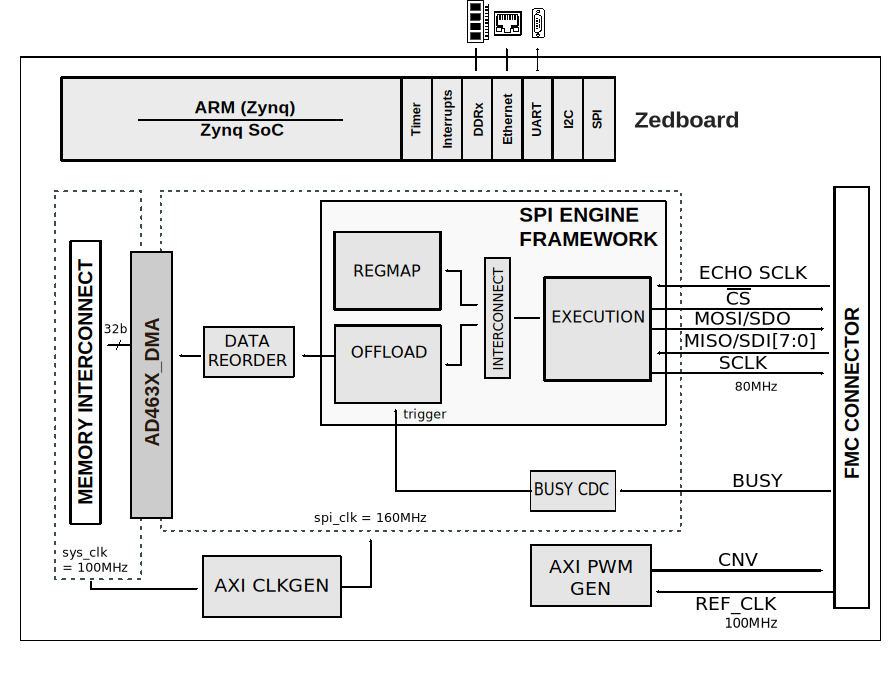
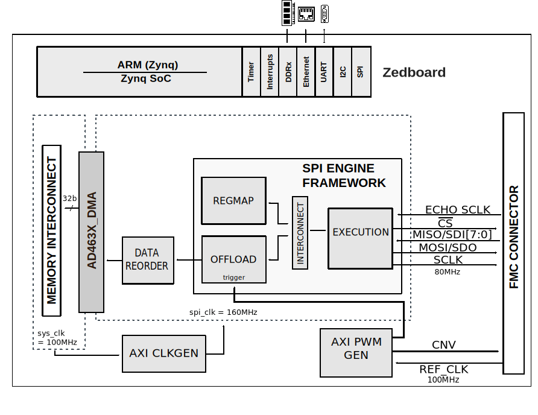
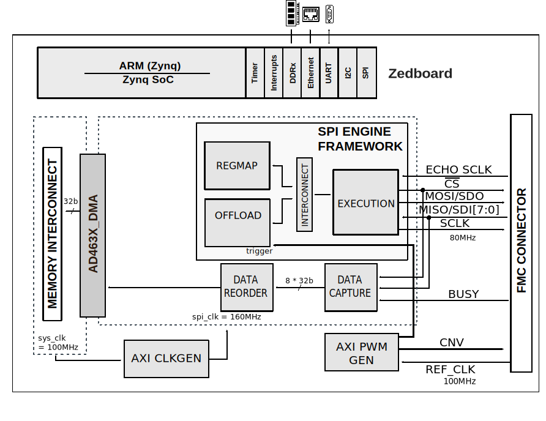

.. _ad_463x_data_capture:

EVAL-AD4630_FMCZ and EVAL-AD4030_FMCZ HDL Reference Design
==========================================================

Overview
--------

The HDL reference design for the EVAL-AD4630_FMCZ and EVAL-AD4030_FMCZ provides
all the interfaces that are necessary to interact with the device using a Xilinx
FPGA development board.

The design has all the necessary infrastructure to acquire data from the
AD4630-24 24-bit dual-channel precision SAR ADC, AD4630-16 16-bit dual channel
precision SAR ADC and AD4030-24 single channel ADC, supporting continuous data
capture at maximum 2 MSPS data rate. The design targeted to the Zedboard, which
is a low cost FPGA carrier board from Digilent, using a Zynq-7000
re-programmable SoC from Xilinx.

Used devices
~~~~~~~~~~~~

-  :adi:`AD4630-24 <AD4630-24>`
-  :adi:`AD4630-16 <AD4630-16>`
-  :adi:`AD4030-24 <AD4030-24>`

Evaluation board
~~~~~~~~~~~~~~~~

-  :adi:`EVAL-AD4630-24FMCZ <en/design-center/evaluation-hardware-and-software/evaluation-boards-kits/EVAL-AD4630-24.html>`
-  :adi:`EVAL-AD4630-16FMCZ <en/design-center/evaluation-hardware-and-software/evaluation-boards-kits/EVAL-AD4630-16.html>`
-  :adi:`EVAL-AD4030-24FMCZ <en/design-center/evaluation-hardware-and-software/evaluation-boards-kits/EVAL-AD4030-24.html>`

Supported FPGA carrier
~~~~~~~~~~~~~~~~~~~~~~

-  `Zedboard <https://www.avnet.com/wps/portal/us/products/avnet-boards/avnet-board-families/zedboard/>`__

HDL Design Description
----------------------

The design is built upon ADI's generic HDL reference design framework. More
information about the framework can be found in the :ref:`user_guide` wiki page.

The reference design uses the :ref:`spi_engine` to interface with the
AD4630 ADC.

The design supports almost all possible digital interface configurations of the
device. In echo clock mode, because the clock for data latching is routed back
through the BUSY line, an additional data capture module is used for saving the
received samples and transmitting forward for the DMA.

There are three modes in which the system can run. Refer to the
:adi:`AD4630-24 <media/en/technical-documentation/data-sheets/ad4630-24.pdf>`,
:adi:`AD4630-16 <media/en/technical-documentation/data-sheets/ad4630-16.pdf>`
or
:adi:`AD4030-24 <media/en/technical-documentation/data-sheets/ad4030-24.pdf>`
data sheet section titled **SAMPLE CONVERSION TIMING AND DATA TRANSFER** for
more explanation of data transfer zones.

SPI mode - transfer zone 1
~~~~~~~~~~~~~~~~~~~~~~~~~~

The main aspect of this mode is the fact that it is using the BUSY signal from
the ADC to trigger the Offload module.

| Data is then clocked out by the Execution module and transferred to the DMA by
  the Offload module. CNV is always generated by the AXI PWM GEN IP core
  regardless of the mode.

Zone 1 transfer is not currently supported by the pre-compiled HDL files that
are included in the SD card image that is provided with the evaluation board.

The following block diagram shows the simplified architecture of the design:

SPI mode - transfer zone 2
~~~~~~~~~~~~~~~~~~~~~~~~~~

In this mode, the BUSY signal is not used and both the CNV and the Offload
trigger signals are generated by the AXI PWM GEN core. The reason for using two
PWM outputs instead of a common one is to accommodate for the averaging mode
where the two signals will have different frequencies.

Echo clock mode - transfer zone 2
~~~~~~~~~~~~~~~~~~~~~~~~~~~~~~~~~

In this configuration, the ADC's BUSY-SCKOUT pin functions as a bit-clock output
and is generated by looping-through the host’s SCK. The SPI engine is driving
the SPI signals except it is no longer reading the data. For this purpose, the
Data Capture IP is used. This also allows for reading data in DDR mode.

The design supports the following interface and clock modes both in SDR and DDR:

.. list-table::
   :header-rows: 1

   * -
     - 1 Lane per channel
     - 2 Lane per channel
     - 4 Lane per channel
   * - SPI mode
     - yes
     - yes
     - yes
   * - Echo Clock mode
     - yes
     - yes
     - yes

In order to build the HDL design the user has to go through the following steps:

#. Confirm that you have the right tools (see 
   `Release notes <https://github.com/analogdevicesinc/hdl/releases>`)
#. Clone the HDL GitHub repository (see :ref:`git_repository`)
#. Pick the required interface configuration
   (:git-hdl:`projects/ad4630_fmc/zed/README.md`)
#. Build the project (see :ref:`build_hdl`)

HDL Downloads
-------------

-  :git-hdl:`/projects/ad4630_fmc`

Software sources
----------------

-  :dokuwiki:`AD463x - No-OS Driver <resources/tools-software/uc-drivers/ad463x>`
-  :dokuwiki:`AD463x - Linux Driver <resources/tools-software/linux-drivers/iio-adc/ad463x>`
