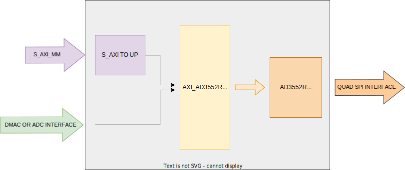
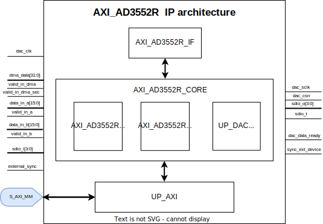

.. _axi_ad3552r:

AXI AD3552R
================================================================================

.. hdl-component-diagram::

The :git-hdl:`AXI AD3552R <library/axi_ad3552r>` IP core
can be used to interface the :adi:`AD3552R`, a low drift, ultra-fast, 16-bit
accuracy, current output digital-to-analog converter (DAC) that can be
configured in multiple voltage span ranges.

Features
--------------------------------------------------------------------------------

* AXI-based configuration
* Vivado compatible
* 8b register read/write SDR/DDR
* 16b register read/write SDR/DDR
* data stream SDR/DDR ( clk_in/8 or clk_in/4 update rate)
* selectable input source: DMA/ADC/TEST_RAMP
* data out clock(SCLK) has clk_in/8 frequency when the converter is configured and
  clk_in/2 when the converter is in stream mode
* the IP reference clock (clk_in) can have a maximum frequency of 132MHz
* the IP has multiple device synchronization capability when the DMA is set
  as an input data source

Files
--------------------------------------------------------------------------------

.. list-table::
   :header-rows: 1

   * - Name
     - Description
   * - :git-hdl:`library/axi_ad3552r/axi_ad3552r.v`
     - Verilog source for the AXI AD3552R.
   * - :git-hdl:`library/axi_ad3552r/axi_ad3552r_channel.v`
     - Verilog source for the AXI AD3552R channel.
   * - :git-hdl:`library/axi_ad3552r/axi_ad3552r_core.v`
     - Verilog source for the AXI AD3552R core.
   * - :git-hdl:`library/axi_ad3552r/axi_ad3552r_if.v`
     - Verilog source for the AD3552R interface module.
   * - :git-hdl:`library/axi_ad3552r/axi_ad3552r_if_tb.v`
     - Verilog source for the AD3552R interface module testbench.
   * - :git-hdl:`library/axi_ad3552r/axi_ad3552r_if_tb`
     - Setup script for the AD3552R interface module testbench.
   * - :git-hdl:`library/axi_ad3552r/axi_ad3552r_ip.tcl`
     - TCL script to generate the Vivado IP-integrator project.

Block Diagram
--------------------------------------------------------------------------------

Configuration Parameters
--------------------------------------------------------------------------------

.. hdl-parameters::

   * - ID
     - Core ID should be unique for each IP in the system
     - 0
   * - FPGA_TECHNOLOGY
     - Encoded value describing the technology/generation of the FPGA device
       (Arria 10/7series)
   * - FPGA_FAMILY
     - Encoded value describing the family variant of the FPGA device(e.g., SX,
       GX, GT)
   * - SPEED_GRADE
     - Encoded value describing the FPGA's speed-grade
   * - DEV_PACKAGE
     - Encoded value describing the device package. The package might affect
       high-speed interfaces

Interface
--------------------------------------------------------------------------------

.. hdl-interfaces::

   * - dac_clk
     - Reference clock
   * - dma_data
     - Data from the DMAC when input source is set to DMA_DATA.
   * - valid_in_dma
     - Valid from the DMAC.
   * - dac_data_ready
     - Data ready signal for the DMAC.
   * - data_in_a
     - Data for channel 1 when input source is set to ADC_DATA.
   * - data_in_b
     - Data for channel 2 when input source is set to ADC_DATA.
   * - valid_in_a
     - Valid for channel 1.
   * - valid_in_b
     - Valid for channel 2.
   * - valid_in_dma_sec
     - Valid from a secondary DMAC if synchronization is needed.
   * - external_sync
     - External synchronization flag from another axi_ad3552r IP.
   * - sync_ext_device
     - Start_sync external device to another axi_ad3552r IP.
   * - dac_sclk
     - Serial clock.
   * - dac_csn
     - Serial chip select.
   * - sdio_o
     - Serial data out to the DAC.
   * - sdio_i
     - Serial data in from the DAC.
   * - sdio_t
     - I/O buffer control signal.
   * - s_axi
     - Standard AXI Slave Memory Map interface.

Detailed Architecture
--------------------------------------------------------------------------------

Detailed Description
--------------------------------------------------------------------------------

The top module instantiates:

* The axi_ad3552r interface module
* The axi_ad3552r core module
* The AXI handling interface

The axi_ad3552r_if has the state machine that controls the quad SPI interface.
The axi_ad3552r_core module instantiates 2 axi_ad3552r channel modules.

Register Map
--------------------------------------------------------------------------------

For the AXI_AD3552R control used registers from DAC Common are:

.. hdl-regmap::
   :name: AXI_AD3552R_DAC_COMMON

For the AXI_AD3552R control used registers from DAC Channel are:

.. hdl-regmap::
   :name: AXI_AD3552R_DAC_CHANNEL

For reference, all the register map templates are:

.. hdl-regmap::
   :name: COMMON
   :no-type-info:

.. hdl-regmap::
   :name: DAC_COMMON
   :no-type-info:

.. hdl-regmap::
   :name: DAC_CHANNEL
   :no-type-info:

Design Guidelines
--------------------------------------------------------------------------------

The control of the chip is done through the AXI_AD3552R IP.

The *DAC interface* must be connected to an IO buffer.

The example design uses a DMA to move the data from the memory to the CHIP quad
SPI interface.

If the data needs to be processed in HDL before moving to DAC's output, it can be
done at the input of the IP (at the system level) or inside the axi_ad3552r_if
interface module (at the IP level).

The example design uses a processor to program all the registers. If no
processor is available in your system, you can create your IP starting from the
interface module.

Software Guidelines
--------------------------------------------------------------------------------

Linux is supported using
:dokuwiki:`AD3552R Dual Channel, 16-Bit, 33 MUPS, Multispan, Multi-IO SPI DAC Linux device driver <resources/tools-software/linux-drivers/iio-dac/axi-ad3552r>`.

References
--------------------------------------------------------------------------------
* :adi:`AD3552R`
* :git-hdl:`projects/ad3552r_evb`
* :git-hdl:`library/axi_ad3552r`
* :git-linux:`/`
* :xilinx:`Zynq-7000 SoC Overview <support/documentation/data_sheets/ds190-Zynq-7000-Overview.pdf>`
* :xilinx:`Zynq-7000 SoC Packaging and Pinout <support/documentation/user_guides/ug865-Zynq-7000-Pkg-Pinout.pdf>`
