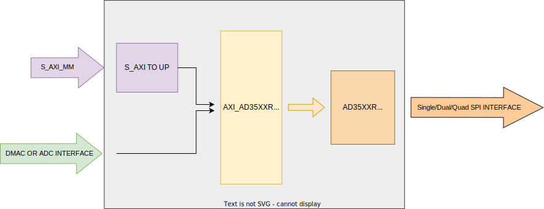
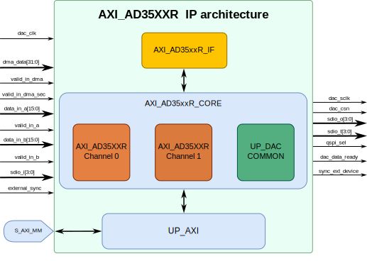

.. _axi_ad35xxr:

AXI AD35XXR
================================================================================

.. hdl-component-diagram::
  :path: library/axi_ad35xxr

The :git-hdl:`AXI AD35XXR <library/axi_ad35xxr>` IP core can be used to
interface the :adi:`AD3541R`, :adi:`AD3542R`, :adi:`AD3551R`, and
:adi:`AD3552R`. :adi:`AD3552R` is a low drift, dual channel, ultra-fast, 
16-bit accuracy, current output digital-to-analog converter (DAC) that can be 
configured in multiple voltage span ranges, the :adi:`AD3551R` is the single 
channel part. :adi:`AD3542R` is is a low drift, dual channel, ultra-fast, 
12-/16-bit accuracy, voltage output digital-to-analog converter (DAC) that 
can be configured in multiple voltage span ranges, the :adi:`AD3541R` is the
single channel part.

Features
--------------------------------------------------------------------------------

* AXI-based configuration;
* Vivado compatible;
* 8b register read/write SDR/DDR;
* 16b register read/write SDR/DDR;
* Data stream SDR/DDR ( clk_in/8 or clk_in/4 update rate);
* Selectable input source: DMA/ADC/TEST_RAMP;
* Data out clock(SCLK) has clk_in/2 frequency for both configuration and streaming
  mode;
* The IP reference clock (clk_in) can have a maximum frequency of 132MHz;
* The IP has multiple device synchronization capability when the DMA is set
  as an input data source.

Files
--------------------------------------------------------------------------------

.. list-table::
   :header-rows: 1

   * - Name
     - Description
   * - :git-hdl:`library/axi_ad35xxr/axi_ad35xxr.v`
     - Verilog source for the AXI AD35XXR.
   * - :git-hdl:`library/axi_ad35xxr/axi_ad35xxr_channel.v`
     - Verilog source for the AXI AD35XXR channel.
   * - :git-hdl:`library/axi_ad35xxr/axi_ad35xxr_core.v`
     - Verilog source for the AXI AD35XXR core.
   * - :git-hdl:`library/axi_ad35xxr/axi_ad35xxr_if.v`
     - Verilog source for the AD35XXR interface module.
   * - :git-hdl:`library/axi_ad35xxr/axi_ad35xxr_if_tb.v`
     - Verilog source for the AD35XXR interface module testbench.
   * - :git-hdl:`library/axi_ad35xxr/axi_ad35xxr_if_tb`
     - Setup script for the AD35XXR interface module testbench.
   * - :git-hdl:`library/axi_ad35xxr/axi_ad35xxr_ip.tcl`
     - TCL script to generate the Vivado IP-integrator project.

Block Diagram
--------------------------------------------------------------------------------

Configuration Parameters
--------------------------------------------------------------------------------

.. hdl-parameters::

   * - ID
     - Core ID should be unique for each IP in the system
     - 0
   * - FPGA_TECHNOLOGY
     - Encoded value describing the technology/generation of the FPGA device
       (Arria 10/7series)
   * - FPGA_FAMILY
     - Encoded value describing the family variant of the FPGA device(e.g., SX,
       GX, GT)
   * - SPEED_GRADE
     - Encoded value describing the FPGA's speed-grade
   * - DEV_PACKAGE
     - Encoded value describing the device package. The package might affect
       high-speed interfaces

Interface
--------------------------------------------------------------------------------

.. hdl-interfaces::

   * - dac_clk
     - Reference clock
   * - dma_data
     - Data from the DMAC when input source is set to DMA_DATA.
   * - valid_in_dma
     - Valid from the DMAC.
   * - dac_data_ready
     - Data ready signal for the DMAC.
   * - data_in_a
     - Data for channel 1 when input source is set to ADC_DATA.
   * - data_in_b
     - Data for channel 2 when input source is set to ADC_DATA.
   * - valid_in_a
     - Valid for channel 1.
   * - valid_in_b
     - Valid for channel 2.
   * - valid_in_dma_sec
     - Valid from a secondary DMAC if synchronization is needed.
   * - external_sync
     - External synchronization flag from another axi_ad35xxr IP.
   * - sync_ext_device
     - Start_sync external device to another _axi_ad35xxr IP.
   * - dac_sclk
     - Serial clock.
   * - dac_csn
     - Serial chip select.
   * - sdio_o
     - Serial data out to the DAC.
   * - sdio_i
     - Serial data in from the DAC.
   * - sdio_t
     - I/O buffer control signal.
   * - qspi_sel
     -  QSPI Mode Enable. High level enables quad SPI interface mode 
        (ad3552r and ad3551r).
   * - s_axi
     - Standard AXI Slave Memory Map interface.

Detailed Architecture
--------------------------------------------------------------------------------

Detailed Description
--------------------------------------------------------------------------------

The top module instantiates:

* The axi_ad35xxr interface module
* The axi_ad35xxr core module
* The AXI handling interface

The axi_ad35xxr_if has the state machine that controls the SPI interface,
which can be Single SPI (Classic), Dual SPI, and Quad SPI.
The axi_ad35xxr_core module instantiates 2 ad35xxr channel modules even for
the ad35x1r cases. For the single channel and 12 bit accuracy cases, consider
the 16 LSBs -- The 4 LSBs of this word are 0's for the 12-bit accuracy.

Register Map
--------------------------------------------------------------------------------

For the AXI_AD3XXR control used registers from DAC Common are:

.. hdl-regmap::
   :name: AXI_AD35XXR_DAC_COMMON

For the AXI_AD35XXR control used registers from DAC Channel are:

.. hdl-regmap::
   :name: AXI_AD35XXR_DAC_CHANNEL

For reference, all the register map templates are:

.. hdl-regmap::
   :name: COMMON
   :no-type-info:

.. hdl-regmap::
   :name: DAC_COMMON
   :no-type-info:

.. hdl-regmap::
   :name: DAC_CHANNEL
   :no-type-info:

Design Guidelines
--------------------------------------------------------------------------------

The control of the chip is done through the AXI_AD35XXR IP.

The *DAC interface* must be connected to an IO buffer.

The example design uses a DMA to move the data from the memory to the CHIP quad
SPI interface.

If the data needs to be processed in HDL before moving to DAC's output, it can be
done at the input of the IP (at the system level) or inside the axi_ad35xxr_if
interface module (at the IP level).

The example design uses a processor to program all the registers. If no
processor is available in your system, you can create your IP starting from the
interface module.

Software Support
--------------------------------------------------------------------------------

* Linux device driver at :git-linux:`drivers/iio/dac/ad3552r.c`
* Linux device driver documentation
  :dokuwiki:`on wiki <resources/tools-software/linux-drivers/iio-dac/axi-ad3552r>`
* No-OS device driver at :git-no-os:`drivers/dac/ad3552r`
* No-OS project at :git-no-os:`projects/ad3552r_fmcz`

References
--------------------------------------------------------------------------------

* HDL IP core at :git-hdl:`library/axi_ad35xxr`
* HDL project at :git-hdl:`projects/ad35xxr_evb`
* :adi:`AD3552R`
* :adi:`AD3551R`
* :adi:`AD3542R`
* :adi:`AD3541R`
* :xilinx:`Zynq-7000 SoC Overview <support/documentation/data_sheets/ds190-Zynq-7000-Overview.pdf>`
* :xilinx:`Zynq-7000 SoC Packaging and Pinout <support/documentation/user_guides/ug865-Zynq-7000-Pkg-Pinout.pdf>`
