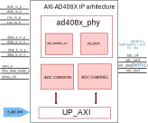

.. _axi_ad408x:

AXI AD408x
================================================================================

.. hdl-component-diagram::

The :git-hdl:`AXI AD408x <library/axi_ad408x>` IP core can be used to interface
the :adi:`AD4080` device.
This documentation only covers the IP core and requires one to be
familiar with the device, for a complete and better understanding.

More about the generic framework interfacing ADCs can be read in :ref:`axi_adc`.

Features
--------------------------------------------------------------------------------

* AXI Lite control/status interface
* Programmable line delays
* DDR data stream selection
* Single/dual lane data stream selection
* Bit-slip capability for synchronization
* Filtered data support
* Programmable decimation rate support
* Xilinx devices compatible

Files
--------------------------------------------------------------------------------

.. list-table::
   :header-rows: 1

   * - Name
     - Description
   * - :git-hdl:`library/axi_ad408x/axi_ad408x.v`
     - Verilog source for the AXI AD408x.
   * - :git-hdl:`library/axi_ad408x/ad408x_phy.v`
     - Verilog source for the AXI AD408x physical interface.
   * - :git-hdl:`library/axi_ad408x/axi_ad408x_ip.tcl`
     - IP definition file (AMD tools)

Block Diagram
--------------------------------------------------------------------------------

Configuration Parameters
--------------------------------------------------------------------------------

.. hdl-parameters::

   * - ID
     - Core ID should be unique for each IP in the system
   * - FPGA_TECHNOLOGY
     - Used to select between FPGA devices, auto set in project.

Interface
--------------------------------------------------------------------------------

.. hdl-interfaces::

   * - filter_data_ready_n
     - Signals when the filtered data is ready at the interface
   * - sync_n
     - Signals when the clock is disabled and the design should be in reset
   * - cnv_in_p
     - LVDS input positive side of differential CNV signal
   * - cnv_in_n
     - LVDS input negative side of differential CNV signal
   * - dclk_in_p
     - LVDS input positive side of differential reference clock signal
   * - dclk_in_n
     - LVDS input negative side of differential reference clock signal
   * - data_a_in_p
     - LVDS input positive side of differential data line A signal
   * - data_a_in_n
     - LVDS input negative side of differential data line A signal
   * - data_b_in_p
     - LVDS input positive side of differential data line B signal
   * - data_b_in_n
     - LVDS input negative side of differential data line B signal
   * - delay_clk
     - Delay clock input for IO_DELAY control, 200 MHz (7 series) or 300 MHz
       (Ultrascale)
   * - adc_clk
     - The clock used to shift data out of the IP
   * - adc_valid
     - Indicates valid data
   * - adc_data
     - Received data output
   * - adc_dovf
     - Data overflow. Must be connected to the DMA
   * - s_axi
     - Standard AXI Slave Memory Map interface

Internal Interface Description
~~~~~~~~~~~~~~~~~~~~~~~~~~~~~~~~~~~~~~~~~~~~~~~~~~~~~~~~~~~~~~~~~~~~~~~~~~~~~~~

The axi_ad408x operates as follows:

* The LVDS data is deserialized by the ad_serdes_in module with a 1:8 ratio.
* After deserialization, the data is sent to the ad_pack module, which packs the 8-bit data into a 20-bit format.
* When the bit-slip (synchronization process) is enabled, the software configures the ADC to output a fixed pattern, and the interface module will adjust the data alignment until the pattern is captured.
* When the filter is enabled, the adc_valid signal is gated by the filter_data_ready_n signal, and the data is sent to the output only when the filtered data is available.

Register Map
--------------------------------------------------------------------------------

The register map of the core contains instances of several generic register maps
like ADC common, ADC channel, :git-hdl:`up_delay_cntrl <library/common/up_delay_cntrl.v>`.
The following table presents the base addresses of each instance, after it you
can find the detailed description of each generic register map.
The absolute address of a register should be calculated by adding the instance
base address to the registers relative address.

.. list-table:: Register Map base addresses for axi_ad408x
   :header-rows: 1

   * - DWORD
     - BYTE
     - Name
     - Description
   * - 0x0000
     - 0x0000
     - BASE
     - See the `Base <#hdl-regmap-COMMON>`__ table for more details.
   * - 0x0000
     - 0x0000
     - RX COMMON
     - See the `ADC Common <#hdl-regmap-ADC_COMMON>`__ table for more details.
   * - 0x0000
     - 0x0000
     - RX CHANNELS
     - See the `ADC Channel <#hdl-regmap-ADC_CHANNEL>`__ table for more details.
   * - 0x0000
     - 0x0800
     - IO_DELAY_CNTRL
     - See the `I/O Delay Control <#hdl-regmap-DELAY_CNTRL>`__ table for more details.

.. hdl-regmap::
   :name: COMMON
   :no-type-info:

.. hdl-regmap::
   :name: ADC_COMMON
   :no-type-info:

.. hdl-regmap::
   :name: ADC_CHANNEL
   :no-type-info:

.. hdl-regmap::
   :name: IO_DELAY_CNTRL
   :no-type-info:

Design Guidelines
--------------------------------------------------------------------------------

The control of the AD408x chip is done through a SPI interface, which is needed
at system level.

The *ADC interface signals* must be connected directly to the top file of the
design, as IO primitives are part of the IP.

The example design uses a DMA to move the data from the output of the IP to
memory.

If the data needs to be processed in HDL before moved to the memory, it can be
done at the output of the IP (at system level) or inside of the ADC channel
module (at IP level).

The example design uses a processor to program all the registers. If no
processor is available in your system, you can create your own IP starting from
the interface module.

Software Guidelines
--------------------------------------------------------------------------------
The software for this IP can be found as part of the AD408x Native FMC Card
Linux drivers can be found in :git-linux:`/`.

.. list-table:: Main registers used to control the AXI AD408x IP
   :header-rows: 1

   * - Name
     - Register
     - BIT
     - Description
   * - BITSLIP_ENABLE
     - 0x44
     - 3
     - Enables the sync process.
   * - NUM_LANES
     - 0x44
     - [12:8]
     - Controls the number of lanes enabled.
   * - FILTER_ENABLE
     - 0x4C
     - 0
     - Controls the filter status.
   * - SELF_SYNC
     - 0x4C
     - 1
     - Controls if the data capture synchronization is done through CNV signal or bit-slip.
   * - SYNC_STATUS
     - 0x68
     - 0
     - States the synchronization status.

References
-------------------------------------------------------------------------------

* :git-hdl:`library/axi_ad408x`
* :adi:`AD4080`
* :xilinx:`Zynq-7000 SoC Overview <support/documentation/data_sheets/ds190-Zynq-7000-Overview.pdf>`
* :xilinx:`Zynq-7000 SoC Packaging and Pinout <support/documentation/user_guides/ug865-Zynq-7000-Pkg-Pinout.pdf>`
