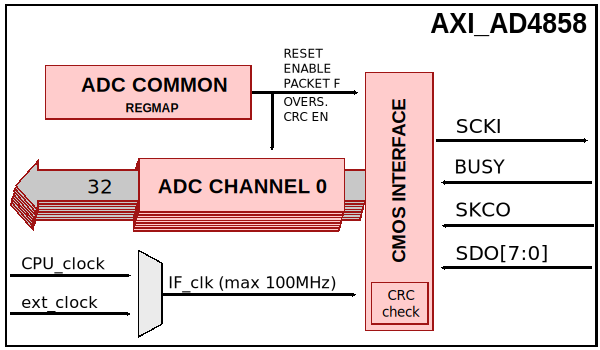
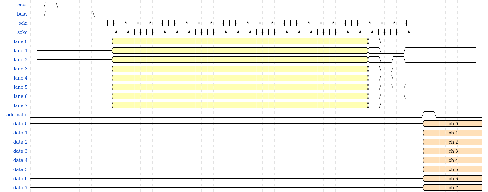
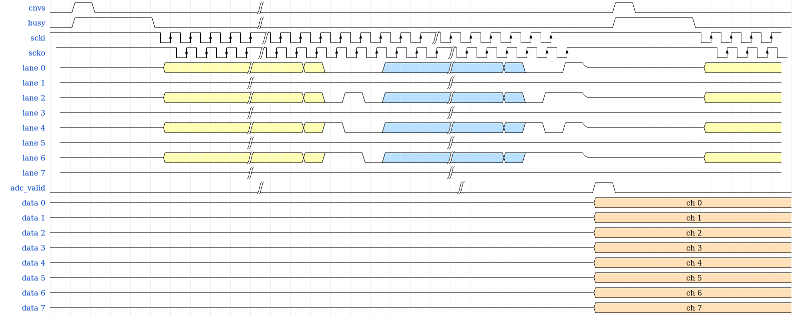

AXI_AD4858
==========

The :adi:`axi_ad4858 <library/axi_ad4858>` IP core can be used to
interface the :adi:`AD4858 <AD4858>` ADC through LVDS or CMOS interface.
More about the generic framework interfacing ADCs can be read here:
:dokuwiki:`axi_adc_ip </resources/fpga/docs/axi_adc_ip>`.

Features
--------

* AXI based configuration
* Configurable number of active data lines (CMOS - build-time configurable)
* Oversampling support
* Supports modes 0,1,2 or 3
* CRC check support
* Real-time data header access
* Channel based raw data access(0x0408)
* Xilinx devices compatible

Configuration Parameters
------------------------

.. hdl-parameters::

   * - ID
     - Core ID should be unique for each ad4858 IP in the system
     - 0
   * - LANE_0_ENABLE
     - Enables lane 0
     - 1
   * - LANE_1_ENABLE
     - Enables lane 1
     - 1
   * - LANE_2_ENABLE
     - Enables lane 2
     - 1
   * - LANE_3_ENABLE
     - Enables lane 3
     - 1
   * - LANE_4_ENABLE
     - Enables lane 4
     - 1
   * - LANE_5_ENABLE
     - Enables lane 5
     - 1
   * - LANE_6_ENABLE
     - Enables lane 6
     - 1
   * - LANE_7_ENABLE
     - Enables lane 7
     - 1
   * - LVDS_CMOS_N
     - Interface type LVDS = 1 or CMOS = 0
     - 0
   * - ECHO_CLK_EN
     - Enables echoed clock for capturing data
     - 1
   * - EXTERNAL_CLK
     - Use external clock for CMOS IF instead of axi clock
     - 1

Interface
---------
  .. hdl-interfaces::
  
  ..
    * - Clocks
      - **axi_ad4858 clocks**
      - 
      - 
    * - 
      - ``delay_clk``
      - ``input``
      - Clock for input delay control(Xilinx) used by LVDS interface
    * - 
      - ``external_clk``
      - ``input``
      - External clock for data path(optional for CMOS), selected by EXTERNAL_CLK parameter
    * - 
      - ``external_fast_clk``
      - ``input``
      - External fast clock LVDS interface only
    * - ``AD4858 generic signals``
      - \*\* axi_ad4858 generic signals \*\*
      - 
      - 
    * - 
      - ``cnvs``
      - ``input``
      - Conversion start signal(generated by axi_pwmgen)
    * - 
      - ``busy``
      - ``input``
      - Busy signal
    * - 
      - ``lvds_cmos_n``
      - ``output``
      - LVDS or CMOS interface selection, determined by parameter LVDS_CMOS_N
    * - '' AD4858 CMOS interface''
      - **ADC CMOS data interface signals**
      - 
      - 
    * - 
      - ``scko``
      - ``input``
      - Input clock(echoed)
    * - 
      - ``busy``
      - ``input``
      - Input busy signal
    * - 
      - ``lane_x``
      - ``input``
      - Input lane x enabled by parameter LANE_x_ENABLE
    * - 
      - ``scki``
      - ``output``
      - Output clock
    * - AD4858 LVDS interface
      - **ADC LVDS data interface signals**
      - 
      - 
    * - 
      - ``scko_p``
      - ``input``
      - Input lvds + clock (echoed)
    * - 
      - ``scko_n``
      - ``input``
      - Input lvds - clock (echoed)
    * - 
      - ``busy``
      - ``input``
      - Input busy signal
    * - 
      - ``sdo_p``
      - ``input``
      - Serial input data
    * - 
      - ``sdo_n``
      - ``input``
      - Serial input data
    * - 
      - ``scki_p``
      - ``output``
      - Output lvds + clock
    * - 
      - ``scki_n``
      - ``output``
      - Output lvds - clock
    * - ''s_axi ''
      - **AXI Slave Memory Map interface**
      - 
      - 
    * - adc_fifo
      - \*\* FIFO interface for connecting to the DMA*\*
      - 
      - 
    * - 
      - adc_clk
      - ``output``
      - This is the clock domain that most of the modules of the core run on
    * - 
      - ``adc_reset``
      - ``output``
      - Output reset, on the adc_clk domain
    * - 
      - ``adc_enable_*``
      - ``output``
      - Set when the channel is enabled, activated by software
    * - 
      - ``adc_valid_*``
      - ``output``
      - Set when valid data is available on the bus
    * - 
      - ``adc_data_*``
      - ``output[31:0]``
      - Parallel output data

Block Diagram
-------------

CMOS
~~~~

LVDS
~~~~

.. image:: axi_ad4858_lvds_4.svg
   :align: center

Detailed Description
--------------------

The top module, axi_ad4858.v, instantiates:

* axi_ad4858_cmos.v interface module;
* axi_ad4858_lvds.v interface module;
* axi_ad4858_channel.v data formats and channel register map;
* the ADC common register map;
* the AXI handling interface;

For the axi_ad4858 CMOS interface module, data is de-serialized according to
the number of active lanes and the number of active channels.
up_adc_common module implements the ADC COMMON register map, allowing for
basic monitoring and control of the ADC.
Up_adc_channel module implements the ADC CHANNEL register map, allowing for
basic monitoring and control of the ADC's channel.

.. hint::
  The axi_ad4858 is used in conjunction with axi_pwm_gen which is
  responsible for generating the cnvs(conversion start signal)

.. warning::
  The valid signal will only be asserted after all enabled
  channels are captured.
  The capture period depends on the combination of active lanes and active
  channels.
  AD4858 has an internal ring buffer which stores the channel data and CRC data.
  It must be taken into consideration the maximum index difference between the
  channel index and lane index when setting the sampling rate(axi_pwm_gen).
  A one index difference means 2x the captured period, a two index difference
  means 3x captured period. In case the cnvs is asserted before all channels are
  captured the valid signal will never be asserted.
  See the timing diagrams below.

.. warning::
  The serial configuration CS must be pulled down before capturing
  data, this is to enable internal clock buffers in AD4858.

Timing Diagrams
~~~~~~~~~~~~~~~

| <note tip>Yellow represents first receive packet data.
| Blue represents the second received packet data.</note>

Register Map
------------

.. hdl-regmap::
   :name: AD4858
   :no-type-info:

Design Guidelines
-----------------

#. The control of the ad4858 chip is done through a SPI interface, which is
   needed at system level.
#. The example design uses a DMA to move the data from the output of the IP to
   memory.
#. If the data needs to be processed in HDL before moved to the memory or to
   some other IP.
#. The example design uses a processor to program all the registers.

Software Guidelines
-------------------

#. Over-range(Under-range) flag - at reg. 0x5C(common) 0x404(channel) -
   available for packet formats 23 and 32 only
#. CHANNEL_ID - at reg. 0x404(channel) bits [10:8] - available for packet
   formats 23 and 32 only
#. SOFTSPAN_ID - at reg. 0x404(channel) bits [7:4] - available for packet format
   32 only
#. PATTERN_MISMATCH - at reg. 0x404(channel) - available in PN_ERR flag
#. CRC_ERR - at reg. 0x404(channel) - available in CRC_ERR flag
#. READ_RAW \_DATA - at reg. 0x408(channel)

Linux driver at `ADI Linux Repository <https://github.com/analogdevicesinc/linux>`

Known Limitations
-----------------

For CMOS interface, the CRC check breaks the captured data when using max sample
rate with scki = 100MHz and packet format >= 20 bit. There is simply not enough
time to capture all data bits. For more info see the datasheet. The solutions:

#. Use lower sampling rates
#. Increase the core clock(100MHz in the reference design)

For LVDS interface, enabling the oversampling breaks the captured data when
using max sample rate with CRC enabled and packet format = 32 bit. Not enough
time to enable the quiet time before sample acquisition and capture all data
bits. For more info see the datasheet.

References
----------

*  :git-hdl:`AD4858 IP source code <library/axi_ad4858>`
*  :adi:`AD4858 chip information <en/ad4858>`
*  :dokuwiki:`ad4858_fmcz_hdl </resources/eval/user-guides/ad4858_fmcz/ad4858_fmcz_hdl>`
*  :ref:`architecture`
*  `ADI Linux repository <https://github.com/analogdevicesinc/linux>`__
