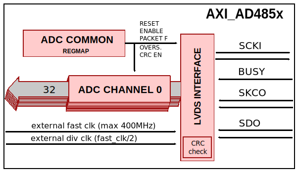
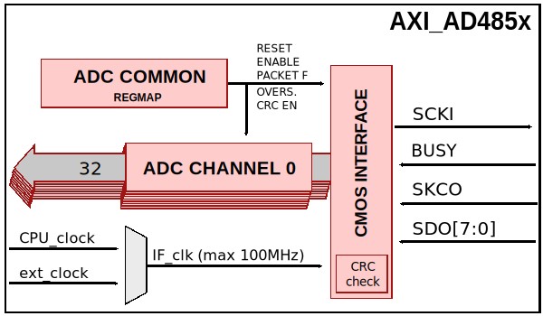
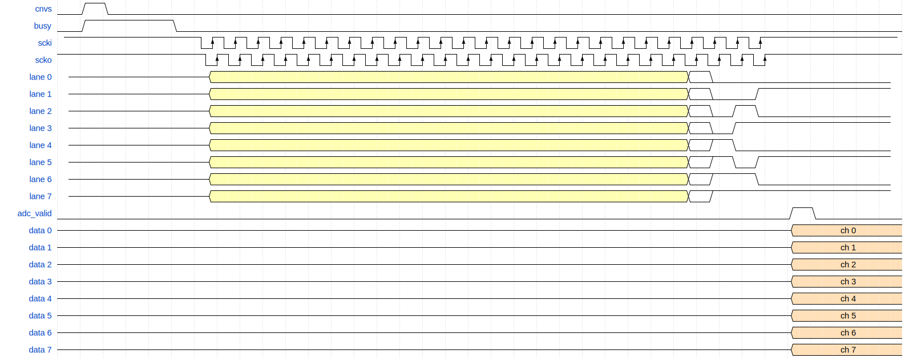
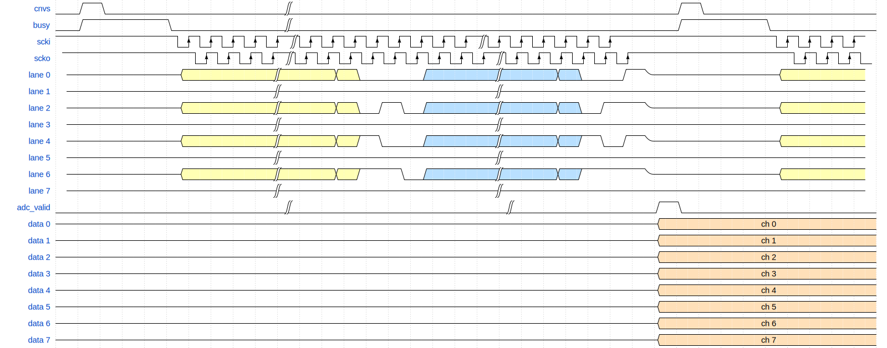

.. _axi_ad485x:

AXI AD485x
================================================================================

.. hdl-component-diagram::

The :git-hdl:`AXI AD485x <library/axi_ad485x>` IP core can be used to interface
the :adi:`AD4851` to :adi:`AD4858` devices.
This documentation only covers the IP core and requires one to be
familiar with the device, for a complete and better understanding.

More about the generic framework interfacing ADCs can be read in :ref:`axi_adc`.

Features
--------------------------------------------------------------------------------

* AXI Lite control/status interface
* Programmable line delays
* Configurable number of active data lines (CMOS - build-time configurable)
* Oversampling support
* Supports modes 0, 1, 2 or 3 - according to each device options
* CRC check support
* Real-time data header access
* Channel based raw data access (0x0408)
* Xilinx devices compatible

Files
--------------------------------------------------------------------------------

.. list-table::
   :header-rows: 1

   * - Name
     - Description
   * - :git-hdl:`library/axi_ad485x/axi_ad485x.v`
     - Verilog source for the AXI AD485x.
   * - :git-hdl:`library/axi_ad485x/axi_ad485x_crc.v`
     - Verilog source for the AXI AD485x CRC check.
   * - :git-hdl:`library/axi_ad485x/axi_ad485x_lvds.v`
     - Verilog source for the AXI AD485x LVDS interface.
   * - :git-hdl:`library/axi_ad485x/axi_ad485x_cmos.v`
     - Verilog source for the AXI AD485x CMOS interface.
   * - :git-hdl:`library/axi_ad485x/axi_ad485x_20b_channel.v`
     - Verilog source for the AXI AD485x 20-bit resolution devices.
   * - :git-hdl:`library/axi_ad485x/axi_ad485x_16b_channel.v`
     - Verilog source for the AXI AD485x 16-bit resolution devices.
   * - :git-hdl:`library/axi_ad485x/axi_ad485x_constr.ttcl`
     - Dynamic constraint file (AMD tools)
   * - :git-hdl:`library/axi_ad485x/axi_ad485x_ip.tcl`
     - IP definition file (AMD tools)

Block Diagram
--------------------------------------------------------------------------------

LVDS interface
~~~~~~~~~~~~~~~~~~~~~~~~~~~~~~~~~~~~~~~~~~~~~~~~~~~~~~~~~~~~~~~~~~~~~~~~~~~~~~~

CMOS interface
~~~~~~~~~~~~~~~~~~~~~~~~~~~~~~~~~~~~~~~~~~~~~~~~~~~~~~~~~~~~~~~~~~~~~~~~~~~~~~~

Configuration Parameters
--------------------------------------------------------------------------------

.. hdl-parameters::

   * - ID
     - Core ID should be unique for each IP in the system
   * - FPGA_TECHNOLOGY
     - Used to select between FPGA devices, auto set in project.
   * - LVDS_CMOS_N
     - Defines the physical interface type
   * - IODELAY_ENABLE
     - Enable delay control on the input data lines
   * - DELAY_REFCLK_FREQ
     - Delay reference clock frequency. Specific range based on FPGA technology
   * - DEVICE
     - The device to interface with AD485x, where x can be from 1 to 8
   * - DW
     - Data Width parameter is auto selected based on DEVICE.
   * - LANE_0_ENABLE
     - Lane 0 enable, for CMOS interface. If set, signals that a lane is connected.
   * - LANE_1_ENABLE
     - Lane 1 enable, for CMOS interface. If set, signals that a lane is connected.
   * - LANE_2_ENABLE
     - Lane 2 enable, for CMOS interface. If set, signals that a lane is connected.
   * - LANE_3_ENABLE
     - Lane 3 enable, for CMOS interface. If set, signals that a lane is connected.
   * - LANE_4_ENABLE
     - Lane 4 enable, for CMOS interface. If set, signals that a lane is connected.
   * - LANE_5_ENABLE
     - Lane 5 enable, for CMOS interface. If set, signals that a lane is connected.
   * - LANE_6_ENABLE
     - Lane 6 enable, for CMOS interface. If set, signals that a lane is connected.
   * - LANE_7_ENABLE
     - Lane 7 enable, for CMOS interface. If set, signals that a lane is connected.
   * - ECHO_CLK_EN
     - Enables echoed clock for capturing data; in other words, it enables the SSI
   * - EXTERNAL_CLK
     - Enables the external_clk input pin

Interface
--------------------------------------------------------------------------------

.. hdl-interfaces::

   * - cnvs
     - Conversion start signal, used to measure delays when oversampling is used
   * - busy
     - Device busy signal
   * - lvds_cmos_n
     - Selects the interface to be used by the device
   * - scki_p
     - LVDS output positive side of differential clock signal
   * - scki_n
     - LVDS output negative side of differential clock signal
   * - scko_p
     - LVDS echoed input positive side of differential clock signal
   * - scko_n
     - LVDS echoed input negative side of differential clock signal
   * - sdo_p
     - LVDS input positive side of differential data line signal
   * - sdo_n
     - LVDS input negative side of differential data line signal
   * - scki
     - CMOS output clock
   * - scko
     - CMOS input (echoed) clock (SSI)
   * - lane_*
     - CMOS input data lines
   * - delay_clk
     - Delay clock input for IO_DELAY control, 200 MHz (7 series) or 300 MHz
       (Ultrascale)
   * - external_clk
     - External clock for internal logic and data path (optional for CMOS),
       enabled by EXTERNAL_CLK parameter. If disabled, s_axi_aclk will be used
   * - adc_enable_*
     - If set, the channel is enabled (one for each channel)
   * - adc_enable_*
     - Indicates channel output is enabled (one for each channel)
   * - adc_valid
     - Indicates valid data
   * - adc_data_*
     - Received data output (one for each channel)
   * - adc_dovf
     - Data overflow. Must be connected to the DMA
   * - s_axi
     - Standard AXI Slave Memory Map interface

Internal Interface Description
~~~~~~~~~~~~~~~~~~~~~~~~~~~~~~~~~~~~~~~~~~~~~~~~~~~~~~~~~~~~~~~~~~~~~~~~~~~~~~~

The main purpose of all (including this) ADI IP cores is to provide a common,
well-defined internal interface within the FPGA. This interface consists of the
following signals per channel.

ENABLE
^^^^^^^^^^^^^^^^^^^^^^^^^^^^^^^^^^^^^^^^^^^^^^^^^^^^^^^^^^^^^^^^^^^^^^^^^^^^^^^

The enable signal is strictly for software use and is controlled by the
corresponding register bit. The core simply reflects the programmed bit as an
output port. In ADI reference projects, this bit is used to activate the channel
of interest. It is then used by the PACK cores to route the data, based on the
total number of channels and the selected number of channels. As an example,
AXI_AD485x supports a total of 8 (or 4) channels, of 32 (or 16) bits.
This corresponds to a packed channel data width of 256 (or 128) bits.
If software enables only two channels, the packed 256 bits of data is exclusively
shared by the 2 enabled channels.

VALID
^^^^^^^^^^^^^^^^^^^^^^^^^^^^^^^^^^^^^^^^^^^^^^^^^^^^^^^^^^^^^^^^^^^^^^^^^^^^^^^

The valid signal is sourced by the core to indicate a valid sample on the DATA
port. The valid is simply a 'reflective' of the 'sampling rate'.
All channels have the same VALID.

DATA
^^^^^^^^^^^^^^^^^^^^^^^^^^^^^^^^^^^^^^^^^^^^^^^^^^^^^^^^^^^^^^^^^^^^^^^^^^^^^^^

The DATA is the raw analog samples. It follows two simple rules.

Device (AD485x) Interface Description
--------------------------------------------------------------------------------

For the :git-hdl:`axi_ad4858 CMOS interface <library/axi_ad485x/axi_ad485x_cmos.v>`
module, data is de-serialized according to the number of active lanes and the
number of active channels.
:git-hdl:`up_adc_common <library/common/up_adc_common.v>` module implements
the ADC COMMON register map, allowing for basic monitoring and control of the ADC.

:git-hdl:`up_adc_channel <library/common/up_adc_channel.v>` module implements
the ADC CHANNEL register map, allowing for basic monitoring and control of the
ADC's channel.

.. note::

   The :git-hdl:`axi_ad485x <library/axi_ad485x>` is used in conjunction with
   :git-hdl:`axi_pwm_gen <library/axi_pwm_gen>` which is responsible for
   generating the cnvs (conversion start signal).

.. warning::

   The valid signal will only be asserted after all enabled channels are captured.
   The capture period depends on the combination of active lanes and active
   channels.
   AD485x has an internal ring buffer which stores the channel data and CRC data.
   It must be taken into consideration the maximum index difference between the
   channel index and lane index when setting the sampling rate (axi_pwm_gen).
   A one index difference means 2x the captured period, a two index difference
   means 3x captured period. In case the cnvs is asserted before all channels are
   captured, the valid signal will never be asserted.
   See the timing diagrams below.

.. warning::

   The serial configuration CS must be pulled down before capturing data. This is
   to enable internal clock buffers in AD485x.

Timing Diagrams
~~~~~~~~~~~~~~~~~~~~~~~~~~~~~~~~~~~~~~~~~~~~~~~~~~~~~~~~~~~~~~~~~~~~~~~~~~~~~~~

.. note::

   Yellow represents the first received data packet.
   Blue represents the second received data packet.

The timing diagram below, shows the ``CMOS interface`` functionality with
all of the 8 channels and lanes enabled.

There are no extra definitions for the LVDS interface compared to the datasheet.

.. wavedrom

  { "signal" : [
    { "name": "cnvs",    "wave": "010.................................."},
    { "name": "busy",    "wave": "01...0..............................."},
    { "name": "scki",    "wave": "1............lHlHlHlHlHlHlHlHlHlHlHlHlHlHlHlHlHlHlHlHlHlHlHlHlH...........",period: 0.5,phase: 0.2},
    { "name": "scko",    "wave": "1............lHlHlHlHlHlHlHlHlHlHlHlHlHlHlHlHlHlHlHlHlHlHlHlHlH...........",period: 0.5},
    { "name": "lane 0",  "wave": "z.....3....................=0.......",phase: -0.5},
    { "name": "lane 1",  "wave": "z.....3....................=0.1.....",phase: -0.5},
    { "name": "lane 2",  "wave": "z.....3....................=010.....",phase: -0.5},
    { "name": "lane 3",  "wave": "z.....3....................=01......",phase: -0.5},
    { "name": "lane 4",  "wave": "z.....3....................=10......",phase: -0.5},
    { "name": "lane 5",  "wave": "z.....3....................=101.....",phase: -0.5},
    { "name": "lane 6",  "wave": "z.....3....................=1.0.....",phase: -0.5},
    { "name": "lane 7",  "wave": "z.....3....................=1.......",phase: -0.5},
    { "name": "adc_valid", "wave": "l...............................10..."},
    { "name": "data 0",  "wave": "z...............................4....","data":["ch 0"]},
    { "name": "data 1",  "wave": "z...............................4....","data":["ch 1"]},
    { "name": "data 2",  "wave": "z...............................4....","data":["ch 2"]},
    { "name": "data 3",  "wave": "z...............................4....","data":["ch 3"]},
    { "name": "data 4",  "wave": "z...............................4....","data":["ch 4"]},
    { "name": "data 5",  "wave": "z...............................4....","data":["ch 5"]},
    { "name": "data 6",  "wave": "z...............................4....","data":["ch 6"]},
    { "name": "data 7",  "wave": "z...............................4....","data":["ch 7"]},
  ]}

   all lanesi(8) all channels(8) active.

.. wavedrom

  { "signal" : [
    { "name": "cnvs",    "wave": "010.......|.................10......."},
    { "name": "busy",    "wave": "01...0....|.................1...0...."},
    { "name": "scki",    "wave": "1............lHlHlHlHlH|lHlHlHlHlHlHlHlH|lHlHlHlHlHlH..............lHlHlHlH",period: 0.5,phase: 1},
    { "name": "scko",    "wave": "1............lHlHlHlH|lHlHlHlHlHlHlHlHlH|lHlHlHlHlHlH..............lHlHlHl",period: 0.5,phase: 0.2},
    { "name": "lane 0",  "wave": "z....3...|..30..5..|..50.1z.....3...",phase: -0.5},
    { "name": "lane 1",  "wave": "z........|.........|................",phase: -0.5},
    { "name": "lane 2",  "wave": "z....3...|..30105..|..501.z.....3...",phase: -0.5},
    { "name": "lane 3",  "wave": "z........|.........|................",phase: -0.5},
    { "name": "lane 4",  "wave": "z....3...|..310.5..|..5101z.....3...",phase: -0.5},
    { "name": "lane 5",  "wave": "z........|.........|................",phase: -0.5},
    { "name": "lane 6",  "wave": "z....3...|..31.05..|..51..z.....3...",phase: -0.5},
    { "name": "lane 7",  "wave": "z........|.........|................",phase: -0.5},
    { "name": "adc_valid", "wave": "l.........|.........|......10........"},
    { "name": "data 0",  "wave": "z..........................4.........","data":["ch 0"]},
    { "name": "data 1",  "wave": "z..........................4.........","data":["ch 1"]},
    { "name": "data 2",  "wave": "z..........................4.........","data":["ch 2"]},
    { "name": "data 3",  "wave": "z..........................4.........","data":["ch 3"]},
    { "name": "data 4",  "wave": "z..........................4.........","data":["ch 4"]},
    { "name": "data 5",  "wave": "z..........................4.........","data":["ch 5"]},
    { "name": "data 6",  "wave": "z..........................4.........","data":["ch 6"]},
    { "name": "data 7",  "wave": "z..........................4.........","data":["ch 7"]},
  ]}

   All lanesi(8) all channels(8) active.

Register Map
--------------------------------------------------------------------------------

The register map of the core contains instances of several generic register maps
like ADC common, ADC channel, :git-hdl:`up_delay_ctrl <library/common/up_delay_ctrl.v>`.
The following table presents the base addresses of each instance, after it you
can find the detailed description of each generic register map.
The absolute address of a register should be calculated by adding the instance
base address to the registers relative address.

.. list-table:: Register Map base addresses for axi_ad485x
   :header-rows: 1

   * - DWORD
     - BYTE
     - Name
     - Description
   * - 0x0000
     - 0x0000
     - BASE
     - See the `Base <#hdl-regmap-COMMON>`__ table for more details.
   * - 0x0000
     - 0x0000
     - RX COMMON
     - See the `ADC Common <#hdl-regmap-ADC_COMMON>`__ table for more details.
   * - 0x0000
     - 0x0000
     - RX CHANNELS
     - See the `ADC Channel <#hdl-regmap-ADC_CHANNEL>`__ table for more details.
   * - 0x0000
     - 0x0800
     - IO_DELAY_CNTRL
     - See the `I/O Delay Control <#hdl-regmap-IO_DELAY_CNTRL>`__ table for more details.

.. hdl-regmap::
   :name: COMMON
   :no-type-info:

.. hdl-regmap::
   :name: ADC_COMMON
   :no-type-info:

.. hdl-regmap::
   :name: ADC_CHANNEL
   :no-type-info:

.. hdl-regmap::
   :name: IO_DELAY_CNTRL
   :no-type-info:

Design Guidelines
--------------------------------------------------------------------------------

The IP was developed part of the
:dokuwiki:`AD485x Native FMC Card Reference Design <resources/fpga/xilinx/fmc/ad485x>`.

The control of the AD485x chip is done through a SPI interface, which is needed
at system level.

The *ADC interface signals* must be connected directly to the top file of the
design, as IO primitives are part of the IP.

The example design uses a DMA to move the data from the output of the IP to
memory.

If the data needs to be processed in HDL before moved to the memory, it can be
done at the output of the IP (at system level) or inside of the ADC channel
module (at IP level).

The example design uses a processor to program all the registers. If no
processor is available in your system, you can create your own IP starting from
the interface module.

Software Guidelines
--------------------------------------------------------------------------------

The software for this IP can be found as part of the AD485x Native FMC Card
Linux drivers can be found in :git-linux:`/`.

  - Over-range (Under-range) flag - at reg. 0x5C (common) 0x404 (channel) - available for packet formats 23 and 32 only
  - CHANNEL_ID - at reg. 0x404 (channel) bits [10:8] - available for packet formats 23 and 32 only
  - SOFTSPAN_ID - at reg. 0x404 (channel) bits [7:4] - available for packet format 32 only
  - PATTERN_MISMATCH - at reg. 0x404 (channel) - available in PN_ERR flag
  - CRC_ERR - at reg. 0x404 (channel) - available in CRC_ERR flag
  - READ_RAW_DATA - at reg. 0x408 (channel)

References
-------------------------------------------------------------------------------

* :git-hdl:`library/axi_ad485x`
* :adi:`AD4858`
* :adi:`AD4857`
* :adi:`AD4856`
* :adi:`AD4855`
* :adi:`AD4854`
* :adi:`AD4853`
* :adi:`AD4852`
* :adi:`AD4851`
* :xilinx:`Zynq-7000 SoC Overview <support/documentation/data_sheets/ds190-Zynq-7000-Overview.pdf>`
* :xilinx:`Zynq-7000 SoC Packaging and Pinout <support/documentation/user_guides/ug865-Zynq-7000-Pkg-Pinout.pdf>`
