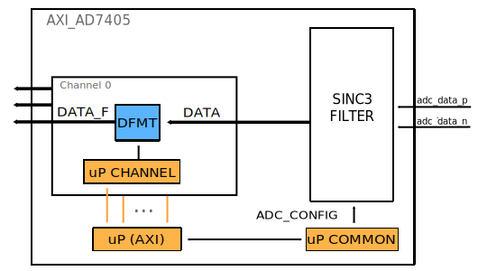

.. _axi_ad7405:

AXI AD7405
================================================================================

.. hdl-component-diagram::

The :git-hdl:`AXI AD7405 <library/axi_ad7405>` IP core
can be used to interface the :adi:`AD7405` device using an
FPGA. The core has a AXI Memory Map interface for configuration, supports the
data interface of the device, and has a simple FIFO interface for the
DMAC.

More about the generic framework interfacing ADCs, that contains the
``up_adc_channel`` and ``up_adc_common modules``, can be read in :ref:`axi_adc`.

Files
--------------------------------------------------------------------------------

.. list-table::
   :header-rows: 1

   * - Name
     - Description
   * - :git-hdl:`library/axi_ad7405/axi_ad7405.v`
     - Verilog source for the AXI AD7405.
   * - :git-hdl:`library/common/util_dec256sinc24b.v`
     - Verilog source for the AXI AD7405 interface.
   * - :git-hdl:`library/common/up_adc_common.v`
     - Verilog source for the ADC Common regmap.
   * - :git-hdl:`library/common/up_adc_channel.v`
     - Verilog source for the ADC Channel regmap.

Block Diagram
--------------------------------------------------------------------------------

Interface
--------------------------------------------------------------------------------

.. hdl-interfaces::

   * - adc_data_in
     - Data in
   * - adc_data_out
     - Data out
   * - adc_data_en
     - ADC enable channel
   * - clk_in
     - ADC clock
   * - s_axi
     - Standard AXI Slave Memory Map interface

Register Map
--------------------------------------------------------------------------------

The register map of the core contains instances of several generic register maps
like ADC common, ADC channel or PWM Generator. The following table presents the
base addresses of each instance, after that can be found the detailed
description of each generic register map.

.. hdl-regmap::
   :name: COMMON
   :no-type-info:

.. hdl-regmap::
   :name: ADC_COMMON
   :no-type-info:

.. hdl-regmap::
   :name: ADC_CHANNEL
   :no-type-info:

Software Support
--------------------------------------------------------------------------------

Linux driver at: :git-hdl:`drivers/iio/adc/ad7405.c`

Refereces
--------------------------------------------------------------------------------

* HDL IP core at :git-hdl:`library/axi_ad7405`
* HDL project at :git-hdl:`projects/ad7405_fmc`
* HDL project documentation at :ref:`ad7405_fmc`
* :adi:`AD7405`
