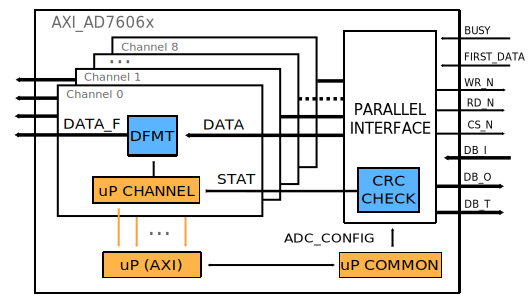

.. _axi_ad7606x:

AXI AD7606x
================================================================================

.. hdl-component-diagram::

The :git-hdl:`AXI AD7606x <library/axi_ad7606x>` IP core can be used to
interface the :adi:`AD7606B`, :adi:`AD7606C-16`, :adi:`AD7606C-18`,
:adi:`AD7605-4`, :adi:`AD7606`, :adi:`AD7606-6`, :adi:`AD7606-4`,
:adi:`AD7607`, :adi:`AD7608` and :adi:`AD7609` devices using an FPGA.

The core supports the parallel data interface of the device,
and has a simple FIFO interface for the DMAC.
More about the generic framework interfacing ADCs, that contains the
``up_adc_channel`` and ``up_adc_common modules``, can be read in :ref:`axi_adc`.

Files
--------------------------------------------------------------------------------

.. list-table::
   :header-rows: 1

   * - Name
     - Description
   * - :git-hdl:`library/axi_ad7606x/axi_ad7606x.v`
     - Verilog source for the AXI AD7606x.
   * - :git-hdl:`library/common/up_adc_common.v`
     - Verilog source for the ADC Common regmap.
   * - :git-hdl:`library/common/up_adc_channel.v`
     - Verilog source for the ADC Channel regmap.

Block Diagram
--------------------------------------------------------------------------------

Configuration Parameters
--------------------------------------------------------------------------------

.. hdl-parameters::

   * - ID
     - Core ID should be unique for each IP in the system
   * - ADC_TO_DMA_N_BITS
     - Defines the number of bits to be transmitted to DMA: 16 - AD7606B/C-16,
       32 - AD7606C-18
   * - ADC_N_BITS
     - Defines the number of bits of each device: 16 - AD7606B/C-16,
       18 - AD7606C-18

Interface
--------------------------------------------------------------------------------

.. hdl-interfaces::

   * - rx_db_o
     - Parallel data out
   * - rx_db_i
     - Parallel data in
   * - rx_db_t
     - Active high 3-state T pin for IOBUF
   * - rx_rd_n
     - Active low parallel data read control
   * - rx_wr_n
     - Active low parallel data write control
   * - rx_cs_n
     - Active low chip select
   * - rx_busy
     - Active low busy signal
   * - first_data
     - Active high status signal indicating when the first channel is available
       on the data bus
   * - adc_valid
     - Shows when a valid data is available on the bus
   * - adc_data_*
     - Channel ADC data
   * - adc_enable_*
     - ADC enable signal for each channel
   * - adc_clk
     - ADC clock
   * - adc_dovf
     - ADC data overflow signaling
   * - s_axi
     - Standard AXI Slave Memory Map interface

Register Map
--------------------------------------------------------------------------------

The register map of the core contains instances of several generic register maps
like ADC common, ADC channel or PWM Generator. The following table presents the
base addresses of each instance, after that can be found the detailed
description of each generic register map.

.. hdl-regmap::
   :name: COMMON
   :no-type-info:

.. hdl-regmap::
   :name: ADC_COMMON
   :no-type-info:

.. hdl-regmap::
   :name: ADC_CHANNEL
   :no-type-info:

Theory of operation
--------------------------------------------------------------------------------

The axi_ad7606x IP can be configured in various operation modes, this feature
being integrated in the device register map. Thus, to be able to configure the
operation mode and any other features available through the mentioned register
map, **adc_config_ctrl** signal, that is available in the *up_adc_common*
module, is used in this way: bit 1 - RD ('b1) \| WR ('b0) and bit 0 - enable
WR/RD operation.

ADC Register Mode (AD7606x familiy)
~~~~~~~~~~~~~~~~~~~~~~~~~~~~~~~~~~~~~~~~~~~~~~~~~~~~~~~~~~~~~~~~~~~~~~~~~~~~~~~

As regards the register mode, AD7606x family devices have the following
workflow: DB[15] - RD ('b0) \| WR ('b1), DB[14:8] - register address and DB[7:0]
- register data or don't care data. Besides the data output signal, WR_N and
RD_N signals are also used in order to make a write or read request to the
device. The following timing diagram shows a parallel interface register read
operation followed by a write operation.

.. tip::

   In case of the :adi:`AD7606C-18` chip, the **x** identifier, this being the
   number of the DB pins, will be the **x** identifier
   from the :adi:`AD7606B` or :adi:`AD7606C-16` chips + 2
   (e.g. DB0 from :adi:`AD7606B` or :adi:`AD7606C-16` will
   be DB2 in :adi:`AD7606C-18`. The pinout of the
   :adi:`AD7606C-18` chip can be obtained from the page 12 of the
   :adi:`AD7606C-18 Datasheet <media/en/technical-documentation/data-sheets/ad7606c-18.pdf>`.

.. wavedrom

   {signal: [
     {name: 'CS_N', wave:'1.0......|......1..'},
     {name: 'RD_N', wave:'1.....0.1|.........'},
     {name: 'WR_N', wave:'1.0.1....|0.1.0.1..'},
     {name: 'DB[15]', wave:'z.1.z.0.z|0.z.0.z..'},
     {name: 'DB[14:8]', wave:'z.=.z.=.z|=.z.0.z..', data: ['ADDR',"ADDR","ADDR"]},
     {name: 'DB[7:0]', wave:'z.=.z.=.z|=.z.=.z..', data: ['DC',"DATA","DATA","DC"]},
     {name: 'MODE', wave:'=.=......|......=..', data: ['ADC Read', 'ADC Register Mode','ADC Read']}
   ]
   }

The following timing diagrams illustrate available ADC read modes using the
AD7606x family devices.

ADC Read Mode (AD7606B/C-16)
~~~~~~~~~~~~~~~~~~~~~~~~~~~~~~~~~~~~~~~~~~~~~~~~~~~~~~~~~~~~~~~~~~~~~~~~~~~~~~~

.. wavedrom

   {signal: [
     {name: 'CNVST_N', wave: '1..01...........|......01.'},
     {name: 'BUSY', wave:'0...10..........|.......10'},
     {name: 'CS_N', wave:'1....0..........|......1.0'},
     {name: 'RD_N', wave:'1....0.1.0.1.0.1|0.1.0.1..'},
     {name: 'DB[15:0]', wave:'z....=.z.=.z.=.z|=.z.=.z..', data: ['V1',"V2","V3","V7","V8"]},
     {name: 'FIRST_DATA', wave:'z....1.0........|......z..'}
   ]
   }

ADC Read Mode (AD7606C-18)
~~~~~~~~~~~~~~~~~~~~~~~~~~~~~~~~~~~~~~~~~~~~~~~~~~~~~~~~~~~~~~~~~~~~~~~~~~~~~~~

.. wavedrom

   {signal: [
     {name: 'CNVST_N', wave: '1..01...........|......01.'},
     {name: 'BUSY', wave:'0...10..........|.......10'},
     {name: 'CS_N', wave:'1....0..........|......1.0'},
     {name: 'RD_N', wave:'1....0.1.0.1.0.1|0.1.0.1..'},
     {name: 'DB[15:0]', wave:'z....=.z.=.z.=.z.=.z.=.z..', data: ['V1[17:2]',"V1[1:0]","V3[17:2]","V8[17:2]","V8[1:0]"]},
     {name: 'FIRST_DATA', wave:'z....1.0........|......z..'}
   ]
   }

ADC Read Mode with CRC enabled (AD7606B/C-16)
~~~~~~~~~~~~~~~~~~~~~~~~~~~~~~~~~~~~~~~~~~~~~~~~~~~~~~~~~~~~~~~~~~~~~~~~~~~~~~~

.. wavedrom

   {signal: [
     {name: 'CNVST_N', wave: '1..01...........|......01.'},
     {name: 'BUSY', wave:'0...10..........|.......10'},
     {name: 'CS_N', wave:'1....0..........|......1.0'},
     {name: 'RD_N', wave:'1....0.1.0.1.0.1|0.1.0.1..'},
     {name: 'DB[15:0]', wave:'z....=.z.=.z.=.z|=.z.=.z..', data: ['V1',"V2","V3","V8","CRC"]},
     {name: 'FIRST_DATA', wave:'z....1.0........|......z..'}
   ]
   }

ADC Read Mode with CRC enabled (AD7606C-18)
~~~~~~~~~~~~~~~~~~~~~~~~~~~~~~~~~~~~~~~~~~~~~~~~~~~~~~~~~~~~~~~~~~~~~~~~~~~~~~~

.. wavedrom

   {signal: [
     {name: 'CNVST_N', wave: '1..01...........|......01.'},
     {name: 'BUSY', wave:'0...10..........|.......10'},
     {name: 'CS_N', wave:'1....0..........|......1.0'},
     {name: 'RD_N', wave:'1....0.1.0.1.0.1|0.1.0.1..'},
     {name: 'DB[15:0]', wave:'z....=.z.=.z.=.z.=.z.=.z..', data: ['V1[17:2]',"V1[1:0]","V3[17:2]","V8[1:0]","CRC"]},
     {name: 'FIRST_DATA', wave:'z....1.0........|......z..'}
   ]
   }

.. image:: wavedrom-5.svg

ADC Read Mode with Status enabled (AD7606B/C-16)
~~~~~~~~~~~~~~~~~~~~~~~~~~~~~~~~~~~~~~~~~~~~~~~~~~~~~~~~~~~~~~~~~~~~~~~~~~~~~~~

.. wavedrom

   {signal: [
     {name: 'CNVST_N', wave: '1..01...........|......01.'},
     {name: 'BUSY', wave:'0...10..........|.......10'},
     {name: 'CS_N', wave:'1....0..........|......1.0'},
     {name: 'RD_N', wave:'1....0.1.0.1.0.1|0.1.0.1..'},
     {name: 'DB[15:8]', wave:'z....=.z.=.z.=.z.=.z.=.z..', data: ['V1[15:8]','Status_CH1',"V2[15:8]","V8[15:8]","Status_CH8"]},
     {name: 'DB[7:0]', wave:'z....=.z.0.z.=.z.=.z.0.z..', data: ['V1[7:0]','V2[7:0]','V3[7:0]']},
     {name: 'FIRST_DATA', wave:'z....1.0........|......z..'}
   ]
   }

ADC Read Mode with Status enabled (AD7606C-18)
~~~~~~~~~~~~~~~~~~~~~~~~~~~~~~~~~~~~~~~~~~~~~~~~~~~~~~~~~~~~~~~~~~~~~~~~~~~~~~~

.. wavedrom

   {signal: [
     {name: 'CNVST_N', wave: '1..01...........|......01.'},
     {name: 'BUSY', wave:'0...10..........|.......10'},
     {name: 'CS_N', wave:'1....0..........|......1.0'},
     {name: 'RD_N', wave:'1....0.1.0.1.0.1|0.1.0.1..'},
     {name: 'DB[15]', wave:'z....=.z.=.z.=.z.=.z.=.z..', data: ['V1[17]',"V1[1]","V2[17]","V8[17]","V8[1]"]},
     {name: 'DB[14]', wave:'z....=.z.=.z.=.z.=.z.=.z..', data: ['V1[16]',"V1[0]","V2[16]","V8[16]","V8[0]"]},
     {name: 'DB[13]', wave:'z....=.z.0.z.=.z.=.z.0.z..', data: ['V1[15]',"V2[15]","V8[15]"]},
     {name: 'DB[12]', wave:'z....=.z.0.z.=.z.=.z.0.z..', data: ['V1[14]',"V2[14]","V8[14]"]},
     {name: 'DB[11]', wave:'z....=.z.0.z.=.z.=.z.0.z..', data: ['V1[13]',"V2[13]","V8[13]"]},
     {name: 'DB[10]', wave:'z....=.z.0.z.=.z.=.z.0.z..', data: ['V1[12]',"V2[12]","V8[12]"]},
     {name: 'DB[9]', wave:'z....=.z.0.z.=.z.=.z.0.z..', data: ['V1[11]',"V2[11]","V8[11]"]},
     {name: 'DB[8]', wave:'z....=.z.0.z.=.z.=.z.0.z..', data: ['V1[10]',"V2[10]","V8[10]"]},
     {name: 'DB[7]', wave:'z....=.z.=.z.=.z.=.z.=.z..', data: ['V1[9]','Status1[7]',"V2[9]","V8[9]","Status8[7]"]},
     {name: 'DB[6]', wave:'z....=.z.=.z.=.z.=.z.=.z..', data: ['V1[8]','Status1[6]',"V2[8]","V8[8]","Status8[6]"]},
     {name: 'DB[5]', wave:'z....=.z.=.z.=.z.=.z.=.z..', data: ['V1[7]','Status1[5]',"V2[7]","V8[7]","Status8[5]"]},
     {name: 'DB[4]', wave:'z....=.z.=.z.=.z.=.z.=.z..', data: ['V1[6]','Status1[4]',"V2[6]","V8[6]","Status8[4]"]},
     {name: 'DB[3]', wave:'z....=.z.=.z.=.z.=.z.=.z..', data: ['V1[5]','Status1[3]',"V2[5]","V8[5]","Status8[3]"]},
     {name: 'DB[2]', wave:'z....=.z.=.z.=.z.=.z.=.z..', data: ['V1[4]','Status1[2]',"V2[4]","V8[4]","Status8[2]"]},
     {name: 'DB[1]', wave:'z....=.z.=.z.=.z.=.z.=.z..', data: ['V1[3]','Status1[1]',"V2[3]","V8[3]","Status8[1]"]},
     {name: 'DB[0]', wave:'z....=.z.=.z.=.z.=.z.=.z..', data: ['V1[2]','Status1[0]',"V2[2]","V8[2]","Status8[0]"]},
     {name: 'FIRST_DATA', wave:'z....1.0........|......z..'}
   ]
   }

ADC Read Mode with Status and CRC enabled (AD7606B/C-16)
~~~~~~~~~~~~~~~~~~~~~~~~~~~~~~~~~~~~~~~~~~~~~~~~~~~~~~~~~~~~~~~~~~~~~~~~~~~~~~~

.. wavedrom

   {signal: [
     {name: 'CNVST_N', wave: '1..01...........|..........01.'},
     {name: 'BUSY', wave:'0...10..........|...........10'},
     {name: 'CS_N', wave:'1....0..........|..........1.0'},
     {name: 'RD_N', wave:'1....0.1.0.1.0.1|0.1.0.1.0.1..'},
     {name: 'DB[15:8]', wave:'z....=.z.=.z.=.z|=.z.=.z.=.z..', data: ['V1[15:8]','Status_CH1',"V2[15:8]","V8[15:8]","Status_CH8","CRC[15:8]"]},
     {name: 'DB[7:0]', wave:'z....=.z.0.z.=.z|=.z.0.z.=.z..', data: ['V1[7:0]','V2[7:0]','V3[7:0]','CRC[7:0]']},
     {name: 'FIRST_DATA', wave:'z....1.0........|..........z..'}
   ]
   }

ADC Read Mode with Status and CRC enabled (AD7606C-18)
~~~~~~~~~~~~~~~~~~~~~~~~~~~~~~~~~~~~~~~~~~~~~~~~~~~~~~~~~~~~~~~~~~~~~~~~~~~~~~~

.. wavedrom

   {signal: [
     {name: 'CNVST_N', wave: '1..01...........|..........01.'},
     {name: 'BUSY', wave:'0...10..........|...........10'},
     {name: 'CS_N', wave:'1....0..........|..........1.0'},
     {name: 'RD_N', wave:'1....0.1.0.1.0.1|0.1.0.1.0.1..'},
     {name: 'DB[15]', wave:'z....=.z.=.z.=.z|=.z.=.z.=.z..', data: ['V1[17]',"V1[1]","V2[17]","V8[17]","V8[1]","CRC[15]"]},
     {name: 'DB[14]', wave:'z....=.z.=.z.=.z|=.z.=.z.=.z..', data: ['V1[16]',"V1[0]","V2[16]","V8[16]","V8[0]","CRC[14]"]},
     {name: 'DB[13]', wave:'z....=.z.0.z.=.z|=.z.0.z.=.z..', data: ['V1[15]',"V2[15]","V8[15]","CRC[13]"]},
     {name: 'DB[12]', wave:'z....=.z.0.z.=.z|=.z.0.z.=.z..', data: ['V1[14]',"V2[14]","V8[14]","CRC[12]"]},
     {name: 'DB[11]', wave:'z....=.z.0.z.=.z|=.z.0.z.=.z..', data: ['V1[13]',"V2[13]","V8[13]","CRC[11]"]},
     {name: 'DB[10]', wave:'z....=.z.0.z.=.z|=.z.0.z.=.z..', data: ['V1[12]',"V2[12]","V8[12]","CRC[10]"]},
     {name: 'DB[9]', wave:'z....=.z.0.z.=.z|=.z.0.z.=.z..', data: ['V1[11]',"V2[11]","V8[11]","CRC[9]"]},
     {name: 'DB[8]', wave:'z....=.z.0.z.=.z|=.z.0.z.=.z..', data: ['V1[10]',"V2[10]","V8[10]","CRC[8]"]},
     {name: 'DB[7]', wave:'z....=.z.=.z.=.z|=.z.=.z.=.z..', data: ['V1[9]','Status1[7]',"V2[9]","V8[9]","Status8[7]","CRC[7]"]},
     {name: 'DB[6]', wave:'z....=.z.=.z.=.z|=.z.=.z.=.z..', data: ['V1[8]','Status1[6]',"V2[8]","V8[8]","Status8[6]","CRC[6]"]},
     {name: 'DB[5]', wave:'z....=.z.=.z.=.z|=.z.=.z.=.z..', data: ['V1[7]','Status1[5]',"V2[7]","V8[7]","Status8[5]","CRC[5]"]},
     {name: 'DB[4]', wave:'z....=.z.=.z.=.z|=.z.=.z.=.z..', data: ['V1[6]','Status1[4]',"V2[6]","V8[6]","Status8[4]","CRC[4]"]},
     {name: 'DB[3]', wave:'z....=.z.=.z.=.z|=.z.=.z.=.z..', data: ['V1[5]','Status1[3]',"V2[5]","V8[5]","Status8[3]","CRC[3]"]},
     {name: 'DB[2]', wave:'z....=.z.=.z.=.z|=.z.=.z.=.z..', data: ['V1[4]','Status1[2]',"V2[4]","V8[4]","Status8[2]","CRC[2]"]},
     {name: 'DB[1]', wave:'z....=.z.=.z.=.z|=.z.=.z.=.z..', data: ['V1[3]','Status1[1]',"V2[3]","V8[3]","Status8[1]","CRC[1]"]},
     {name: 'DB[0]', wave:'z....=.z.=.z.=.z|=.z.=.z.=.z..', data: ['V1[2]','Status1[0]',"V2[2]","V8[2]","Status8[0]","CRC[0]"]},
     {name: 'FIRST_DATA', wave:'z....1.0........|..........z..'}
   ]
   }

Software Support
-------------------------------------------------------------------------------

* Linux device drivers at:

  * :git-linux:`drivers/iio/adc/ad7606.c`
  * :git-linux:`drivers/iio/adc/ad7606_par.c`
  * :git-linux:`drivers/iio/adc/ad7606_spi.c`

References
-------------------------------------------------------------------------------

* HDL IP core at :git-hdl:`library/axi_ad7606x`
* HDL project at :git-hdl:`projects/ad7606x_fmc`
* HDL project documentation at :ref:`ad7606x_fmc`
* :adi:`AD7606B`
* :adi:`AD7606C-16`
* :adi:`AD7606C-18`
* :adi:`AD7605-4`
* :adi:`AD7606`
* :adi:`AD7606-6`
* :adi:`AD7606-4`
* :adi:`AD7607`
* :adi:`AD7608`
* :adi:`AD7609`
* :adi:`AD7606B Documentation <media/en/technical-documentation/data-sheets/ad7606b.pdf>`
* :adi:`AD7606C-16 Documentation <media/en/technical-documentation/data-sheets/ad7606c-16.pdf>`
* :adi:`AD7606C-18 Documentation <media/en/technical-documentation/data-sheets/ad7606c-18.pdf>`
* :adi:`AD7605-4 Documentation <media/en/technical-documentation/data-sheets/ad7605-4.pdf>`
* :adi:`AD7606-8/-6/-4 Documentation <media/en/technical-documentation/data-sheets/ad7606_7606-6_7606-4.pdf>`
* :adi:`AD7607 Documentation <media/en/technical-documentation/data-sheets/ad7607.pdf>`
* :adi:`AD7608 Documentation <media/en/technical-documentation/data-sheets/ad7608.pdf>`
* :adi:`AD7609 Documentation <media/en/technical-documentation/data-sheets/ad7609.pdf>`
* :adi:`EVAL-AD7606B Information <en/design-center/evaluation-hardware-and-software/evaluation-boards-kits/eval-ad7606b-fmcz.html>`
* :adi:`EVAL-AD7606C-16/18 Information <en/design-center/evaluation-hardware-and-software/evaluation-boards-kits/eval-ad7606c-18.html>`
* :adi:`EVAL-AD7606B User Guide <media/en/technical-documentation/user-guides/EVAL-AD7606BFMCZ-UG-1225.pdf>`
* :adi:`EVAL-AD7606C-16/18 User Guide <media/en/technical-documentation/user-guides/eval-ad7606c-fmcz-ug-1870.pdf>`
* :adi:`EVAL-AD7605-4 User Guide <media/en/technical-documentation/user-guides/EVAL-AD7605-4SDZ_7606SDZ_7606-6SDZ_7606-4SDZ_7607SDZ_7608SDZ.pdf>`
* :adi:`EVAL-AD7606-8/-6/-4 User Guide <media/en/technical-documentation/user-guides/EVAL-AD7605-4SDZ_7606SDZ_7606-6SDZ_7606-4SDZ_7607SDZ_7608SDZ.pdf>`
* :adi:`EVAL-AD7607 User Guide <media/en/technical-documentation/user-guides/EVAL-AD7605-4SDZ_7606SDZ_7606-6SDZ_7606-4SDZ_7607SDZ_7608SDZ.pdf>`
* :adi:`EVAL-AD7608 User Guide <media/en/technical-documentation/user-guides/EVAL-AD7605-4SDZ_7606SDZ_7606-6SDZ_7606-4SDZ_7607SDZ_7608SDZ.pdf>`
* :adi:`EVAL-AD7609 User Guide <en/resources/evaluation-hardware-and-software/evaluation-boards-kits/eval-ad7609.html>`
* :dokuwiki:`AD7606X FMC HDL Reference Design <resources/eval/user-guides/ad7606x-fmc/hdl>`
