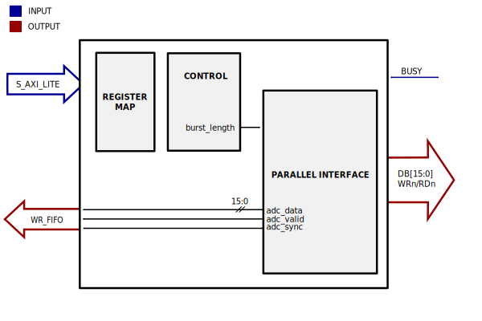

.. _axi_ad7616:

AXI AD7616
================================================================================

.. hdl-component-diagram::

The :git-hdl:`AXI AD7616 <library/axi_ad7616>` IP core
can be used to interface the :adi:`AD7616` device using an
FPGA. The core has a AXI Memory Map interface for configuration, supports the
parallel data interface of the device, and has a simple FIFO interface for the
DMAC.

Files
--------------------------------------------------------------------------------

.. list-table::
   :header-rows: 1

   * - Name
     - Description
   * - :git-hdl:`library/axi_ad7616/axi_ad7616.v`
     - Verilog source for the AXI AD7616.
   * - :git-hdl:`library/axi_ad7616/axi_ad7616_control.v`
     - Verilog source for the AXI AD7616 control.
   * - :git-hdl:`library/axi_ad7616/axi_ad7616_pif.v`
     - Verilog source for the AXI AD7616 parallel interface.

Block Diagram
--------------------------------------------------------------------------------

Configuration Parameters
--------------------------------------------------------------------------------

.. hdl-parameters::

   * - ID
     - Core ID should be unique for each IP in the system

Interface
--------------------------------------------------------------------------------

.. hdl-interfaces::

   * - rx_db_o
     - Parallel data out
   * - rx_db_i
     - Parallel data in
   * - rx_db_t
     - Active high 3-state T pin for IOBUF
   * - rx_rd_n
     - Active low parallel data read control
   * - rx_wr_n
     - Active low parallel data write control
   * - rx_cs_n
     - Active low chip select
   * - rx_trigger
     - End of conversion signal
   * - adc_valid
     - Shows when a valid data is available on the bus
   * - adc_data
     - Data bus
   * - adc_sync
     - Shows the first valid beat on a sequence
   * - s_axi
     - Standard AXI Slave Memory Map interface

Register Map
--------------------------------------------------------------------------------

.. hdl-regmap::
   :name: AXI_AD7616

Software Support
--------------------------------------------------------------------------------

* Linux documentation :dokuwiki:`on wiki <resources/tools-software/linux-drivers/iio-adc/ad7606>`
* No-OS driver at :git-no-os:`drivers/adc/ad7616`

Refereces
--------------------------------------------------------------------------------

* HDL IP core at :git-hdl:`library/axi_ad7616`
* HDL project at :git-hdl:`projects/ad7616_sdz`
* HDL project documentation at :ref:`ad7616_sdz`
* :adi:`AD7616`
