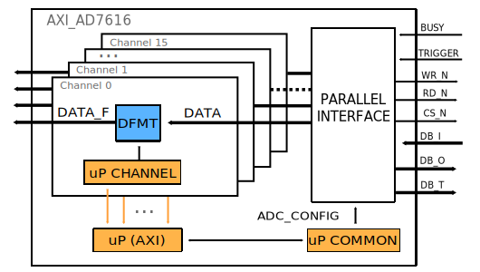
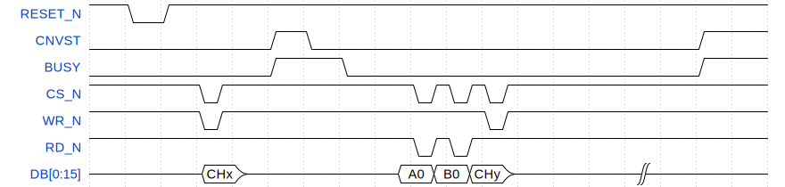
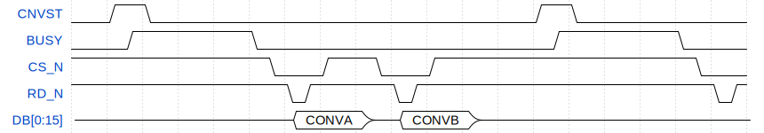
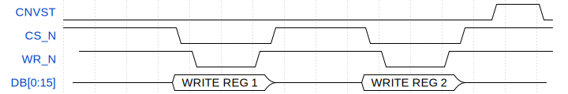

.. _axi_ad7616:

AXI AD7616
================================================================================

.. hdl-component-diagram::

The :git-hdl:`AXI AD7616 <library/axi_ad7616>` IP core
can be used to interface the :adi:`AD7616` device using an
FPGA. The core has a AXI Memory Map interface for configuration, supports the
parallel data interface of the device, and has a simple FIFO interface for the
DMAC.

More about the generic framework interfacing ADCs, that contains the
``up_adc_channel`` and ``up_adc_common modules``, can be read in :ref:`axi_adc`.

Files
--------------------------------------------------------------------------------

.. list-table::
   :header-rows: 1

   * - Name
     - Description
   * - :git-hdl:`library/axi_ad7616/axi_ad7616.v`
     - Verilog source for the AXI AD7616.
   * - :git-hdl:`library/axi_ad7616/axi_ad7616_pif.v`
     - Verilog source for the AXI AD7616 parallel interface.
   * - :git-hdl:`library/common/up_adc_common.v`
     - Verilog source for the ADC Common regmap.
   * - :git-hdl:`library/common/up_adc_channel.v`
     - Verilog source for the ADC Channel regmap.

Block Diagram
--------------------------------------------------------------------------------

Configuration Parameters
--------------------------------------------------------------------------------

.. hdl-parameters::

   * - ID
     - Core ID should be unique for each IP in the system

Interface
--------------------------------------------------------------------------------

.. hdl-interfaces::

   * - rx_db_o
     - Parallel data out
   * - rx_db_i
     - Parallel data in
   * - rx_db_t
     - Active high 3-state T pin for IOBUF
   * - rx_rd_n
     - Active low parallel data read control
   * - rx_wr_n
     - Active low parallel data write control
   * - rx_cs_n
     - Active low chip select
   * - rx_trigger
     - End of conversion signal
   * - adc_valid
     - Shows when a valid data is available on the bus
   * - adc_data_*
     - Channel ADC data
   * - adc_enable_*
     - ADC enable signal for each channel
   * - adc_clk
     - ADC clock
   * - adc_reset
     - ADC reset
   * - adc_dovf
     - ADC data overflow signaling
   * - s_axi
     - Standard AXI Slave Memory Map interface

Register Map
--------------------------------------------------------------------------------

The register map of the core contains instances of several generic register maps
like ADC common, ADC channel or PWM Generator. The following table presents the
base addresses of each instance, after that can be found the detailed
description of each generic register map.

.. hdl-regmap::
   :name: COMMON
   :no-type-info:

.. hdl-regmap::
   :name: ADC_COMMON
   :no-type-info:

.. hdl-regmap::
   :name: ADC_CHANNEL
   :no-type-info:

Theory of operation
--------------------------------------------------------------------------------

The axi_ad7616 IP can be configured in various operation modes, this feature
being integrated in the device register map. Thus, to be able to configure the
operation mode and any other features available through the mentioned register
map, **adc_config_ctrl** signal, that is available in the *up_adc_common*
module, is used in this way: bit 1 - RD request to the device register map('b1),
bit 0 - WR request to the device register map('b1). Also, **adc_custom_control**
signal, that is available in the *up_adc_common* module, controls burst_length.

Software Parallel Mode Channel Conversion Setting
~~~~~~~~~~~~~~~~~~~~~~~~~~~~~~~~~~~~~~~~~~~~~~~~~~~~~~~~~~~~~~~~~~~~~~~~~~~~~~~
.. wavedrom

   {signal: [
     {name: 'RESET_N', wave:'101................'},
     {name: 'CNVST', wave:'0....10..........1.'},
     {name: 'BUSY', wave:'0....1.0.........1.'},
     {name: 'CS_N', wave:'1.....01..........010101..............', "period" :0.5},
     {name: 'WR_N', wave:'1.....01..............01..............', "period" :0.5},
     {name: 'RD_N', wave:'1.................0101................', "period" :0.5},
     {name: 'DB[0:15]', wave:'z.....=.z.........=.=.=.z.........|.....', data: ['CHx',"A0","B0","CHy"], "period" :0.45}
   ]}

   CHx CONVERSION START

Parallel Read Timing Diagram
~~~~~~~~~~~~~~~~~~~~~~~~~~~~~~~~~~~~~~~~~~~~~~~~~~~~~~~~~~~~~~~~~~~~~~~~~~~~~~~
.. wavedrom

   {signal: [
     {name: 'CNVST', wave:'010..........10....'},
     {name: 'BUSY', wave:'0..1......0................1......0...', "period" :0.5},
     {name: 'CS_N', wave:'1..........0..1..0..1..............0..', "period" :0.5},
     {name: 'RD_N', wave:'1......................01........01................................01.', "period" :0.25},
     {name: 'DB[0:15]', wave:'z.....=.z=.z.......', data: ['CONVA',"CONVB","B0","CHy"], "period" :1,"phase":-0.1}
   ]}

Parallel Write Timing Diagram
~~~~~~~~~~~~~~~~~~~~~~~~~~~~~~~~~~~~~~~~~~~~~~~~~~~~~~~~~~~~~~~~~~~~~~~~~~~~~~~
.. wavedrom

   {signal: [
     {name: 'CNVST', wave:'0..........................1..0', "period" :0.5},
     {name: 'CS_N', wave:'1......0.....1.....0.....1.....', "period" :0.5},
     {name: 'WR_N', wave:'1......0...1.......0...1......', "period" :0.5,"phase":-0.5},
     {name: 'DB[0:15]', wave:'z..=.z.=.z.', data: ['WRITE REG 1',"WRITE REG 2","B0","CHy"], "period" :1.3,"phase":0.7}
   ]}

Software Support
--------------------------------------------------------------------------------

* Linux documentation :dokuwiki:`on wiki <resources/tools-software/linux-drivers/iio-adc/ad7606>`
* No-OS driver at :git-no-os:`drivers/adc/ad7616`

Refereces
--------------------------------------------------------------------------------

* HDL IP core at :git-hdl:`library/axi_ad7616`
* HDL project at :git-hdl:`projects/ad7616_sdz`
* HDL project documentation at :ref:`ad7616_sdz`
* :adi:`AD7616`
