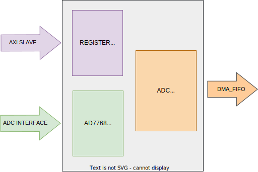
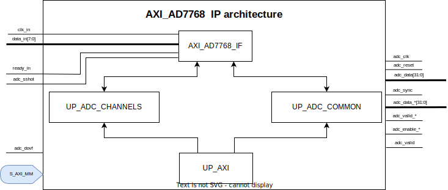

.. _axi_ad7768:

AXI AD7768
================================================================================

.. hdl-component-diagram::

The :git-hdl:`AXI AD7768 <library/axi_ad7768>` IP core
can be used to interface the :adi:`AD7768` and
:adi:`AD7768-4` ADC, in 1, 2, 4 or 8 data lines active.
More about the generic framework interfacing ADCs, that contains the
``up_adc_channel`` and ``up_adc_common modules``, can be read in :ref:`axi_adc`.

Features
--------------------------------------------------------------------------------

* AXI based configuration
* CRC validation flag
* Configurable number of active data lines
* Real-time data header access
* Vivado and Quartus compatible

Files
--------------------------------------------------------------------------------

.. list-table::
   :header-rows: 1

   * - Name
     - Description
   * - :git-hdl:`library/axi_ad7768/axi_ad7768.v`
     - Verilog source for the AXI AD7768.
   * - :git-hdl:`library/axi_ad7768/axi_ad7768_if.v`
     - Verilog source for the AXI AD7768 interface module.
   * - :git-hdl:`library/axi_ad7768/axi_ad7768_ip.tcl`
     - TCL script to generate the Vivado IP-integrator project.
   * - :git-hdl:`library/axi_ad7768/axi_ad7768_hw.tcl`
     - TCL script to generate the Quartus IP-integrator project.

Block Diagram
--------------------------------------------------------------------------------

Configuration Parameters
--------------------------------------------------------------------------------

.. hdl-parameters::

   * - ID
     - Core ID should be unique for each IP in the system
   * - NUM_CHANNELS
     - Select number of ADC channels. 8 for AD7768 and 4 for AD7768-4

Interface
--------------------------------------------------------------------------------

.. hdl-interfaces::

   * - clk_in
     - Input clock.
   * - ready_in
     - Input ready signal.
   * - data_in
     - Serial input data.
   * - adc_dovf
     - Data overflow input, from the DMA.
   * - adc_clk
     - This is the clock domain that most of the modules of the core run on.
   * - adc_reset
     - Output reset, on the adc_clk domain.
   * - adc_sshot
     - Single shot conversion.
   * - adc_enable_*
     - Set when the channel is enabled, activated by software.
   * - adc_valid_*
     - Set when valid channel data is available on the bus.
   * - adc_data_*
     - Channel parallel output data.
   * - adc_data
     - Serial output data.
   * - adc_valid
     - Set when valid data is available in the serial output.
   * - adc_sync
     - Start of transfer flag for serial data.
   * - adc_crc_ch_mismatch
     - Channels CRC mismatch flags register.
   * - s_axi
     - Standard AXI Slave Memory Map interface.

Detailed Architecture
--------------------------------------------------------------------------------

Detailed Description
--------------------------------------------------------------------------------

The top module, axi_ad7768, instantiates:

* The ad7768 interface module
* The ADC channel register map
* The ADC common register map
* The AXI handling interface

The AD7768 interface module has as input the serial data lines, the ready_in
signal and the interface clock. Data is deserialized according to the number
of active lanes. The interface module also implements a parallel CRC check
algorithm.
The data from the interface module is processed by the adc channel module.
``up_adc_common`` module implements the ADC COMMON register map, allowing for
basic monitoring and control of the ADC.
``up_adc_channel`` module implements the ADC CHANNEL register map, allowing for
basic monitoring and control of the ADC's channel.

Register Map
--------------------------------------------------------------------------------

.. hdl-regmap::
   :name: COMMON
   :no-type-info:

.. hdl-regmap::
   :name: ADC_COMMON
   :no-type-info:

.. hdl-regmap::
   :name: ADC_CHANNEL
   :no-type-info:

Design Guidelines
--------------------------------------------------------------------------------

The control of the AD7768 chip is done through a SPI interface, which is needed
at system level.

The *ADC interface signals* must be connected directly to the top file of the
design, as IO primitives are part of the IP.

The example design uses a DMA to move the data from the output of the IP to
memory.

If the data needs to be processed in HDL before moved to the memory, it can be
done at the output of the IP (at system level) or inside of the adc interface
module (at IP level).

The example design uses a processor to program all the registers. If no
processor is available in your system, you can create your own IP starting from
the interface module.

Software Support
--------------------------------------------------------------------------------

* Linux documentation :dokuwiki:`on wiki <resources/tools-software/linux-drivers/iio-adc/ad7768>`
* Linux documentation for AD7768-1 :dokuwiki:`on wiki <resources/tools-software/linux-drivers/iio-adc/ad7768-1>`
* No-OS driver at :git-no-os:`drivers/adc/ad7768`, :git-no-os:`drivers/adc/ad7768-1`
* No-OS project at :git-no-os:`projects/ad7768-evb`, :git-no-os:`projects/ad7768-1fmcz`
* IIO documentation support for AD7768-1 :dokuwiki:`on wiki <resources/tools-software/product-support-software/ad77681_mbed_iio_application>`

References
-------------------------------------------------------------------------------

* HDL IP core at :git-hdl:`library/axi_ad7768`
* HDL project at :git-hdl:`projects/ad7768evb`, :git-hdl:`projects/ad77681evb`
* HDL project documentation at :ref:`ad7768evb`
* :adi:`AD7768`
* :adi:`AD7768-4`
* :xilinx:`Zynq-7000 SoC Overview <support/documentation/data_sheets/ds190-Zynq-7000-Overview.pdf>`
* :xilinx:`Zynq-7000 SoC Packaging and Pinout <support/documentation/user_guides/ug865-Zynq-7000-Pkg-Pinout.pdf>`
