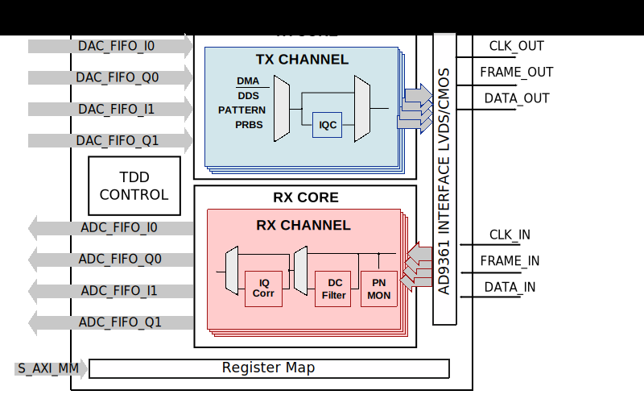

.. _axi_ad9361:

AXI AD9361
================================================================================

.. hdl-component-diagram::

The :git-hdl:`AXI AD9361 <library/axi_ad9361>` IP core
can be used to interface the :adi:`AD9361` device.
This documentation only covers the IP core and requires that one must be
familiar with the device for a complete and better understanding.

More about the generic framework interfacing ADCs can be read in :ref:`axi_adc`,
and interfacing DACs in :ref:`axi_dac`.

Features
--------------------------------------------------------------------------------

* AXI Lite control/status interface
* PRBS monitoring
* Hardware and software DC filtering
* IQ correction
* Internal DDS
* Programmable line delays
* Receive and transmit loop back
* Supports both Altera and AMD Xilinx devices

Files
--------------------------------------------------------------------------------

.. list-table::
   :header-rows: 1

   * - Name
     - Description
   * - :git-hdl:`library/axi_ad9361/axi_ad9361.v`
     - Verilog source for the AXI AD9361.
   * - :git-hdl:`library/common/up_adc_common.v`
     - Verilog source for the ADC Common regmap.
   * - :git-hdl:`library/common/up_adc_channel.v`
     - Verilog source for the ADC Channel regmap.
   * - :git-hdl:`library/common/up_dac_common.v`
     - Verilog source for the DAC Common regmap.
   * - :git-hdl:`library/common/up_dac_channel.v`
     - Verilog source for the DAC Channel regmap.

Block Diagram
--------------------------------------------------------------------------------

Functional Description
--------------------------------------------------------------------------------

The axi_ad9361 cores architecture contains:

* :git-hdl:`Interface <library/axi_ad9361/axi_ad9361.v#L302>` module in either
  CMOS Dual Port Full Duplex or LVDS mode for :git-hdl:`Intel <library/axi_ad9361/intel>`
  or :git-hdl:`AMD Xilinx <library/axi_ad9361/xilinx>` devices.
* :git-hdl:`Receive <library/axi_ad9361/axi_ad9361_rx.v>` module, which contains:

  * :git-hdl:`ADC channel processing <library/axi_ad9361/axi_ad9361_rx_channel.v>` modules, one for each channel

    * data processing modules (
      :git-hdl:`DC Filter <library/xilinx/common/ad_dcfilter.v>`,
      :git-hdl:`IQ Correction <library/common/ad_iqcor.v>` and
      :git-hdl:`Data Format Control <library/common/ad_datafmt.v>`)
    * :git-hdl:`ADC PN Monitor <library/axi_ad9361/axi_ad9361_rx_pnmon.v>` for interface validation
    * :git-hdl:`ADC Channel register map <library/common/up_adc_channel.v>`

  * :git-hdl:`Delay Control <library/common/up_delay_cntrl.v>` and
    :git-hdl:`ADC Common register map <library/common/up_adc_common.v>`

* :git-hdl:`Transmit <library/axi_ad9361/axi_ad9361_tx.v>` module, which contains:

   * :git-hdl:`DAC channel processing <library/axi_ad9361/axi_ad9361_tx_channel.v>`
     modules, one for each channel

     * Different data generators (:git-hdl:`DDS <library/common/ad_dds.v>`, pattern, PRBS)
     * :git-hdl:`IQ Correction <library/common/ad_iqcor.v>`
     * :git-hdl:`DAC Channel register map <library/common/up_dac_channel.v>`

   * :git-hdl:`Delay Control <library/common/up_delay_cntrl.v>` and
     :git-hdl:`DAC Common register map <library/common/up_dac_common.v>`

* :git-hdl:`TDD control module <library/axi_ad9361/axi_ad9361_tdd.v>` for TDD mode,
  see more information on the
  :dokuwiki:`HDL support for AD9361 TDD mode <resources/eval/user-guides/ad-pzsdr2400tdd-eb/reference_hdl>`
  wiki page.
* :git-hdl:`AXI control and status <common/up_axi.v>` modules.

Device (AD9361) Interface Description
~~~~~~~~~~~~~~~~~~~~~~~~~~~~~~~~~~~~~~~~~~~~~~~~~~~~~~~~~~~~~~~~~~~~~~~~~~~~~~~

The IP supports both LVDS and CMOS Dual Port Full Duplex interfaces
(configurable, see parameters section). It avoids all the programmable flavors
of the device interface mess. The interface is in fact quite simple, in LVDS
mode samples require two active clock edges and in CMOS mode a single edge. The
samples are then delineated in-order using the FRAME signal. This is applicable
to both DDR and SDR modes. There is a limitation though, the IP core does NOT
support swapping of the data ports in CMOS mode. This option is left as a
constraint. As an example the PZSDR projects uses SWAP on some boards based on
the board layout.

Let's consider the 2R2T configuration, each frame consists of 4 samples in each
direction. In LVDS-DDR mode that is 8 clock edges (4 full clock cycles)
identified by a frame pattern of 8'b11110000. The IP interface logic simply
collects data on consecutive 8 edges and deframes using the FRAME signal and
outputs the samples. The device does the same in the transmit direction. In CMOS
mode, the same is done over 4 clock edges.

The interface also provides a single clock tree for the entire core. This clock
uses a global buffer that has the minimum skew all across the die. On Altera
devices, this is done via the PLL and because the LVDS cores do NOT support a
serialization factor of 2, runs at half the interface clock frequency.
On AMD Xilinx devices, this is done via the BUFG and the core and interface runs
at the same clock frequency.

Altera
^^^^^^^^^^^^^^^^^^^^^^^^^^^^^^^^^^^^^^^^^^^^^^^^^^^^^^^^^^^^^^^^^^^^^^^^^^^^^^^

The core is tested to work only on Cyclone V Arrow SOC Kit. Since Altera does
half-thought board designs that do not favor FMC bank allocations, we are
incapable of validating the core on other devices.

AMD Xilinx
^^^^^^^^^^^^^^^^^^^^^^^^^^^^^^^^^^^^^^^^^^^^^^^^^^^^^^^^^^^^^^^^^^^^^^^^^^^^^^^

Alternative Clocking Methods
'''''''''''''''''''''''''''''''''''''''''''''''''''''''''''''''''''''''''''''''

1. Using MMCM 2. Using BUFIO/BUFR

Alternative Use Models
'''''''''''''''''''''''''''''''''''''''''''''''''''''''''''''''''''''''''''''''

1. Interface Logic Only 2. Disable DSP Functions 3. Removing AXI interface and
Processor Control

Internal Interface Description
~~~~~~~~~~~~~~~~~~~~~~~~~~~~~~~~~~~~~~~~~~~~~~~~~~~~~~~~~~~~~~~~~~~~~~~~~~~~~~~

The main purpose of all (including this) ADI IP cores is to provide a common,
well-defined internal interface within the FPGA. This interface consists of the
following signals per channel.

ENABLE
^^^^^^^^^^^^^^^^^^^^^^^^^^^^^^^^^^^^^^^^^^^^^^^^^^^^^^^^^^^^^^^^^^^^^^^^^^^^^^^

The enable signal is strictly for software use and is controlled by the
corresponding register bit. The core simply reflects the programmed bit as an
output port. In ADI reference projects, this bit is used to activate the channel
of interest. It is then used by the PACK/UNPACK cores to route the data based on
total number of channels and the selected number of channels. As an example,
AXI_AD9361 supports a total of 4 channels 16bits each. This corresponds to a
packed channel data width of 64bits. If software enables only two channels the
packed 64bits of data is exclusively shared by the enabled 2 channels (each
channel gets 32 bits of data).

VALID
^^^^^^^^^^^^^^^^^^^^^^^^^^^^^^^^^^^^^^^^^^^^^^^^^^^^^^^^^^^^^^^^^^^^^^^^^^^^^^^

The valid signal is sourced by the core to indicate a valid sample on the DATA
port. In the receive (ADC) direction this indicates a valid sample and in the
transmit (DAC) direction this indicates the current sample is being read by the
core. The valid is simply a 'reflective' of the 'sampling rate'. Note that he
cores always run at the interface clock. This is to avoid any customized clock
handling or transfer within this core. However in many cases interface clock may
not be the sampling clock. As an example for AD9361 the interface clock is
244Mhz for a sampling clock of 61MHz. That is each channel's sampling rate is
61MHz. This translates into the VALID signal being asserted once every 4 clocks.
In cores where sampling rate is same as the interface clock, VALID is always
asserted and may be safely ignored.

A common interpretation of this is that all channels has the same VALID
behavior. This is NOT necessarily true. A majority of use cases may have this as
a result of data path equivalency. However, if software decides to
enable/disable functions differently among channels, the VALID signals of those
channels will NOT be the same.

DATA
^^^^^^^^^^^^^^^^^^^^^^^^^^^^^^^^^^^^^^^^^^^^^^^^^^^^^^^^^^^^^^^^^^^^^^^^^^^^^^^

The DATA is the raw Analog samples. It follows two simple rules.

#. The samples are always 16bits, regardless of the ADC/DAC data width. That is
   the source or destination is intended to handle samples as 16bits. In the
   transmit direction, if the DAC data width is less than 16bits, the most
   significant bits are used. In the receive direction, if the ADC data width is
   less than 16bits, the most significant bits are sign extended. This allows
   the same source or destination portable across different ADC/DAC data widths.
   In other words, if the source is generating a 16bits tone the signal appears
   the same across a 12bit, 14bit or 16bit DAC with only the corresponding
   amplitude change. The source can thus be independent of the number of bits
   supported by DAC. In the receive direction, the samples are sign extended.
   Thus the destination always receives a 16bit sample with different amplitude
   levels corresponding to the number of bits supported by the ADC. This may
   seem to break the symmetry rule, but in most DSP functions the samples are
   rounded up towards the MSB as only precision is allowed to lost or gained at
   the expense of the LSB bits. The MSB bits retains all the physical nature of
   the signal.
#. The DATA is received and transmitted with most significant sample "newest"
   regardless of the channel width. In other words the most significant sample
   is the "newest" sample. If the total channel width is 64bits, it carries 4
   samples (16bits) per clock. If we were to name these samples as S3 (bits 63
   down to 48), S2 (bits 47 down to 32), S1 (bits 31 down to 16) and S0 (bits 15
   down to 0), the following is true. In the transmit direction, S0 is sent
   first and S3 is sent last to the DAC. The analog samples are S0, S1, S2 and
   S3 across time with S0 being the oldest and S3 being the newest sample. In
   the receive direction, S0 carries the oldest sample received and S3 carries
   the newest sample from the ADC.

Configuration Parameters
--------------------------------------------------------------------------------

.. hdl-parameters::

   * - ID
     - Core ID should be unique for each IP in the system
   * - FPGA_TECHNOLOGY
     - Used to select between devices
   * - MODE_1R1T
     - Used to select between 2RX2TX (0) and 1RX1TX (1) mode.
   * - TDD_DISABLE
     - Setting this parameter the TDD control will not be implemented in the
       core.
   * - CMOS_OR_LVDS_N
     - Defines the physical interface type, set 1 for CMOS and 0 for LVDS
   * - ADC_DATAPATH_DISABLE
     - If set, the data path processing logic is not generated in the RX path,
       and the raw data is pushed directly to the DMA interface.
   * - ADC_USERPORTS_DISABLE
     - Disable the User Control ports in receive path.
   * - ADC_DATAFORMAT_DISABLE
     - Disable the Data Format control module.
   * - ADC_DCFILTER_DISABLE
     - Disable the DC Filter module.
   * - ADC_IQCORRECTION_DISABLE
     - Disable the IQ Correction module in receive path.
   * - DAC_DATAPATH_DISABLE
     - If set, the data path processing logic is not generated in the TX path,
       and the raw data is pushed directly to the physical interface.
   * - DAC_IODELAY_ENABLE
     - Set IO_DELAY control in transmit path.
   * - DAC_DDS_DISABLE
     - Disable the DDS modules in transmit path.
   * - DAC_USERPORTS_DISABLE
     - Disable the User Control ports in transmit path.
   * - DAC_IQCORRECTION_DISABLE
     - Disable the IQ Correction module in transmit path.
   * - IO_DELAY_GROUP
     - The delay group name which is set for the delay controller

Interface
--------------------------------------------------------------------------------

.. hdl-interfaces::

   * - rx_clk_in_p
     - LVDS input clock
   * - rx_clk_in_n
     - LVDS input clock
   * - rx_frame_in_p
     - LVDS input frame signal
   * - rx_frame_in_n
     - LVDS input frame signal
   * - rx_data_in_p
     - LVDS input data lines
   * - rx_data_in_n
     - LVDS input data lines
   * - rx_clk_in
     - CMOS input clock
   * - rx_frame_in
     - CMOS input frame signal
   * - rx_data_in
     - CMOS input data lines
   * - tx_clk_out_p
     - LVDS output clock
   * - tx_clk_out_n
     - LVDS output clock
   * - tx_frame_out_p
     - LVDS output frame signal
   * - tx_frame_out_n
     - LVDS output frame signal
   * - tx_data_out_p
     - LVDS output data lines
   * - tx_data_out_n
     - LVDS output data lines
   * - tx_clk_out
     - CMOS output clock
   * - tx_frame_out
     - CMOS output frame signal
   * - tx_data_out
     - CMOS output data lines
   * - enable
     - ENSM control signal, see User Guide for more information
   * - txnrx
     - ENSM control signal, see User Guide for more information
   * - tdd_sync
     - SYNC input for frame synchronization in TDD mode
   * - tdd_sync_cntr
     - SYNC output for frame synchronization in TDD mode
   * - delay_clk
     - Delay clock input for IO_DELAY control, 200 MHz (7 series) or 300 MHz
       (Ultrascale)
   * - dac_sync_in
     - Synchronization signal of the transmit path for slave devices (ID>0)
   * - dac_sync_out
     - Synchronization signal of the transmit path for master device (ID==0)
   * - l_clk
     - This clock should be used for further data processing
   * - clk
     - Must be driven by ``l_clk``
   * - rst
     - Core reset signal
   * - adc_enable_q*
     - If set, the channel is enabled (one for each channel)
   * - adc_enable_i*
     - If set, the channel is enabled (one for each channel)
   * - adc_valid_q*
     - Indicates valid data at the current channel (one for each channel)
   * - adc_valid_i*
     - Indicates valid data at the current channel (one for each channel)
   * - adc_data_q*
     - Received data output (one for each channel)
   * - adc_data_i*
     - Received data output (one for each channel)
   * - adc_dovf
     - Data overflow, must be connected to the DMA
   * - adc_r1_mode
     - If set, core is functioning in single channel mode (one I/Q pair)
   * - dac_enable_q*
     - If set, the channel is enabled (one for each channel)
   * - dac_enable_i*
     - If set, the channel is enabled (one for each channel)
   * - dac_valid_q*
     - Indicates valid data request at the current channel (one for each
       channel)
   * - dac_valid_i*
     - Indicates valid data request at the current channel (one for each
       channel)
   * - dac_data_q*
     - Transmitted data output (one for each channel)
   * - dac_data_i*
     - Transmitted data output (one for each channel)
   * - dac_dunf
     - Data underflow, must be connected to the DMA
   * - dac_r1_mode
     - If set, core is functioning in single channel mode (one I/Q pair)
   * - up_enable
     - GPI control of the ENABLE line in TDD mode, when HDL TDD control is
       DISABLED
   * - up_txnrx
     - GPI control of the TXNRX line in TDD mode, when HDL TDD control is
       DISABLED
   * - up_dac_gpio_in
     - GPI ports connected to the AXI memory map for custom use
   * - up_dac_gpio_out
     - GPI ports connected to the AXI memory map for custom use
   * - up_adc_gpio_in
     - GPI ports connected to the AXI memory map for custom use
   * - up_adc_gpio_out
     - GPO ports connected to the AXI memory map for custom use
   * - s_axi
     - Standard AXI Slave Memory Map interface

Register Map
--------------------------------------------------------------------------------

The register map of the core contains instances of several generic register maps
like ADC common, ADC channel, DAC common, DAC channel etc. The following table
presents the base addresses of each instance, after that can be found the
detailed description of each generic register map. The absolute address of a
register should be calculated by adding the instance base address to the
registers relative address.

.. list-table:: Register Map base addresses for axi_ad9361
   :header-rows: 1

   * - DWORD
     - BYTE
     - Name
     - Description
   * - 0x0000
     - 0x0000
     - BASE
     - See the `Base <#hdl-regmap-COMMON>`__ table for more details.
   * - 0x0000
     - 0x0000
     - RX COMMON
     - See the `ADC Common <#hdl-regmap-ADC_COMMON>`__ table for more details.
   * - 0x0000
     - 0x0000
     - RX CHANNELS
     - See the `ADC Channel <#hdl-regmap-ADC_CHANNEL>`__ table for more details.
   * - 0x1000
     - 0x4000
     - TX COMMON
     - See the `DAC Common <#hdl-regmap-DAC_COMMON>`__ table for more details.
   * - 0x1000
     - 0x4000
     - TX CHANNELS
     - See the `DAC Channel <#hdl-regmap-DAC_CHANNEL>`__ table for more details.
   * - 0x2000
     - 0x8000
     - TDD CONTROL
     - See the `Transceiver TDD Control <#hdl-regmap-TDD_CNTRL>`__ table for more details.

.. hdl-regmap::
   :name: COMMON
   :no-type-info:

.. hdl-regmap::
   :name: ADC_COMMON
   :no-type-info:

.. hdl-regmap::
   :name: ADC_CHANNEL
   :no-type-info:

.. hdl-regmap::
   :name: DAC_COMMON
   :no-type-info:

.. hdl-regmap::
   :name: DAC_CHANNEL
   :no-type-info:

.. hdl-regmap::
   :name: TDD_CNTRL
   :no-type-info:

Software Support
--------------------------------------------------------------------------------

The software for this IP can be found as part of the FMCOMMS2/3/4/5
reference designs.

* Linux device driver at :git-linux:`drivers/iio/adc/ad9361.c`
* Linux device trees for this can be found at :git-linux:`/`
* Linux documentation :dokuwiki:`on wiki <resources/tools-software/linux-drivers/iio-transceiver/ad9361>`
* No-OS device driver at :git-no-os:`drivers/rf-transceiver/ad9361`
* No-OS project at :git-no-os:`projects/ad9361`

References
-------------------------------------------------------------------------------

* HDL IP core at :git-hdl:`library/axi_ad9361`
* :adi:`AD9361`
* :adi:`AD9361 User Guide <media/en/technical-documentation/user-guides/AD9361_Reference_Manual_UG-570.pdf>`
* :dokuwiki:`FMCOMMS2 Reference Design <resources/eval/user-guides/ad-fmcomms2-ebz>`
* :dokuwiki:`FMCOMMS4 Reference Design <resources/eval/user-guides/ad-fmcomms4-ebz>`
* :xilinx:`Zynq-7000 SoC Overview <support/documentation/data_sheets/ds190-Zynq-7000-Overview.pdf>`
* :xilinx:`Zynq-7000 SoC Packaging and Pinout <support/documentation/user_guides/ug865-Zynq-7000-Pkg-Pinout.pdf>`
