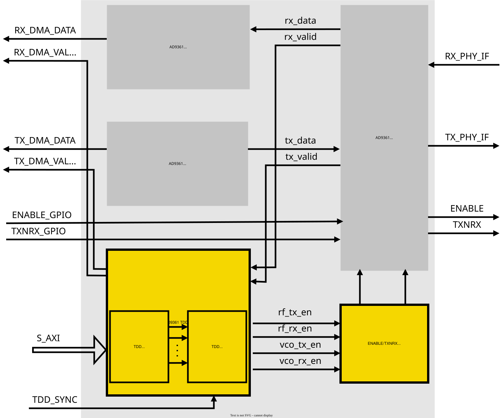

.. _axi_ad9361 tdd:

HDL Support for AD9361 TDD Mode
================================================================================

Using the :adi:`AD9361` RF Agile Transceiver in TDD (Time Division Duplex) mode,
the user has multiple solutions to control the time period of the receive and
transmit bursts. The internal enable state machine of device (ENSM) can either
be controlled by SPI writes or ENABLE/TXNRX pins. SPI control is considered
asynchronous to the DATA_CLK because the SPI_CLK can be derived from a different
clock reference and still function properly. The SPI control ENSM method is
recommended when real time control of the synthesizers is not necessary. SPI
control can be used for real time control as long as the Base Band Processor
(BBP) has the ability to perform timed SPI writes accurately.

The ENABLE/TXNRX pin control method is recommended if the BBP has extra control
outputs that can be controlled in real time, allowing a simple two-wire
interface to control the state of the AD9361 device. This user guide intend to
provide an in-depth description about the HDL support of the ENABLE/TXNRX pin
control method.

ENABLE/TXNRX Pin Control
--------------------------------------------------------------------------------

In TDD, the state of the TXNRX pin controls whether the AD9361 will transition
from ALERT to Rx or ALERT to Tx. If TXNRX is high, the device will move into the
Tx state. If TXNRX is low, the device will move into the Rx state. The TXNRX pin
level should be set during the ALERT state. The logic level of TXNRX must not
change during the Rx, Tx, or FDD states. The role of the ENABLE pin is to
transition the ENSM state to the next state, and can be operated in pulse mode
or level mode.

.. figure:: ad9361_tdd_pincntr_pulse.png
   :alt: Enable Pulse Mode (TDD)

   Enable Pulse Mode (TDD)

.. figure:: ad9361_tdd_pincntr_level.png
   :alt: Enable Level Mode (TDD)

   Enable Level Mode (TDD)

By default the ENABLE and TXNRX pins are controlled by GPIO's. This solution
similarly to the SPI write ENSM control, can not provide a real time control of
these pins.

The **axi_ad9361** IP core has an integrated TDD controller, which gives the
possibility to control the ENABLE/TXNRX pins in real time. The TDD controller
consists of a counter, which counts on every positive edge of the FB_CLK, and a
several software accessible registers, which defines the time when the ENABLE
and TXNRX pins should be set or reset.

TDD Controller
--------------------------------------------------------------------------------

In the block diagram below can be seen the **axi_ad9361** IP core with the
integrated TDD controller modules inside. If the controller is enabled, all the
data flow from or to the device will be controlled by this module.

   axi_ad9361 IP block diagram

The AXI register map of the TDD controller, and the description of each
registers can be found under the following link:
`TDD REGISTER MAP <resources/fpga/docs/hdl/regmap#transceiver_tdd_control_axi_ad>`__

The foundation of the TDD controller is a counter, which can be configured to
count until a specified frame length. The maximum value of the counter can be
defined by simple divide the desired frame length with the current FB_CLK clock
period, e.g. in the case of a 10 ms frame length, when the FB_CLK is 122.88 Mhz
the value of the REG_TDD_FRAME_LENGTH register must be 1228800.

After defining the frame length, the user can define one or two sets of
pointers, which will tell the exact location, when the device will start/stop a
receive/transmit burst inside a frame.

Start and stop a receive burst consists of the following action points, each
point will define a pointer:

#. Enabling the RX synthesizer
#. Enabling the RX RF path inside the device (ALERT to RX state transition)
#. Enabling the RX Data path inside the FPGA (the core starts to get valid data
   from the devices interface)
#. Disabling the RX Data path inside the FPGA
#. Disabling the RX RF path inside the device (RX to ALERT state transition)
#. Disabling the RX synthesizer

Start or stop a transmit burst consists of the following action points, each
point will define a pointer:

#. Enabling the TX synthesizer
#. Enabling the TX RF path inside the device (ALERT to TX state transition)
#. Enabling the TX Data path inside the FPGA (the core starts to push valid data
   to the devices interface)
#. Disabling the TX Data path inside the FPGA
#. Disabling the TX RF path inside the device (TX to ALERT state transition)
#. Disabling the TX synthesizer

After enabling the TDD controller, the counter starts to count and compares its
value to the values of the pointers, if there is a match the corresponding
control signal is asserted. Using this simple method the controller generates
six different control signals: VCO_RX_EN, VCO_TX_EN, RF_RX_EN, RF_TX_EN,
TX_DP_EN, RX_DP_EN. Using these
control signals the :git-hdl:`TDD interface <library/axi_ad9361/axi_ad9361_tdd_if.v>`
module will drive the ENABLE and TXNRX pins accordingly.

Register Map
--------------------------------------------------------------------------------

.. hdl-regmap::
   :name: TDD_CNTRL
   :no-type-info:

Synchronization
--------------------------------------------------------------------------------

To test and validate the functionality of the TDD controller, two Avnet
PicoZed SDR Development Kits were used, in conjunction with the Avnet
AES-PZSDRCC-FMC-G carrier board and the
:adi:`AD-PZSDR2400TDD-EB` RF personality card.

.. figure:: util_tdd_sync.png
   :alt: util_tdd_sync core

   util_tdd_sync core

TDD systems are using the same frequency channel for both Uplink (UL) and
Downlink (DL) transmission, but in different times. This scheme gives the
possibility to dynamically allocate the amount of time for UL and DL, resulting
an asymmetric UL/DL transmission. To prevent unwanted interference of different
transmission links between nodes, a network synchronization is required between
base stations and users. In practice this synchronization can be obtained by
using IEEE 1588 or GPS.

In our case, the goal was to showcase the TDD support of the AD9361, so the
synchronization of the two devices is solved as simple as possible, without
using any of the above mentioned method. The reference design contains a pulse
generator core (:git-hdl:`util_tdd_sync <library/util_tdd_sync>`), which is
independent of the **axi_ad9361** core, and can be generate a small pulse in a
defined time interval. Than this pulse will be fed into both **axi_ad9361**
core and will reset the counter, this way the two controller will stay synced.

.. important::

   This reference design will not provide a complete solution for the network
   synchronization.

Parameters of util_tdd_sync
~~~~~~~~~~~~~~~~~~~~~~~~~~~~~~~~~~~~~~~~~~~~~~~~~~~~~~~~~~~~~~~~~~~~~~~~~~~~~~~~

.. list-table::
   :header-rows: 1

   * - Name
     - Default
     - Description
   * - ``TDD_SYNC_PERIOD``
     - 100000000
     - Relative time between two synchronization pulse. The actual time is the
       value multiplied by the ``clk`` clock period.

IO Ports of util_tdd_sync
~~~~~~~~~~~~~~~~~~~~~~~~~~~~~~~~~~~~~~~~~~~~~~~~~~~~~~~~~~~~~~~~~~~~~~~~~~~~~~~~

.. list-table::
   :header-rows: 1

   * - Name
     - Type
     - Description
   * - ``clk``
     - Clock
     - It's driven by the system clock (S_AXI_ACLK), which is a 100 Mhz clock
       signal.
   * - ``rstn``
     - Reset
     - Active low reset, driven by the system reset. (S_AXI_RSTN)
   * - ``sync_mode``
     - Input
     - If ``sync_mode`` is asserted, the internally generated sync signal will
       be assigned to ``sync_out``, otherwise the ``sync_out`` will get the
       ``sync_in`` value. This pin is connected to the ``tdd_sync_cntr`` pin of
       the axi_ad9361 core.
   * - ``sync_in``
     - Input
     - External input signal, which comes from the other terminal.
   * - ``sync_out``
     - Output
     - This pin is connected to the ``tdd_sync`` pin of the axi_ad9361 core.

To activate the sync pulse generator the software needs to set the
``REG_TDD_SYNC_TERMINAL_TYPE`` register to ``0x01``.

TDD_SYNC Interface IO Mapping
~~~~~~~~~~~~~~~~~~~~~~~~~~~~~~~~~~~~~~~~~~~~~~~~~~~~~~~~~~~~~~~~~~~~~~~~~~~~~~~~

.. list-table::
   :header-rows: 1

   * - Carrier Name
     - Connector Name
     - Port Name
     - FPGA IO Pin
   * - AES-PZSDRCC-FMC-G
     - PMOD1 / P11
     - PMOD1[5]
     - W19
   * - :xilinx:`ZC706`
     - PMOD1 / J58
     - PMOD1_5_LS
     - AA20

Linux Driver
--------------------------------------------------------------------------------

Example Platform Device Initialization
~~~~~~~~~~~~~~~~~~~~~~~~~~~~~~~~~~~~~~~~~~~~~~~~~~~~~~~~~~~~~~~~~~~~~~~~~~~~~~~~

The TDD HDL core driver is a platform driver and can currently only be
instantiated via devicetree.

Required devicetree properties:

* ``compatible``: Should always be ``"adi,axi-tdd-1.00"``
* ``reg``: Base address and register area size. This parameter expects a
  register range.
* ``adi,profile-config0``: At least one (maximum 7) configuration profile should
  be defined. A profile contains the values of the registers: COUNTER_2
  (0x8048),
  FRAME_LENGTH (0x804c), SYNC_TERM_TYPE (0x8050), VCO_RX_ON_1 (0x8080),
  VCO_RX_OFF_1 (0x8084), VCO_TX_ON_1 (0x8088), VCO_TX_OFF_1 (0x808C),
  RX_ON_1 (0x8090), RX_OFF_1 (0x8094), TX_ON_1 (0x8098), TX_OFF_1 (0x809C),
  TX_DP_ON_1 (0x80A0), TX_DP_OFF_1 (0x80A4), RX_DP_ON_1 (0x80A8),
  RX_DP_OFF_1 (0x80AC).

.. code-block:: devicetree

   cf_ad9361_tdd_core_0: cf-ad9361-tdd-core-lpc@79028000 {
       compatible = "adi,axi-tdd-1.00";
       reg = <0x79028000 0x1000>;
       adi,profile-config0 = <0 1228800 1 1198080 771920 771920 1198080 39832 771536 781032 1197696 44832 766536 786032 1192696>; /* Master Configuration Profile */
       adi,profile-config1 = <0 1228800 0 771920 1198080 1198080 771920 781032 1197696 39832 771536 786032 1192696 44832 766536>; /* Slave Configuration Profile */
   };

Device Attributes
~~~~~~~~~~~~~~~~~~~~~~~~~~~~~~~~~~~~~~~~~~~~~~~~~~~~~~~~~~~~~~~~~~~~~~~~~~~~~~~~

.. shell:: bash

   /sys/bus/iio/devices/iio:device5
   $ls -l
    -rw-rw-rw- 1 root root 4096 Jan  1  1970 burst_count
    -rw-rw-rw- 1 root root 4096 Jan  1  1970 dev
    -rw-rw-rw- 1 root root 4096 Jan  1  1970 dma_gateing_mode
    -rw-rw-rw- 1 root root 4096 Jan  1  1970 dma_gateing_mode_available
    -rw-rw-rw- 1 root root 4096 Sep 21 09:11 enable
    -rw-rw-rw- 1 root root 4096 Jan  1  1970 enable_mode
    -rw-rw-rw- 1 root root 4096 Jan  1  1970 enable_mode_available
    -rw-rw-rw- 1 root root 4096 Jan  1  1970 name
    lrwxrwxrwx 1 root root    0 Sep 21 09:10 of_node -> ../../../../../firmware/devicetree/base/fpga-axi@0/cf-ad9361-tdd-core-lpc@79028000
    drwxrwxrwx 2 root root    0 Jan  1  1970 power
    -rw-rw-rw- 1 root root 4096 Jan  1  1970 profile_config
    lrwxrwxrwx 1 root root    0 Sep 21 09:10 subsystem -> ../../../../../bus/iio
    -rw-rw-rw- 1 root root 4096 Jan  1  1970 uevent

The following attributes are implemented:

Show Device Name
^^^^^^^^^^^^^^^^^^^^^^^^^^^^^^^^^^^^^^^^^^^^^^^^^^^^^^^^^^^^^^^^^^^^^^^^^^^^^^^^

.. shell:: bash

   /sys/bus/iio/devices/iio:device5
   $cat name
    cf-ad9361-tdd-core-lpc

Enable the TDD Controller
^^^^^^^^^^^^^^^^^^^^^^^^^^^^^^^^^^^^^^^^^^^^^^^^^^^^^^^^^^^^^^^^^^^^^^^^^^^^^^^^

.. shell:: bash

   /sys/bus/iio/devices/iio:device5
   $echo 1 > enable

Choose the Desired Configuration Profile
^^^^^^^^^^^^^^^^^^^^^^^^^^^^^^^^^^^^^^^^^^^^^^^^^^^^^^^^^^^^^^^^^^^^^^^^^^^^^^^^

.. shell:: bash

   /sys/bus/iio/devices/iio:device5
   $echo 1 > profile_config

Configure the DMA Gate
^^^^^^^^^^^^^^^^^^^^^^^^^^^^^^^^^^^^^^^^^^^^^^^^^^^^^^^^^^^^^^^^^^^^^^^^^^^^^^^^

.. shell:: bash

   /sys/bus/iio/devices/iio:device5
   $cat dma_gateing_mode_available
    none rx_only tx_only rx_tx
   $echo none > dma_gateing_mode

Configure the RX/TX Mode
^^^^^^^^^^^^^^^^^^^^^^^^^^^^^^^^^^^^^^^^^^^^^^^^^^^^^^^^^^^^^^^^^^^^^^^^^^^^^^^^

.. shell:: bash

   /sys/bus/iio/devices/iio:device5
   $cat enable_mode_available
    rx_tx rx_only tx_only
   $echo rx_tx > enable_mode

.. figure:: tdd_scope_1.png
   :alt: TDD scope capture 1

   TDD scope capture 1

.. figure:: tdd_scope_2.png
   :alt: TDD scope capture 2

   TDD scope capture 2

Support
--------------------------------------------------------------------------------

If you have any question related to the HDL or the AD-PZSDR2400TDD-EBZ board
please visit the
:dokuwiki:`Help and support <resources/eval/user-guides/ad-pzsdr2400tdd-eb/help_and_support>`
section for more information.
