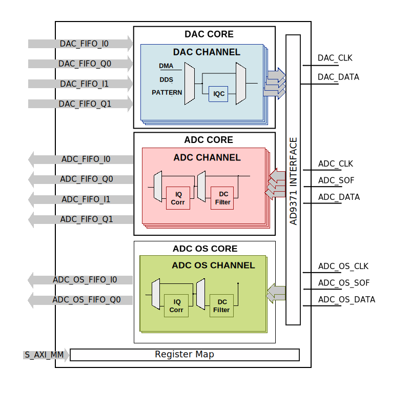

.. _axi_ad9371:

AXI AD9371 (OBSOLETE)
================================================================================

.. warning::

   The support for :git-hdl:`AXI AD9371 <hdl_2019_r2:library/axi_ad9371>`
   has been discontinued, the latest tested release being ``hdl_2019_r2``.
   This page is for legacy purposes only.

.. note::
   This page has a great historical background. The same functionalities are
   implemented using the generic JESD204 TPL IPs.

The :git-hdl:`AXI AD9371 <hdl_2019_r2:library/axi_ad9371>` IP core can be used
to interface the :adi:`AD9371` device. An AXI Memory Map interface is used for
configuration. Data is sent in a format that can be transmitted by Xilinx's
JESD IP.

More about the generic framework interfacing ADCs and DACs, that contains the
``up_dac_channel``, ``up_adc_channel`` and ``up_dac_common modules``,
``up_adc_common modules`` can be read in :ref:`axi_dac` and :ref:`axi_adc`.

Features
--------------------------------------------------------------------------------

* AXI Lite control/status interface
* Hardware and software DC filtering
* IQ correction
* Internal DDS
* Receive and transmit loopback
* Supports both Altera and Xilinx devices

Files
--------------------------------------------------------------------------------

.. list-table::
   :header-rows: 1

   * - Name
     - Description
   * - :git-hdl:`hdl_2019_r2:library/axi_ad9371/axi_ad9371.v`
     - Verilog source for the AXI AD9371.
   * - :git-hdl:`hdl_2019_r2:library/axi_ad9371/axi_ad9371_ip.tcl`
     - TCL script to generate the Vivado IP-integrator project.
   * - :git-hdl:`hdl_2019_r2:library/axi_ad9371/axi_ad9371_hw.tcl`
     - TCL script to generate the Quartus IP-integrator project.
   * - :git-hdl:`hdl_2019_r2:library/axi_ad9371/axi_ad9371_constr.xdc`
     - Constraint file of the IP.
   * - :git-hdl:`hdl_2019_r2:library/axi_ad9371/axi_ad9371_rx.v`
     - Verilog source for the AXI AD9371 RX component.
   * - :git-hdl:`hdl_2019_r2:library/axi_ad9371/axi_ad9371_rx_channel.v`
     - Verilog source for the AXI AD9371 RX channel.
   * - :git-hdl:`hdl_2019_r2:library/axi_ad9371/axi_ad9371_rx_os.v`
     - Verilog source for the AXI AD9371 RX channel observation component.
   * - :git-hdl:`hdl_2019_r2:library/axi_ad9371/axi_ad9371_tx.v`
     - Verilog source for the AXI AD9371 TX component.
   * - :git-hdl:`hdl_2019_r2:library/axi_ad9371/axi_ad9371_tx_channel.v`
     - Verilog source for the AXI AD9371 TX channel.
   * - :git-hdl:`library/common/up_adc_common.v`
     - Verilog source for the ADC Common regmap.
   * - :git-hdl:`library/common/up_adc_channel.v`
     - Verilog source for the ADC Channel regmap.
   * - :git-hdl:`library/common/up_dac_common.v`
     - Verilog source for the DAC Common regmap.
   * - :git-hdl:`library/common/up_dac_channel.v`
     - Verilog source for the DAC Channel regmap.

Block Diagram
--------------------------------------------------------------------------------

Configuration Parameters
--------------------------------------------------------------------------------

.. list-table::
   :header-rows: 1

   * - ID
     - Core ID should be unique for each IP in the system.
   * - DEVICE_TYPE
     - Used to select between 7 Series (0), Virtex 6 (1) or Ultrascale (2) for
       Xilinx devices.
   * - ADC_DATAPATH_DISABLE
     - Disable the receive data path modules.
   * - DAC_DATAPATH_DISABLE
     - Disable the transmit data path modules.

Interface
--------------------------------------------------------------------------------

The interface module of the core is connected to the JESD204B IP core and does
a simple realignment of the data stream. Below it's a list of I/O signals:

.. list-table::
   :header-rows: 1

   * - adc_clk
     - Rx core clock from the GTs, in general clock rate is (Lane Rate)/40.
   * - adc_rx_valid
     - This signal is unused; is defined just to make tools happy.
   * - adc_rx_sof
     - Frame boundary indication signals. Indicate the byte position of the
       first byte of a frame.
   * - adc_rx_data
     - Received data stream from the JESD204B IP.
   * - adc_rx_ready
     - This signal is tied to one; is defined just to make tools happy.
   * - adc_os_clk
     - Rx core clock from the GTs, in general clock rate is (Lane Rate)/40.
   * - adc_rx_os_valid
     - This signal is unused; is defined just to make tools happy.
   * - adc_rx_os_sof
     - Frame boundary indication signals. Indicate the byte position of the
       first byte of a frame
   * - adc_rx_os_data
     - Received data stream from the JESD204B IP.
   * - adc_rx_os_ready
     - This signal is tied to one; is defined just to make tools happy.
   * - dac_clk
     - Tx core clock from the GTs, in general clock rate is (Lane Rate)/40.
   * - dac_tx_valid
     - This signal is tied to one; is defined just to make tools happy.
   * - dac_tx_data
     - Transmitted data stream to the JESD204B IP.
   * - dac_tx_ready
     - This signal is not used; is defined just to make tools happy.
   * - dac_sync_in
     - Synchronization signal of the transmit path for slave devices (ID>0)
   * - dac_sync_out
     - Synchronization signal of the transmit path for master device (ID==0)
   * - adc_enable
     - If set, the channel is enabled (one for each channel)
   * - adc_valid
     - Indicates valid data at the current channel (one for each channel)
   * - adc_data
     - Received data output (one for each channel)
   * - adc_dovf
     - Data overflow, must be connected to the DMA
   * - adc_dunf
     - Data underflow, must be connected to the DMA
   * - adc_os_enable
     - If set, the channel is enabled (one for each channel)
   * - adc_os_valid
     - Indicates valid data at the current channel (one for each channel)
   * - adc_os_data
     - Received data output (one for each channel)
   * - adc_os_dovf
     - Data overflow, must be connected to the DMA
   * - adc_os_dunf
     - Data underflow, must be connected to the DMA
   * - dac_enable
     - If set, the channel is enabled (one for each channel)
   * - dac_valid
     - Indicates valid data request at the current channel (one for each channel)
   * - dac_data
     - Transmitted data output (one for each channel)
   * - dac_dovf
     - Data overflow, must be connected to the DMA
   * - dac_dunf
     - Data underflow, must be connected to the DMA
   * - s_axi
     - Standard AXI Slave Memory Map interface

Detailed Description
--------------------------------------------------------------------------------

The axi_ad9371 cores architecture contains:

* Interface module, which implements the application layer of the JESD20B
  interface. This interface is connected to the JESD204B IP core.
* Receive module, which contains:

  * ADC channel processing modules, one for each channel
    (receive path supports 4 channels)

    * data processing modules ( DC filter, IQ Correction and Data format
      control)
    * ADC Channel register map

  * ADC Common register map

* Observation module, which has the same architecture as the Receive module, but
  supports just 2 channels
* Transmit module, which contains:

  * DAC channel processing modules, one for each channel

    * Different data generators ( DDS, pattern)
    * IQ Correction
    * DAC Channel register map

  * Delay Control and DAC Common register map

* AXI to uP interface wrapper modules (more details :dokuwiki:`here <resources/fpga/docs/up_if>`)

Register Map
--------------------------------------------------------------------------------

.. hdl-regmap::
   :name: COMMON
   :no-type-info:

.. hdl-regmap::
   :name: ADC_COMMON
   :no-type-info:

.. hdl-regmap::
   :name: ADC_CHANNEL
   :no-type-info:

.. hdl-regmap::
   :name: DAC_COMMON
   :no-type-info:

.. hdl-regmap::
   :name: DAC_CHANNEL
   :no-type-info:

.. hdl-regmap::
   :name: JESD_TPL
   :no-type-info:

Design Guidelines
--------------------------------------------------------------------------------

The IP was developed part of the :adi:`AD9371` chip, that can be found on
:adi:`EVAL-ADRV9371`.

The control of the :git-hdl:`AXI AD9371 <hdl_2019_r2:library/axi_ad9371>` chip
is done through a SPI interface, using ACE software. The ACE
(Analysis - Control- Evaluate) software provides a graphical user interface for
configuring and controlling the :adi:`AD9371`, allowing for easy setup and
evaluation of the DAC's performance.

.. warning::
   We **do not** offer support for ACE anymore. Limited support is available.

Software Support
--------------------------------------------------------------------------------

* Linux device driver at:

  * :git-linux:`2019_R2:drivers/iio/adc/ad9371.c`
  * :git-linux:`2019_R2:drivers/iio/adc/ad9371_conv.c`

* Linux device tree at:

  * :git-linux:`2019_R2:arch/arm/boot/dts/adi-adrv9371.dtsi`
  * :git-linux:`2019_R2:arch/microblaze/boot/dts/adi-adrv9371.dtsi`
  * :git-linux:`2019_R2:arch/arm64/boot/dts/xilinx/adi-adrv9371.dtsi`
  * :git-linux:`2019_R2:arch/nios2/boot/dts/a10gx_adrv9371.dts`
  * :git-linux:`2019_R2:arch/microblaze/boot/dts/kcu105_adrv9371x.dts`
  * :git-linux:`2019_R2:arch/arm/boot/dts/zynq-zc706-adv7511-adrv9371.dts`
  * :git-linux:`2019_R2:arch/arm/boot/dts/socfpga_arria10_socdk_adrv9371.dts`
  * :git-linux:`2019_R2:arch/arm64/boot/dts/xilinx/zynqmp-zcu102-rev10-adrv9371.dts`
  * :git-linux:`2019_R2:arch/arm/boot/dts/zynq-zc706-adv7511-adrv9371-jesd204-fsm.dts`
  * :git-linux:`2019_R2:arch/arm64/boot/dts/xilinx/zynqmp-zcu102-rev10-adrv9371-jesd204-fsm.dts`

* No-OS project at :git-no-os:`2019_r2:projects/ad9371`

References
--------------------------------------------------------------------------------

* HDL IP core at :git-hdl:`hdl_2019_r2:library/axi_ad9371`
* :adi:`AD9371`
* :adi:`EVAL-ADRV9371`
* :dokuwiki+deprecated:`[Wiki] Prerequisites for AD9371 based boards <resources/eval/user-guides/mykonos/prerequisites>`
* :dokuwiki+deprecated:`[Wiki] AXI_AD9371 (Obsolete) <resources/fpga/docs/axi_ad9371>`
* :dokuwiki+deprecated:`[Wiki] AD9371 & AD9375 Prototyping Platform User Guide <resources/eval/user-guides/mykonos>`
* :dokuwiki+deprecated:`[Wiki] AD9371 Plugin Description <resources/tools-software/linux-software/ad9371_plugin>`
* :dokuwiki+deprecated:`[Wiki] AD9371, AD9375 highly integrated, wideband RF transceiver Linux device driver <resources/tools-software/linux-drivers/iio-transceiver/ad9371>`
* :dokuwiki+deprecated:`[Wiki] AD9371/AD9375 Advanced Plugin <resources/tools-software/linux-software/ad9371_advanced_plugin>`
* :dokuwiki+deprecated:`[Wiki] AD9371 detailed Block Diagram <resources/eval/user-guides/mykonos/ad9371>`
* :dokuwiki+deprecated:`[Wiki] AD9371/AD9375 Device Driver Customization <resources/tools-software/linux-drivers/iio-transceiver/ad9371-customization>`
* :dokuwiki+deprecated:`[Wiki] IIO OSC AD9371 Capture Window <resources/tools-software/linux-software/ad9371_osc_main>`
* :dokuwiki+deprecated:`[Wiki] AD9371/AD9375 No-OS Setup <resources/eval/user-guides/mykonos/no-os-setup>`
* :dokuwiki+deprecated:`[Wiki] AD9371 Basic IQ Datafiles <resources/eval/user-guides/mykonos/software/basic_iq_datafiles>`
* :xilinx:`Zynq-7000 SoC Overview <support/documentation/data_sheets/ds190-Zynq-7000-Overview.pdf>`
* :xilinx:`Zynq-7000 SoC Packaging and Pinout <support/documentation/user_guides/ug865-Zynq-7000-Pkg-Pinout.pdf>`
* :xilinx:`7 Series libraries <support/documentation/sw_manuals/xilinx2016_2/ug953-vivado-7series-libraries.pdf>`
