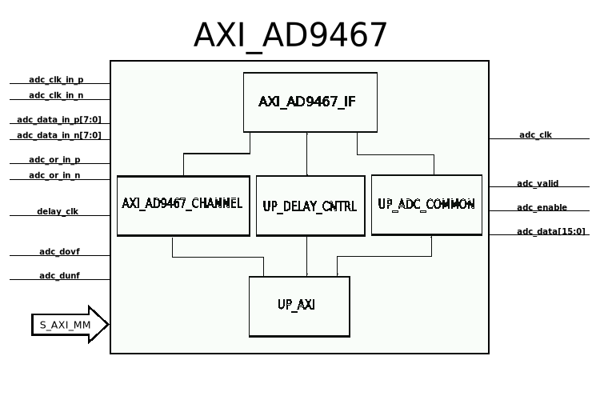

.. _axi_ad9467:

AXI AD9467
================================================================================

.. hdl-component-diagram::

The :git-hdl:`AXI AD9467 <library/axi_ad9467>` IP core
can be used to interface the :adi:`AD9467` ADC.
An AXI Memory Map interface is used for configuration. The data is output using a
FIFO interface.

More about the generic framework interfacing ADCs can be read in :ref:`axi_adc`.

Features
--------------------------------------------------------------------------------

* AXI based configuration
* PRBS monitoring (PN9 and PN23)
* DC filtering
* Configurable line delays
* Vivado compatible

Files
--------------------------------------------------------------------------------

.. list-table::
   :header-rows: 1

   * - Name
     - Description
   * - :git-hdl:`library/axi_ad9467/axi_ad9467.v`
     - Verilog source for the AXI AD9467.
   * - :git-hdl:`library/common/up_adc_common.v`
     - Verilog source for the ADC Common regmap.
   * - :git-hdl:`library/common/up_adc_channel.v`
     - Verilog source for the ADC Channel regmap.

Block Diagram
--------------------------------------------------------------------------------

.. image:: block_diagram.svg
   :alt: AXI AD9467 block diagram

Configuration Parameters
--------------------------------------------------------------------------------

.. hdl-parameters::

   * - ID
     - Core ID should be unique for each IP in the system
   * - FPGA_TECHNOLOGY
     - Used to select between devices
   * - IO_DELAY_GROUP
     - The delay group name which is set for the delay controller

Interface
--------------------------------------------------------------------------------

.. hdl-interfaces::

   * - adc_clk_in_p
     - LVDS input clock
   * - adc_clk_in_n
     - LVDS input clock
   * - adc_data_in_p
     - LVDS input data
   * - adc_data_in_n
     - LVDS input data
   * - adc_or_in_p
     - LVDS input over range
   * - adc_or_in_n
     - LVDS input over range
   * - delay_clk
     - Clock used by the IDELAYCTRL. Connect to 200MHz
   * - adc_clk
     - The input clock is passed through an IBUFGDS and a BUFG primitive and
       adc_clk reults. This is the clock domain that most of the modules of
       the core run on
   * - adc_valid
     - Set when valid data is available on the bus
   * - adc_enable
     - Set when the channel is enabled, activated by software
   * - adc_data
     - Data bus
   * - adc_dovf
     - Data overflow input, from the DMA
   * - s_axi
     - Standard AXI Slave Memory Map interface

Detailed Architecture
--------------------------------------------------------------------------------

Detailed Description
--------------------------------------------------------------------------------

The top module, axi_ad9467, instantiates:

* the LVDS interface module
* two channel processing module
* the ADC common register map
* the AXI handling interface
* delay control module

The LVDS interface module (axi_ad9467_if.v) takes at the input the lvds
signals for clock, data[7:0] and over range and outputs single ended signals.
The data signals are passed through an IDELAYE2 so that each line can be
delayed independently through the delay controller register map.
The latency between input and output of the interface module is 3 clock
cycles.
For more information regarding the 7 Series primitives you can take a look at
UG472, UG471 and UG953.

The channel module implements:

*  a PRBS monitor
*  data format conversion
*  DC filter
*  the ADC CHANNEL register map

The data analyzed by the PRBS monitor is raw data received from the interface.
You can select between PN9 and PN23 sequences.

The delay controller module (up_delay_cntrl) allows the dynamic reconfiguration
of the IDELAYE2 block, which allows for a calibration procedure to be run by
software.

up_adc_common implements the ADC COMMON register map, allowing for basic
monitoring and control of the ADC.

Register Map
--------------------------------------------------------------------------------

.. hdl-regmap::
   :name: COMMON
   :no-type-info:

.. hdl-regmap::
   :name: ADC_COMMON
   :no-type-info:

.. hdl-regmap::
   :name: ADC_CHANNEL
   :no-type-info:

Design Guidelines
--------------------------------------------------------------------------------

The IP was developed part of the
:dokuwiki:`AD9467-FMC-EBZ Reference Design <resources/eval/ad9467-fmc-250ebz>`.

The control of the AD9467 chip is done through a SPI interface, which is needed
at system level.

The *ADC interface signals* must be connected directly to the top file of the
design, as IO primitives are part of the IP.

The example design uses a DMA to move the data from the output of the IP to
memory.

If the data needs to be processed in HDL before moved to the memory, it can be
done at the output of the IP (at system level) or inside of the adc channel
module (at IP level).

The example design uses a processor to program all the registers. If no
processor is available in your system, you can create your own IP starting from
the interface module.

Software Support
--------------------------------------------------------------------------------

* Linux device driver at :git-linux:`drivers/iio/adc/ad9467.c``
* Linux device trees at:

  * :git-linux:`arch/microblaze/boot/dts/kc705_ad9467_fmc.dts`
  * :git-linux:`arch/arm/boot/dts/zynq-zed-adv7511-ad9467-fmc-250ebz.dts`

* No-OS device driver at :git-no-os:`drivers/adc/ad9467`
* No-OS project at :git-no-os:`projects/ad9467`

References
-------------------------------------------------------------------------------

* HDL IP core at :git-hdl:`library/axi_ad9467`
* HDL project at :git-hdl:`projects/ad9467_fmc`
* HDL project documentation at :ref:`ad9467_fmc`
* :adi:`AD9467`
* :dokuwiki:`AD9467-FMC-250EBZ FMC card Quick start guide <resources/fpga/xilinx/fmc/ad9467>`
* :xilinx:`Zynq-7000 SoC Overview <support/documentation/data_sheets/ds190-Zynq-7000-Overview.pdf>`
* :xilinx:`Zynq-7000 SoC Packaging and Pinout <support/documentation/user_guides/ug865-Zynq-7000-Pkg-Pinout.pdf>`
* :xilinx:`7 Series libraries <support/documentation/sw_manuals/xilinx2016_2/ug953-vivado-7series-libraries.pdf>`
