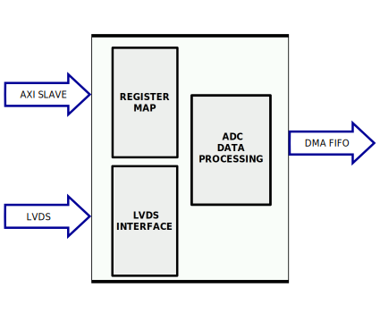

.. _axi_ad9643:

AXI AD9643 (OBSOLETE)
===============================================================================

.. warning::

   The support for :git-hdl:`AXI AD9643 <hdl_2016_r1:library/axi_ad9643>` IP
   has been discontinued, the latest tested release being ``hdl_2016_r1``.
   This page is for legacy purposes only.

The :git-hdl:`AXI AD9643 <hdl_2016_r1:library/axi_ad9643>` IP core was used
to interface the :adi:`AD9643` dual ADC. An AXI Memory Map interface was used
for configuration. The data is outputted using a FIFO interface.

More about the generic framework interfacing ADCs can be read in :ref:`axi_adc`.

Features
-------------------------------------------------------------------------------

* AXI based configuration
* PRBS monitoring (PN9 and PN23)
* DC filtering
* Configurable line delays

Files
-------------------------------------------------------------------------------

.. list-table::
   :header-rows: 1

   * - Name
     - Description
   * - :git-hdl:`hdl_2016_r1:library/axi_ad9643/axi_ad9643.v`
     - Verilog source for the AXI AD9643.
   * - :git-hdl:`hdl_2016_r1:library/axi_ad9643/axi_ad9643_channel.v`
     - Verilog source for the AXI AD9643 channel.
   * - :git-hdl:`hdl_2016_r1:library/axi_ad9643/axi_ad9643_if.v`
     - Verilog source for the interface module of AXI AD9643.
   * - :git-hdl:`hdl_2016_r1:library/axi_ad9643/axi_ad9643_ip.tcl`
     - Tcl script for creating the AXI AD9643 module.
   * - :git-hdl:`hdl_2016_r1:library/axi_ad9643/axi_ad9643_pnmon.v`
     - Verilog source for the PN monitor of AXI AD9643.
   * - :git-hdl:`hdl_2016_r1:library/axi_ad9643/axi_ad9643_constr.xdc`
     - Constraints file for the AXI AD9643.

Block Diagram
-------------------------------------------------------------------------------

Below is the block diagram for the AXI AD9643 IP:

General diagram for ADC LVDS systems:

Configuration Parameters
-------------------------------------------------------------------------------

.. list-table::
   :widths: 30 40 30
   :header-rows: 1

   * - ID
     - Description
     - Default value
   * - ID
     - Core ID should be unique for each AD9643 IP in the system
     - 0
   * - DEVICE_TYPE
     - Used to select between Virtex 6 (1) or 7 Series (0) devices
     - 0
   * - ADC_DATAPATH_DISABLE
     - If set, the datapath processing is not generated and output data is
       taken directly from the AD9643
     - 0
   * - IO_DELAY_GROUP
     - The delay group name which is set for the delay controller
     - "adc_if_delay_group"

Interface
-------------------------------------------------------------------------------

+----------------+-----------------+--------------+--------------------------------------------------------+
| Interface      | Pin             | Type         | Description                                            |
+================+=================+==============+========================================================+
| adc interface  | ADC interface signals                                                                   |
|                +-----------------+--------------+--------------------------------------------------------+
|                | adc_clk_in_*    | input        | LVDS input clock                                       |
|                +-----------------+--------------+--------------------------------------------------------+
|                | adc_data_in_*   | input[13:0]  | LVDS input data                                        |
|                +-----------------+--------------+--------------------------------------------------------+
|                | adc_or_in_*     | input        | LVDS input over range                                  |
+----------------+-----------------+--------------+--------------------------------------------------------+
| delay          | Interface used to control the delay lines                                               |
|                +-----------------+--------------+--------------------------------------------------------+
|                | delay_clock     | input        | Clock used by the IDELAYCTRL.                          |
|                |                 |              | Connect to 200MHz                                      |
+----------------+-----------------+--------------+--------------------------------------------------------+
| s_axi          | AXI Slave Memory Map interface                                                          |
+----------------+-----------------+--------------+--------------------------------------------------------+
| adc fifo       | FIFO interface for connecting to the DMA                                                |
|                +-----------------+--------------+--------------------------------------------------------+
|                | adc_clk         | output       | The input clock is passed through an IBUFGDS and a     |
|                |                 |              | BUFG primitive and adc_clk results. This is the clock  |
|                |                 |              | domain that most of themodules of the core run on.     |
|                +-----------------+--------------+--------------------------------------------------------+
|                | adc_rst         | output       | Output reset, on the adc_clk domain                    |
|                +-----------------+--------------+--------------------------------------------------------+
|                | adc_enable_0    | output       | Set when the channel is enabled, activated by software |
|                +-----------------+--------------+--------------------------------------------------------+
|                | adc_valid_0     | output       | Set when valid data is available on the bus            |
|                +-----------------+--------------+--------------------------------------------------------+
|                | adc_data_0      | output[15:0] | Data bus                                               |
|                +-----------------+--------------+--------------------------------------------------------+
|                | adc_enable_1    | output       | Set when the channel is enabled, activated by software |
|                +-----------------+--------------+--------------------------------------------------------+
|                | adc_valid_1     | output       | Set when valid data is available on the bus            |
|                +-----------------+--------------+--------------------------------------------------------+
|                | adc_data_1      | output[15:0] | Data bus                                               |
|                +-----------------+--------------+--------------------------------------------------------+
|                | adc_dovf        | input        | Data overflow input, from the DMA                      |
|                +-----------------+--------------+--------------------------------------------------------+
|                | adc_dunf        | input        | Data underflow input                                   |
+----------------+-----------------+--------------+--------------------------------------------------------+
| gpio           | Memory-mapped controlled GPIO                                                           |
|                +-----------------+--------------+--------------------------------------------------------+
|                | up_adc_gpio_in  | input[31:0]  | GPIO IN                                                |
|                +-----------------+--------------+--------------------------------------------------------+
|                | up_adc_gpio_out | output[31:0] | GPIO OUT                                               |
+----------------+-----------------+--------------+--------------------------------------------------------+

Detailed Description
-------------------------------------------------------------------------------

The axi_ad9643 top module instantiates:

* the interface module
* two channel-processing modules
* the ADC common register map
* the AXI handling interface
* the delay control module

The top module (axi_ad9643.v) instantiates the lvds interface module, the
channel processing modules, the ADC common register map, the AXI handling
interface and the delay control module.

The LVDS interface module (axi_ad9643_if.v) takes at the input the lvds
signals for clock, data[13:0] and over range and outputs single ended signals.
The data signals are passed through an IDELAYE2 so that each line can be
delayed independently through the delay controller register map.

For more information regarding the 7 Series primitives you can take a look at
AMD Xilinx's user guides UG472, UG471 and UG953.

The output of the interface module is fed to the channel modules.
The channel module implements:

* a PRBS monitor
* data format conversion
* DC filter
* the ADC CHANNEL register map

The data analyzed by the PRBS monitor is raw data received from the interface,
before being processed in any way.
Selection between PN9 and PN23 sequences can be done by programming the
REG_CHAN_CNTRL_3 register.

The delay controller module (up_delay_cntrl) allows the dynamic reconfiguration
of the IDELAYE2 blocks. Changing the delay on each individual line helps
compensate trace differences between the data lines on the PCB.

A calibration procedure can be run on software by changing the delays and
monitoring the PRBS sequence.

Up_adc_common implements the ADC common register map, allowing for basic
monitoring and control of the ADC.

.. important::

   This IP was developed as part of the
   :dokuwiki:`FMCOMMS1 reference design (obsolete) <resources/eval/user-guides/ad-fmcomms1-ebz>`.

The control of the :adi:`AD9643` chip is done through a SPI interface, which
is needed at system level.

The ADC interface signals must be connected directly to the top file of the
design, as I/O primitives are part of the IP.

The example design uses a DMA to move the data from the output of the IP
to memory.

If the data needs to be processed in HDL before moved to the memory, it can be
done at the output of the IP (at system level) or inside of the ADC channel
module (at IP level).

The example design uses a processor to program all the registers. If no processor is available in your system, you can create your own IP starting from the interface module.

Register Map
--------------------------------------------------------------------------------

.. hdl-regmap::
   :name: COMMON
   :no-type-info:

.. hdl-regmap::
   :name: ADC_COMMON
   :no-type-info:

.. hdl-regmap::
   :name: ADC_CHANNEL
   :no-type-info:

Software Support
--------------------------------------------------------------------------------

* No-OS software for this IP can be found as part of the FMCOMMS1 reference
  design at :git-no-os:`here <2016_R1:fmcomms1>`

References
-------------------------------------------------------------------------------

* HDL IP core at :git-hdl:`hdl_2016_r1:library/axi_ad9643`
