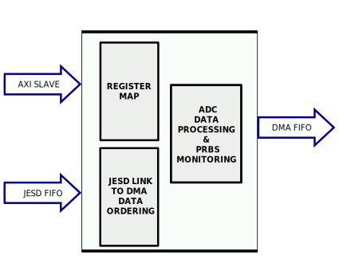
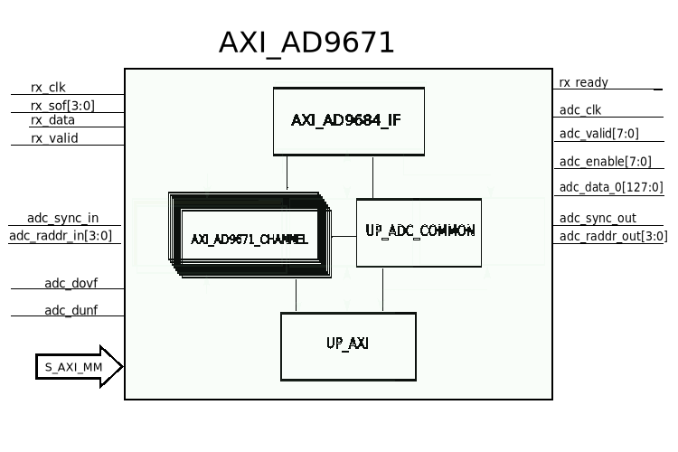

.. _axi_ad9671:

AXI AD9671 (OBSOLETE)
================================================================================

.. hdl-component-diagram::

.. warning::

   The support for :git-hdl:`AXI AD9671 <hdl_2022_r2:library/axi_ad9671>`
   has been discontinued.
   This page is kept for legacy purposes only.

The :git-hdl:`AXI AD9671 <hdl_2022_r2:library/axi_ad9671>` IP core
can be used to interface the :adi:`AD9671` Octal Ultrasound AFE with digital
demodulator.
An AXI Memory Map interface is used for configuration.
Data is received from AMD Xilinx JESD IP.

More about the generic framework interfacing ADCs can be read in :ref:`axi_adc`.

Features
--------------------------------------------------------------------------------

* AXI based configuration
* PRBS monitoring (PN9 and PN23)
* Altera Quartus compatible
* Vivado compatible

Files
--------------------------------------------------------------------------------

.. list-table::
   :header-rows: 1

   * - Name
     - Description
   * - :git-hdl:`library/axi_ad9671/axi_ad9671.v`
     - Verilog source for the AXI AD9671.
   * - :git-hdl:`library/common/up_adc_common.v`
     - Verilog source for the ADC Common regmap.
   * - :git-hdl:`library/common/up_adc_channel.v`
     - Verilog source for the ADC Channel regmap.

Block Diagram
--------------------------------------------------------------------------------

Configuration Parameters
--------------------------------------------------------------------------------

.. hdl-parameters::

   * - ID
     - Core ID should be unique for each IP in the system
   * - FPGA_TECHNOLOGY
     - Used to select between devices, Altera devices are also supprted.
   * - QUAD_OR_DUAL_N
     - Selects if 4 lanes (1) or 2 lanes (0) are connected

Interface
--------------------------------------------------------------------------------

.. hdl-interfaces::

   * - rx_clk
     - JESD clock rate / 40
   * - rx_data
     - RX data from the JESD core. 128 bit wide for QUAD operation, and 64 bit
       for DUAL operation
   * - rx_valid
     - Placeholder for interfaces. Assume data is always valid
   * - rx_ready
     - Always ready
   * - adc_clk
     - Loopback of the tx_clk. most of the modules of the core run on this
       clock
   * - adc_valid
     - ADC valid, used to read new data from the DMA. Each bit applies to one
       channel
   * - adc_enable
     - Set when the channel is enabled, activated by software. Each bit applies
       to one channel
   * - adc_data
     - Data for all channels
   * - adc_dovf
     - Data overflow input
   * - adc_sync_in
     - Starts the synchronization procedure. Comes from the master IP
   * - adc_sync_out
     - Starts the synchronization procedure. Sent to the slave IPs
   * - adc_raddr_in
     - Read address. All IPs are sending data from the same memory location.
       Comes from the master IP
   * - adc_raddr_out
     - Read address. All IPs are sending data from the same memory location.
       Sent to the slave IPs
   * - s_axi
     - Standard AXI Slave Memory Map interface

Detailed Architecture
--------------------------------------------------------------------------------

Detailed Description
--------------------------------------------------------------------------------

The top module, axi_ad9671, instantiates:

* the interface module
* the channel processing module
* the ADC common register map
* the AXI handling interface

The interface module, axi_ad9671_if, takes the data from the Xilinx JESD IP
and splits it into channels. In order to synchronize several AD9671 chips, a
FIFO is used and a comparison mechanism with a start code.

The data from the interface module is processed by the adc channel module.
The channel module implements:

* a PRBS monitor
* data format conversion
* the ADC CHANNEL register map

Register Map
--------------------------------------------------------------------------------

.. hdl-regmap::
   :name: COMMON
   :no-type-info:

.. hdl-regmap::
   :name: ADC_COMMON
   :no-type-info:

.. hdl-regmap::
   :name: ADC_CHANNEL
   :no-type-info:

Design Guidelines
--------------------------------------------------------------------------------

The control of the :adi:`AD9671` chip is done through a SPI interface,
which is needed at system level.

The design should use a DMA to move the data from the output of the IP to
memory.

If the data needs to be processed in HDL before moved to the memory, it can be
done at the output of the IP (at system level) or inside of the adc channel
module (at IP level).

References
-------------------------------------------------------------------------------

* HDL IP core at :git-hdl:`library/axi_ad9671`
* :adi:`AD9671`
* :ref:`jesd204`
* :adi:`Analog Device's JESD204B Survival Guide <media/en/technical-documentation/technical-articles/JESD204B-Survival-Guide.pdf>`
* :intel:`JESD204B Intel FPGA IP User Guide <content/dam/support/us/en/programmable/support-resources/bulk-container/pdfs/literature/ug/archives/ug-jesd204b-18-1.pdf>`
* :xilinx:`Xilinx Vivado JESD IP documentation <support/documentation/ip_documentation/jesd204/v6_0/pg066-jesd204.pdf>`
* :intel:`Arria 5 Transceivers <content/www/us/en/docs/programmable/683573/current/transceiver-architecture-in-arria-v-devices.html>`
* :xilinx:`7 Series Transceivers <support/documentation/user_guides/ug476_7Series_Transceivers.pdf>`
