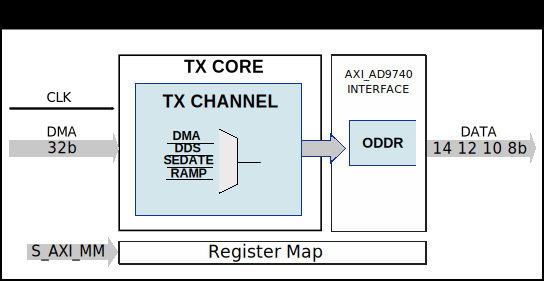

.. _axi_ad9740:

AXI AD9740
================================================================================

.. hdl-component-diagram::

The :git-hdl:`AXI AD9740 <library/axi_ad9740>` IP core
can be used to interface the :adi:`AD9740`, :adi:`AD9742`, :adi:`AD9744` or
:adi:`AD9748` devices.
It is a DAC with 8, 10, 12 or 14 bits resolution and with sample rates up to 210
MSPS. This documentation only covers the IP core and requires
that one must be familiar with the device for a complete and better understanding.

More about the generic framework interfacing DACs can be read in :ref:`axi_dac`.

Features
--------------------------------------------------------------------------------

* AXI Lite control/status interface
* AXI-Stream interface for DMA data
* Configurable DAC resolution (8/10/12/14-bit via DAC_RESOLUTION parameter)
* Multiple data source modes:

  * DDS - Direct Digital Synthesis with dual-tone support
  * DMA - Data streaming from memory
  * Ramp - Internal test pattern generator
  * Sedation - Zero output (mute)

* Data format conversion (two's complement to offset binary)
* MSB-aligned data path for all resolutions

Files
--------------------------------------------------------------------------------

.. list-table::
   :header-rows: 1

   * - Name
     - Description
   * - :git-hdl:`library/axi_ad9740/axi_ad9740.v`
     - Verilog source for the AXI AD9740 top module.
   * - :git-hdl:`library/axi_ad9740/axi_ad9740_core.v`
     - Verilog source for the AXI AD9740 core.
   * - :git-hdl:`library/axi_ad9740/axi_ad9740_channel.v`
     - Verilog source for the AXI AD9740 channel processing.
   * - :git-hdl:`library/axi_ad9740/axi_ad9740_if.v`
     - Verilog source for the AXI AD9740 data format interface.
   * - :git-hdl:`library/common/up_dac_common.v`
     - Verilog source for the DAC Common regmap.
   * - :git-hdl:`library/common/up_dac_channel.v`
     - Verilog source for the DAC Channel regmap.

Functional Description
--------------------------------------------------------------------------------

The axi_ad9740 cores architecture contains:

* :git-hdl:`Interface <library/axi_ad9740/axi_ad9740.v#L110>`
  module for Xilinx devices
* :git-hdl:`Transmit <library/axi_ad9740/axi_ad9740_core.v>`
  module, which contains:

  * :git-hdl:`DAC channel processing <library/axi_ad9740/axi_ad9740_channel.v>`

  * :git-hdl:`DAC Common register map <library/common/up_dac_common.v>`

* :git-hdl:`AXI control and status <library/common/up_axi.v>` modules.

Block Diagram
--------------------------------------------------------------------------------

Configuration Parameters
--------------------------------------------------------------------------------

.. hdl-parameters::

   * - ID
     - Core ID should be unique for each IP in the system
   * - FPGA_TECHNOLOGY
     - Encoded value describing the technology/generation of the FPGA device
       (e.g., 1=7series, 2=ultrascale, 3=ultrascale+, 4=versal). Auto-set in
       project.
   * - FPGA_FAMILY
     - Encoded value describing the family variant of the FPGA device (e.g.,
       1=artix, 2=kintex, 3=virtex, 4=zynq). Auto-set in project.
   * - SPEED_GRADE
     - Encoded value describing the FPGA's speed-grade. Auto-set in project.
   * - DEV_PACKAGE
     - Encoded value describing the device package. The package might affect
       high-speed interfaces. Auto-set in project.
   * - DAC_RESOLUTION
     - Sets the DAC resolution in bits. Valid values are 8, 10, 12, or 14
       corresponding to the target device: AD9748 (8-bit), AD9740 (10-bit),
       AD9742 (12-bit), or AD9744 (14-bit). This parameter controls the DDS
       output width and the DMA data alignment. Default value is 14.
   * - DDS_DISABLE
     - Disable the DDS logic to save FPGA resources when not needed. Set to 1
       to disable. Default value is 0.
   * - DDS_TYPE
     - Selects the DDS phase-to-amplitude converter implementation. Set to 1
       for CORDIC (better precision) or 2 for Polynomial (uses more DSPs but
       fewer LUTs). Default value is 1.
   * - DDS_CORDIC_DW
     - CORDIC DDS data width, range 8-24. Default value is 14.
   * - DDS_CORDIC_PHASE_DW
     - Number of CORDIC rotation stages, range 8-32. Higher values provide
       better precision at the cost of more resources. Default value is 14.

Interface
--------------------------------------------------------------------------------

.. hdl-interfaces::

   * - dac_clk
     - Input clock for the DAC interface
   * - s_axis
     - AXI-Stream slave interface for DMA data (16-bit TDATA, TVALID, TREADY)
   * - dac_data
     - Output data to DAC, MSB-aligned for all resolutions
   * - s_axi
     - Standard AXI Slave Memory Map interface

Register Map
--------------------------------------------------------------------------------

The register map of the core contains instances of several generic register maps
like DAC common and DAC channel. The following table presents the base addresses
of each instance, after that can be found the detailed description of each
generic register map. The absolute address of a register should be calculated
by adding the instance base address to the registers relative address.

.. list-table:: Register Map base addresses for axi_ad9740
   :header-rows: 1

   * - DWORD
     - BYTE
     - Name
     - Description
   * - 0x0000
     - 0x0000
     - TX COMMON
     - See the `DAC Common <#hdl-regmap-DAC_COMMON>`__ table for more details.
   * - 0x0100
     - 0x0400
     - TX CHANNEL
     - See the `DAC Channel <#hdl-regmap-DAC_CHANNEL>`__ table for more details.

.. hdl-regmap::
   :name: COMMON
   :no-type-info:

.. hdl-regmap::
   :name: DAC_COMMON
   :no-type-info:

.. hdl-regmap::
   :name: DAC_CHANNEL
   :no-type-info:

Design Guidelines
--------------------------------------------------------------------------------

The control of the AD9740/AD9742/AD9744/AD9748 DAC is done through the AXI AD9740
IP core registers. These devices use a parallel data interface and do not require
a separate SPI interface for configuration.

The *DAC interface signals* must be directly connected to the top-level FPGA I/O
pins.

The example design uses a DMA to stream data from memory to the DAC. The IP
supports multiple data sources selectable via the DAC_DDS_SEL register:

* DDS mode (0x0) - Internal dual-tone DDS generator
* DMA mode (0x2) - Data streaming from memory
* Ramp mode (0xB) - Internal ramp pattern for testing

The data format (signed/unsigned) can be configured via the DAC_DATAFMT register
in DAC Common. When set to 1, the IP converts two's complement data to offset
binary format expected by these devices.

Software Guidelines
--------------------------------------------------------------------------------

The software for this IP can be found as part of the ZedBoard Reference Design.

Software Support
--------------------------------------------------------------------------------

.. warning::

   The software support for this IP is not yet merged into the main ADI Linux
   kernel branch. The links below refer to development branches.

.. collapsible:: Linux driver and device tree sources

   * Linux device driver at :git-linux:`drivers/iio/dac/ad9740.c`
   * Linux device tree at :git-linux:`arch/arm/boot/dts/xilinx/zynq-zed-adv7511-ad9740.dts`
   * Linux device tree at :git-linux:`arch/arm/boot/dts/xilinx/zynq-zed-adv7511-ad9742.dts`
   * Linux device tree at :git-linux:`arch/arm/boot/dts/xilinx/zynq-zed-adv7511-ad9744.dts`
   * Linux device tree at :git-linux:`arch/arm/boot/dts/xilinx/zynq-zed-adv7511-ad9748.dts`

References
-------------------------------------------------------------------------------

* HDL IP core at :git-hdl:`library/axi_ad9740`
* HDL project at :git-hdl:`projects/ad9740_fmc`
* HDL project documentation at :ref:`ad9740_fmc`
* :adi:`AD9740`
* :adi:`AD9742`
* :adi:`AD9744`
* :adi:`AD9748`
* :adi:`EVAL-AD9740`
* :adi:`EVAL-AD9742`
* :adi:`EVAL-AD9744`
* :adi:`EVAL-AD9748`
