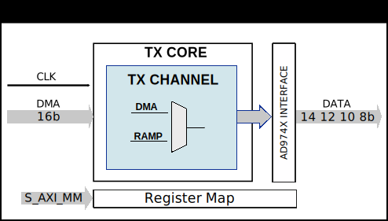

.. _axi_ad974x:

AXI AD974X
================================================================================

.. hdl-component-diagram::

The :git-hdl:`AXI AD974x <library/axi_ad974x>` IP core
can be used to interface the :adi:`AD9740`, :adi:`AD9742`, :adi:`AD9744` or
:adi:`AD9748` devices.
It is a DAC with 8, 10,12 or 16 bits resolution and with sample rates up to 210
MSPS. This documentation only covers the IP core and requires
that one must be familiar with the device for a complete and better understanding.

More about the generic framework interfacing DACs can be read in :ref:`axi_dac`.

Features
--------------------------------------------------------------------------------

* AXI Memory-Mapped to Streaming control/status interface
* Supports only Xilinx devices

Files
--------------------------------------------------------------------------------

.. list-table::
   :header-rows: 1

   * - Name
     - Description
   * - :git-hdl:`library/axi_ad974x/axi_ad974x.v`
     - Verilog source for the AXI AD974x.
   * - :git-hdl:`library/common/up_dac_common.v`
     - Verilog source for the DAC Common regmap.
   * - :git-hdl:`library/common/up_dac_channel.v`
     - Verilog source for the DAC Channel regmap.

Functional Description
--------------------------------------------------------------------------------

The axi_ad974x cores architecture contains:

* :git-hdl:`Interface <library/axi_ad974x/axi_ad974x.v#L110>`
  module for Xilinx devices
* :git-hdl:`Transmit <library/axi_ad974x/axi_ad974x_core.v>`
  module, which contains:

  * :git-hdl:`DAC channel processing <axi_ad974x/axi_ad974x_channel.v>`

  * :git-hdl:`DAC Common register map <library/common/up_dac_common.v>`

* :git-hdl:`AXI control and status <library/common/up_axi.v>` modules.

Block Diagram
--------------------------------------------------------------------------------

Configuration Parameters
--------------------------------------------------------------------------------

.. hdl-parameters::

   * - ID
     - Core ID should be unique for each IP in the system
   * - FPGA_TECHNOLOGY
     - Encoded value describing the technology/generation of the FPGA device
   * - FPGA_FAMILY
     - Encoded value describing the family variant of the FPGA device
   * - SPEED_GRADE
     - Encoded value describing the FPGA's speed-grade
   * - DEV_PACKAGE
     - Encoded value describing the device package. The package might affect
       high-speed interfaces

.. note::

   Make sure these parameters have the appropriate values set.

Interface
--------------------------------------------------------------------------------

.. hdl-interfaces::

   * - dac_clk
     - input clock
   * - dma_data
     - input data lines; comes from DMA
   * - dac_data
     - output data lines; goes to DAC 
   * - s_axi
     - Standard AXI Slave Memory Map interface

Register Map
--------------------------------------------------------------------------------

The register map of the core contains instances of several generic register maps
like ADC common, ADC channel, DAC common, DAC channel etc. The following table
presents the base addresses of each instance, after that can be found the
detailed description of each generic register map. The absolute address of a
register should be calculated by adding the instance base address to the
registers relative address.

.. list-table:: Register Map base addresses for axi_ad974x
   :header-rows: 1

   * - DWORD
     - BYTE
     - Name
     - Description
   * - 0x0000
     - 0x0000
     - BASE
     - See the `Base <#hdl-regmap-COMMON>`__ table for more details.
   * - 0x1000
     - 0x4000
     - TX COMMON
     - See the `DAC Common <#hdl-regmap-DAC_COMMON>`__ table for more details.
   * - 0x1000
     - 0x4000
     - TX CHANNELS
     - See the `DAC Channel <#hdl-regmap-DAC_CHANNEL>`__ table for more details.

.. hdl-regmap::
   :name: COMMON
   :no-type-info:

.. hdl-regmap::
   :name: DAC_COMMON
   :no-type-info:

.. hdl-regmap::
   :name: DAC_CHANNEL
   :no-type-info:

Software Guidelines
--------------------------------------------------------------------------------

The software for this IP can be found as part of the ZedBoard Reference Design.

Software Support
--------------------------------------------------------------------------------

* Linux device driver at :git-linux:`drivers/iio/dac/ad9740.c` ; ??? TBD
* Linux device tree at :git-linux:`arch/arm64/boot/dts/xilinx/zynq-zed-adv7511-ad9740.dts`
* Linux device tree at :git-linux:`arch/arm64/boot/dts/xilinx/zynq-zed-adv7511-ad9742.dts` ??? TBD
* Linux device tree at :git-linux:`arch/arm64/boot/dts/xilinx/zynq-zed-adv7511-ad9744.dts` ??? TBD
* Linux device tree at :git-linux:`arch/arm64/boot/dts/xilinx/zynq-zed-adv7511-ad9748.dts` ??? TBD

References
-------------------------------------------------------------------------------

* HDL IP core at :git-hdl:`library/axi_ad974x`
* HDL project at :git-hdl:`projects/ad9740_fmc`
* HDL project documentation at :ref:`ad9740_fmc`
* :adi:`AD9740`
* :adi:`AD9742`
* :adi:`AD9744`
* :adi:`AD9748`
* :adi:`EVAL-AD9740`
* :adi:`EVAL-AD9742`
* :adi:`EVAL-AD9744`
* :adi:`EVAL-AD9748`
