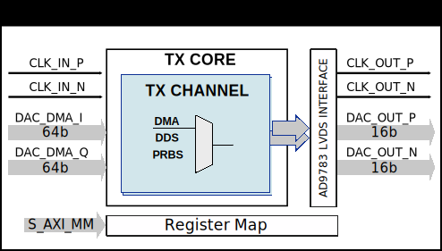

.. _axi_ad9783:

AXI AD9783
================================================================================

.. hdl-component-diagram::

The :git-hdl:`AXI AD9783 <library/axi_ad9783>` IP core
can be used to interface the :adi:`AD9783` device.
It is a dual DAC with 16 bits resolution, interfaced through LVDS, and with sample
rates up to 500 MSPS. This documentation only covers the IP core and requires
that one must be familiar with the device for a complete and better understanding.

More about the generic framework interfacing DACs can be read in :ref:`axi_dac`.

Features
--------------------------------------------------------------------------------

* AXI Memory-Mapped to Streaming control/status interface
* PRBS monitoring
* Internal DDS
* BIST testing
* Supports only Xilinx devices

Files
--------------------------------------------------------------------------------

.. list-table::
   :header-rows: 1

   * - Name
     - Description
   * - :git-hdl:`library/axi_ad9783/axi_ad9783.v`
     - Verilog source for the AXI AD9783.
   * - :git-hdl:`library/common/up_dac_common.v`
     - Verilog source for the DAC Common regmap.
   * - :git-hdl:`library/common/up_dac_channel.v`
     - Verilog source for the DAC Channel regmap.

Functional Description
--------------------------------------------------------------------------------

The axi_ad9783 cores architecture contains:

* :git-hdl:`Interface <library/axi_ad9783/axi_ad9783.v#L135>`
  module in LVDS mode for Xilinx devices
* :git-hdl:`Transmit <library/axi_ad9783/axi_ad9783_core.v>`
  module, which contains:

  * :git-hdl:`DAC channel processing <axi_ad9783/axi_ad9783_channel.v>` modules, one for each channel

    * Different data generators (:git-hdl:`DDS <library/common/ad_dds.v>`, pattern, PRBS)
    * :git-hdl:`DAC Channel register map <library/common/up_dac_channel.v>`

  * :git-hdl:`DAC Common register map <library/common/up_dac_common.v>`

* :git-hdl:`AXI control and status <library/common/up_axi.v>` modules.

Device Interface Description
~~~~~~~~~~~~~~~~~~~~~~~~~~~~~~~~~~~~~~~~~~~~~~~~~~~~~~~~~~~~~~~~~~~~~~~~~~~~~~~

The interface also provides a single clock tree for the entire core. This clock
uses a global buffer that has the minimum skew all across the die. On Xilinx
devices, this is done via the IBUFGDS, BUFGCE_DIV and BUFG primitives. The clock
``dac_clk_in_p`` is passed through these primitives in order to obtain the
divided clock: through IBUFGDS, then BUFGCE_DIV to BUFG. The core and the
interface run at the same clock frequency.

Internal Interface Description
~~~~~~~~~~~~~~~~~~~~~~~~~~~~~~~~~~~~~~~~~~~~~~~~~~~~~~~~~~~~~~~~~~~~~~~~~~~~~~~

The main purpose of all (including this) ADI IP cores is to provide a common,
well-defined internal interface within the FPGA. This interface consists of the
following signals per channel, except for VALID which is common to all channels.

VALID
^^^^^^^^^^^^^^^^^^^^^^^^^^^^^^^^^^^^^^^^^^^^^^^^^^^^^^^^^^^^^^^^^^^^^^^^^^^^^^^^

It is always set to logic 1 and indicates a valid sample on each DATA port.
Because it is in the transmit (DAC) direction, this indicates the current sample
is being read by the core.

ENABLE
^^^^^^^^^^^^^^^^^^^^^^^^^^^^^^^^^^^^^^^^^^^^^^^^^^^^^^^^^^^^^^^^^^^^^^^^^^^^^^^^

The enable signal is only for software use and it is controlled by the
corresponding register bit. The core simply reflects the programmed bit as an
output port. In ADI reference projects, this bit is used to activate the channel
that one is interested in. It is then used by the UPACK core to route the data
based on total number of channels and the selected number of channels. As an
example, AXI_AD9783 supports a total of 2 channels, 64 bits each. Because the
SERDES factor was chosen to be 8, we have 4 samples of 16 bits each, on I
channel and Q channel also, resulting in DMA with 128 bits as data width.

DATA
^^^^^^^^^^^^^^^^^^^^^^^^^^^^^^^^^^^^^^^^^^^^^^^^^^^^^^^^^^^^^^^^^^^^^^^^^^^^^^^^

The DATA is the raw analog samples, and 4096 samples generated by PRBS are sent.
It follows two simple rules.

#. The samples are always 16 bits. In the transmit direction, if the DAC data
   width is less than 16 bits, the most significant bits are used. This allows
   the same destination portable across different DAC data widths. In other
   words, if the source is generating a 16 bits tone, the signal appears the
   same across a 12 bit, 14 bit or 16 bit DAC with only the corresponding
   amplitude change. The source can thus be independent of the number of bits
   supported by DAC.
#. The DATA is received and transmitted with most significant sample "newest"
   regardless of the channel width. In other words, the most significant sample
   is the "newest" sample. If the total channel width is 64 bits, it carries 4
   samples (16 bits) per clock. If we were to name these samples as S3 (bits 63
   down to 48), S2 (bits 47 down to 32), S1 (bits 31 down to 16) and S0 (bits 15
   down to 0), the following is true. In the transmit direction, S0 is sent
   first and S3 is sent last to the DAC. The analog samples are S0, S1, S2 and
   S3 across time with S0 being the oldest and S3 being the newest sample.

Parallel data port interface
-------------------------------------------------------------------------------

The parallel port data interface consists of up to 18 differential signals,
``dac_clk_out_*``, ``dac_clk_in_*``, and up to 16 data lines
(``dac_data_out_*``\ [15:0]).
DCO is the output clock generated by the AD9783 that is used to clock out the
data from the digital data engine.

The data lines transmit the multiplexed I and Q data words for the I and Q
DACs, respectively.
DCI provides timing information about the parallel data and signals the I/Q
status of the data.

The incoming LVDS data is latched by an internally generated clock referred to
as the data sampling signal (DSS). DSS is a delayed version of the main DAC
clock signal.

The clock input signal provides timing information about the parallel data, as
well as indicating the destination (that is, I DAC or Q DAC) of the data. The
data that is processed on rising edge will be outputted on the I DAC, and the
data that is on falling edge will be outputted on Q DAC (see figure below).

Calibration of the device
-------------------------------------------------------------------------------

Calibrating the device means finding the proper value for the SMP_DLY register
(see datasheet) in order for the PRBS function (PN23 in this case) to work
properly when generating the 4096 samples of data.

The BIST feature in the AD9783 is a simple type adder and is a user
synchronizable BIST feature. When a reading is performed, it adds up all the
data that was generated on the rising edges of the ``dac_div_clk`` and it
writes it in the registers accessible by the user: the low part of the result
is written in register 0x1B, and the high part in 0x1C. For the sum of data
from falling edges, read 0x1D and 0x1E respectively.

.. code::

   register 0x1A <- 0x20
   register 0x1A <- 0x00 # to clear the BIST registers
   register 0x1A <- 0x80 # enable BIST
   # 4096 samples generated by PN23 are sent
   # send zeroes
   register 0x1A <- 0xC0 # perform BIST read
   # read registers 0x1B, 0x1C for the sum of data from rising edges
   # read registers 0x1D, 0x1E for the sum of data from falling edges

In register 0x1A, write 0x20 then 0x00 to clear the BIST registers while the
IP is writing zeros to the data bits. To enable BIST, write 0x80 to register
0x1A. Afterwards, 4096 samples of data are generated by PN23 PRBS and are sent
to the data inputs.
When all samples are sent, the IP is continuously sending zeros after the
samples, while the BIST read is being performed. Sending zeroes after the
samples is required in order to maintain the sums unchanged in the registers.
Perform a BIST read by writing 0xC0 to register 0x1A to receive the unique sum
of rising edge data in register 0x1B and register 0x1C and a unique sum of
falling edge data in register 0x1D and register 0x1E. These register contents
must always give the same values for the same samples each time they are sent.
In order to change what data is sent, the DAC_DDS_SEL register value should be
changed. To send PN23, 0x9 should be written in the register. The address for
the DAC_DDS_SEL register is calculated by adding 0x418 (for the first channel)
to the offset found in the devicetree, for the device.

Block Diagram
--------------------------------------------------------------------------------

Configuration Parameters
--------------------------------------------------------------------------------

.. hdl-parameters::

   * - ID
     - Core ID should be unique for each IP in the system
   * - FPGA_TECHNOLOGY
     - Encoded value describing the technology/generation of the FPGA device
   * - FPGA_FAMILY
     - Encoded value describing the family variant of the FPGA device
   * - SPEED_GRADE
     - Encoded value describing the FPGA's speed-grade
   * - DEV_PACKAGE
     - Encoded value describing the device package. The package might affect
       high-speed interfaces
   * - DAC_DDS_TYPE
     - 1 for CORDIC or 2 for Polynomial
   * - DAC_DDS_CORDIC_DW
     - CORDIC DDS data width
   * - DAC_DDS_CORDIC_PHASE_DW
     - CORDIC DDS phase width
   * - DAC_DATAPATH_DISABLE
     - Disable DAC processing blocks. Disables DDS

.. note::

   Make sure these parameters have the appropriate values set.

Interface
--------------------------------------------------------------------------------

.. hdl-interfaces::

   * - dac_clk_in_p
     - LVDS input clock; comes from DCOP/N of the AD9783 chip
   * - dac_clk_in_n
     - LVDS input clock; comes from DCOP/N of the AD9783 chip
   * - dac_clk_out_p
     - LVDS output clock; goes to DCIP/N of the AD9783 chip
   * - dac_clk_out_n
     - LVDS output clock; goes to DCIP/N of the AD9783 chip
   * - dac_data_out_p
     - LVDS output data lines
   * - dac_data_out_n
     - LVDS output data lines
   * - dac_div_clk
     - Frequency divided clock used for clocking the DMA and the UPACK; it is
       1/4 compared to the reference input clock
   * - dac_rst
     - Core reset signal
   * - dac_enable_*
     - If set, the channel is enabled (one for each channel)
   * - dac_valid
     - Indicates valid data request for all channels
   * - dac_ddata_*
     - Transmitted data output (one for each channel)
   * - dac_dunf
     - Data underflow, must be connected to the DMA
   * - s_axi
     - Standard AXI Slave Memory Map interface

Register Map
--------------------------------------------------------------------------------

The register map of the core contains instances of several generic register maps
like ADC common, ADC channel, DAC common, DAC channel etc. The following table
presents the base addresses of each instance, after that can be found the
detailed description of each generic register map. The absolute address of a
register should be calculated by adding the instance base address to the
registers relative address.

.. list-table:: Register Map base addresses for axi_ad9783
   :header-rows: 1

   * - DWORD
     - BYTE
     - Name
     - Description
   * - 0x0000
     - 0x0000
     - BASE
     - See the `Base <#hdl-regmap-COMMON>`__ table for more details.
   * - 0x1000
     - 0x4000
     - TX COMMON
     - See the `DAC Common <#hdl-regmap-DAC_COMMON>`__ table for more details.
   * - 0x1000
     - 0x4000
     - TX CHANNELS
     - See the `DAC Channel <#hdl-regmap-DAC_CHANNEL>`__ table for more details.

.. hdl-regmap::
   :name: COMMON
   :no-type-info:

.. hdl-regmap::
   :name: DAC_COMMON
   :no-type-info:

.. hdl-regmap::
   :name: DAC_CHANNEL
   :no-type-info:

Software Guidelines
--------------------------------------------------------------------------------

The software for this IP can be found as part of the ZCU102 Reference Design.
The IP expects the software run a calibration at least once. It has to find
out what value for the SMP_DLY (see in datasheet) is good for the PRBS to
work.

Software Support
--------------------------------------------------------------------------------

* Linux device driver at :git-linux:`drivers/iio/adc/ad9783.c`
* Linux device tree at :git-linux:`arch/arm64/boot/dts/xilinx/zynqmp-zcu102-rev10-ad9783.dts`

References
-------------------------------------------------------------------------------

* HDL IP core at :git-hdl:`library/axi_ad9783`
* HDL project at :git-hdl:`projects/ad9783_ebz`
* HDL project documentation at :ref:`ad9783_ebz`
* :adi:`AD9783`
* :adi:`EVAL-AD9783 <en/design-center/evaluation-hardware-and-software/evaluation-boards-kits/EVAL-AD9783.html>`
* :dokuwiki:`AXI AD9783 on wiki <resources/fpga/docs/axi_ad9783>`
* :dokuwiki:`EVAL-AD9783 with ZCU102 reference design description <resources/fpga/xilinx/interposer/ad9783>`
* :xilinx:`Ultrascale SelectIO <support/documentation/user_guides/ug571-ultrascale-selectio.pdf>`
* :xilinx:`UltraScale Architecture Clocking Resources User Guide <support/documentation/user_guides/ug572-ultrascale-clocking.pdf>`
