.. _axi_ad9910:

AXI AD9910
================================================================================

.. hdl-component-diagram::

The :git-hdl:`AXI AD9910 <library/axi_ad9910>` IP core provides an FPGA-side
control and update interface for the AD9910 DDS. The core exposes an AXI4-Lite
register map for ramp control, interrupt handling, and parallel-port timing,
plus an optional AXI4-Stream sink used to feed 16-bit words into the AD9910
parallel data port.

Features
--------------------------------------------------------------------------------

* AXI4-Lite control/status register map
* AD9910 digital-ramp control with simple and duty-cycle toggle modes
* Delay, burst, and interval-monitoring support for ramp sequencing
* 16-bit parallel data interface with optional IODELAY-based timing alignment
* Separate ``f_o[1:0]`` function-select outputs driven from the register map
* AMD/Xilinx device support

Files
--------------------------------------------------------------------------------

.. list-table::
   :header-rows: 1

   * - Name
     - Description
   * - :git-hdl:`library/axi_ad9910/axi_ad9910.v`
     - Top-level Verilog for the AXI AD9910 core.
   * - :git-hdl:`library/axi_ad9910/axi_ad9910_if.v`
     - AD9910 device interface (pins, timing, optional IODELAY).
   * - :git-hdl:`library/axi_ad9910/axi_ad9910_reg.v`
     - Register map and control/status logic.
   * - :git-hdl:`library/axi_ad9910/axi_ad9910_ip.tcl`
     - IP metadata definition (AMD/Xilinx tools).
   * - :git-hdl:`library/axi_ad9910/Makefile`
     - Local build helper for IP packaging.

Block Diagram
--------------------------------------------------------------------------------

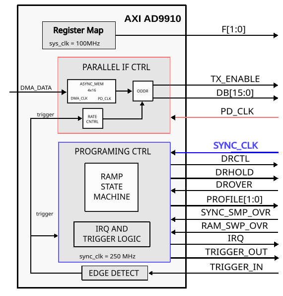

Interfaces
--------------------------------------------------------------------------------

AXI4-Lite slave: ``s_axi_*`` — register access for configuration and status.

AXI4-Stream sink (optional): ``s_axis_*`` — supplies one 16-bit word per
parallel-port transfer. In the current RTL, ``tlast`` is accepted at the
top-level port but is not consumed by the transfer logic.

.. hdl-interfaces::

   * - ext_sync
     - External synchronization/trigger input used by the sync-clock ramp
       logic and by the parallel interface trigger path.
   * - irq
     - Masked interrupt output generated from the latched interrupt table.
   * - trig_out
     - Pulse output generated by the external-trigger interval monitor.
   * - delay_clk
     - Delay clock input for IO_DELAY control, 200 MHz (7 series) or 300 MHz
       (Ultrascale)
   * - sync_clk
     - General serial I/O operation clock
   * - drctl
     - The direction of the ramping function is controlled by the DRCTL
   * - drhold
     - Digital Ramp Hold. This pin stalls the digital ramp generator in its
       present state.
   * - drover
     - Digital Ramp Over. This pin is switched to logic 1 whenever the digital
       ramp generator reaches its programmed upper or lower limit.
   * - ram_swp_ovr
     - RAM Sweep Over. A high on this pin indicates that the RAM sweep profile
       has completed.
   * - profile
     - Profile Select Pins. These pins are used to select the phase/frequency
       profiles for the DDS.
   * - io_update
     - Input/Output Update. A high on this pin transfers the contents of the
       I/O buffers to the corresponding internal registers of AD9910.
   * - pd_clk_in
     - Parallel Data Clock
   * - f_o
     - Two-bit AD9910 function-select bus driven directly from ``F_CFG``.
       It selects how the AD9910 interprets ``db_o[15:0]``.
   * - tx_enable
     - Transmit Enable
   * - db_o
     - 16-bit parallel data bus driven from the AXI4-Stream input FIFO
   * - s_axi
     - Standard AXI Slave Memory Map interface

Parameters
--------------------------------------------------------------------------------

Key generics (see source for full list):

* ``FPGA_TECHNOLOGY``: Synthesis hint for device family.
* ``FPGA_FAMILY``: Synthesis hint for device family.
* ``SPEED_GRADE``: Synthesis hint for timing grade.
* ``DEV_PACKAGE``: Synthesis hint for device package.
* ``MEASURE_CLKS_EN``: Enables the optional clock monitor readback logic.
* ``DELAY_REFCLK_FREQ``: IODELAY reference clock frequency in MHz.
* ``IODELAY_ENABLE``: Enable IODELAY based alignment (1/0).
* ``ID``: Instance identifier exposed via registers.

Register Map
--------------------------------------------------------------------------------

.. hdl-regmap::
   :name: AXI_AD9910

Register notes for the current ramp controller:

* ``RESET_CTRL`` (0x40) uses bit 0 for the internal core reset. Other bits are
  reserved and read as zero.
* ``DEVICE_INFO`` (0x1C) exposes ``FPGA_TECHNOLOGY``, ``FPGA_FAMILY``,
  ``SPEED_GRADE``, and ``DEV_PACKAGE``.
* ``TRIG_OUT_CTRL`` (0x50) uses bits [21:16] for ``TRIG_OUT_MASK`` and
  bits [1:0] for ``TRIG_CONFIG``. ``EXT_TRIG_TIMER_CFG`` (0x54) controls only
  external-sync disarm/arm on bits [1:0]. Other bits are reserved and read as
  zero.
* ``DRG_CTRL`` (0x84) uses bit 3 for ``DRCTL_TOGGLE_EN``, bit 2 for
  ``DRCTL_INIT``, and bit 1 for ``DRHOLD``. Bits [5:4] and bit 0 are
  reserved and read as zero.
* ``DRCTL_PERIOD`` is at 0x8C and is 32 bits wide.
* ``DRCTL_WIDTH`` is at 0x90 and is 32 bits wide.
* ``MONITOR_MAX_PERIOD`` is at 0xA4 and is 32 bits wide.
* ``IRQ_START_INTERVAL`` is at 0xA8 and is 32 bits wide.
* ``IRQ_STOP_INTERVAL`` is at 0xAC and is 32 bits wide.
* ``TRIG_OUT_START_INTERVAL`` is at 0xB0 and is 32 bits wide.
* ``TRIG_OUT_STOP_INTERVAL`` is at 0xB4 and is 32 bits wide.

Design Guidelines
--------------------------------------------------------------------------------

The control of the AD9910 chip is done through a SPI interface, GPIOs, and the
``axi_ad9910`` register map. The register map controls ramp generation,
interrupts, monitoring, profiles, and the parallel data interface. Board-level
reset, power-down, IO_UPDATE, and OSK may be routed outside this core, depending
on the project integration.

DIGITAL RAMP MODULATION MODE
''''''''''''''''''''''''''''''''''''''''''''''''''''''''''''''''''''''''''''''''

SIMPLE
~~~~~~~~~~~~~~~~~~~~~~~~~~~~~~~~~~~~~~~~~~~~~~~~~~~~~~~~~~~~~~~~~~~~~~~~~~~~~~~~

In SIMPLE mode the user can update the ramp direction by writing to register
DRG_CTRL(0x84), BIT 2.

NOTE:
DRG_CTRL(0x84), BIT 3, must be cleared.

The limit reach can be tracked by enabling the DROVER interrupt through
``IRQ_MASK`` (0x44), or by reading ``IRQ_TABLE`` (0x48). DROVER is only used
as an interrupt/status source; it does not drive the HDL ramp-period state
machine.

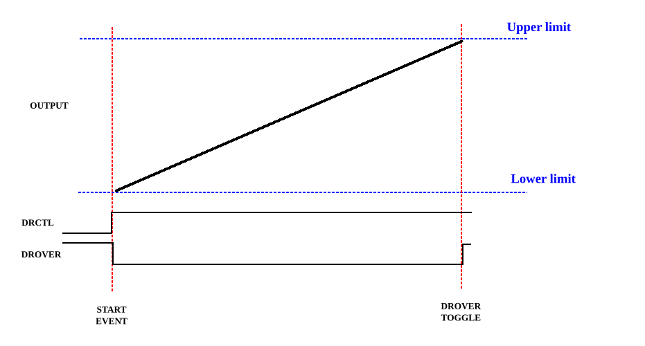

TOGGLE / DUTY CYCLE
~~~~~~~~~~~~~~~~~~~~~~~~~~~~~~~~~~~~~~~~~~~~~~~~~~~~~~~~~~~~~~~~~~~~~~~~~~~~~~~~

To activate the TOGGLE mode set BIT 3 of DRG_CTRL(0x84).
In TOGGLE mode ``DRCTL_INIT`` is ignored by the HDL ramp generator.
When toggle mode is enabled, the HDL generates a DRCTL duty cycle from
two programmable counts:

* ``DRCTL_PERIOD`` (0x8C): full duty-cycle period in sync-clock cycles.
* ``DRCTL_WIDTH`` (0x90): high-time width in sync-clock cycles.

Each period starts by driving DRCTL high for ``DRCTL_WIDTH`` cycles, then
drives DRCTL low for the remaining ``DRCTL_PERIOD - DRCTL_WIDTH`` cycles.
If ``DRCTL_WIDTH`` is greater than ``DRCTL_PERIOD``, the high interval is
effectively clamped to the full period. ``DRCTL_WIDTH = 0`` skips the high
interval, while ``DRCTL_WIDTH >= DRCTL_PERIOD`` produces a fully high period.
Software should include both the time needed for the AD9910 ramp to reach a
limit and any desired dwell time inside the corresponding high or low interval.

Recommended programming limits:

* ``1 <= DRCTL_PERIOD <= 0xffff_ffff``
* ``0 <= DRCTL_WIDTH <= DRCTL_PERIOD``

Adjacent duty-cycle periods are contiguous when no burst delay is active. If
``DRCTL_PERIOD = 1``, DRCTL toggles on each active sync-clock cycle and
``DRCTL_WIDTH`` is ignored for that minimum-period case.

The limit reach can still be tracked by enabling the DROVER interrupt through
``IRQ_MASK`` (0x44), or by reading ``IRQ_TABLE`` (0x48).

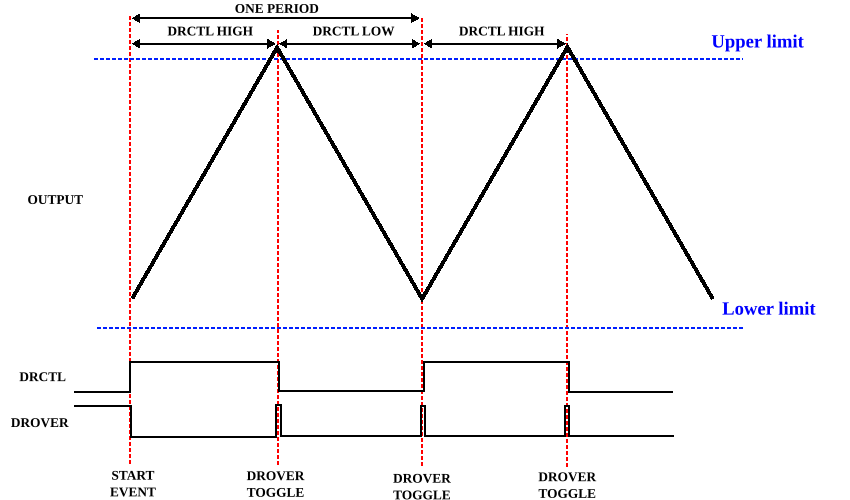

DUTY-CYCLE WAVEFORM RECOMMENDATIONS
~~~~~~~~~~~~~~~~~~~~~~~~~~~~~~~~~~~~~~~~~~~~~~~~~~~~~~~~~~~~~~~~~~~~~~~~~~~~~~~~

Program the high interval long enough for the AD9910 ramp action that should
occur while DRCTL is high. Program the low interval long enough for the ramp
action that should occur while DRCTL is low. Any dwell time at a ramp limit
should be added to the corresponding interval.

For an immediate return after the high interval, use a short low interval. For
a falling/ramp-down phase, use the high interval to reach or hold the upper
state, then place the falling ramp and any low dwell time in the low interval:

.. code-block:: text

   DRCTL_WIDTH  = high_ramp_cycles + high_dwell_cycles
   DRCTL_PERIOD = DRCTL_WIDTH + low_ramp_cycles + low_dwell_cycles

The generated toggle period is always high first and low second.

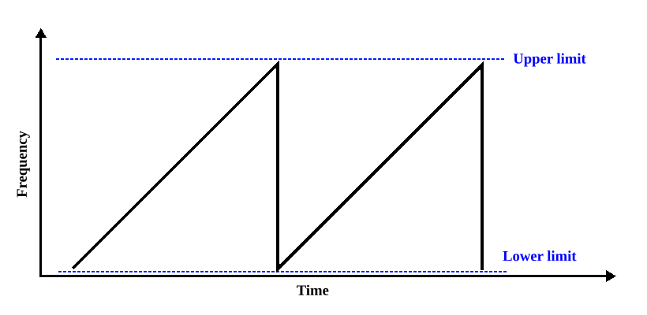

USE DELAY INTERVALS
~~~~~~~~~~~~~~~~~~~~~~~~~~~~~~~~~~~~~~~~~~~~~~~~~~~~~~~~~~~~~~~~~~~~~~~~~~~~~~~~

The timing controls define the start/wait interval, DRCTL duty-cycle counts,
and burst wait intervals.

There are 4 timing controls.
  - Start delay - an initial delay interval after the start event.
    Set in reg DELAY_BST_RAMP_DELAY (0x94)
  - DRCTL period - the full DRCTL duty-cycle period.
    Set in reg DRCTL_PERIOD (0x8C)
  - DRCTL width - the DRCTL-high interval within the period.
    Set in reg DRCTL_WIDTH (0x90)
  - Burst delays - repeats after each burst is complete
    Set in reg BURST_DELAY (0x9C)

Once the timing registers mentioned above are set, they are used automatically.
The start delay is used before a ramp sequence starts. In toggle mode,
``DRCTL_PERIOD`` defines the complete period and ``DRCTL_WIDTH`` defines
the high interval. Any desired delay after the AD9910 reaches a limit must be
included in the corresponding high or low interval.
``BURST_DELAY`` is inserted after the configured number of periods in
``RAMP_BURSTS``. During burst delay, the next duty-cycle period is held off and
DRCTL is kept low.

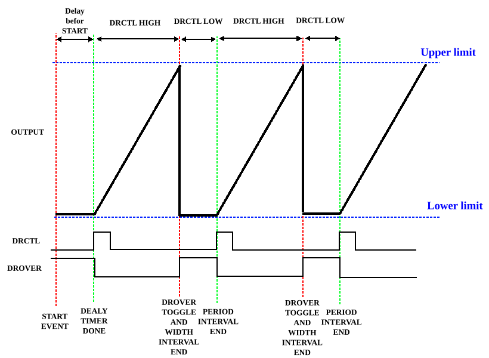
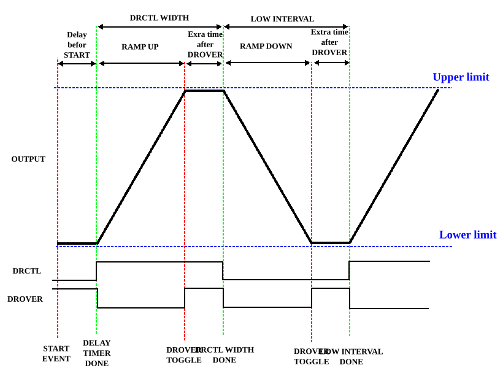

BURST
~~~~~~~~~~~~~~~~~~~~~~~~~~~~~~~~~~~~~~~~~~~~~~~~~~~~~~~~~~~~~~~~~~~~~~~~~~~~~~~~

A burst is a defined period which is set to repeat itself for N number of times.
N is set in register RAMP_BURSTS (0x98).

If a delay burst is defined the wait mechanism is activated after the ramp burst
finishes.
After burst is done, one has the following options register:

  - Repeat (nothing to configure)
  - Stops and waits for SW input RAMP_CFG (0xA0)
  - Interrupts after burst is complete.

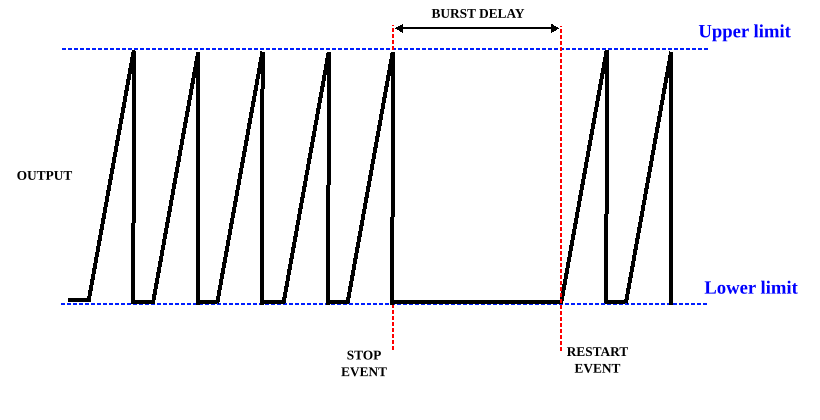

INTERRUPTS
''''''''''''''''''''''''''''''''''''''''''''''''''''''''''''''''''''''''''''''''

The axi_ad9910 can output an interrupt signal.
The interrupt can come from multiple sources such as:

  - A predefined interval
  - Burst complete
  - Digital ramp generator reached its programmed upper or lower limit.
  - RAM_SWP_OVR - RAM sweep profile completed.

There is an ``IRQ_MASK`` (0x44) register that allows the selection of active
interrupts.

In register ``IRQ_TABLE`` (0x48) one can find the list of triggered
interrupts. Reading ``IRQ_TABLE`` returns the latched status bits. Writing
1s to the same register clears the corresponding latched bits.

``IRQ_MASK`` and ``IRQ_TABLE`` use the following bit order:

* [5] ``IRQ_INTERVAL_START``: monitor counter reached the programmed start
  match value
* [4] ``IRQ_INTERVAL_STOP``: monitor counter reached the programmed stop
  match value
* [3] Reserved, tied low
* [2] ``DROVER``: digital ramp generator reached its programmed upper or lower
  limit
* [1] ``BURSTS_IRQ``: programmed number of ramp bursts completed
* [0] ``RAM_SWP_OVR``: AD9910 RAM sweep over input

To set the interrupt start and stop match values set the registers:

  - 0xA8 - IRQ_START_INTERVAL
  - 0xAC - IRQ_STOP_INTERVAL

The interrupt and trigger-output interval counters are down counters. Software
programs the selected reference-window length in ``MONITOR_MAX_PERIOD`` and the
exact counter compare value in the start/stop interval registers. The HDL loads
the counter with ``MONITOR_MAX_PERIOD`` and compares directly against the
programmed register value:

.. code-block:: text

   irq_start_pulse_when ref_cnt == IRQ_START_INTERVAL
   irq_stop_pulse_when  ref_cnt == IRQ_STOP_INTERVAL

Software must do the interval-to-match conversion before writing the register:

.. code-block:: text

   MATCH_VALUE = MONITOR_MAX_PERIOD - INTERVAL

There is no ``+1`` correction. The registered ``irq`` and ``trig_out`` outputs
assert three sync-clock cycles after the internal reference counter reaches the
programmed match value. For an output pulse exactly ``D`` sync-clock cycles
after the reference counter load edge, set:

.. code-block:: text

   MATCH_VALUE = MONITOR_MAX_PERIOD - (D - 3)

For example, with ``MONITOR_MAX_PERIOD = 16``, to make the output pulse exit the
core 10 sync-clock cycles after the reference counter loads, program the
corresponding match register to ``16 - (10 - 3) = 9``.

Recommended limits:

* ``MATCH_VALUE = 0`` disables that start/stop pulse.
* Use ``1 <= MATCH_VALUE <= MONITOR_MAX_PERIOD`` for enabled pulses.
* For an interval measured from the counter load edge, use
  ``1 <= INTERVAL < MONITOR_MAX_PERIOD`` so the computed match value is nonzero.

The start and stop events use the same counter and output pipeline. Therefore,
the distance between the start and stop pulses at the core output is exactly:

.. code-block:: text

   stop_pulse_delay - start_pulse_delay = START_MATCH_VALUE - STOP_MATCH_VALUE

For a start pulse before a stop pulse, the start match value must be larger than
the stop match value because the counter decrements. Do not add or subtract one
clock cycle in software. Only account for the fixed three-cycle output latency
when an absolute pulse exit time from the reference counter load edge is
required. This fixed latency is common to both start and stop pulses, so it does
not change the programmed pulse spacing.

There is one counter for the predefined interrupt decision, it can monitor
based on register IRQ_MONITOR_TIMER_CFG (0x4C). The user can select only one
option from:

  - Periods, resetting after the period is complete see e.g. below.
  - Burst delays, resetting after the burst delay is complete see e.g. below.
  - A maximum delay set in MONITOR_MAX_PERIOD (0xA4).

Period monitoring configuration
~~~~~~~~~~~~~~~~~~~~~~~~~~~~~~~~~~~~~~~~~~~~~~~~~~~~~~~~~~~~~~~~~~~~~~~~~~~~~~~~

In this mode the monitoring interval starts when DRCTL changes its state and
ends at the end of the programmed period. In toggle mode, one programmed period
is the full ``DRCTL_PERIOD`` duty cycle. The monitor counter
is reset at the end of the period.

Below there is an e.g. of one period monitoring interval.

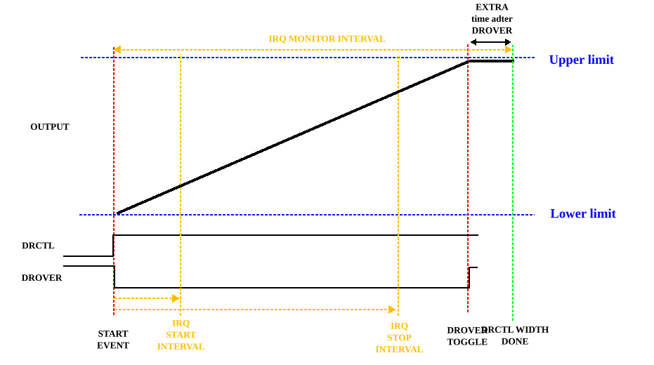

Below there is an e.g. of monitoring intervals, in toggling mode.

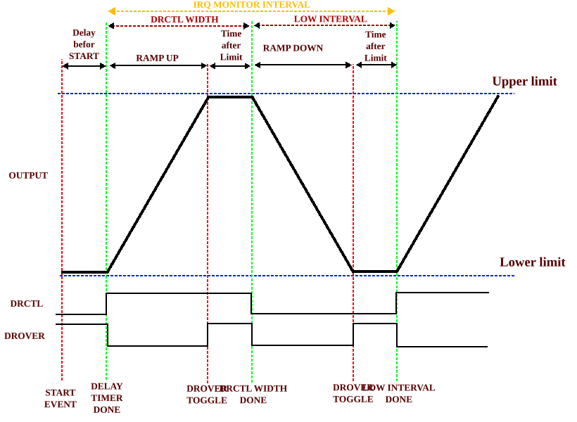

Burst delay monitoring
~~~~~~~~~~~~~~~~~~~~~~~~~~~~~~~~~~~~~~~~~~~~~~~~~~~~~~~~~~~~~~~~~~~~~~~~~~~~~~~~

The monitoring counter starts with the burst delay and is reset when the burst
delay interval ends.

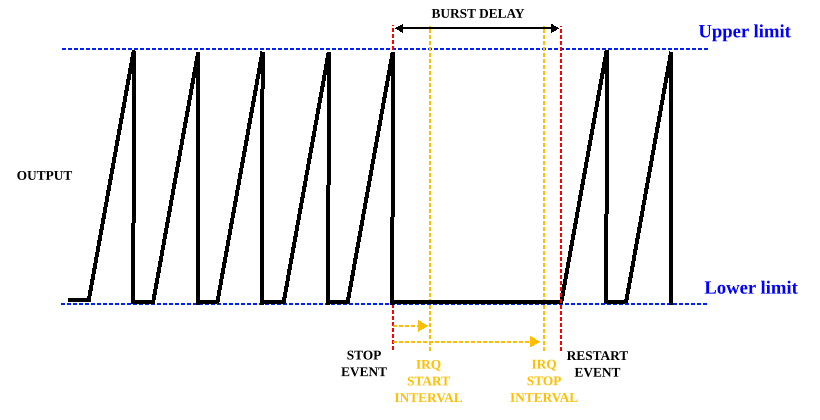

Max period monitoring
~~~~~~~~~~~~~~~~~~~~~~~~~~~~~~~~~~~~~~~~~~~~~~~~~~~~~~~~~~~~~~~~~~~~~~~~~~~~~~~~

The monitoring counter starts from the ramp start event and is reset when the
programmed value is reached.

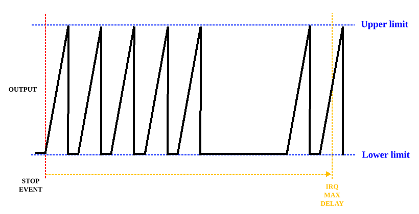

EXTERNAL TRIGGER
''''''''''''''''''''''''''''''''''''''''''''''''''''''''''''''''''''''''''''''''

Same options as for the period monitor configurations above configured in
IRQ_MONITOR_TIMER_CFG.
The trigger timing source is selected with ``TRIG_CONFIG`` in
``TRIG_OUT_CTRL`` (0x50) bits [1:0]. External-sync arm/disarm control is done
with ``EXT_TRIG_TIMER_CFG`` (0x54) bits [1:0].
Same functionality as in above sections:

  - Period monitoring configuration
  - Burst delay monitoring
  - Max period monitoring

The difference is that the output will be a pulse on trig_out, and not a
interrupt flag that must be cleared.

To set the trigger-output start and stop match values set the registers:

  - 0xB0 - TRIG_OUT_START_INTERVAL
  - 0xB4 - TRIG_OUT_STOP_INTERVAL

The trigger-output interval registers use the same down-counter match semantics
and registered-output timing as the interrupt interval registers:

.. code-block:: text

   trig_out_start_pulse_when trig_ref_cnt == TRIG_OUT_START_INTERVAL
   trig_out_stop_pulse_when  trig_ref_cnt == TRIG_OUT_STOP_INTERVAL

For a ``trig_out`` pulse to exit the core ``D`` sync-clock cycles after the
trigger reference counter load edge, program:

.. code-block:: text

   TRIG_OUT_MATCH_VALUE = MONITOR_MAX_PERIOD - (D - 3)

Program ``0`` to disable the corresponding trigger-output interval pulse. The
spacing between the start and stop ``trig_out`` pulses is exactly:

.. code-block:: text

   TRIG_OUT_START_MATCH_VALUE - TRIG_OUT_STOP_MATCH_VALUE

PARALLEL DATA PORT MODULATION MODE
--------------------------------------------------------------------------------

The parallel interface transfer can be synchronized with an external sync
signal through ``EXT_TRIG_TIMER_CFG`` (0x54).

The parallel-port destination configured from:

* ``s_axis_tdata[15:0]`` carries one 16-bit payload word
* ``F_CFG`` (0x10C) drives the external ``f_o[1:0]`` bus
* ``UPDATE_CTRL`` (0x104) enables the interface and selects whether transfers
  are driven by the internal update-rate counter or by the external trigger
  path
* ``PAR_UPDATE_RATE`` (0x108) is a 32-bit value that programs the internal
  transfer interval

Parallel bus payload destination configuration.
``F_CFG`` / ``f_o[1:0]`` selects the AD9910 parallel-port dest:

* ``2'b00``: 14-bit amplitude parameter, unsigned, carried on ``db_o[15:2]``
* ``2'b01``: 16-bit phase parameter, unsigned, carried on ``db_o[15:0]``
* ``2'b10``: 32-bit frequency parameter, unsigned, transferred as successive
  16-bit words on ``db_o[15:0]``. The alignment of the 16-bit data word within
  the 32-bit frequency parameter is controlled by the AD9910 4-bit FM gain
  word in the device programming registers
* ``2'b11``: combined 8-bit amplitude on ``db_o[15:8]`` and 8-bit phase on
  ``db_o[7:0]``

If the internal FIFO is empty when a trigger event occurs, the transfer is skipped.

Rate counter mode
''''''''''''''''''''''''''''''''''''''''''''''''''''''''''''''''''''''''''''''''

In rate-counter mode, the parallel interface generates one transfer each time
the internal counter reaches zero. After each transfer opportunity, the counter
reloads from ``PAR_UPDATE_RATE``.

Program ``PAR_UPDATE_RATE`` (0x108), then write ``UPDATE_CTRL`` (0x104) with
``ENABLE_P_IF`` and ``LOAD_NEW_RATE`` set. With the current bit assignment this
is ``UPDATE_CTRL = 0x3`` for timed mode.

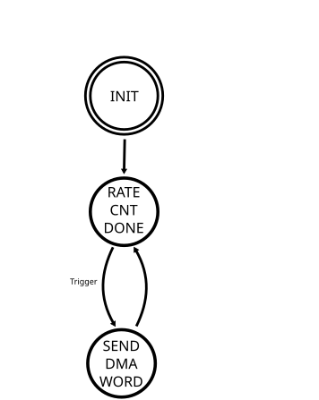

Trigger mode
''''''''''''''''''''''''''''''''''''''''''''''''''''''''''''''''''''''''''''''''

In trigger mode, the interface waits for the external trigger path to arm and
then emits one transfer when the trigger event is observed.

Use ``UPDATE_CTRL = 0x6`` to enable the interface and select trigger mode.
After ``EXT_SYNC_ARM`` is set, a trigger on ``ext_sync`` disarms the sync logic;
that falling edge of the internal armed state sends one 16-bit DDS word if the
FIFO contains data.

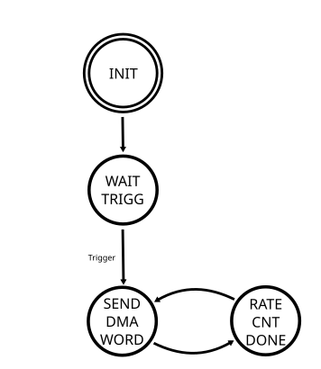
