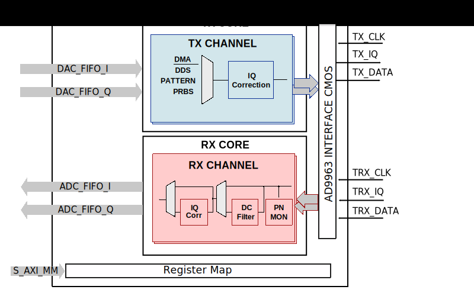

.. _axi_ad9963:

AXI AD9963
================================================================================

.. hdl-component-diagram::

The :git-hdl:`AXI AD9963 <library/axi_ad9963>` IP core
can be used to interface the :adi:`AD9963` chip.
It features a dual 12-bit ADC working up to 100MSPS and a dual 12-bit DAC with
up to 170MSPS. It also features a DLL which can provide clock for both the ADC
and the DAC path.

More about the generic framework interfacing ADCs can be read in :ref:`axi_adc`
and interfacing DACs in :ref:`axi_dac`.

Features
--------------------------------------------------------------------------------

* AXI Lite control/status interface
* PRBS monitoring
* Hardware DC filtering
* IQ/Scale correction
* Internal DDS
* Programmable line delays
* Supports AMD Xilinx devices

Files
--------------------------------------------------------------------------------

.. list-table::
   :header-rows: 1

   * - Name
     - Description
   * - :git-hdl:`library/axi_ad9963/axi_ad9963.v`
     - Verilog source for the AXI AD9963.
   * - :git-hdl:`library/common/up_adc_common.v`
     - Verilog source for the ADC Common regmap.
   * - :git-hdl:`library/common/up_adc_channel.v`
     - Verilog source for the ADC Channel regmap.
   * - :git-hdl:`library/common/up_dac_common.v`
     - Verilog source for the DAC Common regmap.
   * - :git-hdl:`library/common/up_dac_channel.v`
     - Verilog source for the DAC Channel regmap.

Block Diagram
--------------------------------------------------------------------------------

Configuration Parameters
--------------------------------------------------------------------------------

.. hdl-parameters::

   * - ID
     - Core ID should be unique for each IP in the system
   * - FPGA_TECHNOLOGY
     - Used to select between devices.
   * - ADC_IODELAY_ENABLE
     - Enable IODELAY for tuning the TRX interface
   * - IO_DELAY_GROUP
     - The delay group name which is set for the delay controller
   * - DAC_DATAPATH_DISABLE
     - Disable DAC processing blocks. Disables DDS
   * - ADC_USERPORTS_DISABLE
     - Disable ADC userports
   * - ADC_DATAFORMAT_DISABLE
     - Disable ADC data format processing block
   * - ADC_DCFILTER_DISABLE
     - Disable ADC dc filtering processing block
   * - ADC_IQCORRECTION_DISABLE
     - Disable ADC IQ corection processing block
   * - ADC_SCALECORRECTION_ONLY
     - If IQ correction block is enabled and only the scale needs to be
       corrected, this should be set to 1

Interface
--------------------------------------------------------------------------------

.. hdl-interfaces::

   * - trx_clk
     - CMOS input clock
   * - trx_iq
     - CMOS input channel selection
   * - trx_data
     - CMOS input data
   * - tx_clk
     - CMOS input clock
   * - tx_iq
     - CMOS output channel selection
   * - tx_data
     - CMOS output data
   * - dac_sync_in
     - DAC synchronization signal. It is generated by the master core and used
       by all the cores in the system. Only one of the IPs should be master
   * - dac_sync_out
     - DAC synchronization signal. It is generated by the master core and used
       by all the cores in the system. Only one of the cores should be master
   * - delay_clk
     - Clock used by the IDELAYCTRL. Connect to 200MHz
   * - adc_clk
     - Clock derived from the TRX clock. It is the clock on which all
       ADC-related logic runs.
   * - adc_rst
     - Output reset, on the adc_clk domain
   * - adc_enable_i
     - Set when the channel I is enabled, activated by software
   * - adc_valid_i
     - Set when valid data is available on the channel I
   * - adc_data_i
     - Channel I data bus
   * - adc_enable_q
     - Set when the channel Q is enabled, activated by software
   * - adc_valid_q
     - Set when valid data is available on the channel Q
   * - adc_data_q
     - Channel Q data bus
   * - adc_dovf
     - Data overflow input, from the DMA
   * - dac_clk
     - Clock derived from the TX clock. It is the clock on which all DAC-related
       logic runs.
   * - dac_rst
     - Output reset, on the dac_clk domain
   * - dac_enable_i
     - Set when the channel I is enabled, activated by software
   * - dac_valid_i
     - Set when valid data is available on the channel I
   * - dac_data_i
     - Channel I data bus
   * - dac_enable_q
     - Set when the channel Q is enabled, activated by software
   * - dac_valid_q
     - Set when valid data is available on the channel Q
   * - dac_data_q
     - Channel Q data bus
   * - dac_dunf
     - Data underflow input from the DMA
   * - s_axi
     - Standard AXI Slave Memory Map interface

Detailed Description
--------------------------------------------------------------------------------

The TRX (ADC) interface is set at 100MSPS, full duplex mode, double data rate
(DDR), two channels. The clock comes from the :adi:`AD9963` chip.

The TX (DAC) interface works at 75MSPS data rate with interpolation by 2 on the
AD9963 chip. The DAC path inside AD9963 chip works at 150MHz, pushing part of
the spurs outside the 100MHz bandwidth. The design assumes that the 75MHz clock
is not available in the FPGA. To reduce the number of PLLs used in the FPGA,
we are using AD9963 and a BUFR (divide by 2) to generate this clock. When
the clock is generated by AD9963, DDR transfer is not available. The TX
interface works at 150MHz, SDR.

Register Map
--------------------------------------------------------------------------------

The register map of the core contains instances of several generic register maps
like ADC common, ADC channel, DAC common, DAC channel etc. The following table
presents the base addresses of each instance, after that can be found the
detailed description of each generic register map. The absolute address of a
register should be calculated by adding the instance base address to the
registers relative address.

.. list-table:: Register Map base addresses for axi_ad9361
   :header-rows: 1

   * - DWORD
     - BYTE
     - Name
     - Description
   * - 0x0000
     - 0x0000
     - BASE
     - See the `Base <#hdl-regmap-COMMON>`__ table for more details.
   * - 0x0000
     - 0x0000
     - RX COMMON
     - See the `ADC Common <#hdl-regmap-ADC_COMMON>`__ table for more details.
   * - 0x0000
     - 0x0000
     - RX CHANNELS
     - See the `ADC Channel <#hdl-regmap-ADC_CHANNEL>`__ table for more details.
   * - 0x1000
     - 0x4000
     - TX COMMON
     - See the `DAC Common <#hdl-regmap-DAC_COMMON>`__ table for more details.
   * - 0x1000
     - 0x4000
     - TX CHANNELS
     - See the `DAC Channel <#hdl-regmap-DAC_CHANNEL>`__ table for more details.

.. hdl-regmap::
   :name: COMMON
   :no-type-info:

.. hdl-regmap::
   :name: ADC_COMMON
   :no-type-info:

.. hdl-regmap::
   :name: ADC_CHANNEL
   :no-type-info:

.. hdl-regmap::
   :name: DAC_COMMON
   :no-type-info:

.. hdl-regmap::
   :name: DAC_CHANNEL
   :no-type-info:

Design Guidelines
--------------------------------------------------------------------------------

To reduce the power and resource utilization, all the unused features
should be disabled.

Software Guidelines
--------------------------------------------------------------------------------

For RX PRBS data, when 2's complement mode is selected, each new word is the
1-bit shifted version of the previous word. Steps to do in order to test
the PRBS on the RX path:

#. Write to AD9963 SPI register 0x51 the value 1, which enables the BIST core.
#. Write to AD9963 SPI register 0x51 the value 7.
#. Read register 0x404 from the AD9361 ADC core (should read value 2 or 6).
#. Write back to register 0x404 from the AD9361 ADC core the value read above.
#. Read register 0x404 from the AD9361 ADC core.
   It should read 0x0 if the RX path is working correctly for channel 1.
#. Perform steps 3-6 with register 0x444.
   This will validate the RX path for channel 2.

If the TRX path does not work correctly, the output current on the TRX pins can
be changed by writing to register 0x63.

The TX interface testing is done by writing 1024 samples of PRBS data and
checking the BIST signature values for both the I and the Q side. Interpolation
should not be active during the BIST testing.

Software Support
--------------------------------------------------------------------------------

The software for this part can be found as part of the :adi:`ADALM2000`
(or shortly, M2K) reference design.

* Linux device driver at :git-linux:`drivers/iio/adc/ad9963.c`

References
-------------------------------------------------------------------------------

* :adi:`AD9963`
* HDL IP core at :git-hdl:`library/axi_ad9963`
* HDL project at :git-hdl:`projects/m2k`
* HDL project documentation at :ref:`m2k`
* :xilinx:`Zynq-7000 SoC Overview <support/documentation/data_sheets/ds190-Zynq-7000-Overview.pdf>`
* :xilinx:`Zynq-7000 SoC Packaging and Pinout <support/documentation/user_guides/ug865-Zynq-7000-Pkg-Pinout.pdf>`
* :xilinx:`7 Series libraries <support/documentation/sw_manuals/xilinx2016_2/ug953-vivado-7series-libraries.pdf>`
