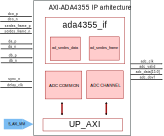

.. _axi_ada4355:

AXI ADA4355
================================================================================

.. hdl-component-diagram::

The :git-hdl:`AXI ADA4355 <library/axi_ada4355>` IP core
can be used to interface the :adi:`ADA4355` device using an
FPGA. The core has a AXI Memory Map interface for configuration, supports the
data interface of the device, and has a simple FIFO interface for the
DMAC. This documentation only covers the IP core and requires one to be familiar
with the device, for a complete and better understanding.

More about the generic framework interfacing ADCs can be read in :ref:`axi_adc`.

Files
--------------------------------------------------------------------------------

.. list-table::
   :header-rows: 1

   * - Name
     - Description
   * - :git-hdl:`library/axi_ada4355/axi_ada4355.v`
     - Verilog source for the AXI ADA4355.
   * - :git-hdl:`library/axi_ada4355/axi_ada4355_if.v`
     - Verilog source for the AXI ADA4355 interface.
   * - :git-hdl:`library/axi_ada4355/axi_ada4355_ip.tcl`
     - IP definition file (AMD tools)
   * - :git-hdl:`library/common/up_adc_common.v`
     - Verilog source for the ADC Common regmap.
   * - :git-hdl:`library/common/up_adc_channel.v`
     - Verilog source for the ADC Channel regmap.

Block Diagram
--------------------------------------------------------------------------------

Configuration Parameters
--------------------------------------------------------------------------------

.. hdl-parameters::

   * - ID
     - Core ID should be unique for each IP in the system
   * - FPGA_TECHNOLOGY
     - Used to select between FPGA devices, auto set in project.
   * - BUFMRCE_EN
     - Used to select between pinouts that are differentiated
       by how the frame clock signals are distributed.

Interface
--------------------------------------------------------------------------------

.. hdl-interfaces::

   * - sync_n
     - Signals when the clock is disabled and the design should be in reset
   * - fco_p
     - LVDS input positive side of differential data frame signal
   * - fco_n
     - LVDS input negative side of differential data frame signal
   * - dco_p
     - LVDS input positive side of differential reference clock signal
   * - dco_n
     - LVDS input negative side of differential reference clock signal
   * - d0a_p
     - LVDS input positive side of differential data line A signal
   * - d0a_n
     - LVDS input negative side of differential data line A signal
   * - d1a_p
     - LVDS input positive side of differential data line B signal
   * - d1a_n
     - LVDS input negative side of differential data line B signal
   * - delay_clk
     - Delay clock input for IO_DELAY control, 200 MHz (7 series) or 300 MHz
       (Ultrascale)
   * - adc_clk
     - The clock used to shift data out of the IP
   * - adc_valid
     - Indicates valid data
   * - adc_data
     - Received data output
   * - adc_dovf
     - Data overflow. Must be connected to the DMA
   * - up_adc_pn_err
     - Error monitoring
   * - s_axi
     - Standard AXI Slave Memory Map interface

Internal Interface Description
~~~~~~~~~~~~~~~~~~~~~~~~~~~~~~~~~~~~~~~~~~~~~~~~~~~~~~~~~~~~~~~~~~~~~~~~~~~~~~~

The axi_ada4355 operates as follows:

* The LVDS data is deserialized by the
  :git-hdl:`ad_serdes_in <library/xilinx/common/ad_serdes_in.v>` module with
  a 1:8 ratio.
* The LVDS data frame is also deserialized by the
  :git-hdl:`ad_serdes_in <library/xilinx/common/ad_serdes_in.v>` module with
  a 1:8 ratio.
* After deserialization, data is aligned using data_frame and a fixed pattern.

Register Map
--------------------------------------------------------------------------------

The register map of the core contains instances of several generic register maps
like ADC common, ADC channel,
:git-hdl:`up_delay_cntrl <library/common/up_delay_cntrl.v>`.
The following table presents the base addresses of each instance, after it you
can find the detailed description of each generic register map.

The absolute address of a register should be calculated by adding the instance
base address to the registers relative address.

.. list-table:: Register Map base addresses for axi_ada4355
   :header-rows: 1

   * - DWORD
     - BYTE
     - Name
     - Description
   * - 0x0000
     - 0x0000
     - BASE
     - See the `Base <#hdl-regmap-COMMON>`__ table for more details.
   * - 0x0010
     - 0x0040
     - ADC COMMON
     - See the `ADC Common <#hdl-regmap-ADC_COMMON>`__ table for more details.
   * - 0x0100
     - 0x0400
     - ADC CHANNELS
     - See the `ADC Channel <#hdl-regmap-ADC_CHANNEL>`__ table for more details.
   * - 0x0200
     - 0x0800
     - IO_DELAY_CNTRL
     - See the `I/O Delay Control <#hdl-regmap-IO_DELAY_CNTRL>`__ table for more details.

.. hdl-regmap::
   :name: AXI_ADA4355
   :no-type-info:

.. hdl-regmap::
   :name: COMMON
   :no-type-info:

.. hdl-regmap::
   :name: ADC_COMMON
   :no-type-info:

.. hdl-regmap::
   :name: ADC_CHANNEL
   :no-type-info:

.. hdl-regmap::
   :name: IO_DELAY_CNTRL
   :no-type-info:

Design Guidelines
--------------------------------------------------------------------------------

The control of the ADA4355 chip is done through a SPI interface, which is needed
at system level.

The *ADC interface signals* must be connected directly to the top file of the
design, as I/O primitives are part of the IP.

The example design uses a DMA to move the data from the output of the IP to
memory.

If the data needs to be processed in HDL before moving it to the memory, it can be
done at the output of the IP (at system level) or inside of the ADC channel
module (at IP level).

The example design uses a processor to program all the registers. If no
processor is available in your system, you can create your own IP starting from
the interface module.

References
-------------------------------------------------------------------------------

* HDL IP core at :git-hdl:`library/axi_ada4355`
* HDL project at :git-hdl:`projects/ada4355_fmc`
* HDL project documentation at :ref:`ada4355_fmc`
* :adi:`ADA4355`
* :xilinx:`Zynq-7000 SoC Overview <support/documentation/data_sheets/ds190-Zynq-7000-Overview.pdf>`
* :xilinx:`Zynq-7000 SoC Packaging and Pinout <support/documentation/user_guides/ug865-Zynq-7000-Pkg-Pinout.pdf>`
