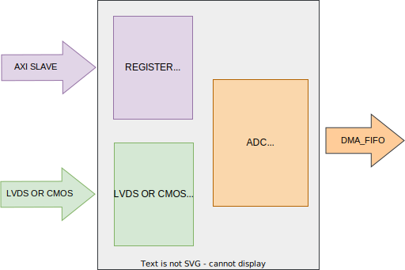

.. _axi_adaq8092:

AXI ADAQ8092
================================================================================

.. hdl-component-diagram::

The :git-hdl:`AXI ADAQ8092 <library/axi_adaq8092>` IP core
can be used to interface the :adi:`ADAQ8092` ADC,
in DDR, LVDS/CMOS or SDR CMOS mode.

More about the generic framework interfacing ADCs can be read in :ref:`axi_adc`.

Features
--------------------------------------------------------------------------------

* AXI based configuration
* DC filtering
* Configurable line delays
* Digital output randomize output mode decoding
* Alternate bit polarity output mode decoding
* Vivado compatible

Files
--------------------------------------------------------------------------------

.. list-table::
   :header-rows: 1

   * - Name
     - Description
   * - :git-hdl:`library/axi_adaq8092/axi_adaq8092.v`
     - Verilog source for the AXI ADAQ8092.
   * - :git-hdl:`library/axi_adaq8092/axi_adaq8092_apb_decode.v`
     - Verilog source for the module that implements the alternate bit polarity.
       decoding.
   * - :git-hdl:`library/axi_adaq8092/axi_adaq8092_channel.v`
     - Verilog source for the AXI ADAQ8092 channel.
   * - :git-hdl:`library/axi_adaq8092/axi_adaq8092_if.v`
     - Verilog source for the AXI ADAQ8092 interface module.
   * - :git-hdl:`library/axi_adaq8092/axi_adaq8092_rand_decode.v`
     - Verilog source for the module that implements the randomize decoding.
   * - :git-hdl:`library/axi_adaq8092/axi_adaq8092_ip.tcl`
     - TCL script to generate the Quartus IP-integrator project.

Block Diagram
--------------------------------------------------------------------------------

Configuration Parameters
--------------------------------------------------------------------------------

.. hdl-parameters::

   * - ID
     - Core ID should be unique for each IP in the system
   * - FPGA_TECHNOLOGY
     - Used to select between devices.
   * - ADC_DATAPATH_DISABLE
     - If set, the datapath processing is not generated and output data is
       taken directly from the ADAQ8092
   * - IO_DELAY_GROUP
     - The delay group name which is set for the delay controller

Interface
--------------------------------------------------------------------------------

.. hdl-interfaces::

   * - adc_clk_in_p
     - LVDS input clock.
   * - adc_clk_in_n
     - LVDS input clock.
   * - lvds_adc_data_in1_p
     - Channel 1 LVDS input data.
   * - lvds_adc_data_in1_n
     - Channel 1 LVDS input data.
   * - lvds_adc_data_in2_p
     - Channel 2 LVDS input data.
   * - lvds_adc_data_in2_n
     - Channel 2 LVDS input data.
   * - lvds_adc_or_in_p
     - LVDS input over range.
   * - lvds_adc_or_in_n
     - LVDS input over range.
   * - cmos_adc_data_in1
     - Channel 1 CMOS DDR or SDR input data.
   * - cmos_adc_data_in2
     - Channel 2 CMOS DDR or SDR input data.
   * - cmos_adc_or_in_*
     - CMOS input over range.
   * - delay_clk
     - Clock used by the IDELAYCTRL. Connect to 200MHz.
   * - adc_clk
     - The input clock is passed through an IBUFGDS and a BUFG primitive and
       adc_clk reults. This is the clock domain that most of the modules of
       the core run on.
   * - adc_rst
     - Output reset, on the adc_clk domain.
   * - adc_enable_*
     - Set when the channel is enabled, activated by software.
   * - adc_valid
     - Set when valid data is available on the bus.
   * - adc_data_channel1
     - Channel 1 data bus.
   * - adc_data_channel2
     - Channel 2 data bus.
   * - adc_dovf
     - Data overflow input, from the DMA.
   * - s_axi
     - Standard AXI Slave Memory Map interface.

Detailed Architecture
--------------------------------------------------------------------------------

.. image:: detailed_architecture-lvds_ddr.svg
   :alt: AXI ADAQ8092 DDR LVDS IP architecture

.. image:: detailed_architecture-cmos_ddr.svg
   :alt: AXI ADAQ8092 DDR CMOS IP architecture

.. image:: detailed_architecture-cmos_sdr.svg
   :alt: AXI ADAQ8092 SDR CMOS IP architecture

Detailed Description
--------------------------------------------------------------------------------

The top module, axi_ADAQ8092, instantiates:

* the LVDS/CMOS interface module
* the channel1 processing module
* the channel2 processing module
* the ADC common register map
* the AXI handling interface
* delay control module

The LVDS/CMOS interface module, axi_adaq8092_if, has as input the lvds signals
for clock, data[7:0](DDR) or data[13:0](SDR) and over range. It uses IO block
primitives inside of IP to handle the input signals. The input clock is routed
to a clock distribution primitive from which it drives all the ADC related
processing circuitry. The data signals are passed through an IDELAYE2 so that
each line can be delayed independently through the delay controller register
map. The IP outputs a data value on every clock cycle, along with the over
range signal. The latency between input and output of the interface module is
3 clock cycles.
The data from the interface module is processed by the adc channel module.

The channel module implements:

* digital output randomize output mode decoding
* alternate bit polarity output mode decoding
* data format conversion
* DC filter
* the ADC CHANNEL register map

``up_adc_common`` module implements the ADC COMMON register map, allowing for
basic monitoring and control of the ADC.

The delay controller module, up_delay_cntrl, allows the dynamic
reconfiguration of the IDELAYE2 blocks. Changing the delay on each individual
line helps compensate trace differences between the data lines on the PCB.

Register Map
--------------------------------------------------------------------------------

.. hdl-regmap::
   :name: COMMON
   :no-type-info:

.. hdl-regmap::
   :name: ADC_COMMON
   :no-type-info:

.. hdl-regmap::
   :name: ADC_CHANNEL
   :no-type-info:

Design Guidelines
--------------------------------------------------------------------------------

The control of the ADAQ8092 chip is done through a SPI interface or parallel
interface, which is needed at system level.

The *ADC interface signals* must be connected directly to the top file of the
design, as IO primitives are part of the IP.

The example design uses a DMA to move the data from the output of the IP to
memory.

If the data needs to be processed in HDL before moved to the memory, it can be
done at the output of the IP (at system level) or inside of the adc channel
module (at IP level).

The example design uses a processor to program all the registers. If no
processor is available in your system, you can create your own IP starting from
the interface module.

Software Support
--------------------------------------------------------------------------------

* No-OS project at :git-no-OS:`drivers/adc/adaq8092`
* No-OS device driver at  :git-no-OS:`drivers/adc/drivers/adc/adaq8092/adaq8092.c`
* Linux device driver at :git-linux:`drivers/iio/adc/adaq8092.c`
* Linux device tree at :git-linux:`arch/arm/boot/dts/zynq-zed-adv7511-adaq8092.dts`
* Linux device driver documentation
  :dokuwiki:`on wiki <resources/tools-software/linux-drivers/iio-adc/adaq8092>`

References
-------------------------------------------------------------------------------

* HDL IP core at :git-hdl:`library/axi_adaq8092`
* HDL project at :git-hdl:`projects/adaq8092_fmc`
* HDL project documentation at :ref:`adaq8092_fmc`
* :adi:`ADAQ8092`
* :xilinx:`Zynq-7000 SoC Overview <support/documentation/data_sheets/ds190-Zynq-7000-Overview.pdf>`
* :xilinx:`Zynq-7000 SoC Packaging and Pinout <support/documentation/user_guides/ug865-Zynq-7000-Pkg-Pinout.pdf>`
