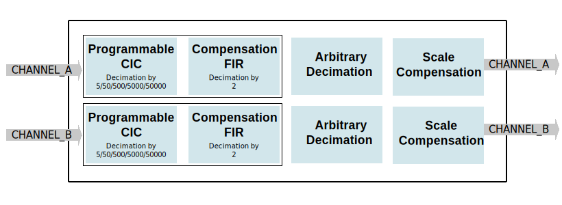

.. _axi_adc_decimate:

AXI ADC Decimate
================================================================================

.. hdl-component-diagram::

The :git-hdl:`AXI ADC Decimate <library/axi_adc_decimate>` IP core
allows decimating the input data by 10/100/1000/10000/100000, with filtering
and arbitrary decimation by dropping samples.

More about the generic framework interfacing ADCs can be read here at :ref:`axi_adc`.

.. important::

   The axi_adc_decimate was designed to interface with 12-bit converters. Even
   though the input data bus width is 16, it will not work with anything higher
   than 12-bit sign extended (to 16-bit) data.

Features
--------------------------------------------------------------------------------

*  AXI Lite control/status interface
*  Allows decimation by 10/100/1000/10000/100000 with filtering
*  Allows arbitrary decimation by dropping samples
*  Filtering is implemented by a 6-section CIC programmable rate filter and a
   compensation FIR filter.

Files
--------------------------------------------------------------------------------

.. list-table::
   :header-rows: 1

   * - Name
     - Description
   * - :git-hdl:`library/axi_adc_decimate/axi_adc_decimate.v`
     - Verilog source for the peripheral.

Block Diagram
--------------------------------------------------------------------------------

Configuration Parameters
--------------------------------------------------------------------------------

.. hdl-parameters::

   * - CORRECTION_DISABLE
     - Disable scale correction of the CIC output

Interface
--------------------------------------------------------------------------------

.. hdl-interfaces::

   * - adc_clk
     - Clock input
   * - adc_rst
     - Reset, synchronous on the adc_clk clock domain
   * - adc_data_a
     - Analog data for channel A
   * - adc_data_b
     - Analog data for channel B
   * - adc_valid_a
     - Data valid signal for channel A
   * - adc_valid_b
     - Data valid signal for channel B
   * - adc_dec_data_a
     - Decimated data for channel A
   * - adc_dec_data_b
     - Decimated data for channel B
   * - adc_dec_valid_a
     - Data valid for channel A
   * - adc_dec_valid_b
     - Data valid for channel B
   * - adc_data_rate
     - Data rate (decimation ratio)
   * - adc_oversampling_en
     - Data oversampling enabled
   * - s_axi
     - Standard AXI Slave Memory Map interface

Detailed Description
--------------------------------------------------------------------------------

For some applications, the maximum sampling rate is not required and leads to
lots of samples transferred to memory. To avoid it, the decimation IP
can be used.

The decimation block allows decimating the input data so that the sampling
frequency can be reduced by 10, 100, 1000, 10000, 100000, with filtering.

The filtering is implemented by a 6-section CIC programmable rate filter which
allows decimation by 5/50/500/5000/50000 and a compensation FIR filter
(decimation by 2).

At the end of the filter chain, there is an arbitrary decimation block. The
arbitrary decimation can be activated independently and it does not implement
any type of filtering.

Register Map
--------------------------------------------------------------------------------

.. hdl-regmap::
   :name: axi_adc_decimate

References
--------------------------------------------------------------------------------

* HDL IP core at :git-hdl:`library/axi_adc_decimate`
* :dokuwiki:`AXI ADC DECIMATE on wiki <resources/fpga/docs/axi_adc_decimate>`
* :xilinx:`7 Series libraries <support/documentation/sw_manuals/xilinx2016_2/ug953-vivado-7series-libraries.pdf>`
