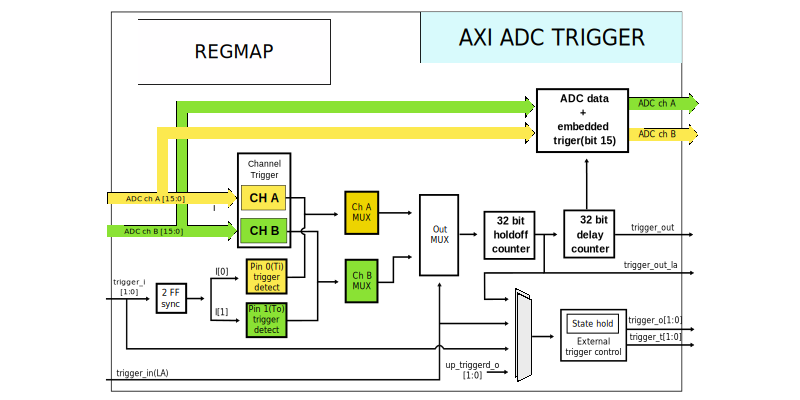

.. _axi_adc_trigger:

AXI ADC Trigger
================================================================================

.. hdl-component-diagram::

The :git-hdl:`AXI ADC Trigger <library/axi_adc_trigger>` IP core implements
triggering for the ADC path and also controls two I/O triggering pins.

More about the generic framework interfacing ADCs can be read here at :ref:`axi_adc`.

Features
--------------------------------------------------------------------------------

-  AXI Lite control/status interface
-  Analog triggers, two channels

   -  Greater than a limit
   -  Lower than a limit
   -  Passing through the limit, high
   -  Passing through the limit, low

-  Digital triggers, two trigger pins

   -  Low
   -  High
   -  Any edge
   -  Rising edge
   -  Falling edge

-  Mixing analog and digital triggers
-  Instrument trigger (from Logic Analyzer)
-  Controls two IO trigger pins

Files
--------------------------------------------------------------------------------

.. list-table::
   :header-rows: 1

   * - Name
     - Description
   * - :git-hdl:`library/axi_adc_trigger/axi_adc_trigger.v`
     - Verilog source for the peripheral.

Block Diagram
--------------------------------------------------------------------------------

Submodules
~~~~~~~~~~~~~~~~~~~~~~~~~~~~~~~~~~~~~~~~~~~~~~~~~~~~~~~~~~~~~~~~~~~~~~~~~~~~~~~~

-  **Channel trigger**

   -  Channel A

      -  Amplitude limit - LIMIT_A (0x0014) - Defines the threshold level for
         the ADC trigger
      -  Function - TRIGGER_FUNCTION_A (0x0018) - Lower, higher than limit;
         pass-through limit
      -  Hysteresis - TRIGGER_FUNCTION_A (0x001c) - "+-" value. Used for the
         pass-through functions

   -  Channel B

      -  Amplitude limit - LIMIT_A (0x0024) - Defines the threshold level for
         the ADC trigger
      -  Function - TRIGGER_FUNCTION_A (0x0028) - Lower, higher than limit;
         pass-through limit
      -  Hysteresis - TRIGGER_FUNCTION_A (0x002c) - "+-" value. Used for the
         pass-through functions

-  **External trigger**

   -  Pin 0 (Ti)
      Configurations - CONFIG_TRIGGER_I (0x004) allows for:

      -  falling edge (bit 8)
      -  rising edge (bit 6)
      -  any edge (bit 4)
      -  high level (bit 2)
      -  low level (bit 0)

   -  Pin 1 (To)
      Configurations - CONFIG_TRIGGER_I (0x004) allows for:

      -  falling edge (bit 9)
      -  rising edge (bit 7)
      -  any edge (bit 5)
      -  high level (bit 3)
      -  low level (bit 1)

.. important::

   In the case of :adi:`M2K <ADALM2000>`, the trigger pins (Ti and To) are
   chosen one for input and one for output. This is for the ease of
   configuring a daisy-chain of :adi:`M2Ks <ADALM2000>`.
   Both pins can be configured as input or output using the IO_SELECTION
   register (0x000c).

-  **Channel A MUX** - TRIGGER_MUX_A(0x0020) - Selects between a combination
   of ADC trigger and the external trigger
-  **Channel B MUX** - TRIGGER_MUX_B(0x0030) - Selects between a combination
   of ADC trigger and the external trigger

-  **Output MUX** - TRIGGER_OUT_CONTROL(0x0034) - Selects a combination
   between the channel A and/or B MUX's and the input of the instrument trigger
-  **Holdoff counter** (32 bit) - TRIGGER_HOLDOFF(0x0048) - Controls the
   trigger out silent period after an event.
-  **Delay counter** (32 bit) - TRIGGER_DELAY(0x0040) - Controls the trigger
   delay

-  **External trigger control**

   * IO_SELECTION(0x000c) - Controls the direction of the external trigger pins,
     and the source (for each pin configured as output)
   * TRIGGER_OUT_HOLD_PINS(0x004c) - Controls the hold period after a
     transition to a new logic level.

Configuration Parameters
--------------------------------------------------------------------------------

.. hdl-parameters::

Interface
--------------------------------------------------------------------------------

.. hdl-interfaces::

   * - clk
     - Clock input
   * - trigger_in
     - Instrument trigger input
   * - trigger_i
     - External trigger input
   * - trigger_o
     - Trigger output
   * - trigger_t
     - Trigger T signal, controlling if pin is input or output
   * - data_a
     - Analog data for channel A
   * - data_b
     - Analog data for channel B
   * - data_valid_a
     - Data valid signal for channel A
   * - data_valid_b
     - Data valid signal for channel B
   * - data_a_trig
     - Data with trigger embedded as most significant bit, channel A
   * - data_b_trig
     - Data with trigger embedded as most significant bit, channel B
   * - data_valid_a_trig
     - Data valid for channel A
   * - data_valid_b_trig
     - Data valid for channel B
   * - trigger_out
     - Trigger out of the adc_trigger delayed by 4 clock cycles plus the
       trigger delay mechanism used with the variable FIFO for history (data
       before trigger)
   * - trigger_out_la
     - Trigger out of the adc_trigger delayed by 2 clock cycles, minimum
       delay possible for instrument trigger
   * - fifo_depth
     - Controls the dynamic depth of the history FIFO
   * - s_axi
     - Standard AXI Slave Memory Map interface

Detailed Description
--------------------------------------------------------------------------------

The AXI ADC Trigger core implements triggering for the ADC path. The trigger is
generated based on two external trigger pins, a triggering signal from the logic
analyzer and the ADC channels.

The external trigger pins are controlled by the core and can be both input or
output. For external triggering, they must be set to inputs (independently).

The analog triggering is based on comparison with a limit. The data format must
be in 2's complement and the maximum number of bits of the analog channel is 15.
The trigger can be transmitted independent or embedded in the output word, at
bit 15. When embedded, the triggers must be extracted and data must be
reconstructed, before forwarding the data to the DMA.
The :ref:`util_extract` IP core can be used for this purpose. Embedding the
trigger in the data allows for additional IPs with unknown pipeline length
to be introduced in the path.

If a history for data before the trigger is needed, a :ref:`util_var_fifo`
should be used.
The FIFO depth is controlled using the trigger_offset bus of this IP.

Register Map
--------------------------------------------------------------------------------

.. hdl-regmap::
   :name: AXI_ADC_TRIGGER

References
--------------------------------------------------------------------------------

* HDL IP core at :git-hdl:`library/axi_adc_trigger`
* :dokuwiki:`AXI ADC TRIGGER on wiki <resources/fpga/docs/axi_adc_trigger>`
