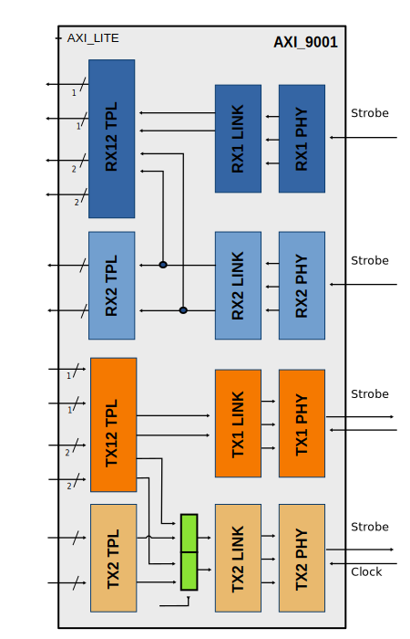
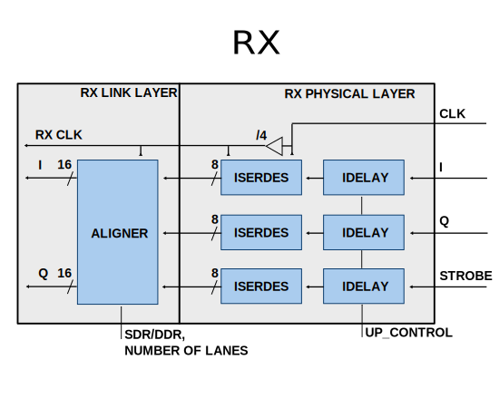
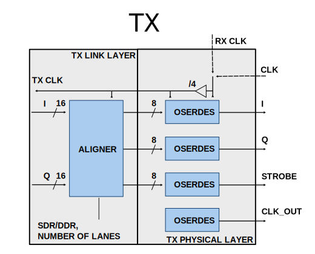

.. _axi_adrv9001:

AXI ADRV9001
================================================================================

.. hdl-component-diagram::

The :git-hdl:`AXI ADRV9001 <library/axi_adrv9001>` IP core
can be used to interface the ADRV9001 family like :adi:`ADRV9002` device.
This documentation only covers the IP core and requires that one must be
familiar with the device for a complete and better understanding.

More about the generic framework interfacing ADCs can be read in :ref:`axi_adc`,
and interfacing DACs in :ref:`axi_dac`.

Features
--------------------------------------------------------------------------------

* AXI Lite control/status interface
* PRBS monitoring
* Hardware and software DC filtering
* IQ correction
* Internal DDS
* Programmable line delays
* Receive and transmit loop back
* Supports both Altera and AMD Xilinx devices

Block Diagram
--------------------------------------------------------------------------------

Functional Description
--------------------------------------------------------------------------------

The axi_adrv9001 cores architecture contains:

* :git-hdl:`Wrapper <library/axi_adrv9001/axi_adrv9001.v>` module

  * :git-hdl:`Interface <library/axi_adrv9001/axi_adrv9001_if.v>` module

    * :git-hdl:`Receive PHY <library/adrv9001/adrv9001_rx.v>` receive CMOS or LVDS if.
    * :git-hdl:`Receive Link <library/adrv9001/adrv9001_rx_link.v>` receive link layer.
    * :git-hdl:`Transmit PHY <library/adrv9001/adrv9001_tx.v>` transmit CMOS or LVDS if.
    * :git-hdl:`Transmit Link <library/adrv9001/adrv9001_tx_link.v>` transmit link layer.

  * :git-hdl:`TPL (core) <library/axi_adrv9001/axi_adrv9001_core>` module, which contains:

    * :git-hdl:`Receive <library/axi_adrv9001/axi_adrv9001_rx.v>` module, which contains:

      * :git-hdl:`ADC channel processing <library/axi_adrv9001/axi_adrv9001_rx_channel.v>` modules, one for each channel

        * data processing modules (
          :git-hdl:`DC Filter <library/xilinx/common/ad_dcfilter.v>`,
          :git-hdl:`IQ Correction <library/common/ad_iqcor.v>` and
          :git-hdl:`Data Format Control <library/common/ad_datafmt.v>`)
        * :git-hdl:`ADC PN Monitor <library/common/ad_pnmon.v>` for interface validation
        * :git-hdl:`ADC Channel register map <library/common/up_adc_channel.v>`

      * :git-hdl:`Delay Control <library/common/up_delay_cntrl.v>`
      * :git-hdl:`ADC Common register map <library/common/up_adc_common.v>`

    * :git-hdl:`Transmit <library/axi_adrv9001/axi_adrv9001_tx.v>` module, which contains:

      * :git-hdl:`DAC channel processing <library/axi_adrv9001/axi_adrv9001_tx_channel.v>`
        modules, one for each channel

        * Different data generators (:git-hdl:`DDS <library/common/ad_dds.v>`, ramp pattern)
        * :git-hdl:`IQ Correction <library/common/ad_iqcor.v>`
        * :git-hdl:`ADC PN Generator <library/common/ad_pngen.v>` for interface validation
        * :git-hdl:`DAC Channel register map <library/common/up_dac_channel.v>`

      * :git-hdl:`Delay Control <library/common/up_delay_cntrl.v>`
      * :git-hdl:`DAC Common register map <library/common/up_dac_common.v>`

    * :git-hdl:`TDD control module <library/axi_adrv9001/axi_adrv9001_tdd.v>`

  * :git-hdl:`AXI control and status <common/up_axi.v>` modules.

Physical Interface
~~~~~~~~~~~~~~~~~~~~~~~~~~~~~~~~~~~~~~~~~~~~~~~~~~~~~~~~~~~~~~~~~~~~~~~~~~~~~~~

The following operation modes are supported by the physical layer.
CMOS (CSSI) and LVDS (LSSI) selection is done through synthesis parameter.
Other parameter (column B, G, H) can be run time modified preferably while
the core is in reset.

+-------------------+---+----+--------+--------+-------+-----+---+
| A                 | B | C  | D      | E      | F     | G   | H |
+===================+===+====+========+========+=======+=====+===+
| CSSI 1=lane       | 1 | 32 | 80     | 80     | 2.5   | SDR | 8 |
+-------------------+---+----+--------+--------+-------+-----+---+
| CSSI 1-lane       | 1 | 32 | 160    | 80     | 5     | DDR | 4 |
+-------------------+---+----+--------+--------+-------+-----+---+
| CSSI 1-lane*      | 1 | 16 | 80     | 80     | -     | SDR | 4 |
+-------------------+---+----+--------+--------+-------+-----+---+
| CSSI 1-lane [1]_  | 1 | 16 | 160    | 80     | -     | DDR | 2 |
+-------------------+---+----+--------+--------+-------+-----+---+
| CSSI 1-lane [2]_  | 1 | 8  | 80     | 80     | -     | SDR | 2 |
+-------------------+---+----+--------+--------+-------+-----+---+
| CSSI 1-lane [2]_  | 1 | 8  | 160    | 80     | -     | DDR | 1 |
+-------------------+---+----+--------+--------+-------+-----+---+
| CSSI 4-lane       | 4 | 8  | 80     | 80     | 10    | SDR | 2 |
+-------------------+---+----+--------+--------+-------+-----+---+
| CSSI 4-lane       | 4 | 8  | 160    | 80     | 20    | DDR | 1 |
+-------------------+---+----+--------+--------+-------+-----+---+
| LSSI 1-lane       | 1 | 32 | 983.04 | 491.52 | 30.72 | DDR | 4 |
+-------------------+---+----+--------+--------+-------+-----+---+
| LSSI 2-lane       | 2 | 16 | 983.04 | 491.52 | 61.44 | DDR | 2 |
+-------------------+---+----+--------+--------+-------+-----+---+

.. [1] ADRV9001 data port transmit/receive 16-bit data symbols
.. [2] ADRV9001 data port transmit/receive 8-bit data symbols.
   In case of 8-bit and 2-bit data symbols we'll use aligned MSBs.

Columns description:

  - A - SSI Modes
  - B - Data Lanes Per Channel
  - C - Serialization factor Per data lane
  - D - Max data lane rate(MHz)
  - E - Max Clock rate (MHz)
  - F - Max Sample Rate for I/Q (MHz)
  - G - Data Type
  - H - User Interface Clock to Sample Clock ratio (aka DDS Rate) for Xilinx devices

The following equations apply:

.. math::
   f_{sclk} = \frac{f_{clk}}{((div + 1) * 2)}

.. math::
   MaxDataLaneRate = \frac{MaxSampleRateForIQ*16*2}{DataLanesPerChannel}

.. math::
   MaxClockRate = \frac{MaxDataLaneRate} {1+(DataType = DDR)}

.. math::
   UserInterfaceClock = \frac{MaxClockRate} {InternalDivider}

.. math::
   UserInterfaceClock = \frac{MaxSampleRateForIQ*32}{DataLanesPerChannel*(1+(DataType = DDR))*InternalDivider}

.. math::
   DDS rate = \frac{32} {DataLanesPerChannel*(1+(DataType = DDR))*InternalDivider}

Where :
  * **MaxDataLaneRate** - number of bits transferred in a second per active lane
  * **MaxClockRate** - represents the source synchronous interface clock frequency
  * **UserInterfaceClock** - represents the frequency of the clock the user
    interface logic is connected
  * **InternalDivider**  - represents the division factor the source synchronous
    interface clock is divided to get the user interface clock. This is
    implementation specific. **Xilinx CMOS and LVDS = 4;   Intel CMOS = 1**

Since the **UserInterfaceClock** is an integer multiple (column H) of the
**MaxSampleRateForIQ** the interface toward the user logic has a valid
qualifier which is not active on every clock cycle.

Requirements
--------------------------------------------------------------------------------

Rx1 clock and Rx2 clock should be length matched
Clock and data in SSI interface must be length matched

Xilinx Physical interface
--------------------------------------------------------------------------------

RX Component mode
~~~~~~~~~~~~~~~~~~~~~~~~~~~~~~~~~~~~~~~~~~~~~~~~~~~~~~~~~~~~~~~~~~~~~~~~~~~~~~~~

For Rx interfaces the source synchronous associated clock is used to sample the input data. Software configuration is required described in :ref:`config_adc_common_if` section. Input delays of the FPGA or output delays of the ADRV9001 can be tuned by software for optimize sampling.

TX Using dedicated clock
~~~~~~~~~~~~~~~~~~~~~~~~~~~~~~~~~~~~~~~~~~~~~~~~~~~~~~~~~~~~~~~~~~~~~~~~~~~~~~~~

For Tx interfaces the clock received from the transceiver is used to drive the output data. Software configuration is required for clock rate selection described in :ref:`config_dac_common_if` section. Input delays of the ADRV9001 can be tuned by software for optimize sampling.

.. _config_dac_common_if:

Configure DAC common interface
~~~~~~~~~~~~~~~~~~~~~~~~~~~~~~~~~~~~~~~~~~~~~~~~~~~~~~~~~~~~~~~~~~~~~~~~~~~~~~~~

Register **0x0048 REG_CNTRL_2**

| [12:8] - NUM_LANES (new) - number of active lanes (1 : CSSI 1-lane, LSSI 1-lane, 2 : LSSI 2-lane, 4 : CSSI 4-lane)
| [14] - SYMB_8_16B (new) - select number of bits for symbol format mode (1 represents 8b, 0 represents 16b)
| [15] - SYMB_OP (new) - select symbol data format mode
| [16] - SDR_DDR_N (new) - interface type (1 represents SDR, 0 represents DDR)

Register **0x04c REG_RATECNTRL**

[7:0] RATE - must be set according to column H of the table

.. _config_adc_common_if:

Configure ADC common interface
~~~~~~~~~~~~~~~~~~~~~~~~~~~~~~~~~~~~~~~~~~~~~~~~~~~~~~~~~~~~~~~~~~~~~~~~~~~~~~~~

Register **0x0044 REG_CNTRL**

| [12:8] - NUM_LANES (new) - number of active lanes (1 : CSSI 1-lane, LSSI 1-lane, 2 : LSSI 2-lane, 4 : CSSI 4-lane)
| [14] - SYMB_8_16B (new) - select number of bits for symbol format mode (1 represents 8b, 0 represents 16b)
| [15] - SYMB_OP (new) - select symbol data format mode
| [16] - SDR_DDR_N (new) - interface type ( 1 represents SDR, 0 represents DDR)

Configuration Parameters
--------------------------------------------------------------------------------

.. hdl-parameters::

   * - ID
     - Core ID should be unique for each IP in the system
   * - CMOS_LVDS_N
     - Defines the physical interface type, set 1 for CMOS and 0 for LVDS
   * - TDD_DISABLE
     - Setting this parameter the TDD control will not be implemented in the
       core.
   * - DDS_DISABLE
     - If resource utilization is a concern, by setting this parameter you can
       remove the dual tone DDS logic from the Tx channels. This will reduce
       resource utilization significantly but loosing the ability to generate
       a test tone.
   * - INDEPENDENT_1R1T_SUPPORT
     - 0 - Rx2 (adc_2_*) and Tx2 (dac_2_*) data channels will be disabled; RX2 TPL, TX2 TPL cores are disabled.
     | 1 - Allows independent control of Rx2/Tx2 PHY either from Rx12/Tx12 TPL or Rx2/Tx2 TPL blocks;
   * - COMMON_2R2T_SUPPORT
     -  0 - puts the Rx12/Tx12 TPL in R1_MODE, having access only to Rx1/Tx1 PHYs;
     |  1 - Allows Rx12/Tx12 TPL to operate in 2R 2T mode having control over Rx2/Tx2 PHY
   * - DISABLE_RX1_SSI
     - Setting this parameter you will disables RX1 interface, PHY Link and TPL.
   * - DISABLE_RX2_SSI
     - Setting this parameter you will disables RX2 interface, PHY Link and TPL.
   * - DISABLE_TX1_SSI
     - Setting this parameter you will disables TX1 interface, PHY Link and TPL.
   * - DISABLE_TX2_SSI
     - Setting this parameter you will disables TX2 interface, PHY Link and TPL.
   * - RX_USE_BUFG
     - Used in case of Xilinx 7 series devices; If set, will insert a global
       clock buffer on the Rx clock path. Useful if user logic does not fits
       in a clock region.
   * - TX_USE_BUFG
     - Used in case of Xilinx 7 series devices; If set, will insert a global
       clock buffer on the Tx clock path. Useful if user logic does not fits
       in a clock region.
   * - USE_RX_CLK_FOR_TX1
     - Select the clock to drive the TX1 SSI interface.
       | 0 = TX1 dedicated clock
       | 1 = RX1 SSI clock
       | 2 = RX2 SSI clock
   * - USE_RX_CLK_FOR_TX2
     - Select the clock to drive the TX2 SSI interface.
       | 0 = TX2 dedicated clock
       | 1 = RX1 SSI clock
       | 2 = RX2 SSI clock
   * - EXT_SYNC
     - DAC channel sync 1 = external or 0 = internal.
   * - IO_DELAY_GROUP
     - The delay group name which is set for the delay controller
   * - FPGA_TECHNOLOGY
     - Auto populated by IPI.
   * - FPGA_FAMILY
     - Auto populated by IPI.
   * - SPEED_GRADE
     - Auto populated by IPI.
   * - DEV_PACKAGE
     - Auto populated by IPI.

Interface
--------------------------------------------------------------------------------

  // physical interface

  input                   rx2_dclk_in_n_NC,
  input                   rx2_dclk_in_p_dclk_in,
  input                   rx2_idata_in_n_idata0,
  input                   rx2_idata_in_p_idata1,
  input                   rx2_qdata_in_n_qdata2,
  input                   rx2_qdata_in_p_qdata3,
  input                   rx2_strobe_in_n_NC,
  input                   rx2_strobe_in_p_strobe_in,

  output                  tx1_dclk_out_n_NC,
  output                  tx1_dclk_out_p_dclk_out,
  input                   tx1_dclk_in_n_NC,
  input                   tx1_dclk_in_p_dclk_in,
  output                  tx1_idata_out_n_idata0,
  output                  tx1_idata_out_p_idata1,
  output                  tx1_qdata_out_n_qdata2,
  output                  tx1_qdata_out_p_qdata3,
  output                  tx1_strobe_out_n_NC,
  output                  tx1_strobe_out_p_strobe_out,

  output                  tx2_dclk_out_n_NC,
  output                  tx2_dclk_out_p_dclk_out,
  input                   tx2_dclk_in_n_NC,
  input                   tx2_dclk_in_p_dclk_in,
  output                  tx2_idata_out_n_idata0,
  output                  tx2_idata_out_p_idata1,
  output                  tx2_qdata_out_n_qdata2,
  output                  tx2_qdata_out_p_qdata3,
  output                  tx2_strobe_out_n_NC,
  output                  tx2_strobe_out_p_strobe_out,

  output                  rx1_enable,
  output                  rx2_enable,
  output                  tx1_enable,
  output                  tx2_enable,

  input                   delay_clk,

  // user interface

  output                  adc_1_clk,
  output                  adc_1_rst,

  output                  adc_1_valid_i0,
  output                  adc_1_enable_i0,
  output      [15:0]      adc_1_data_i0,
  output                  adc_1_valid_q0,
  output                  adc_1_enable_q0,
  output      [15:0]      adc_1_data_q0,
  output                  adc_1_valid_i1,
  output                  adc_1_enable_i1,
  output      [15:0]      adc_1_data_i1,
  output                  adc_1_valid_q1,
  output                  adc_1_enable_q1,
  output      [15:0]      adc_1_data_q1,
  input                   adc_1_dovf,

  output                  adc_2_clk,
  output                  adc_2_rst,
  output                  adc_2_valid_i0,
  output                  adc_2_enable_i0,
  output      [15:0]      adc_2_data_i0,
  output                  adc_2_valid_q0,
  output                  adc_2_enable_q0,
  output      [15:0]      adc_2_data_q0,
  input                   adc_2_dovf,

  output                  dac_1_clk,
  output                  dac_1_rst,
  output                  dac_1_valid_i0,
  output                  dac_1_enable_i0,
  input       [15:0]      dac_1_data_i0,
  output                  dac_1_valid_q0,
  output                  dac_1_enable_q0,
  input       [15:0]      dac_1_data_q0,
  output                  dac_1_valid_i1,
  output                  dac_1_enable_i1,
  input       [15:0]      dac_1_data_i1,
  output                  dac_1_valid_q1,
  output                  dac_1_enable_q1,
  input       [15:0]      dac_1_data_q1,
  input                   dac_1_dunf,

  output                  dac_2_clk,
  output                  dac_2_rst,
  output                  dac_2_valid_i0,
  output                  dac_2_enable_i0,
  input       [15:0]      dac_2_data_i0,
  output                  dac_2_valid_q0,
  output                  dac_2_enable_q0,
  input       [15:0]      dac_2_data_q0,
  input                   dac_2_dunf,

  // TDD interface
  input                   tdd_sync,
  output                  tdd_sync_cntr,

  input                   gpio_rx1_enable_in,
  input                   gpio_rx2_enable_in,
  input                   gpio_tx1_enable_in,
  input                   gpio_tx2_enable_in,

.. hdl-interfaces::

   * - rx*_idata_in_n_idata0,
     - CMOS or LVDS input clock P
   * - rx*_idata_in_p_idata1,
   * - rx*_qdata_in_n_qdata2,
   * - rx*_qdata_in_p_qdata3,
   * - rx*_strobe_in_n_NC,
   * - rx*_strobe_in_p_strobe_in,
     -
   * - rx*_dclk_in_p_dclk_in
     - CMOS or LVDS input clock P
   * - rx*_dclk_in_n_NC
     - CMOS - NC or LVDS input clock N
   * - tdd_sync
     - SYNC input for frame synchronization in TDD mode
   * - tdd_sync_cntr
     - SYNC output for frame synchronization in TDD mode
   * - delay_clk
     - Delay clock input for IO_DELAY control, 200 MHz (7 series) or 300 MHz
       (Ultrascale)
   * - dac_sync_in
     - Synchronization signal of the transmit path for slave devices (ID>0)
   * - dac_sync_out
     - Synchronization signal of the transmit path for master device (ID==0)
   * - adc_*_rst
     - Channel reset signal
   * - adc_*_enable_q*
     - If set, the channel is enabled (one for each channel)
   * - adc_enable_i*
     - If set, the channel is enabled (one for each channel)
   * - adc_valid_q*
     - Indicates valid data at the current channel (one for each channel)
   * - adc_valid_i*
     - Indicates valid data at the current channel (one for each channel)
   * - adc_data_q*
     - Received data output (one for each channel)
   * - adc_data_i*
     - Received data output (one for each channel)
   * - adc_dovf
     - Data overflow, must be connected to the DMA
   * - adc_r1_mode
     - If set, core is functioning in single channel mode (one I/Q pair)
   * - dac_enable_q*
     - If set, the channel is enabled (one for each channel)
   * - dac_enable_i*
     - If set, the channel is enabled (one for each channel)
   * - dac_valid_q*
     - Indicates valid data request at the current channel (one for each
       channel)
   * - dac_valid_i*
     - Indicates valid data request at the current channel (one for each
       channel)
   * - dac_data_q*
     - Transmitted data output (one for each channel)
   * - dac_data_i*
     - Transmitted data output (one for each channel)
   * - dac_dunf
     - Data underflow, must be connected to the DMA
   * - dac_r1_mode
     - If set, core is functioning in single channel mode (one I/Q pair)
   * - up_enable
     - GPI control of the ENABLE line in TDD mode, when HDL TDD control is
       DISABLED
   * - up_txnrx
     - GPI control of the TXNRX line in TDD mode, when HDL TDD control is
       DISABLED
   * - up_dac_gpio_in
     - GPI ports connected to the AXI memory map for custom use
   * - up_dac_gpio_out
     - GPI ports connected to the AXI memory map for custom use
   * - up_adc_gpio_in
     - GPI ports connected to the AXI memory map for custom use
   * - up_adc_gpio_out
     - GPO ports connected to the AXI memory map for custom use
   * - s_axi
     - Standard AXI Slave Memory Map interface

Register Map
--------------------------------------------------------------------------------

The register map of the core contains instances of several generic register maps
like ADC common, ADC channel, DAC common, DAC channel etc. The following table
presents the base addresses of each instance, after that can be found the
detailed description of each generic register map. The absolute address of a
register should be calculated by adding the instance base address to the
registers relative address.

.. list-table:: Register Map base addresses for axi_adrv9001
   :header-rows: 1

   * - DWORD
     - BYTE
     - Name
     - Description
   * - 0x0000
     - 0x0000
     - RX1 BASE
     - See the `RX1 Base <#hdl-regmap-COMMON>`__ table for more details.
   * - 0x0000
     - 0x0000
     - RX1 COMMON
     - See the `ADC Common <#hdl-regmap-ADC_COMMON>`__ table for more details.
   * - 0x0000
     - 0x0000
     - RX1 CHANNELS
     - See the `ADC Channel <#hdl-regmap-ADC_CHANNEL>`__ table for more details.
   * - 0x0200
     - 0x0800
     - RX1 DELAY CONTROL
     - See the `IO Delay Control <#hdl-regmap-IO_DELAY_CNTRL>`__ table for more details.
   * - 0x0400
     - 0x1000
     - RX2 BASE
     - See the `RX2 Base <#hdl-regmap-COMMON>`__ table for more details.
   * - 0x0400
     - 0x1000
     - RX2 COMMON
     - See the `ADC Common <#hdl-regmap-ADC_COMMON>`__ table for more details.
   * - 0x0400
     - 0x1000
     - RX2 CHANNELS
     - See the `ADC Channel <#hdl-regmap-ADC_CHANNEL>`__ table for more details.
   * - 0x0600
     - 0x1800
     - RX1 DELAY CONTROL
     - See the `IO Delay Control <#hdl-regmap-IO_DELAY_CNTRL>`__ table for more details.
   * - 0x0800
     - 0x2000
     - TX1 COMMON
     - See the `DAC Common <#hdl-regmap-DAC_COMMON>`__ table for more details.
   * - 0x0800
     - 0x2000
     - TX1 CHANNELS
     - See the `DAC Channel <#hdl-regmap-DAC_CHANNEL>`__ table for more details.
   * - 0x2000
     - 0x8000
     - TX2 COMMON
     - See the `DAC Common <#hdl-regmap-DAC_COMMON>`__ table for more details.
   * - 0x1200
     - 0x4800
     - TX2 CHANNELS
     - See the `DAC Channel <#hdl-regmap-DAC_CHANNEL>`__ table for more details.
   * - 0x1200
     - 0x4800
     - TDD1 CONTROL
     - See the `Transceiver TDD1 Control <#hdl-regmap-TDD_CNTRL>`__ table for more details.
   * - 0x1300
     - 0x4C00
     - TDD2 CONTROL
     - See the `Transceiver TDD2 Control <#hdl-regmap-TDD_CNTRL>`__ table for more details.

.. hdl-regmap::
   :name: AXI_ADRV9001_COMMON
   :no-type-info:

.. hdl-regmap::
   :name: AXI_ADRV9001_ADC_COMMON
   :no-type-info:

.. hdl-regmap::
   :name: AXI_ADRV9001_ADC_CHANNEL
   :no-type-info:

.. hdl-regmap::
   :name: IO_DELAY_CNTRL
   :no-type-info:

.. hdl-regmap::
   :name: AXI_ADRV9001_DAC_COMMON
   :no-type-info:

.. hdl-regmap::
   :name: AXI_ADRV9001_DAC_CHANNEL
   :no-type-info:

.. hdl-regmap::
   :name: TDD_CNTRL
   :no-type-info:

More information
-------------------------------------------------------------------------------

* :dokuwiki:`ADRV9001/2 Quick Start Guides <resources/eval/user-guides/adrv9002/quickstart>`
   * :dokuwiki:`ADRV9002 Zynq UltraScale+ MPSoC ZCU102 Quick Start Guide <resources/eval/user-guides/adrv9002/quickstart/zynqmp>`
   * :dokuwiki:`ADRV9002 Zynq SoC ZC706 Quick Start Guide <resources/eval/user-guides/adrv9002/quickstart/zynq>`
   * :dokuwiki:`ADRV9002 Zynq Zed Board Quick Start Guide <resources/eval/user-guides/adrv9002/quickstart/zed>`
   * :dokuwiki:`ADRV9002 Arria10 SoC Quick Start Guide <resources/eval/user-guides/adrv9002/quickstart/a10soc>`
* :dokuwiki:`ADRV9001/ADRV9002 HDL Reference Design <resources/eval/user-guides/adrv9002/reference_hdl>`
   * :dokuwiki:`Building HDL how-to, ADI Reference Designs HDL User Guide <resources/fpga/docs/hdl>`
* :dokuwiki:`ADRV9002 Device Driver Customization <resources/tools-software/linux-drivers/iio-transceiver/adrv9002-customization>`
* :dokuwiki:`ADRV9002 Integrated Dual RF Transceiver Linux device driver <resources/tools-software/linux-drivers/iio-transceiver/adrv9002>`

References
-------------------------------------------------------------------------------

* :git-hdl:`library/axi_adrv9001`
* :adi:`ADRV9001`
* :git-linux:`/`
* :git-no-OS:`no-OS/projects/adrv9001`
* :adi:`ADRV9001 User Guide <media/en/technical-documentation/user-guides/ADRV9001_Reference_Manual_UG-570.pdf>`
* :xilinx:`Zynq-7000 SoC Overview <support/documentation/data_sheets/ds190-Zynq-7000-Overview.pdf>`
* :xilinx:`Zynq-7000 SoC Packaging and Pinout <support/documentation/user_guides/ug865-Zynq-7000-Pkg-Pinout.pdf>`

