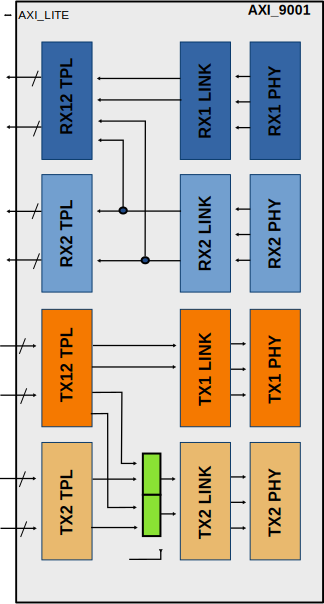
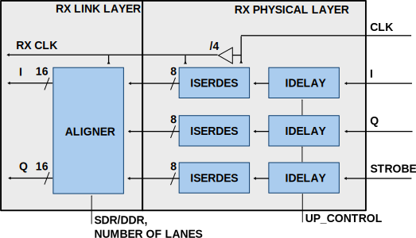

.. _axi_adrv9001:

AXI ADRV9001
================================================================================

.. hdl-component-diagram::

The :git-hdl:`AXI ADRV9001 <library/axi_adrv9001>` IP Core can be used to
interface the ADRV9001 family, meaning:

- :adi:`ADRV9002`
- :adi:`ADRV9003`
- :adi:`ADRV9004`
- :adi:`ADRV9005`
- :adi:`ADRV9006`

This documentation only covers the IP core and requires that one must be
familiar with the device for a complete and better understanding.

More about the generic framework interfacing ADCs that contains the
:git-hdl:`up_adc_channel <library/up_adc_channel.v>` and
:git-hdl:`up_adc_common <library/up_adc_common.v>` modules can be read in
:ref:`axi_adc`. Regarding the DAC, more information related to its generic
framework can be found at :ref:`axi_dac`.

Features
--------------------------------------------------------------------------------

- AXI-based configuration
- Supports both Altera and AMD Xilinx devices
- LVDS and CMOS synchronous data interface options
- PRBS monitoring
- DC filtering
- IQ correction
- Programmable line delays (AMD)
- Receive and transmit loop backs
- Internal DDS
- DAC selectable input source: DDS/DMA/ADC/TEST_RAMP

Files
--------------------------------------------------------------------------------

.. list-table::
   :header-rows: 1

   * - Name
     - Description
   * - :git-hdl:`library/axi_adrv9001/adrv9001_aligner4.v`
     - Verilog source for 4-port aligner.
   * - :git-hdl:`library/axi_adrv9001/adrv9001_aligner8.v`
     - Verilog source for 8-port aligner.
   * - :git-hdl:`library/axi_adrv9001/adrv9001_pack.v`
     - Verilog source packing two input beats into one.
   * - :git-hdl:`library/axi_adrv9001/adrv9001_rx_link.v`
     - Verilog source for the RX Link.
   * - :git-hdl:`library/axi_adrv9001/adrv9001_rx.v`
     - Verilog source for the RX Serdes Interface.
   * - :git-hdl:`library/axi_adrv9001/adrv9001_tx_link.v`
     - Verilog source for the TX Link.
   * - :git-hdl:`library/axi_adrv9001/adrv9001_tx.v`
     - Verilog source for the TX Serdes Interface.
   * - :git-hdl:`library/axi_adrv9001/axi_adrv9001_core.v`
     - Verilog source for the AXI ADRV9001 core.
   * - :git-hdl:`library/axi_adrv9001/axi_adrv9001_if.v`
     - Verilog source for the ADRV9001 interface module.
   * - :git-hdl:`library/axi_adrv9001/axi_adrv9001_rx_channel.v`
     - Verilog source for the ADRV9001 RX channel.
   * - :git-hdl:`library/axi_adrv9001/axi_adrv9001_rx.v`
     - Verilog source for the AXI ADRV9001 RX Interface.
   * - :git-hdl:`library/axi_adrv9001/axi_adrv9001_tdd.v`
     - Verilog source for the Transceiver TDD Control.
   * - :git-hdl:`library/axi_adrv9001/axi_adrv9001_tx_channel.v`
     -  Verilog source for the ADRV9001 TX channel.
   * - :git-hdl:`library/axi_adrv9001/axi_adrv9001_tx.v`
     - Verilog source for the AXI ADRV9001 TX Interface.
   * - :git-hdl:`library/axi_adrv9001/axi_adrv9001.v`
     - Verilog source for the AXI ADRV9001.
   * - :git-hdl:`library/axi_adrv9001/axi_adrv9001_ip.tcl`
     - TCL script to generate the Vivado IP-integrator project.

Block diagram
--------------------------------------------------------------------------------

Functional Description
--------------------------------------------------------------------------------

The :git-hdl:`axi_adrv9001 <library/axi_adrv9001>` core's architecture contains:

- :git-hdl:`Wrapper <library/axi_adrv9001/axi_adrv9001.v>` top module

  - :git-hdl:`Interface <library/axi_adrv9001/axi_adrv9001_if.v>` module

    - :git-hdl:`Receive PHY <library/adrv9001/adrv9001_rx.v>` (CMOS or LVDS interface)
    - :git-hdl:`Receive Link Layer<library/adrv9001/adrv9001_rx_link.v>`
    - :git-hdl:`Transmit PHY <library/adrv9001/adrv9001_tx.v>` (CMOS or LVDS interface)
    - :git-hdl:`Transmit Link Layer <library/adrv9001/adrv9001_tx_link.v>`

  - :git-hdl:`TPL (core) <library/axi_adrv9001/axi_adrv9001_core>`, containing:

    - :git-hdl:`Receive <library/axi_adrv9001/axi_adrv9001_rx.v>` - common receive module, containing:

      - :git-hdl:`ADC channel processing <library/axi_adrv9001/axi_adrv9001_rx_channel.v>` - RX channel modules, one for each channel

        - data processing modules (
          :git-hdl:`DC Filter <library/xilinx/common/ad_dcfilter.v>`,
          :git-hdl:`IQ Correction <library/common/ad_iqcor.v>` and
          :git-hdl:`Data Format Control <library/common/ad_datafmt.v>`)
        - :git-hdl:`ADC PN Monitor <library/common/ad_pnmon.v>` for interface validation
        - :git-hdl:`ADC Channel register map <library/common/up_adc_channel.v>`

      - :git-hdl:`Delay Control <library/common/up_delay_cntrl.v>`
      - :git-hdl:`ADC Common register map <library/common/up_adc_common.v>`

    - :git-hdl:`Transmit <library/axi_adrv9001/axi_adrv9001_tx.v>` module, containing:

      - :git-hdl:`DAC channel processing <library/axi_adrv9001/axi_adrv9001_tx_channel.v>`
        modules, one for each channel

        - Different data generators (:git-hdl:`DDS <library/common/ad_dds.v>`, ramp pattern)
        - :git-hdl:`IQ Correction <library/common/ad_iqcor.v>`
        - :git-hdl:`ADC PN Generator <library/common/ad_pngen.v>` for interface validation
        - :git-hdl:`DAC Channel register map <library/common/up_dac_channel.v>`

      - :git-hdl:`Delay Control <library/common/up_delay_cntrl.v>`
      - :git-hdl:`DAC Common register map <library/common/up_dac_common.v>`

    - :git-hdl:`TDD control module <library/axi_adrv9001/axi_adrv9001_tdd.v>`

  - :git-hdl:`AXI control and status <common/up_axi.v>` modules.

Physical Interface
~~~~~~~~~~~~~~~~~~~~~~~~~~~~~~~~~~~~~~~~~~~~~~~~~~~~~~~~~~~~~~~~~~~~~~~~~~~~~~~

The following operation modes are supported by the physical layer (PHY).
CMOS (CSSI) and LVDS (LSSI) selection is done through a synthesis parameter.
Other parameters (column B, G, H) can be modified at run time, preferably while
the core is in reset.

+-------------------+---+----+--------+--------+-------+-----+---+
| A                 | B | C  | D      | E      | F     | G   | H |
+===================+===+====+========+========+=======+=====+===+
| CSSI 1-lane       | 1 | 32 | 80     | 80     | 2.5   | SDR | 8 |
+-------------------+---+----+--------+--------+-------+-----+---+
| CSSI 1-lane       | 1 | 32 | 160    | 80     | 5     | DDR | 4 |
+-------------------+---+----+--------+--------+-------+-----+---+
| CSSI 1-lane [1]_  | 1 | 16 | 80     | 80     | ---   | SDR | 4 |
+-------------------+---+----+--------+--------+-------+-----+---+
| CSSI 1-lane [1]_  | 1 | 16 | 160    | 80     | ---   | DDR | 2 |
+-------------------+---+----+--------+--------+-------+-----+---+
| CSSI 1-lane [2]_  | 1 | 8  | 80     | 80     | ---   | SDR | 2 |
+-------------------+---+----+--------+--------+-------+-----+---+
| CSSI 1-lane [2]_  | 1 | 8  | 160    | 80     | ---   | DDR | 1 |
+-------------------+---+----+--------+--------+-------+-----+---+
| CSSI 4-lane       | 4 | 8  | 80     | 80     | 10    | SDR | 2 |
+-------------------+---+----+--------+--------+-------+-----+---+
| CSSI 4-lane       | 4 | 8  | 160    | 80     | 20    | DDR | 1 |
+-------------------+---+----+--------+--------+-------+-----+---+
| LSSI 1-lane       | 1 | 32 | 983.04 | 491.52 | 30.72 | DDR | 4 |
+-------------------+---+----+--------+--------+-------+-----+---+
| LSSI 2-lane       | 2 | 16 | 983.04 | 491.52 | 61.44 | DDR | 2 |
+-------------------+---+----+--------+--------+-------+-----+---+

.. [1] ADRV9001 data port transmit/receive 16-bit data symbols
.. [2] ADRV9001 data port transmit/receive 8-bit data symbols. In case of 8-bit and 2-bit data symbols we'll use aligned MSBs.

Columns description:

- A - SSI Modes
- B - Data Lanes Per Channel
- C - Serialization factor Per data lane
- D - Max data lane rate (MHz)
- E - Max Clock rate (MHz)
- F - Max Sample Rate for I/Q (MHz)
- G - Data Type
- H - User Interface Clock to Sample Clock ratio (aka DDS Rate) for Xilinx devices

The following equations apply:

.. math::

   MaxDataLaneRate = \frac{MaxSampleRateForIQ*16*2}{DataLanesPerChannel}

.. math::

   MaxClockRate = \frac{MaxDataLaneRate} {1+(DataType = DDR)}

.. math::

   UserInterfaceClock = \frac{MaxClockRate} {InternalDivider}

.. math::

   UserInterfaceClock = \frac{MaxSampleRateForIQ*32}{DataLanesPerChannel*(1+(DataType = DDR))*InternalDivider}

.. math::

   DDS rate = \frac{32} {DataLanesPerChannel*(1+(DataType = DDR))*InternalDivider}

Where:

- **MaxDataLaneRate** - number of bits transferred in a second per active lane
- **MaxClockRate** - the source-synchronous interface clock frequency
- **UserInterfaceClock** - the frequency of the clock the user interface logic
  is connected
- **InternalDivider** - the division factor with which the source-synchronous
  interface clock is divided, to get the user interface clock. This is
  implementation-specific. **Xilinx CMOS and LVDS = 4; Intel CMOS = 1**

Since the **UserInterfaceClock** (column H) is an integer multiple of the
**MaxSampleRateForIQ**, the interface towards the user logic has a valid
qualifier which is not active on every clock cycle.

Requirements
--------------------------------------------------------------------------------

- Rx1 clock and Rx2 clock should be length matched
- Clock and data in SSI interface must be length matched

Xilinx Physical interface
--------------------------------------------------------------------------------

RX Component mode
~~~~~~~~~~~~~~~~~~~~~~~~~~~~~~~~~~~~~~~~~~~~~~~~~~~~~~~~~~~~~~~~~~~~~~~~~~~~~~~~

For Rx interfaces, the source-synchronous associated clock is used to sample the
input data. Software configuration is required, which is described in
:ref:`axi_adrv9001 adc_config` section. Input delays of the FPGA or output
delays of the ADRV9001 can be tuned by software for optimized sampling.

TX Using dedicated clock
~~~~~~~~~~~~~~~~~~~~~~~~~~~~~~~~~~~~~~~~~~~~~~~~~~~~~~~~~~~~~~~~~~~~~~~~~~~~~~~~

For Tx interfaces, the clock received from the transceiver is used to drive the
output data. Software configuration is required for clock rate selection, which
is described in :ref:`axi_adrv9001 dac_config` section. Input delays of the
ADRV9001 can be tuned by software for optimized sampling.

.. image:: txcomponentmodephy.svg
   :width: 500

.. _axi_adrv9001 dac_config:

Configure DAC common interface
~~~~~~~~~~~~~~~~~~~~~~~~~~~~~~~~~~~~~~~~~~~~~~~~~~~~~~~~~~~~~~~~~~~~~~~~~~~~~~~~

Register **0x0048 REG_CNTRL_2**

- [12:8] - NUM_LANES (**new**) - number of active lanes (1 : CSSI 1-lane, LSSI
  1-lane, 2 : LSSI 2-lane, 4 : CSSI 4-lane)
- [14] - SYMB_8_16B (**new**) - select number of bits for symbol format mode (1
  represents 8b, 0 represents 16b)
- [15] - SYMB_OP (**new**) - select symbol data format mode
- [16] - SDR_DDR_N (**new**) - interface type (1 represents SDR, 0 represents
  DDR)

Register **0x04c REG_RATECNTRL**

- [7:0] RATE - must be set according to column H of the table

.. _axi_adrv9001 adc_config:

Configure ADC common interface
~~~~~~~~~~~~~~~~~~~~~~~~~~~~~~~~~~~~~~~~~~~~~~~~~~~~~~~~~~~~~~~~~~~~~~~~~~~~~~~~

Register **0x0044 REG_CNTRL**

- [12:8] - NUM_LANES (**new**) - number of active lanes (1 : CSSI 1-lane, LSSI
  1-lane, 2 : LSSI 2-lane, 4 : CSSI 4-lane)
- [14] - SYMB_8_16B (**new**) - select number of bits for symbol format mode (1
  represents 8b, 0 represents 16b)
- [15] - SYMB_OP (**new**) - select symbol data format mode
- [16] - SDR_DDR_N (**new**) - interface type ( 1 represents SDR, 0 represents
  DDR)

Configuration Parameters
--------------------------------------------------------------------------------

.. hdl-parameters::

   * - ID
     - Core ID should be unique for each IP in the system
   * - CMOS_LVDS_N
     - Defines the physical interface type, set 1 for CMOS and 0 for LVDS
   * - TDD_DISABLE
     - By setting this parameter, the TDD control will not be implemented in
       the core
   * - DDS_DISABLE
     - If resource utilization is a concern, by setting this parameter you can
       remove the dual tone DDS logic from the Tx channels. This will reduce
       resource utilization significantly, but will lose the ability to generate
       a test tone
   * - INDEPENDENT_1R1T_SUPPORT
     - 0 - Rx2 (adc_2_*) and Tx2 (dac_2_*) data channels will be disabled; RX2 TPL, TX2 TPL cores are disabled.
     | 1 - Allows independent control of Rx2/Tx2 PHY either from Rx12/Tx12 TPL or Rx2/Tx2 TPL blocks;
   * - COMMON_2R2T_SUPPORT
     -  0 - puts the Rx12/Tx12 TPL in R1_MODE, having access only to Rx1/Tx1 PHYs;
     |  1 - Allows Rx12/Tx12 TPL to operate in 2R 2T mode having control over Rx2/Tx2 PHY
   * - DISABLE_RX1_SSI
     - Setting this parameter disables RX1 interface, PHY Link and TPL
   * - DISABLE_RX2_SSI
     - Setting this parameter disables RX2 interface, PHY Link and TPL
   * - DISABLE_TX1_SSI
     - Setting this parameter disables TX1 interface, PHY Link and TPL
   * - DISABLE_TX2_SSI
     - Setting this parameter disables TX2 interface, PHY Link and TPL
   * - RX_USE_BUFG
     - Used in case of Xilinx 7 series devices; If set, will insert a global
       clock buffer on the Rx clock path. Useful if user logic does not fit
       in a clock region
   * - TX_USE_BUFG
     - Used in case of Xilinx 7 series devices; If set, will insert a global
       clock buffer on the Tx clock path. Useful if user logic does not fit
       in a clock region
   * - USE_RX_CLK_FOR_TX1
     - Select the clock to drive the TX1 SSI interface
       | 0 = TX1 dedicated clock
       | 1 = RX1 SSI clock
       | 2 = RX2 SSI clock
   * - USE_RX_CLK_FOR_TX2
     - Select the clock to drive the TX2 SSI interface
       | 0 = TX2 dedicated clock
       | 1 = RX1 SSI clock
       | 2 = RX2 SSI clock
   * - EXT_SYNC
     - DAC channel sync 1 = external or 0 = internal
   * - IO_DELAY_GROUP
     - The delay group name which is set for the delay controller
   * - FPGA_TECHNOLOGY
     - Auto populated by IPI
   * - FPGA_FAMILY
     - Auto populated by IPI
   * - SPEED_GRADE
     - Auto populated by IPI
   * - DEV_PACKAGE
     - Auto populated by IPI

Interface
--------------------------------------------------------------------------------

.. note::

   There are two ADC interfaces, composed of enable, valid, data and underflow
   signals. For simplicity, we will look only at the data part:

   - \* - adc_1_data_i0/adc_1_data_i1
   - \* - adc_2_data_i

.. hdl-interfaces::

   * - rx1_dclk_in_n_NC
     - rx1 CMOS - NC or LVDS - input clock N
   * - rx1_dclk_in_p_dclk_in
     - rx1 CMOS or LVDS - input clock P
   * - rx1_idata_in_n_idata0
     - rx1 CMOS - I data 0 or LVDS - I data N
   * - rx1_idata_in_p_idata1
     - rx1 CMOS - I data 1 or LVDS - I data P
   * - rx1_qdata_in_n_qdata2
     - rx1 CMOS - Q data 2 or LVDS - Q data N
   * - rx1_qdata_in_p_qdata3
     - rx1 CMOS - Q data 3 or LVDS - Q data P
   * - rx1_strobe_in_n_NC
     - rx1 CMOS - NC or LVDS - input strobe N
   * - rx1_strobe_in_p_strobe_in
     - rx1 CMOS - strobe or LVDS - input strobe P

   * - rx2_dclk_in_n_NC
     - rx2 CMOS - NC or LVDS - input clock N
   * - rx2_dclk_in_p_dclk_in
     - rx2 CMOS or LVDS - input clock P
   * - rx2_idata_in_n_idata0
     - rx2 CMOS - I data 0 or LVDS - I data N
   * - rx2_idata_in_p_idata1
     - rx2 CMOS - I data 1 or LVDS - I data P
   * - rx2_qdata_in_n_qdata2
     - rx2 CMOS - Q data 2 or LVDS - Q data N
   * - rx2_qdata_in_p_qdata3
     - rx2 CMOS - Q data 3 or LVDS - Q data P
   * - rx2_strobe_in_n_NC
     - rx2 CMOS - NC or LVDS - input strobe N
   * - rx2_strobe_in_p_strobe_in
     - rx2 CMOS - strobe or LVDS - input strobe P

   * - tx1_dclk_in_n_NC
     - tx1 CMOS - NC or LVDS - input clock N
   * - tx1_dclk_in_p_dclk_in
     - tx1 CMOS or LVDS - input clock P
   * - tx1_dclk_out_n_NC
     - tx1 CMOS - NC or LVDS - output clock N
   * - tx1_dclk_out_p_dclk_out
     - tx1 CMOS or LVDS - output clock P
   * - tx1_idata_out_n_idata0
     - tx1 CMOS - I data 0 or LVDS - I data N
   * - tx1_idata_out_p_idata1
     - tx1 CMOS - I data 1 or LVDS - I data P
   * - tx1_qdata_out_n_qdata2
     - tx1 CMOS - Q data 2 or LVDS - Q data N
   * - tx1_qdata_out_p_qdata3
     - tx1 CMOS - Q data 3 or LVDS - Q data P
   * - tx1_strobe_out_n_NC
     - tx1 CMOS - NC or LVDS - output strobe N
   * - tx1_strobe_out_p_strobe_out
     - tx1 CMOS - strobe or LVDS - output strobe P

   * - tx2_dclk_in_n_NC
     - tx2 CMOS - NC or LVDS - input clock N
   * - tx2_dclk_in_p_dclk_in
     - tx2 CMOS or LVDS - input clock P
   * - tx2_dclk_out_n_NC
     - tx2 CMOS - NC or LVDS - output clock N
   * - tx2_dclk_out_p_dclk_out
     - tx2 CMOS or LVDS - output clock P
   * - tx2_idata_out_n_idata0
     - tx2 CMOS - I data 0 or LVDS - I data N
   * - tx2_idata_out_p_idata1
     - tx2 CMOS - I data 1 or LVDS - I data P
   * - tx2_qdata_out_n_qdata2
     - tx2 CMOS - Q data 2 or LVDS - Q data N
   * - tx2_qdata_out_p_qdata3
     - tx2 CMOS - Q data 3 or LVDS - Q data P
   * - tx2_strobe_out_n_NC
     - tx2 CMOS - NC or LVDS - output strobe N
   * - tx2_strobe_out_p_strobe_out
     - tx2 CMOS - strobe or LVDS - output strobe P

   * - adc_1_rst
     - Channel reset signal
   * - adc_1_enable_i*
     - If set, the channel 0 or 1, I component is enabled
   * - adc_1_valid_i*
     - Indicates valid data at the channel 0 or 1, I component
   * - adc_1_data_i*
     - Received data output for channel 0 or 1, I component
   * - adc_1_enable_q*
     - If set, the channel 0 or 1, Q component is enabled
   * - adc_1_valid_q*
     - Indicates valid data at the channel 0 or 1, Q component
   * - adc_1_data_q*
     - Received data output for channel 0 or 1, Q component
   * - adc_1_dovf
     - Data overflow, signal comming from pack

   * - adc_2_rst
     - Channel reset signal
   * - adc_2_enable_i*
     - If set, the channel 1, I/Q component is enabled - used only if r1_mode is disabled
   * - adc_2_valid_i*
     - Indicates valid data at the channel 1, I/Q component - used only if r1_mode is disabled
   * - adc_2_data_i*
     - Received data output for channel 1, Q component - used only if r1_mode is disabled
   * - adc_2_enable_q*
     - If set, the channel 1, I/Q component is enabled - used only if r1_mode is disabled
   * - adc_2_valid_q*
     - Indicates valid data at the channel 1, I/Q component - used only if r1_mode is disabled
   * - adc_2_data_q*
     - Received data output for channel 1, Q component - used only if r1_mode is disabled
   * - adc_2_dovf
     - Data overflow, signal comming from pack

   * - dac_1_rst
     - Channel reset signal
   * - dac_1_enable_i*
     - If set, the channel 0, I component is enabled
   * - dac_1_valid_i*
     - Signals the DAC channel 0, I component, is ready to receive data
   * - dac_1_data_i*
     - Data input for channel 0, I component
   * - dac_1_enable_q*
     - If set, the channel 0, Q component is enabled
   * - dac_1_valid_q*
     - Signals the DAC channel 0, Q component, is ready to receive data
   * - dac_1_data_q*
     - Data input for channel 0, Q component
   * - dac_1_dunf
     - Data underflow, signal comming from upack

   * - dac_2_rst
     - Channel reset signal
   * - dac_2_enable_i*
     - If set, the channel 1, I/Q component is enabled - used only if r1_mode is disabled
   * - dac_2_valid_i*
     - Signals the DAC channel 1, I/Q component - is ready to receive data - used only if r1_mode is disabled
   * - dac_2_data_i*
     - Data input for channel 1, I/Q component - used only if r1_mode is disabled
   * - dac_2_enable_q*
     - If set, the channel 1, I/Q component is enabled - used only if r1_mode is disabled
   * - dac_2_valid_q*
     - Signals the DAC channel 1, I/Q component - is ready to receive data - used only if r1_mode is disabled
   * - dac_2_data_q*
     - Data input for channel 1, I/Q component - used only if r1_mode is disabled
   * - dac_2_dunf
     - Data underflow, signal comming from upack

   * - gpio_rx1_enable_in
     - input gpio rx1 enable
   * - gpio_rx2_enable_in
     - input gpio rx2 enable
   * - gpio_tx1_enable_in
     - input gpio tx1 enable
   * - gpio_tx2_enable_in
     - input gpio tx2 enable
   * - rx1_enable
     - out gpio rx1 enable pin
   * - rx2_enable
     - out gpio rx2 enable pin
   * - tx1_enable
     - out gpio tx1 enable pin
   * - tx2_enable
     - out gpio tx2 enable pin

   * - tdd_sync
     - SYNC input for frame synchronization in TDD mode
   * - tdd_sync_cntr
     - SYNC output for frame synchronization in TDD mode
   * - delay_clk
     - Delay clock input for IO_DELAY control, 200 MHz (7 series) or 300 MHz
       (Ultrascale)
   * - dac_sync_in
     - Synchronization signal of the transmit path for slave devices (ID>0)

   * - s_axi
     - Standard AXI Slave Memory Map interface

Register Map
--------------------------------------------------------------------------------

The register map of the core contains instances of several generic register maps
like ADC common, ADC channel, DAC common, DAC channel etc. The following table
presents the base addresses of each instance, after that can be found the
detailed description of each generic register map. The absolute address of a
register should be calculated by adding the instance base address to the
registers relative address.

Register Map base addresses for axi_adrv9001
--------------------------------------------------------------------------------

.. list-table::

   * - DWORD
     - BYTE
     - Name
     - Description
   * - 0x0000
     - 0x0000
     - RX1 COMMON
     - See the `ADC Common <#hdl-regmap-AXI_ADRV9001_ADC_COMMON>`__ table for more details
   * - 0x0000
     - 0x0000
     - RX1 CHANNELS
     - See the `ADC Channel <#hdl-regmap-AXI_ADRV9001_ADC_CHANNEL>`__ table for more details
   * - 0x0200
     - 0x0800
     - RX1 DELAY CONTROL
     - See the `IO Delay Control <#hdl-regmap-IO_DELAY_CNTRL>`__ table for more details
   * - 0x0400
     - 0x1000
     - RX2 COMMON
     - See the `ADC Common <#hdl-regmap-AXI_ADRV9001_ADC_COMMON>`__ table for more details
   * - 0x0400
     - 0x1000
     - RX2 CHANNELS
     - See the `ADC Channel <#hdl-regmap-AXI_ADRV9001_ADC_CHANNEL>`__ table for more details
   * - 0x0600
     - 0x1800
     - RX2 DELAY CONTROL
     - See the `IO Delay Control <#hdl-regmap-IO_DELAY_CNTRL>`__ table for more details
   * - 0x0800
     - 0x2000
     - TX1 COMMON
     - See the `DAC Common <#hdl-regmap-AXI_ADRV9001_DAC_COMMON>`__ table for more details
   * - 0x0800
     - 0x2000
     - TX1 CHANNELS
     - See the `DAC Channel <#hdl-regmap-AXI_ADRV9001_DAC_CHANNEL>`__ table for more details
   * - 0x1000
     - 0x4000
     - TX2 COMMON
     - See the `DAC Common <#hdl-regmap-AXI_ADRV9001_DAC_COMMON>`__ table for more details
   * - 0x1000
     - 0x4000
     - TX2 CHANNELS
     - See the `DAC Channel <#hdl-regmap-AXI_ADRV9001_DAC_CHANNEL>`__ table for more details
   * - 0x1200
     - 0x4800
     - TDD1 CONTROL
     - See the `Transceiver TDD1 Control <#hdl-regmap-TDD_CNTRL>`__ table for more details
   * - 0x1300
     - 0x4C00
     - TDD2 CONTROL
     - See the `Transceiver TDD2 Control <#hdl-regmap-TDD_CNTRL>`__ table for more details

.. hdl-regmap::
   :name: AXI_ADRV9001_ADC_COMMON
   :no-type-info:

.. hdl-regmap::
   :name: AXI_ADRV9001_ADC_CHANNEL
   :no-type-info:

.. hdl-regmap::
   :name: IO_DELAY_CNTRL
   :no-type-info:

.. hdl-regmap::
   :name: AXI_ADRV9001_DAC_COMMON
   :no-type-info:

.. hdl-regmap::
   :name: AXI_ADRV9001_DAC_CHANNEL
   :no-type-info:

.. hdl-regmap::
   :name: TDD_CNTRL
   :no-type-info:

References
--------------------------------------------------------------------------------

- HDL IP core at :git-hdl:`library/axi_adrv9001`
- HDL project at :git-hdl:`projects/adrv9001`
- HDL project documentation at :ref:`adrv9001`
- :adi:`ADRV9001/ADRV9002 <ADRV9002>`
- No-OS driver at :git-no-os:`drivers/rf-transceiver/navassa/devices/adrv9001`
- Linux driver at :git-linux:`drivers/iio/adc/navassa`
