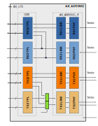
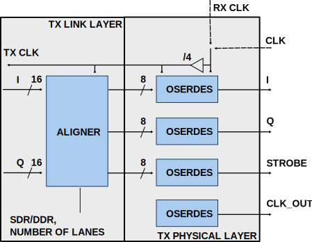

.. _axi_adrv9001:

AXI ADRV9001/2
================================================================================

The AXI ADRV9001/2 IP Core can be used to interface the 
:adi:`ADRV9001`\/:adi:`ADRV9002`. More about the generic framework interfacing 
ADCs that contains the up_adc_channel and up_adc_common modules can be read in
:ref:`axi_adc`. Regarding the DAC, more information related to its generic 
framework can be found at :ref:`axi_dac`.

Block diagram
--------------------------------------------------------------------------------

Parameters
--------------------------------------------------------------------------------

.. hdl-parameters::
   
   * - CMOS_LVDS_N
     - Source synchronous interface type;
       0 - LVDS ; 1 - CMOS
   * - TDD_DISABLE
     - Controls the insertion of the TDD core. If set the TDD controller won't
       be part of the implementation.
   * - DDS_DISABLE
     - If resource utilization is a concern, by setting this parameter you can
       remove the dual tone DDS logic from the Tx channels. This will reduce
       resource utilization significantly but loosing the ability to generate
       a test tone.
   * - INDEPENDENT_1R1T_SUPPORT
     - 0 - Rx2 (adc_2\_\*) and Tx2 (dac_2\_\*) data channels will be disabled;
       RX2 TPL, TX2 TPL cores are disabled.
       1 - Allows independent control of Rx2/Tx2 PHY either from Rx12/Tx12 TPL
       or Rx2/Tx2 TPL blocks;
   * - COMMON_2R2T_SUPPORT
     - 0 - puts the Rx12/Tx12 TPL in R1_MODE, having access only to Rx1/Tx1
       PHYs;
       1 - Allows Rx12/Tx12 TPL to operate in 2R 2T mode having control over
       Rx2/Tx2 PHY
   * - RX_USE_BUFG
     - Used in case of Xilinx 7 series devices; If set, will insert a global
       clock buffer on the Rx clock path. Useful if user logic does not fits
       in a clock region.
   * - TX_USE_BUFG
     - Used in case of Xilinx 7 series devices; If set, will insert a global
       clock buffer on the Tx clock path. Useful if user logic does not fits
       in a clock region.
   * - USE_RX_CLK_FOR_TX1
     - In case the received clock on the Tx source synchronous interface is not
       routed to clock capable pins, when setting this to 1 the Rx clock will
       be used to drive the Tx interface
   * - USE_RX_CLK_FOR_TX2
     - In case the received clock on the Tx source synchronous interface is not
       routed to clock capable pins, when setting this to 1 the Rx clock will
       be used to drive the Tx interface
   * - IODELAY_CTRL
     - IODELAY_CTRL parameter can have the values 0 or 1, conditioning the
       instantiation of the IODELAY_CTRL primitive. You can place only one
       IODELAY_CTRL per I/O bank, and need to set the same IO_DELAY_GROUP for
       the interfaces placed in that I/O bank.
   * - IO_DELAY_GROUP
     - "dev_if_delay_group"
     - Used in case of Xilinx devices. Identifier of the IODELAYCTRL cell.
   * - FPGA_TECHNOLOGY
     - Auto populated by IPI.
   * - FPGA_FAMILY
     - Auto populated by IPI.
   * - SPEED_GRADE
     - Auto populated by IPI.
   * - DEV_PACKAGE
     - Auto populated by IPI.

Register Map
--------------------------------------------------------------------------------

The register map of the core contains instances of several generic register maps
like ADC common, ADC channel, DAC common, DAC channel etc. The following table
presents the base addresses of each instance, after that can be found the
detailed description of each generic register map. The absolute address of a
register should be calculated by adding the instance base address to the
registers relative address.

Register Map base addresses for axi_adrv9001
--------------------------------------------------------------------------------

.. list-table::

   * - DWORD
     - BYTE
     - Name
     - Description
   * - 0x0000
     - 0x0000
     - RX1 BASE
     - See the `Base <#hdl-regmap-COMMON>`__ table for more details.
   * - 0x0000
     - 0x0000
     - RX1 COMMON
     - See the `ADC Common <#hdl-regmap-ADC_COMMON>`__ table for more details.
   * - 0x0000
     - 0x0000
     - RX1 CHANNELS
     - See the `ADC Channel <#hdl-regmap-ADC_CHANNEL>`__ table for more details.
   * - 0x0200
     - 0x0800
     - RX1 Delay Control
     - See the `IO DELAY CNTRL <#hdl-regmap-IO_DELAY_CNTRL>`__ table for more details.
   * - 0x0400
     - 0x1000
     - RX2 BASE
     - See the `Base <#hdl-regmap-COMMON>`__ table for more details.
   * - 0x0400
     - 0x1000
     - RX2 COMMON
     - See the `ADC Common <#hdl-regmap-ADC_COMMON>`__ table for more details.
   * - 0x0400
     - 0x1000
     - RX2 CHANNELS
     - See the `ADC Channel <#hdl-regmap-ADC_CHANNEL>`__ table for more details.
   * - 0x0600
     - 0x1800
     - RX2 Delay Control
     - See the `IO Delay Control <#hdl-regmap-IO_DELAY_CNTRL>`__ table for more details.
   * - 0x0800
     - 0x2000
     - TX1 BASE
     - See the `Base <#hdl-regmap-COMMON>`__ table for more details.
   * - 0x0800
     - 0x2000
     - TX1 COMMON
     - See the `DAC Common <#hdl-regmap-DAC_COMMON>`__ table for more details.
   * - 0x0800
     - 0x2000
     - TX1 CHANNELS
     - See the `DAC Channel <#hdl-regmap-DAC_CHANNEL>`__ table for more details.
   * - 0x1000
     - 0x4000
     - TX2 BASE
     - See the `Base <#hdl-regmap-COMMON>`__ table for more details.
   * - 0x1000
     - 0x4000
     - TX2 COMMON
     - See the `DAC Common <#hdl-regmap-DAC_COMMON>`__ table for more details.
   * - 0x1000
     - 0x4000
     - TX2 CHANNELS
     - See the `DAC Channel <#hdl-regmap-DAC_CHANNEL>`__ table for more details.
   * - 0x1200
     - 0x4800
     - TDD1
     - See the `Transceiver TDD Control <#hdl-regmap-TDD_CNTRL>`__ table for more details.
   * - 0x1300
     - 0x4C00
     - TDD2
     - See the `Transceiver TDD Control <#hdl-regmap-TDD_CNTRL>`__ table for more details.
   
.. hdl-regmap::
   :name: COMMON
   :no-type-info:

.. hdl-regmap::
   :name: ADC_COMMON
   :no-type-info:

.. hdl-regmap::
   :name: ADC_CHANNEL
   :no-type-info:

.. hdl-regmap::
   :name: DAC_COMMON
   :no-type-info:

.. hdl-regmap::
   :name: DAC_CHANNEL
   :no-type-info:

.. hdl-regmap::
   :name: IO_DELAY_CNTRL
   :no-type-info:

.. hdl-regmap::
   :name: TDD_CNTRL
   :no-type-info:

Physical Interface
--------------------------------------------------------------------------------

The following operation modes are supported by the physical layer. CMOS (CSSI)
and LVDS (LSSI) selection is done through synthesis parameter. Other parameter
(column B, G, H) can be run time modified preferably while the core is in reset.

.. list-table::
   :header-rows: 1
   
   * - A
     - B
     - C
     - D
     - E
     - F
     - G
     - H
   * - CSSI 1-lane
     - 1
     - 32
     - 80
     - 80
     - 2.5
     - SDR
     - 8
   * - CSSI 1-lane
     - 1
     - 32
     - 160
     - 80
     - 5
     - DDR
     - 4
   * - CSSI 1-lane\*
     - 1
     - 16
     - 80
     - 80
     - -
     - SDR
     - 4
   * - CSSI 1-lane\*
     - 1
     - 16
     - 160
     - 80
     - -
     - DDR
     - 2
   * - CSSI 1-lane*\*
     - 1
     - 8
     - 80
     - 80
     - -
     - SDR
     - 2
   * - CSSI 1-lane*\*
     - 1
     - 8
     - 160
     - 80
     - -
     - DDR
     - 1
   * - CSSI 4-lane
     - 4
     - 8
     - 80
     - 80
     - 10
     - SDR
     - 2
   * - CSSI 4-lane
     - 4
     - 8
     - 160
     - 80
     - 20
     - DDR
     - 1
   * - LSSI 1-lane
     - 1
     - 32
     - 983.04
     - 491.52
     - 30.72
     - DDR
     - 4
   * - LSSI 2-lane
     - 2
     - 16
     - 983.04
     - 491.52
     - 61.44
     - DDR
     - 2

\* ADRV9001 data port transmit/receive 16-bit data symbols

\*\* ADRV9001 data port transmit/receive 8-bit data symbols. In case of 8-bit
and 2-bit data symbols we'll use aligned MSBs

Columns description:

-  A - SSI Modes
-  B - Data Lanes Per Channel
-  C - Serialization factor Per data lane
-  D - Max data lane rate(MHz)
-  E - Max Clock rate (MHz)
-  F - Max Sample Rate for I/Q (MHz)
-  G - Data Type
-  H - User Interface Clock to Sample Clock ratio (aka DDS Rate) for Xilinx
   devices

The following equations apply:

.. math::
   MaxDataLaneRate = \frac{MaxSampleRateForIQ*16*2}{DataLanesPerChannel}

.. math::
   MaxClockRate = \frac{MaxDataLaneRate}{(1 + (DataType = DDR))}

.. math::
   UserInterfaceClock = \frac{MaxClockRate}{InternalDivider}

.. math::
   UserInterfaceClock = \frac{MaxSampleRateForIQ*32}{DataLanesPerChannel*(1+(DataType=DDR))*InternalDivider}

.. math::
   DDS rate = \frac{32}{DataLanesPerChannel*(1+(DataType=DDR))*InternalDivider}

where :

-  *MaxDataLaneRate* - number of bits transferred in a second per active lane
-  *MaxClockRate* - represents the source synchronous interface clock frequency
-  *UserInterfaceClock* - represents the frequency of the clock the user
   interface logic is connected
-  *InternalDivider* - represents the division factor the source synchronous 
   interface clock is divided to get the user interface clock. This is 
   implementation specific. **Xilinx CMOS and LVDS = 4; Intel CMOS = 1**

Since the *UserInterfaceClock* is an integer multiple (column H) of the
*MaxSampleRateForIQ* the interface toward the user logic has a valid
qualifier which is not active on every clock cycle.

.. _axi_adrv9001_dac_config:

Configure DAC common interface
~~~~~~~~~~~~~~~~~~~~~~~~~~~~~~~~~~~~~~~~~~~~~~~~~~~~~~~~~~~~~~~~~~~~~~~~~~~~~~~~

- Register **0x0048 REG_CNTRL_2**

  - [12:8] - NUM_LANES (**new**) - number of active lanes (1 : CSSI 1-lane, LSSI
    1-lane, 2 : LSSI 2-lane, 4 : CSSI 4-lane)
  - [14] - SYMB_8_16B (**new**) - select number of bits for symbol format mode (1
    represents 8b, 0 represents 16b)
  - [15] - SYMB_OP (**new**) - select symbol data format mode
  - [16] - SDR_DDR_N (**new**) - interface type (1 represents SDR, 0 represents
    DDR)

- Register **0x04c REG_RATECNTRL**

  - [7:0] RATE - must be set according to column H of the table

.. _axi_adrv9001_adc_config:

Configure ADC common interface
~~~~~~~~~~~~~~~~~~~~~~~~~~~~~~~~~~~~~~~~~~~~~~~~~~~~~~~~~~~~~~~~~~~~~~~~~~~~~~~~

| Register **0x0044 REG_CNTRL**

-  [12:8] - NUM_LANES (**new**) - number of active lanes (1 : CSSI 1-lane, LSSI
   1-lane, 2 : LSSI 2-lane, 4 : CSSI 4-lane)
-  [14] - SYMB_8_16B (**new**) - select number of bits for symbol format mode (1
   represents 8b, 0 represents 16b)
-  [15] - SYMB_OP (**new**) - select symbol data format mode
-  [16] - SDR_DDR_N (**new**) - interface type ( 1 represents SDR, 0 represents
   DDR)

Requirements
--------------------------------------------------------------------------------

-  Rx1 clock and Rx2 clock should be length matched
-  Clock and data in SSI interface must be length matched

Xilinx Physical interface
--------------------------------------------------------------------------------

RX Component mode
~~~~~~~~~~~~~~~~~~~~~~~~~~~~~~~~~~~~~~~~~~~~~~~~~~~~~~~~~~~~~~~~~~~~~~~~~~~~~~~~

For Rx interfaces the source synchronous associated clock is used to sample the
input data. Software configuration is required described in :ref:`axi_adrv9001_adc_config`
section. Input delays of the FPGA or output delays of the ADRV9001 can be tuned
by software for optimize sampling.

.. image:: rxcomponentmodephy.svg
   :width: 500
   :align: center

TX Using dedicated clock
~~~~~~~~~~~~~~~~~~~~~~~~~~~~~~~~~~~~~~~~~~~~~~~~~~~~~~~~~~~~~~~~~~~~~~~~~~~~~~~~

For Tx interfaces the clock received from the transceiver is used to drive the
output data. Software configuration is required for clock rate selection
described in :ref:`axi_adrv9001_dac_config` section. Input delays of the
ADRV9001 can be tuned by software for optimize sampling.

   
More Information
--------------------------------------------------------------------------------

- :dokuwiki:`ADRV9001/2 Quick Start Guides <resources/eval/user-guides/adrv9002/quickstart>`
 
  - :dokuwiki:`ADRV9002 Zynq UltraScale+ MPSoC ZCU102 Quick Start Guide <resources/eval/user-guides/adrv9002/quickstart/zynqmp>`
  - :dokuwiki:`ADRV9002 Zynq SoC ZC706 Quick Start Guide <resources/eval/user-guides/adrv9002/quickstart/zynq>`
  - :dokuwiki:`ADRV9002 Zynq ZedBoard Quick Start Guide <resources/eval/user-guides/adrv9002/quickstart/zed>`
  - :dokuwiki:`ADRV9002 Arria10 SoC Quick Start Guide <resources/eval/user-guides/adrv9002/quickstart/a10soc>`
  
- :dokuwiki:`ADRV9001/ADRV9002 HDL Reference Design <resources/eval/user-guides/adrv9002/reference_hdl>`
  
  - :ref:`HDL User Guide <user_guide>`
  - :dokuwiki:`ADRV9002 Device Driver Customization <resources/tools-software/linux-drivers/iio-transceiver/adrv9002-customization>`
  - :dokuwiki:`ADRV9002 Integrated Dual RF Transceiver Linux device driver <resources/tools-software/linux-drivers/iio-transceiver/adrv9002>`

Technical Support
--------------------------------------------------------------------------------

Analog Devices will provide limited online support for anyone using the core
with Analog Devices components (ADC, DAC, Video, Audio, etc) via the
:ez:`EngineerZone <fpga>`.
