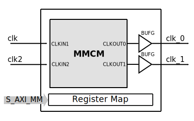

.. _axi_clkgen:

AXI CLK Generator
================================================================================

.. hdl-component-diagram::

The :git-hdl:`AXI CLK Generator <library/axi_clkgen>` IP core is a software
programmable clock generator.

Features
--------------------------------------------------------------------------------

The top module, :git-hdl:`library/axi_clkgen/axi_clkgen.v`, instantiates a
:git-hdl:`MMCM wrapper <library/xilinx/common/ad_mmcm_drp.v>`,
the register map and the AXI handling interface.

The :git-hdl:`ad_mmcm_drp <library/xilinx/common/ad_mmcm_drp.v>`
is a wrapper over MMCM, which can instantiate a Virtex 6 MMCM or
7 Series MMCM. Detailed information regarding the 7 Series MMCM can be found in
AMD Xilinx :xilinx:`UG472 <support/documentation/user_guides/ug472_7Series_Clocking.pdf>` and
:xilinx:`UG953 <support/documentation/sw_manuals/xilinx2015_2/ug953-vivado-7series-libraries.pdf>`.

The register map allows resetting the MMCM, changing the clock source, checking
the status of the MMCM lock and controlling the DRP interface.

Files
--------------------------------------------------------------------------------

.. list-table::
   :header-rows: 1

   * - Name
     - Description
   * - :git-hdl:`library/axi_clkgen/axi_clkgen.v`
     - Verilog source for the peripheral.

Block Diagram
--------------------------------------------------------------------------------

Configuration Parameters
--------------------------------------------------------------------------------

.. note::

   Both pulse width and pulse offset are in number of clock cycles.

.. hdl-parameters::

   * - ID
     - Core ID should be unique for each IP in the system
   * - CLKIN_PERIOD
     - Default clock period for CLKIN1
   * - CLKIN2_PERIOD
     - Default clock period for CLKIN2
   * - VCO_DIV
     - DIVCLK_DIVIDE MMCM parameter
   * - VCO_MUL
     - CLKFBOUT_MULT_F MMCM parameter
   * - CLK0_DIV
     - CLKOUT0_DIVIDE_F MMCM parameter
   * - CLK0_PHASE
     - CLKOUT0_PHASE MMCM parameter
   * - CLK1_DIV
     - CLKOUT1_DIVIDE MMCM parameter
   * - CLK1_PHASE
     - CLKOUT1_PHASE MMCM parameter

.. _axi_clk_gen interface:

Interface
--------------------------------------------------------------------------------

.. hdl-interfaces::

   * - clk
     - Reference clock 1
   * - clk2
     - Reference clock 2
   * - clk_*
     - Output clock, 1 and 2
   * - s_axi
     - AXI Slave Memory Map interface

Register Map
--------------------------------------------------------------------------------

.. hdl-regmap::
   :name: AXI_CLKGEN

References
--------------------------------------------------------------------------------

* HDL IP core at :git-hdl:`library/axi_clkgen`
* :dokuwiki:`AXI CLKGEN on wiki <resources/fpga/docs/axi_clkgen>`
* :xilinx:`7 Series Clocking <support/documentation/user_guides/ug472_7Series_Clocking.pdf>`
* :xilinx:`MMCM and PLL Dynamic Reconfiguration <support/documentation/application_notes/xapp888_7Series_DynamicRecon.pdf>`
