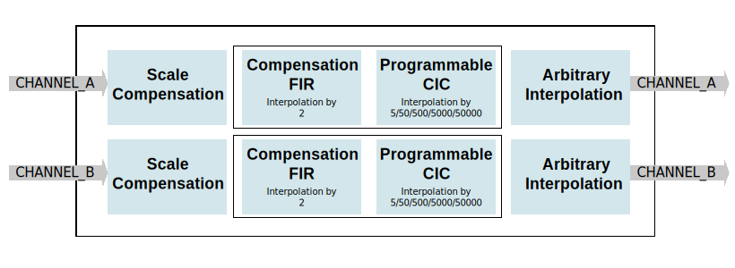

.. _axi_dac_interpolate:

AXI DAC Interpolate
================================================================================

.. hdl-component-diagram::

The :git-hdl:`AXI DAC Interpolate <library/axi_dac_interpolate>` IP core
allows interpolation of the input data by 10/100/1000/10000/100000, with filtering
and arbitrary zero-hold interpolation.

More about the generic framework interfacing DACs can be read here at :ref:`axi_dac`.

Features
--------------------------------------------------------------------------------

*  AXI Lite control/status interface
*  Allows interpolation by 10/100/1000/10000/100000 with filtering
*  Allows arbitrary zero-hold interpolation
*  Filtering is implemented by a 6-section CIC programmable rate filter and a
   compensation FIR filter.

Files
--------------------------------------------------------------------------------

.. list-table::
   :header-rows: 1

   * - Name
     - Description
   * - :git-hdl:`library/axi_dac_interpolate/axi_dac_interpolate.v`
     - Verilog source for the peripheral.

Block Diagram
--------------------------------------------------------------------------------

Configuration Parameters
--------------------------------------------------------------------------------

.. hdl-parameters::

   * - CORRECTION_DISABLE
     - Disable scale correction of the CIC output.

Interface
--------------------------------------------------------------------------------

.. hdl-interfaces::

   * - dac_clk
     - Clock input.
   * - dac_rst
     - Reset, synchronous on the dac_clk clock domain.
   * - dac_data_a
     - Analog data for channel A.
   * - dac_data_b
     - Analog data for channel B.
   * - dac_valid_a
     - Data valid signal for channel A.
   * - dac_valid_b
     - Data valid signal for channel B.
   * - dac_int_data_a
     - Decimated data for channel A.
   * - dac_int_data_b
     - Decimated data for channel B.
   * - dac_valid_out_a
     - Data valid for channel A.
   * - dac_valid_out_b
     - Data valid for channel B.
   * - trigger_i
     - External trigger pins.
   * - trigger_adc
     - ADC trigger.
   * - trigger_la
     - Logic analyzer trigger.
   * - s_axi
     - Standard AXI Slave Memory Map interface.

Detailed Description
--------------------------------------------------------------------------------

For some applications, the maximum sampling rate of the DAC is too high and
leads to bad utilization of the memory or USB bandwidth. To avoid it, the
interpolation IP can be used.

The interpolation block allows interpolation by 10, 100, 1000, 10000,100000 with
filtering. The filtering is implemented using an FIR compensation filter
(interpolation by 2) for the CIC and a 6-stage CIC interpolation filter allowing
interpolation by 5/50/500/5000/50000.

At the end of the filter blocks, there is an arbitrary interpolation zero-order
hold block which holds the value for a configurable number of samples.

The axi_dac_interpolate also controls the data flow, being the middle man
between :ref:`axi_ad9963`: as the main data flow controller (consumer) and the DMA,
a subordinate in the path. This control is done through registers:

-  0x50 FLAGS - Control flags
-  0x60 TRIGGER_CONFIG - Trigger configuration
-  0x64 RAW_CHANNEL_DATA - Raw data to transmit

The actual control consists in fetching data from the DMA:

#. at a desired rate
#. at a new transfer, waiting until the other channel DMA has valid DATA or
   waiting for an external trigger
#. pausing/stopping the transfer at user request through remap or external
   trigger

If the DMA is stopped through the axi_dac_interpolate (dma_transfer_suspend or
external trigger) and not by disabling the DMA from it's register map, the DAC
data path will keep a few residual samples in the DMA's pipes. These samples
will be the first samples to be transferred when a new buffer is pushed.
To avoid it, one can use the DMA flush feature which clears the DMA when
stopped by the consumer.

By default, the flush flag is active. It should be disabled only if the user
wants a "pause" functionality. Meaning, the transfer is stopped on an event and
then on another event, the transfer will continue from the same point without
having to create a new buffer. The event can be setting/clearing the
dma_transfer_suspend or an external trigger.

Another feature is the stop_sync. There is only one use case for it. Stopping the
other channel (configured at a different rate and/or in cyclic mode) when the
first channel (DMA) finishes the transfer of a non-cyclic buffer.

The RAW transfer feature enables the user to transfer data (written into a
register inside the axi_dac_interpolate) without needing DMA (buffer)
config (delays).

For more info, check the state machine below.

.. image:: transfer_sm.svg

Register Map
--------------------------------------------------------------------------------

.. hdl-regmap::
   :name: axi_dac_interpolate

References
--------------------------------------------------------------------------------

* HDL IP core at :git-hdl:`library/axi_dac_interpolate`
* :dokuwiki:`AXI DAC INTEPOLATE on wiki <resources/fpga/docs/axi_dac_interpolate>`
* :xilinx:`7 Series libraries <support/documentation/sw_manuals/xilinx2016_2/ug953-vivado-7series-libraries.pdf>`
