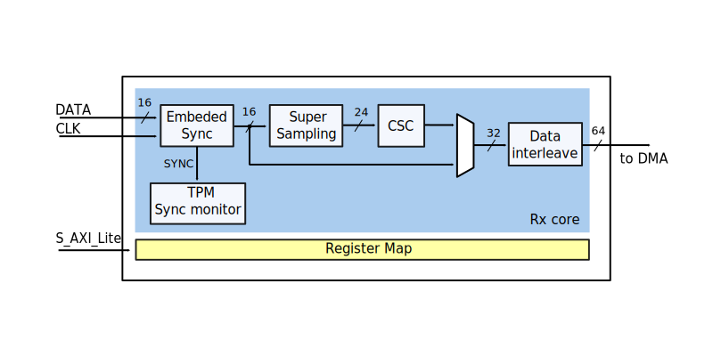

.. _axi_hdmi_rx:

AXI HDMI RX
===============================================================================

.. hdl-component-diagram::

The :git-hdl:`AXI HDMI RX <library/axi_hdmi_rx>` IP core can be used to interface
the :adi:`ADV7611` device using an FPGA.

Features
-------------------------------------------------------------------------------

* AXI based configuration
* Supports multiple resolution (max 1080p)
* Supports embedded sync video reception (16bit data)
* YCbCr or RGB color space output
* Supported on FMC-IMAGEON Xilinx Reference Design

Files
--------------------------------------------------------------------------------

.. list-table::
   :header-rows: 1

   * - Name
     - Description
   * - :git-hdl:`library/axi_hdmi_rx/axi_hdmi_rx.v`
     - Verilog source for the peripheral.

.. _axi_hdmi_rx block-diagram:

Block Diagram
--------------------------------------------------------------------------------

Configuration Parameters
-------------------------------------------------------------------------------

.. hdl-parameters::

   * - ID
     - Core ID should be unique for each axi_hdmi_rx IP in the system.
   * - IO_INTERFACE
     - Type of the IO interface. 0 - Allow sampling of data on falling edge of
       the HDMI clock. others - always sample the input data on rising edge.

Interfaces
-------------------------------------------------------------------------------

.. hdl-interfaces::

   * - hdmi_rx_clk
     - Pixel clock.
   * - hdmi_rx_data
     - HDMI data.
   * - s_axi
     - DMA AXIS interface (vdma).
   * - hdmi_clk
     - Output clock.
   * - hdmi_dma_sof
     - Start of frame.
   * - hdmi_dma_de
     - Data enable.
   * - hdmi_dma_data
     - HDMI DMA data.
   * - hdmi_dma_ovf
     - Data overflow signal.
   * - hdmi_dma_unf
     - Data underflow signal.

Detailed description
-------------------------------------------------------------------------------

The top module (**axi_hdmi_rx**), instantiates:

* axi_hdmi_rx_core module
* the HDMI RX register map
* the AXI handling interface

In **axi_hdmi_rx_core** module the video information is manipulated by passing
through several processing blocks (see :ref:`axi_hdmi_rx block-diagram`):

* Embedded Sync module acquires the video information and splits it into video
  data and synchronization signals.
* Chroma supersampling block, super samples the video information to obtain a
  24 bit video information, has no impact on the video quality.
* CSC (Color Space Conversion) –converts the video information from YCbCr color
  space to RGB color space. If YCbCr is the desired output color space the CSC
  block can be bypassed by setting to 1 the value of CSC_BYPASS in ``CNTRL`` register.
* Sync monitoring - monitors the recovered hsync and vsync against the programmed
  expected resolution. Asserts out of sync and resolutions mismatch indicators
  in the ``TPM_STATUS2`` register.

Register Map
-------------------------------------------------------------------------------

.. hdl-regmap::
   :name: HDMI_RX

Design considerations
-------------------------------------------------------------------------------

Additional IPs needed:

* :ref:`axi_dmac`
* :git-hdl:`library/axi_spdif_tx`

The :ref:`axi_dmac` is used to get the video information from the core into memory.
The audio path is separated from the video path, for audio
:git-hdl:`axi_spdif_tx <library/axi_spdif_tx>` core is needed to receive the audio
information from the ADV7611 device and transmit it to the memory.
The whole system needs to be controlled by a processor (ARM or a softcore) that can
program the registers.

Software support
-------------------------------------------------------------------------------

The core can be controlled by no-Os or Linux

* :dokuwiki:`FMC-IMAGEON Xilinx Reference Design <resources/fpga/xilinx/fmc/fmc-imageon>`
* :git-linux:`ADV7604, ADV7611, ADV7612 Linux Driver <drivers/media/i2c/adv7604.c>`

References
-------------------------------------------------------------------------------

* HDL IP core at :git-hdl:`library/axi_hdmi_rx`
* HDL project at :git-hdl:`projects/imageon`
* HDL project documentation at :ref:`imageon`
* :dokuwiki:`AXI HDMI RX on wiki <resources/fpga/docs/axi_hdmi_rx>`
* :dokuwiki:`FMC-IMAGEON Xilinx Reference Design <resources/fpga/xilinx/fmc/fmc-imageon>`
* :dokuwiki:`Zynq & Altera SoC Quick Start Guide <resources/tools-software/linux-software/kuiper-linux>`
