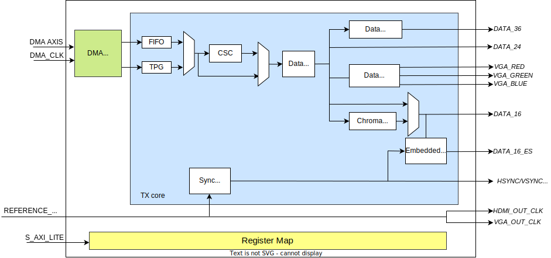

.. _axi_hdmi_tx:

AXI HDMI TX
===============================================================================

.. hdl-component-diagram::

The :git-hdl:`AXI HDMI TX <library/axi_hdmi_tx>` IP core can be used to interface
the :adi:`ADV7511` and :adi:`ADV7123` devices using an FPGA.

Features
-------------------------------------------------------------------------------

* AXI based configuration
* Supports multiple resolution (max 1080p)
* Video transmission on 36/24/16 bits or 8 bits RGB
* Supports embedded sync (16bit data)
* YCbCr or RGB color space output
* Data clipping (min. and max. for each chroma/color value)
* Supports Xilinx 7 Series and Ultrascale devices.
* Supports Altera 5 Series SoC

Files
--------------------------------------------------------------------------------

.. list-table::
   :header-rows: 1

   * - Name
     - Description
   * - :git-hdl:`library/axi_hdmi_tx/axi_hdmi_tx.v`
     - Verilog source for the peripheral.

.. _axi_hdmi_tx block-diagram:

Block Diagram
--------------------------------------------------------------------------------

Configuration Parameters
-------------------------------------------------------------------------------

.. hdl-parameters::

   * - ID
     - Core ID should be unique for each axi_hdmi_tx IP in the system.
   * - FPGA_TECHNOLOGY
     - Used to select the FPGA Technolgy; beyond the "Choices/Range" listed, also
       supports Altera 5 series (101) devices.
   * - CR_CB_N
     - | Used in the chroma subsampling process, selecting which of the red or blue
       | data components will be transmitted first in-between green samples. 1 = red, 0 = blue
   * - INTERFACE
     - | Interface type towards the 7511. Available options: 16_BIT, 24_BIT, 36_BIT,
       | 16_BIT_EMBEDDED_SYNC, VGA_INTERFACE
   * - OUT_CLK_POLARITY
     - 0 = Launch on rising edge, 1 = Launch on falling edge.

Interfaces
-------------------------------------------------------------------------------

.. hdl-interfaces::

   * - reference_clk
     - Pixel clock, generated by an axi_clkgen IP core (axi_hdmi_clkgen in
       reference design.
   * - hdmi_out_clk
     - Output clock.
   * - s_axis
     - DMA AXIS interface (vdma).
   * - hdmi_16_hsync
     - Horizontal sync signal.
   * - hdmi_16_vsync
     - Vertical sync signal.
   * - hdmi_16_data_e
     - Data enable signal.
   * - hdmi_16_data
     - HDMI data.
   * - hdmi_16_es_data
     - HDMI embedded sync data.
   * - hdmi_24_hsync
     - Horizontal sync signal.
   * - hdmi_24_vsync
     - Vertical sync signal.
   * - hdmi_24_data_e
     - Data enable signal.
   * - hdmi_24_data
     - HDMI data.
   * - hdmi_36_hsync
     - Horizontal sync signal.
   * - hdmi_36_vsync
     - Vertical sync signal.
   * - hdmi_36_data_e
     - Data enable signal.
   * - hdmi_36_data
     - HDMI data.
   * - vga_out_clk
     - Output clock.
   * - vga_hsync
     - Horizontal sync signal.
   * - vga_vsync
     - Vertical sync signal.
   * - vga_red
     - VGA red data.
   * - vga_green
     - VGA green data.
   * - vga_blue
     - VGA red data.

Detailed description
-------------------------------------------------------------------------------

The top module (**axi_hdmi_tx**), instantiates:

* axi_hdmi_tx_core module
* axi_hdmi_tx_vdma module
* the HDMI TX register map
* the AXI handling interface

In **axi_hdmi_tx_core** module the video information is manipulated by passing
through several processing blocks (see :ref:`axi_hdmi_tx block-diagram`):

* **CSC (Color Space Converter)** –converts the video information from RGB color
  space to YCbCr color space. If RGB is the desired output color space the CSC
  block can be bypassed by setting to 1 the value of CSC_BYPASS register.
* **Data Clipping** bloc gives the possibility of limiting the minimum and
  maximum color range values. This block is controlled by FULL_RANGE, CLIPP_MAX
  and CLIPP_MIN registers.
* **Chroma subsampling** block as its name suggests, samples the video
  information to obtain a video information that requires less bandwidth and
  has a minimum impact on the video quality experienced by human eyes.
* **Embedded Sync** module interleaves the video synchronization signals with
  the video information, obtaining a more compact transmission path.
* **Sync Signals** block is responsible for generating the video synchronization
  signals for video resolutions written in HDMI interface Control register.

The **axi_hdmi_tx_vdma** module ensures the clock domain crossing circuit
between the video source, typically a :ref:`axi_dmac` core and the
**axi_hdmi_core**, which works at different clock speeds depending on the
required resolution.

Register Map
-------------------------------------------------------------------------------

.. hdl-regmap::
   :name: HDMI_TX

Design considerations
-------------------------------------------------------------------------------

Additional IPs needed:

* :ref:`axi_dmac`
* :ref:`axi_clkgen`
* :git-hdl:`library/axi_spdif_tx`

:ref:`axi_dmac` provides a high-bandwidth direct memory access for the video stream.
The core is configured as follows:

.. code:: tcl

   ad_ip_instance axi_dmac axi_hdmi_dma
   ad_ip_parameter axi_hdmi_dma CONFIG.DMA_TYPE_SRC 0
   ad_ip_parameter axi_hdmi_dma CONFIG.DMA_TYPE_DEST 1
   ad_ip_parameter axi_hdmi_dma CONFIG.CYCLIC true
   ad_ip_parameter axi_hdmi_dma CONFIG.DMA_2D_TRANSFER true
   ad_ip_parameter axi_hdmi_dma CONFIG.DMA_DATA_WIDTH_DEST 64

The audio path is separated from the video path, for audio **axi_spdif_tx** core
(:git-hdl:`axi_spdif_tx <library/axi_spdif_tx>`) is needed to transmit the audio
information to the ADV7511 device.
The whole system needs to be controlled by a processor (ARM or a soft core) that
can programs the registers.
``axi_clkgen`` generates the clock frequency required for the desired resolution
(pixel clock), the frequency is software configurable
(:git-no-OS:`Example adv7511_zc706 no-Os software <projects/adv7511>`).

Examples for different data width configurations
-------------------------------------------------------------------------------

The :adi:`ADV7511 <media/en/technical-documentation/user-guides/ADV7511_Hardware_Users_Guide.pdf>`
can accept video data from as few as eight pins (either YCbCr 4:2:2 double data
rate [DDR] or YCbCr 4:2:2 with 2x pixel clock) to as many as 36 pins (RGB 4:4:4
or YCbCr 4:4:4). In addition it can accept HSYNC, VSYNC and DE (Data Enable)

The **axi_hdmi_tx** core support the following video input connections:

* 36 bits with HSYNC, VSYNC and DE (:git-hdl:`hdl_2017_r1:projects/adv7511/vc707` development board)
* 24 bits with HSYNC, VSYNC and DE (:git-hdl:`projects/adv7511/zc706` development board)
* 16 bits with HSYNC, VSYNC and DE (:git-hdl:`projects/adv7511/zed`)
* 16 bits with embedded SYNC (TX interface of the :git-hdl:`IMAGEON <projects/imageon>` board)

Software support
-------------------------------------------------------------------------------

The core can be controlled by no-Os or Linux

* :dokuwiki:`Linux Driver <resources/tools-software/linux-drivers/drm/adv7511>`
* :dokuwiki:`Reference design with no-OS example <resources/fpga/xilinx/kc705/adv7511>`
* :git-no-OS:`projects/adv7511`

References
-------------------------------------------------------------------------------

* HDL IP core at :git-hdl:`library/axi_hdmi_tx`
* :dokuwiki:`AXI HDMI TX on wiki <resources/fpga/docs/axi_hdmi_tx>`
* :dokuwiki:`Zynq & Altera SoC Quick Start Guide <resources/tools-software/linux-software/kuiper-linux>`
* :dokuwiki:`FMC-IMAGEON Xilinx Reference Design <resources/fpga/xilinx/fmc/fmc-imageon>`
* :dokuwiki:`ADV7511 Xilinx Evaluation Boards Reference Design <resources/fpga/xilinx/kc705/adv7511>`
