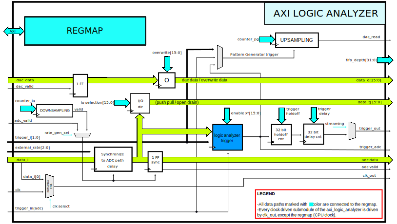

.. _axi_logic_analyzer:

AXI Logic Analyzer
================================================================================

.. hdl-component-diagram::

The :git-hdl:`AXI Logic Analyzer <library/axi_logic_analyzer>` IP core
implements both a logic analyzer and a pattern generator, sharing the same pins.
More about the generic framework interfacing ADCs can be read here at :ref:`axi_adc`.
and for DACs at :ref:`axi_dac`.

Features
--------------------------------------------------------------------------------

*  AXI Lite control/status interface
*  16-channel digital I/O pins
*  Supports open drain outputs, configurable per pin
*  Down-sampling
*  Up-sampling
*  Digital triggering
*  Control history variable FIFO

Files
--------------------------------------------------------------------------------

.. list-table::
   :header-rows: 1

   * - Name
     - Description
   * - :git-hdl:`library/axi_logic_analyzer/axi_logic_analyzer.v`
     - Verilog source for the peripheral.

Block Diagram
--------------------------------------------------------------------------------

   AXI logic analyzer main module.

   AXI logic analyzer trigger submodule.

Interface
--------------------------------------------------------------------------------

.. hdl-interfaces::

   * - clk
     - Main clock.
   * - clk_out
     - Clock on which the logic analyzer/pattern generator related modules
       are running. It is a selection between clk and data[0].
   * - data_i
     - Data input, used when working as logic analyzer.
   * - data_o
     - Data output, used when working as pattern generator.
   * - data_t
     - Data selection, switch between logic analyzer and pattern generator.
   * - trigger_i
     - Trigger pins, controlled by another IP.
   * - adc_data
     - Data for the logic analyzer path.
   * - adc_valid
     - Valid for the logic analyzer path.
   * - external_valid
     - Valid generated by ADC decimation path.
   * - external_rate
     - Information regarding the decimation rate used by the ADC decimation
       filters.
   * - external_decimation_en
     - External decimation enabled.
   * - dac_valid
     - Valid for the pattern generator path.
   * - dac_read
     - Read for the pattern generator path.
   * - dac_data
     - Data for the pattern generator path.
   * - trigger_out
     - Triggers data acquisition on the logic analyzer DMAC.
   * - fifo_depth
     - Controls the depth of the variable FIFO, used for the trigger history on
       the logic analyzer path.
   * - s_axi
     - Standard AXI Slave Memory Map interface.

Detailed Description
--------------------------------------------------------------------------------

The AXI_LOGIC_ANALYZER IP implements both a logic analyzer and a pattern
generator functionality.

There are 16-channel digital I/O pins. All the pins can be configured either as
inputs (logic analyzer) or outputs (pattern generator). The pattern generator
supports open drain outputs, configurable per pin.

The logic analyzer path can work at lower than the maximum rate by configuring
the down sampling block. The same thing is done for the pattern generator using
the up sampling block.

The logic analyzer, can be synchronized (data delayed) to the ADC path.

Triggering for the logic analyzer is implemented in this IP also. It can
generate triggers based on external trigger signals, ADC (Oscilloscope) trigger and
the 16-bit input signals. To order to provide data before triggering, a variable
length FIFO should be used with this IP. The length of the FIFO is configured
through the TRIGGER_DELAY register. It can be bypassed if TRIGGER_DELAY is 0.

For each of the 18 pins, triggering can be done based on rise edge, fall edge,
any edge, high or low.

Register Map
--------------------------------------------------------------------------------

.. hdl-regmap::
   :name: axi_logic_analyzer

References
--------------------------------------------------------------------------------

* HDL IP core at :git-hdl:`library/axi_logic_analyzer`
* :dokuwiki:`AXI LOGIC ANALYZER on wiki <resources/fpga/docs/axi_logic_analyzer>`
* :xilinx:`7 Series IO <support/documentation/user_guides/ug471_7Series_SelectIO.pdf>`
* :xilinx:`7 Series Clocking <support/documentation/user_guides/ug472_7Series_Clocking.pdf>`
* :xilinx:`7 Series libraries <support/documentation/sw_manuals/xilinx2016_2/ug953-vivado-7series-libraries.pdf>`
