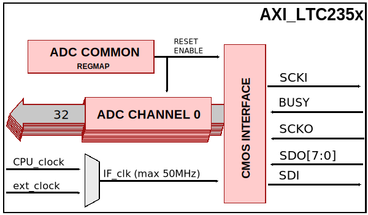
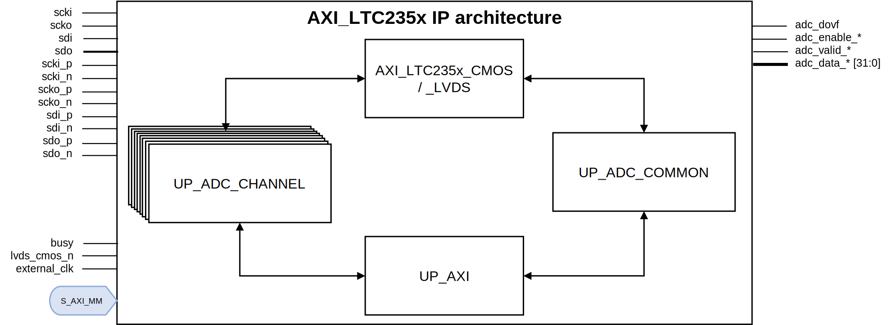

.. _axi_ltc235x:

AXI LTC235X
================================================================================

.. hdl-component-diagram::
   :path: library/axi_ltc235x

The :git-hdl:`AXI LTC235X <library/axi_ltc235x>` IP core can be used to
interface the :adi:`LTC2358-18`, :adi:`LTC2358-16`, and similar devices
using an FPGA. The core has a AXI Memory Map interface for configuration,
supports the CMOS and LVDS interfaces of the device, and has a simple
FIFO interface for the DMAC. This documentation only covers the IP core
and requires that one must be familiar with the devices for a complete
and better understanding.

This documentation only covers the IP core and requires that one must be
familiar with the device for a complete and better understanding.

More about the generic framework interfacing ADCs can be read in :ref:`axi_adc`.

Features
--------------------------------------------------------------------------------

- AXI based configuration
- Quartus Prime compatible
- :adi:`LTC2358-18`. No support yet for :adi:`LTC2358-16`, :adi:`LTC2357-18`,
  :adi:`LTC2357-16`, :adi:`LTC2353-18`, :adi:`LTC2353-16`
- CMOS and LVDS Mode
- SoftSpan configuration

Files
--------------------------------------------------------------------------------

.. list-table::
   :header-rows: 1

   * - Name
     - Description
   * - :git-hdl:`library/axi_ltc235x/axi_ltc235x.v`
     - Verilog source for the module
   * - :git-hdl:`library/axi_ltc235x/axi_ltc235x_cmos.v`
     - Verilog source for CMOS Interface
   * - :git-hdl:`library/axi_ltc235x/axi_ltc235x_lvds.v`
     - Verilog source for LVDS Interface
   * - :git-hdl:`library/common/up_adc_common.v`
     - Verilog source for the ADC Common regmap
   * - :git-hdl:`library/common/up_adc_channel.v`
     - Verilog source for the ADC Channel regmap

Block Diagram
--------------------------------------------------------------------------------

   

Configuration Parameters
--------------------------------------------------------------------------------

.. hdl-parameters::
   :path: library/axi_ltc235x

.. _axi_ltc235x interface:

Interface
--------------------------------------------------------------------------------

.. hdl-interfaces::

Detailed Architecture
--------------------------------------------------------------------------------

Detailed Description
--------------------------------------------------------------------------------

The top module :git-hdl:`library/axi_ltc235x/axi_ltc235x.v` instantiates:

- the :git-hdl:`(CMOS) interface module <library/axi_ltc235x/axi_ltc235x_cmos.v>`
- the :git-hdl:`(LVDS) interface module <library/axi_ltc235x/axi_ltc235x_lcds.v>`
- the :git-hdl:`ADC channel register map <library/common/up_adc_channel.v>`
- the :git-hdl:`ADC common register map <library/common/up_adc_common.v>`
- the :git-hdl:`AXI handling interface <library/common/up_axi.v>`

Interface module description
~~~~~~~~~~~~~~~~~~~~~~~~~~~~~~~~~~~~~~~~~~~~~~~~~~~~~~~~~~~~~~~~~~~~~~~~~~~~~~~

The interface module has I/Os for clock, data, and a busy signal:

- **scki**: Serial clock input of device.
- **scko**: Serial clock output of device.
- **sdi**: Serial data input of device.
- **sdo**: Serial data output of device.
- **busy**: Busy signal from device to control data transfer.

The LVDS interface contains the same signal as the CMOS but as a differential pair.
CMOS: **scki**, LVDS: **scki_p/scki_n**. The **busy** signal is the same for both
interface.

The data from the interface module is processed by the adc channel module.
This includes the channel ID and the SoftSpan ID.

Register Map
--------------------------------------------------------------------------------

.. hdl-regmap::
   :name: COMMON
   :no-type-info:

.. hdl-regmap::
   :name: ADC_COMMON
   :no-type-info:

.. hdl-regmap::
   :name: ADC_CHANNEL
   :no-type-info:

Design Guidelines
--------------------------------------------------------------------------------

The control of the chip is done through the CMOS/LVDS interface at system level.
The SoftSpan ID register per channel in
:git-hdl:`up_adc_channel <library/common/up_adc_channel.v>` can be configured.
The SoftSpan ID of all the channels are sent to the ADC through the interface
module on every conversion.

The :ref:`axi_ltc235x interface` must be connected directly to the top file of the
design, as IO primitives are part of the IP.

The example design uses a DMA to move the data from the output of the IP to memory.

If the data needs to be processed in HDL before moving to the memory, it can be
done at the output of the IP (at the system level) or inside the ADC interface
module (at the IP level).

The example design uses a processor to program all the registers. If no processor is
available in your system, you can create your IP starting from the interface module.

Software Support
--------------------------------------------------------------------------------

- Linux device driver at :git-linux:`drivers/iio/adc/ltc2358.c`
- LTC235X Linux device tree at :git-linux:`arch/arm/boot/dts/socfpga_cyclone5_sockit_dc2677a.dts`

References
--------------------------------------------------------------------------------

- HDL IP core at :git-hdl:`library/axi_ltc235x`
- HDL project at :git-hdl:`projects/dc2677a`
- HDL project documentation at :ref:`dc2677a`
- :adi:`LTC2358-18` 18-bit 15 MSPS
