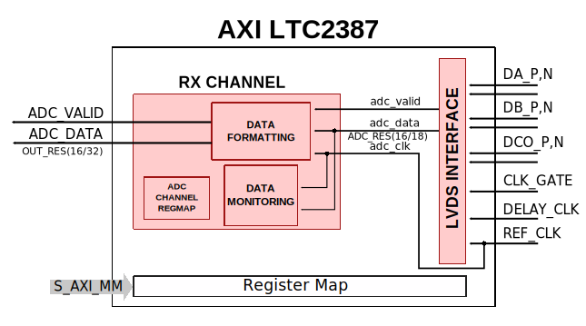

.. _axi_ltc2387:

AXI LTC2387
================================================================================

.. hdl-component-diagram::
   :path: library/axi_ltc2387

The :git-hdl:`AXI LTC2387 <library/axi_ltc2387>` IP core can be used to
interface :adi:`LTC2387-18`, :adi:`LTC2387-16` and :adi:`ADAQ23878` devices.

This documentation only covers the IP core and requires that one must be
familiar with the device for a complete and better understanding.

More about the generic framework interfacing ADCs can be read in :ref:`axi_adc`.

Features
--------------------------------------------------------------------------------

* AXI-based configuration
* Vivado compatible
* High-speed data acquisition
* Imaging
* Communications
* Control loops
* Instrumentation
* ATE

Files
--------------------------------------------------------------------------------

.. list-table::
   :header-rows: 1

   * - Name
     - Description
   * - :git-hdl:`library/axi_ltc2387/axi_ltc2387.v`
     - Verilog source for the module
   * - :git-hdl:`library/axi_ltc2387/axi_ltc2387_channel.v`
     - Verilog source for AXI LTC2387 channel
   * - :git-hdl:`library/axi_ltc2387/axi_ltc2387_if.v`
     - Verilog source for the AXI LTC2387 interface module
   * - :git-hdl:`library/common/up_adc_common.v`
     - Verilog source for the ADC Common regmap
   * - :git-hdl:`library/common/up_adc_channel.v`
     - Verilog source for the ADC Channel regmap

Block Diagram
--------------------------------------------------------------------------------

Configuration Parameters
--------------------------------------------------------------------------------

.. hdl-parameters::
   :path: library/axi_ltc2387

.. _axi_ltc2387 interface:

Interface
--------------------------------------------------------------------------------

.. hdl-interfaces::

Detailed Architecture
--------------------------------------------------------------------------------

From the HDL perspective, the selection between the 16-bit and the 18-bit
version of the chip, is done by the `ADC_RES` and `OUT_RES` parameters of
the modules.

* For the 18-bit, ADC_RES=18 (=> OUT_RES=32; addresses should be on a no. of
  bits power of 2)
* For the 16-bit, ADC_RES=16 (=> OUT_RES=16)

Detailed Description
--------------------------------------------------------------------------------

The top module :git-hdl:`<library/axi_ltc2387/axi_ltc2387.v>` instantiates:

* the :git-hdl:`(LVDS) interface module <library/axi_ltc2387/axi_ltc2387_if.v>`
* the :git-hdl:`channel processing module <library/axi_ltc2387/axi_ltc2387_channel.v>`
* the :git-hdl:`delay control module <library/common/up_delay_cntrl.v>`
* the :git-hdl:`ADC common register map <library/common/up_adc_common.v>`
* the :git-hdl:`AXI handling interface <library/common/up_axi.v>`

Interface module description
~~~~~~~~~~~~~~~~~~~~~~~~~~~~~~~~~~~~~~~~~~~~~~~~~~~~~~~~~~~~~~~~~~~~~~~~~~~~~~~

The LVDS interface module has as inputs the LVDS signals for clock and data:

- **dco_p/dco_n**: LVDS clock input; it is an echoed version of the CLK+/CLK-
  signal, and it's used to latch the data outputs from the chip.
- **da_p/da_n** and **db_p/db_n**: serial LVDS data inputs; DB+/- is used only
  when TWOLANES=1
- **clk_gate**: this signal clk_gate is enabling the CLK+/CLK- which is driven
  by the reference clock. It is generated by AXI_PWM_GEN.
- **adc_valid**: it is 1 for the current sample that is sent. This is generated
  depending on clk_gate.
- **adc_data**: depending on TWOLANES parameter, whether it is set or not,
  the output adc_data is either taken from the da_p/_n port interleaved with
  bits from db_p/_n, or it is taken only from da_p/_n port.

Channel module description
~~~~~~~~~~~~~~~~~~~~~~~~~~~~~~~~~~~~~~~~~~~~~~~~~~~~~~~~~~~~~~~~~~~~~~~~~~~~~~~

The expected pattern is created and checked if the data received from the DMA
is the correct one (this is used for quick validation of the design).

In the case of the device with 16-bit resolution, a sign extension is done
additionally.

Register Map
--------------------------------------------------------------------------------

.. hdl-regmap::
   :name: COMMON
   :no-type-info:

.. hdl-regmap::
   :name: ADC_COMMON
   :no-type-info:

.. hdl-regmap::
   :name: ADC_CHANNEL
   :no-type-info:

Design Guidelines
--------------------------------------------------------------------------------

The control of the chip is done through an SPI interface, which is needed at the
system level.
The :ref:`axi_ltc2387 interface` must be connected directly to the top file of
the design, as I/O primitives are part of the IP.

The example design uses a DMA to move the data from the output of the IP to
memory.

If the data needs to be processed in HDL before moving to the memory, it can be
done at the output of the IP (at the system level) or inside the ADC interface
module (at the IP level).

The example design uses a processor to program all the registers.

If no processor is available in your system, you can create your IP starting
from the interface module.

Software Support
--------------------------------------------------------------------------------

* Linux device driver at :git-linux:`drivers/iio/adc/ltc2387.c`
* LTC2387 Linux device tree at :git-linux:`arch/arm/boot/dts/zynq-zed-adv7511-ltc2387.dts`
* CN0577 Linux device tree at :git-linux:`arch/arm/boot/dts/zynq-zed-adv7511-cn0577.dts`
* Linux documentation at :dokuwiki:`[Wiki] <resources/tools-software/linux-drivers/iio-adc/ltc2387>`

References
--------------------------------------------------------------------------------

* HDL IP core at :git-hdl:`library/axi_ltc2387`
* HDL project at :git-hdl:`projects/cn0577`
* HDL project documentation at :ref:`cn0577`
* :adi:`LTC2387-18` 18-bit 15 MSPS
* :adi:`LTC2387-16` 16-bit 15 MSPS
* :adi:`ADAQ23878` 18-bit 15 MSPS
* :xilinx:`Zynq-7000 SoC Overview <support/documentation/data_sheets/ds190-Zynq-7000-Overview.pdf>`.
* :xilinx:`Zynq-7000 SoC Packaging and Pinout <support/documentation/user_guides/ug865-Zynq-7000-Pkg-Pinout.pdf>`.
