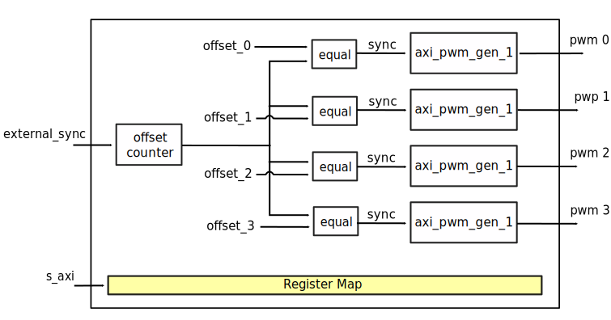
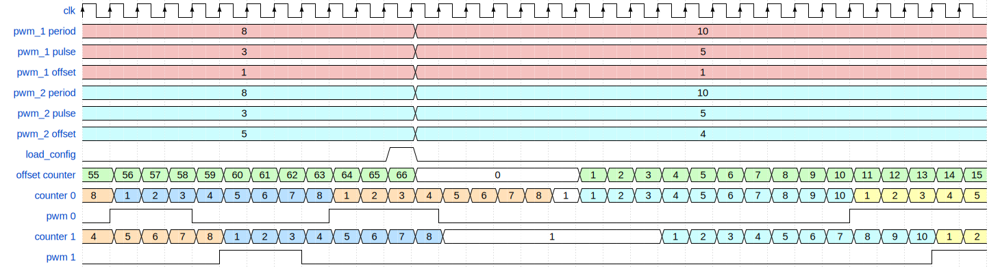
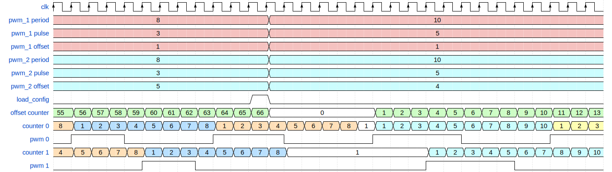
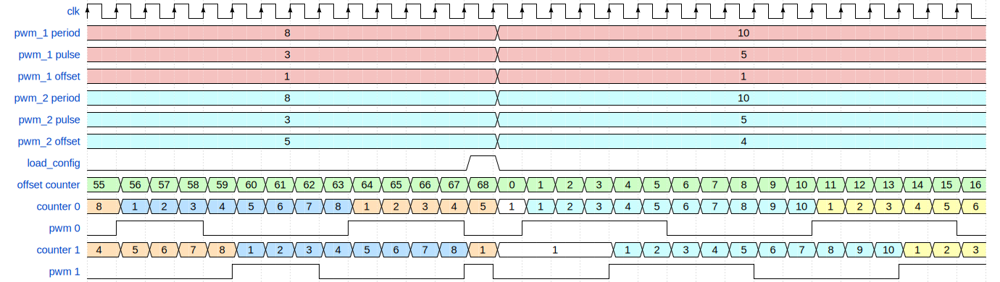
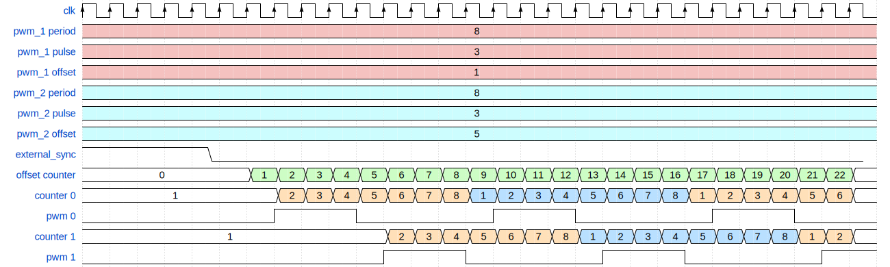
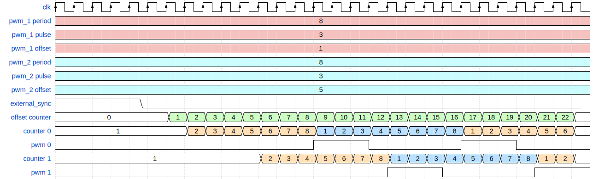

.. _axi_pwm_gen:

AXI PWM Generator
================================================================================

.. hdl-component-diagram::

The :git-hdl:`AXI PWM Generator <library/axi_pwm_gen>` core is used to generate
a maximum of 16 configurable signals (Pulse-Width Modulations).
The pulses are generated according to the state of a counter;
there is one counter for each pulse.

Features
--------------------------------------------------------------------------------

- Up to 16 configurable signals (period, width, offset)
- External synchronization
- External clock

Files
--------------------------------------------------------------------------------

.. list-table::
   :header-rows: 1

   * - Name
     - Description
   * - :git-hdl:`library/axi_pwm_gen/axi_pwm_gen.sv`
     - SystemVerilog source for the top module
   * - :git-hdl:`library/axi_pwm_gen/axi_pwm_gen_1.v`
     - Verilog source for a channel module
   * - :git-hdl:`library/axi_pwm_gen/axi_pwm_gen_regmap.sv`
     - SystemVerilog source for regmap
   * - :git-hdl:`library/axi_pwm_gen/axi_pwm_gen_constr.ttcl`
     - Dynamic constraint file (AMD tools)
   * - :git-hdl:`library/axi_pwm_gen/axi_pwm_gen_constr.sdc`
     - Constraint file (Intel tools)
   * - :git-hdl:`library/axi_pwm_gen/axi_pwm_gen_ip.tcl`
     - IP definition file (AMD tools)
   * - :git-hdl:`library/axi_pwm_gen/axi_pwm_gen_hw.tcl`
     - IP definition file (Intel tools)

Block Diagram
--------------------------------------------------------------------------------

Configuration Parameters
--------------------------------------------------------------------------------

.. note::

   The pulse period, width and offset are set in **number of clock cycles**.
   The clock is the AXI clock or if activated, the external clock.

.. hdl-parameters::

   * - ID
     - Core ID should be unique for each IP in the system
   * - ASYNC_CLK_EN
       Use external clock, asynchronous to s_axi_aclk (1). Otherwise, use
       internal clock, s_axi_aclk (0).
   * - N_PWMS
     - Number of pulses/pwms
   * - PWM_EXT_SYNC
     - PWM offset counter uses external sync
   * - EXT_ASYNC_SYNC
     - The external sync for pulse 0 is asynchronous
   * - SOFTWARE_BRINGUP
     - Require software, to bring the core out if reset
   * - EXT_SYNC_PHASE_ALIGN
     - Set default flag value for external sync phase align feature
   * - FORCE_ALIGN
     - Set default flag value for force align feature
   * - START_AT_SYNC
     - Set default flag value for start at sync feature

.. _axi_pwm_gen interface:

Interface
--------------------------------------------------------------------------------

.. hdl-interfaces::

   * - ext_clk
     - External clock.
   * - ext_sync
     - External sync signal, synchronizes pulses to an external signal.
   * - pwm_*
     - Output PWM, up to 16, indexed from 0 to 15.

Detailed Description
--------------------------------------------------------------------------------

Let's start with some basic notions:

- The pulse generators are based on incrementing counters.
- The pulse period starts on the high level interval and ends on the low level.
- By default, all counters start at the same time. When a different phase (delay)
  is needed between the pulses, we can set an offset.
- The offset feature can synchronize channels 0 to 15 relative to an offset
  counter.
- The offset counter will wait for a HIGH -> LOW transition of the
  synchronization pulse (''load_config'' or ''ext_sync'').
  For more info see the below channel phase alignment feature.
- To **disable a PWM channel**, write 0 to its ``period`` register.
- The duty cycle is the ratio between pulse width over pulse period.

The following features can be enabled by setting a flag in the
register REG_UP_CONTROL(0x18):

Channel phase alignment
~~~~~~~~~~~~~~~~~~~~~~~~~~~~~~~~~~~~~~~~~~~~~~~~~~~~~~~~~~~~~~~~~~~~~~~~~~~~~~~~

The AXI PWM Generator core can be synchronized by an external signal on the
HIGH -> LOW transition of the ext_sync signal.

The external sync can be used in two modes, based on the external sync align
feature:

- external_sync_align flag is set(1) the ext_sync will trigger a phase align
  at each neg-edge.
- otherwise the phase align must be armed by a load config toggle, while
  the external sync must be held HIGH.

Software bringup (software reset)
~~~~~~~~~~~~~~~~~~~~~~~~~~~~~~~~~~~~~~~~~~~~~~~~~~~~~~~~~~~~~~~~~~~~~~~~~~~~~~~~

If set, the software must bring the core out of reset, after a system reset,
for the pwm signals to be generated.

Force align
~~~~~~~~~~~~~~~~~~~~~~~~~~~~~~~~~~~~~~~~~~~~~~~~~~~~~~~~~~~~~~~~~~~~~~~~~~~~~~~~

If set, the current active pulses are immediately stopped and realigned.
Otherwise, the synchronized pulses will start only after all running pulse
periods end. Software overwritable at runtime.

Start at sync
~~~~~~~~~~~~~~~~~~~~~~~~~~~~~~~~~~~~~~~~~~~~~~~~~~~~~~~~~~~~~~~~~~~~~~~~~~~~~~~~

If active, the pulses will start after the trigger event.
Otherwise each pulse will start after a period equal to the one for which
it is set. Software over writable at runtime.

This flags are software overwritable at runtime. Default value is given at build time.

- software bringup = 1
- start at sync = 1
- force align = 0
- ext sync align = 0

Timing Diagrams and examples
--------------------------------------------------------------------------------

.. note::

   The diagrams below, that refer to ``load_config`` functionality, are
   highlighting the transition from a set of pwm core config values (period,
   pulse, offset) to new pwm set of config values.

.. warning::

   The relationship between the offset and channel counters is not 100% accurate.
   It is meant to highlight the functionality, by helping the reader track the
   pwm waveforms. If you are interested in the exact timing you will have to
   simulate the IP.

The timing diagram below, shows the ``load_config`` functionality with
force align and start at sync disabled.

.. wavedrom

  { "signal" : [
    { "name": "clk", "wave": "P................................"},
    { "name": "pwm_1 period", "wave": "9...........9....................","data":["8","10"]},
    { "name": "pwm_1 pulse",  "wave": "9...........9....................","data":["3","5"]},
    { "name": "pwm_1 offset", "wave": "9...........9....................","data":["1","1"]},
    { "name": "pwm_2 period", "wave": "6...........6....................","data":["8","10"]},
    { "name": "pwm_2 pulse",  "wave": "6...........6....................","data":["3","5"]},
    { "name": "pwm_2 offset", "wave": "6...........6....................","data":["5","4"]},
    { "name": "load_config", "wave": "0..........10....................",phase: 0,},
    { "name": "offset counter", "wave": "777777777777=.....777777777777777","data":["55","56","57","58","59","60","61","62","63","64","65","66","0","1","2","3","4","5","6","7","8","9","10","11","12","13","14","15"]},
    { "name": "counter 0", "wave": "45555555544444444=666666666633333","data":["8","1","2","3","4","5","6","7","8","1","2","3","4","5","6","7","8","1","1","2","3","4","5","6","7","8","9","10","1","2","3","4","5"]},
    { "name": "pwm 0", "wave": "lh..l....h...l..............h...."},
    { "name": "counter 1", "wave": "4444455555555=.......666666666633","data":["4","5","6","7","8","1","2","3","4","5","6","7","8","1","1","2","3","4","5","6","7","8","9","10","1","2"]},
    { "name": "pwm 1", "wave": "l....h..l......................h."},
  ]}

The timing diagram below, shows the ``load_config`` functionality with
force align disabled and start at sync enabled.

.. wavedrom

  { "signal" : [
    { "name": "clk", "wave": "P.............................."},
    { "name": "pwm_1 period", "wave": "9...........9..................","data":["8","10"]},
    { "name": "pwm_1 pulse",  "wave": "9...........9..................","data":["3","5"]},
    { "name": "pwm_1 offset", "wave": "9...........9..................","data":["1","1"]},
    { "name": "pwm_2 period", "wave": "6...........6..................","data":["8","10"]},
    { "name": "pwm_2 pulse",  "wave": "6...........6..................","data":["3","5"]},
    { "name": "pwm_2 offset", "wave": "6...........6..................","data":["5","4"]},
    { "name": "load_config", "wave": "0..........10..................",phase: 0,},
    { "name": "offset counter", "wave": "777777777777=.....7777777777777","data":["55","56","57","58","59","60","61","62","63","64","65","66","0","1","2","3","4","5","6","7","8","9","10","11","12","13"]},
    { "name": "counter 0", "wave": "45555555544444444=6666666666333","data":["8","1","2","3","4","5","6","7","8","1","2","3","4","5","6","7","8","1","1","2","3","4","5","6","7","8","9","10","1","2","3"]},
    { "name": "pwm 0", "wave": "lh..l....h...l....h....l....h.."},
    { "name": "counter 1", "wave": "4444455555555=.......6666666666","data":["4","5","6","7","8","1","2","3","4","5","6","7","8","1","1","2","3","4","5","6","7","8","9","10"]},
    { "name": "pwm 1", "wave": "l....h..l............h....l...."},
  ]}

The timing diagram below, shows the ``load_config`` functionality with
force align and start at sync enabled.

.. wavedrom

  { "signal" : [
    { "name": "clk", "wave": "P.............................."},
    { "name": "pwm_1 period", "wave": "9.............9................","data":["8","10"]},
    { "name": "pwm_1 pulse",  "wave": "9.............9................","data":["3","5"]},
    { "name": "pwm_1 offset", "wave": "9.............9................","data":["1","1"]},
    { "name": "pwm_2 period", "wave": "6.............6................","data":["8","10"]},
    { "name": "pwm_2 pulse",  "wave": "6.............6................","data":["3","5"]},
    { "name": "pwm_2 offset", "wave": "6.............6................","data":["5","4"]},
    { "name": "load_config", "wave": "0............10................",phase: 0,},
    { "name": "offset counter", "wave": "7777777777777777777777777777777","data":["55","56","57","58","59","60","61","62","63","64","65","66","67","68","0","1","2","3","4","5","6","7","8","9","10","11","12","13","14","15","16"]},
    { "name": "counter 0", "wave": "45555555544444=6666666666333333","data":["8","1","2","3","4","5","6","7","8","1","2","3","4","5","1","1","2","3","4","5","6","7","8","9","10","1","2","3","4","5","6"]},
    { "name": "pwm 0", "wave": "lh..l....h...l.h....l....h....l"},
    { "name": "counter 1", "wave": "44444555555554=...6666666666333","data":["4","5","6","7","8","1","2","3","4","5","6","7","8","1","1","1","2","3","4","5","6","7","8","9","10","1","2","3","4","5"]},
    { "name": "pwm 1", "wave": "l....h..l....hl...h....l....h.."},
  ]}

The below timing diagrams, shows the ``external_sync`` functionality:

.. wavedrom

  { "signal" : [
    { "name": "clk", "wave": "P............................"},
    { "name": "pwm_1 period", "wave": "9............................","data":["8"]},
    { "name": "pwm_1 pulse", "wave": "9............................","data":["3"]},
    { "name": "pwm_1 offset", "wave": "9............................","data":["1"]},
    { "name": "pwm_2 period", "wave": "6............................","data":["8"]},
    { "name": "pwm_2 pulse", "wave": "6............................","data":["3"]},
    { "name": "pwm_2 offset", "wave": "6............................","data":["5"]},
    { "name": "external_sync", "wave": "1....0.......................",phase: 0.5,},
    { "name": "offset counter", "wave": "=.....7777777777777777777777=","data":["0","1","2","3","4","5","6","7","8","9","10","11","12","13","14","15","16","17","18","19","20","21","22"]},
    { "name": "counter 0", "wave": "=......444444455555555444444=","data":["1","2","3","4","5","6","7","8","1","2","3","4","5","6","7","8","1","2","3","4","5","6"]},
    { "name": "pwm 0", "wave": "l......h..l....h..l....h..l.."},
    { "name": "counter 1", "wave": "=..........44444445555555544=","data":["1","2","3","4","5","6","7","8","1","2","3","4","5","6","7","8","1","2"]},
    { "name": "pwm 1", "wave": "l..........h..l....h..l....h."},
  ]}

   External sync, start at sync (default).

.. wavedrom

  { "signal" : [
    { "name": "clk", "wave": "P............................"},
    { "name": "pwm_1 period", "wave": "9............................","data":["8"]},
    { "name": "pwm_1 pulse", "wave": "9............................","data":["3"]},
    { "name": "pwm_1 offset", "wave": "9............................","data":["1"]},
    { "name": "pwm_2 period", "wave": "6............................","data":["8"]},
    { "name": "pwm_2 pulse", "wave": "6............................","data":["3"]},
    { "name": "pwm_2 offset", "wave": "6............................","data":["5"]},
    { "name": "external_sync", "wave": "1....0.......................",phase: 0.5,},
    { "name": "offset counter", "wave": "=.....7777777777777777777777=","data":["0","1","2","3","4","5","6","7","8","9","10","11","12","13","14","15","16","17","18","19","20","21","22"]},
    { "name": "counter 0", "wave": "=......444444455555555444444=","data":["1","2","3","4","5","6","7","8","1","2","3","4","5","6","7","8","1","2","3","4","5","6"]},
    { "name": "pwm 0", "wave": "l.............h..l....h..l..."},
    { "name": "counter 1", "wave": "=..........44444445555555544=","data":["1","2","3","4","5","6","7","8","1","2","3","4","5","6","7","8","1","2"]},
    { "name": "pwm 1", "wave": "l.................h..l....h.."},
  ]}

   External sync without start at sync.

Register Map
--------------------------------------------------------------------------------

.. hdl-regmap::
   :name: axi_pwm_gen

References
--------------------------------------------------------------------------------

- HDL IP core at :git-hdl:`library/axi_pwm_gen`
- :dokuwiki:`AXI PWM GEN on wiki <resources/fpga/docs/axi_pwm_gen>`
