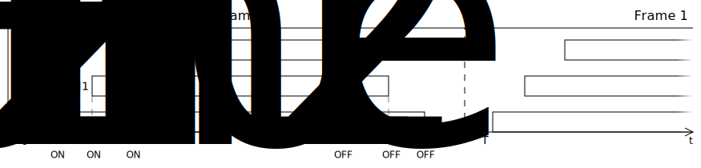
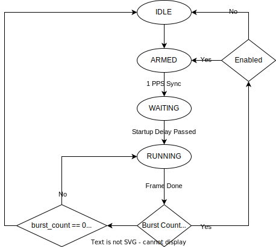

.. _axi_tdd:

AXI TDD
================================================================================

.. hdl-component-diagram::

The :git-hdl:`AXI Time-Division Duplexing <library/axi_tdd>` Controller IP core
is a pulse wave generator capable of addressing RF applications which require
Time Division Duplexing, as well as controlling other modules of general
applications through its dedicated 32 channel outputs.

The reason of creating the generic TDD controller was to reduce the naming
confusion around the existing repurposed
:dokuwiki:`TDD core <resources/eval/user-guides/ad-pzsdr2400tdd-eb/reference_hdl#TDD Controller>`
built for AD9361, as well as expanding its number of output channels for systems
which require more than six controlling signals.

.. note::

   TDD (Time-Division Duplex) mode allows the user to control the time period of
   the receive and transmit bursts.

Features
--------------------------------------------------------------------------------

* Up to 32 independent output channels
* Start/stop time values per channel
* Enable and polarity bit values per channel
* 32 bit-max internal reference counter
* Initial startup delay before wave generation
* Configurable frame length and number of frames per burst
* 3 sources of synchronization: external, internal and software generated

Files
--------------------------------------------------------------------------------

.. list-table::
   :header-rows: 1

   * - Name
     - Description
   * - :git-hdl:`library/axi_tdd/axi_tdd.sv`
     - Top module.
   * - :git-hdl:`library/axi_tdd/axi_tdd_pkg.sv`
     - SystemVerilog Package.
   * - :git-hdl:`library/axi_tdd/axi_tdd_regmap.sv`
     - Register Map with CDC synchronizers.
   * - :git-hdl:`library/axi_tdd/axi_tdd_counter.sv`
     - Internal counters and FSM logic.
   * - :git-hdl:`library/axi_tdd/axi_tdd_channel.sv`
     - Channel waveform generator.
   * - :git-hdl:`library/axi_tdd/axi_tdd_sync_gen.sv`
     - Synchronization pulse generator.
   * - :git-hdl:`library/axi_tdd/axi_tdd_ip.tcl`
     - TCL script to generate the Vivado IP-integrator project.
   * - :git-hdl:`library/axi_tdd/axi_tdd_hw.tcl`
     - TCL script to generate the Quartus IP-integrator project.

Configuration Parameters
--------------------------------------------------------------------------------

.. hdl-parameters::

   * - ID
     - Instance identification number
   * - CHANNEL_COUNT
     - Number of channels
   * - DEFAULT_POLARITY
     - Initial channel polarity
   * - REGISTER_WIDTH
     - Internal counter and register width
   * - BURST_COUNT_WIDTH
     - Burst counter width
   * - SYNC_INTERNAL
     - Enable support for internal sync signal
   * - SYNC_EXTERNAL
     - Enable support for external sync signal
   * - SYNC_EXTERNAL_CDC
     - Enable synchronization of external sync signal
   * - SYNC_COUNT_WIDTH
     - Sync generator counter width

Interface
--------------------------------------------------------------------------------

.. hdl-interfaces::

   * - s_axi_aclk
     - System clock.
   * - s_axi_aresetn
     - System reset, synchronous active low reset.
   * - s_axi
     - AXI-Lite bus slave, memory mapped AXI-Lite bus that provides access to module's
       register map.
   * - clk
     - Core clock.
   * - resetn
     - Core reset, synchronous active low reset.
   * - sync_in
     - External synchronization input signal.
   * - sync_out
     - Module synchronization output signal.
   * - tdd_channel
     - Channels output.

Theory of Operation
--------------------------------------------------------------------------------

The central idea of the TDD controller is “frame”-based operation, i.e. all the
timing defined for the individual channels is relative to the beginning of a
frame. The ``FRAME_LENGTH`` value controls the length of a single frame, while
the ``BURST_COUNT`` value controls how many frames should be played after
enabling the device (a value of 0 means the frames will be repeated indefinitely).
Before the start of a burst, an optional startup delay is inserted, defined by
the ``STARTUP_DELAY`` value in clock cycles.

This diagram illustrates how different channels can be enabled at different
times relative to the beginning of a frame.

.. note::

   While the above graphic shows all channels being enabled in a stacked
   manner, they are completely independent of each other.

Detailed Description
--------------------------------------------------------------------------------

In order to begin its operation, the peripheral must be enabled. This is done by
setting the ``ENABLE`` bit. Next, the peripheral waits to receive a synchronization
signal. There are 3 possible sync sources, which can be independently activated
through their corresponding enabling bits: ``SYNC_INT``, ``SYNC_EXT`` and ``SYNC_SOFT``
can all be active at the same time.

The external synchronization capability allows the alignment of frames between
multiple devices in different locations, for example using a GPSDO 1 PPS output.
The internal sync signal is generated based on a dedicated counter, when its
value matches the one defined in ``SYNC_PERIOD_LOW`` / ``SYNC_PERIOD_HIGH``.
The software generated sync pulse is triggered at an arbitrary point in time
when writing a ‘1’ value in ``SYNC_SOFT``.

The next diagram shows the peripheral’s FSM, which transitions between 4 states:
IDLE, ARMED, WAITING and RUNNING.

In case a synchronization signal is received while the TDD core is running, the
signal can reset the internal counter to zero by setting ``SYNC_RST`` to ‘1’.
This can alter the counter value in both WAITING or RUNNING states.

The generic TDD controller can have up to 32 output channels, each of them
having its unique values when the channel is set/reset under ``CHX_ON`` /
``CHX_OFF``. They are continuously compared to the internal counter’s value
while the core is RUNNING.

Every bit in ``CHANNEL_ENABLE`` / ``CHANNEL_POLARITY`` corresponds to a specific
channel. The bit position is correlated to the channel index, so the LSB will
always be associated with CH0 and the MSB with CH31.

The following registers will not be updated unless the peripheral is disabled:

- ``BURST_COUNT``
- ``STARTUP_DELAY``
- ``FRAME_LENGTH``
- ``CHANNEL_POLARITY``
- ``SYNC_PERIOD_LOW``
- ``SYNC_PERIOD_HIGH``
- ``CHX_ON``
- ``CHX_OFF``

The user must configure them before enabling the peripheral. Any subsequent
write while the peripheral is enabled will be ignored.

An exception to this rule is ``CHANNEL_ENABLE``, which allows enabling /
disabling independent channels on-the-fly. The new value will come into effect
when in ARMED state or at the end of a frame. ``CONTROL`` can also be modified
on-the-fly with immediate effect (after going through the synchronization stage).

``STATUS`` can be used for debugging purposes, reflecting the current peripheral
state.

By adapting the synthesis parameters to the application requirements, the module
is highly flexible and can substantially reduce resource utilization.

Register Map
--------------------------------------------------------------------------------

.. hdl-regmap::
   :name: TDDN_CNTRL

References
--------------------------------------------------------------------------------

* HDL IP core at :git-hdl:`library/axi_tdd`
* :dokuwiki:`Generic Time-Division Duplexing Controller on wiki <resources/fpga/docs/axi_tdd>`
