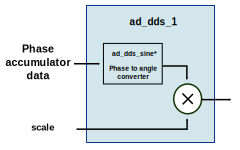

.. _ad_dds:

AD Direct Digital Synthesis
===============================================================================

The :git-hdl:`AD Direct Digital Synthesis (DDS) <library/common/ad_dds.v>` module
is used to generate sine waves on a clock (referenced to sampling clock).

Typically, in the reference designs each HDL DAC interface IP has a DDS for every
channel.

The resulting sine wave can be changed at runtime by 4 parameters:

* frequency word (FW)
* phase shift
* scale (the peak to peak amplitude of the sine wave)
* clock frequency (sampling rate - where possible)

DDS basics
-------------------------------------------------------------------------------

A generic DDS consists of a phase accumulator and a phase to amplitude
converter.

The phase accumulator is basically a counter that increments by a frequency word
which determines a timely overflow (the actual period of the resulting signal).

The phase to amplitude converter is a bit more complex and is the main consumer
of FPGA resources out of the DDS modules.

Currently in the reference designs, there is support for 2 types of phase to
amplitude converters, polynomial and
`CORDIC <https://en.wikibooks.org/wiki/Digital_Circuits/CORDIC>`__. The
polynomial type uses more DSPs and way less LUTs and FFs in comparison to the
CORDIC. Regarding precision/accuracy, CORDIC is better.

.. note::

   The CORDIC implementation is not optimal. The CORDIC phase to
   amplitude converter outputs a sine and a cosine, which can be used as I and Q.
   But because the DAC channel reference design requires dual tone + independent
   I/Q control, only the sine component is used out of a DDS instance, and
   multiple DDS instances are added for each tone and independent I/Q channels.

ADI DDS module
-------------------------------------------------------------------------------

Parameters
~~~~~~~~~~~~~~~~~~~~~~~~~~~~~~~~~~~~~~~~~~~~~~~~~~~~~~~~~~~~~~~~~~~~~~~~~~~~~~~

.. list-table::
   :header-rows: 1

   * - Name
     - Description
     - Default Value
   * - ``DISABLE``
     - Disable DDS
     - 0
   * - ``DDS_DW``
     - DDS out data bus width range 8-24
     - 16
   * - ``PHASE_DW``
     - DDS phase accumulator data width range 8-32.
     - 16
   * - ``DDS_TYPE``
     - 1 for CORDIC or 2 for Polynomial.
     - 1
   * - ``CORDIC_DW``
     - CORDIC stages data width, range 8-24
     - 16
   * - ``CORDIC_PHASE_DW``
     - Number of CORDIC stages, range 8-32
     - 16
   * - ``CLK_RATIO``
     - The clock ratio between the device clock (axi core clock ~= sample rate)
        and the interface clock.
     - 0

Interface
~~~~~~~~~~~~~~~~~~~~~~~~~~~~~~~~~~~~~~~~~~~~~~~~~~~~~~~~~~~~~~~~~~~~~~~~~~~~~~~

.. list-table::
   :header-rows: 1

   * - Interface
     - Type
     - Description
   * - ``clk``
     - ``input``
     - Input clock
   * - ``dac_dds_format``
     - ``input``
     - Two's complement (0) or offset binary (1)
   * - ``dac_data_sync``
     - ``input``
     - Data sync/external phase sync
   * - ``dac_valid``
     - ``input``
     - Valid signal (ready for new data)
   * - ``tone_1_scale``
     - ``input[15:0]``
     - Tone 1 scale
   * - ``tone_2_scale``
     - ``input[15:0]``
     - Tone 2 scale
   * - ``tone_1_init_offset``
     - ``input[31:0]``
     - Tone 1 initial offset (phase shift)
   * - ``tone_2_init_offset``
     - ``input[31:0]``
     - Tone 2 initial offset (phase shift)
   * - ``tone_1_freq_word``
     - ``input[31:0]``
     - Tone 1 frequency word
   * - ``tone_2_freq_word``
     - ``input[31:0]``
     - Tone 2 frequency word
   * - ``dac_dds_data``
     - ``output[DDS_DW*CLK_RATIO-1:0]``
     - Out sine wave

Control
~~~~~~~~~~~~~~~~~~~~~~~~~~~~~~~~~~~~~~~~~~~~~~~~~~~~~~~~~~~~~~~~~~~~~~~~~~~~~~~

In the reference designs, the DDS is controlled through the register map
(DAC channel section).

.. hdl-regmap::
   :name: DAC_CHANNEL

Config
-------------------------------------------------------------------------------

DDS_SCALE
~~~~~~~~~~~~~~~~~~~~~~~~~~~~~~~~~~~~~~~~~~~~~~~~~~~~~~~~~~~~~~~~~~~~~~~~~~~~~~~

The DDS scale for a tone contributes to the amplitude of the channel (I or Q -
where it applies).

The format is 1.1.14 fixed point. See below:

+-------------------------------------------------+
| 16 bit register = scale value                   |
+============+===============+====================+
| 1 bit sign | 1 bit integer | 14 bits fractional |
+------------+---------------+--------------------+

The DDS scale is on 16 bits.

The channel output is equal to
tone_1_fullscale \* scale_1) + (tone_2_fullscale \* scale_2).

The phase to amplitude converter always outputs the full-scale (unity sine)
sine wave, independent on the phase and data widths.

.. note::

   If you do use both tones and set both scales to 0x4000, the channel
   output will over-range.

16'h4000 \* 1 + 16'h4000 \* 1 = 16'h8000 = 16'h1000000000000000

#. sign = 1'b1
#. integer = 1'b0
#. fract = 14'b0

PHASE - DDS_INIT
~~~~~~~~~~~~~~~~~~~~~~~~~~~~~~~~~~~~~~~~~~~~~~~~~~~~~~~~~~~~~~~~~~~~~~~~~~~~~~~

All tones/channels start on a sync event (internal or external).
The DDS_INIT value will be used by the phase accumulator as a starting point in
other words as a phase offset.

The offset can be determined from the phase accumulator capacity 0 to
:math:`2^{phaseDW}` represents (0° - 360°).

e.g., for 90°. :math:`init = (90 * 2^{phaseDW})/360`.

FREQUENCY - DDS_INCR
~~~~~~~~~~~~~~~~~~~~~~~~~~~~~~~~~~~~~~~~~~~~~~~~~~~~~~~~~~~~~~~~~~~~~~~~~~~~~~~

The value can be calculated by:

.. math::

   INCR = \frac{(f_{out} * 2^{phaseDW}) * clkratio}{f_{if}}

Where:

#. f_out is the generated output frequency
#. phaseDW (``DDS_PHASE_DW``) value can be found in ``CHAN_CNTRL_1`` in case
   ``DDS_PHASE_DW`` is not eq. 16
#. f_if is the frequency of the digital interface
#. clock_ratio is the ratio between the sampling clock and the interface clock.

STRUCTURE
~~~~~~~~~~~~~~~~~~~~~~~~~~~~~~~~~~~~~~~~~~~~~~~~~~~~~~~~~~~~~~~~~~~~~~~~~~~~~~~

Below is the hierarchical structure of the modules.

.. code::

  * ad_dds ->
    * ad_dds_2 ->
      * ad_dds_1 ->
        * ad_dds_sine_*

ad_dds
~~~~~~~~~~~~~~~~~~~~~~~~~~~~~~~~~~~~~~~~~~~~~~~~~~~~~~~~~~~~~~~~~~~~~~~~~~~~~~~

:git-hdl:`ad_dds <library/common/ad_dds.v>`
is the main module, it contains the phase accumulators and the phase to
amplitude converters.

ad_dds_2
~~~~~~~~~~~~~~~~~~~~~~~~~~~~~~~~~~~~~~~~~~~~~~~~~~~~~~~~~~~~~~~~~~~~~~~~~~~~~~~

:git-hdl:`ad_dds_2 <library/common/ad_dds_2.v>`
contains two phase to amplitude converters. The resulting waveforms will be
summed. The resulting waveform must have a maximum amplitude level of 0x8000
-1. When only one tone is desired, both tones must have the same frequency word
and shift, there is no constraint for the amplitude, but if is equal for both
channels, it should not be more than 0x400 -1 for each channel.

ad_dds_1
~~~~~~~~~~~~~~~~~~~~~~~~~~~~~~~~~~~~~~~~~~~~~~~~~~~~~~~~~~~~~~~~~~~~~~~~~~~~~~~

:git-hdl:`ad_dds_1 <library/common/ad_dds_1.v>`
contains the phase to amplitude converter and an "amplifier". The phase to
amplitude converter is always generating a full scale sine wave. Because the
data format is two's complement, for a 16-bit data angle, min value will be
-(2^16)/2 and max (2^16)/2-1.

ad_dds_sine_*
~~~~~~~~~~~~~~~~~~~~~~~~~~~~~~~~~~~~~~~~~~~~~~~~~~~~~~~~~~~~~~~~~~~~~~~~~~~~~~~

:git-hdl:`ad_dds_sine <library/common/ad_dds_sine.v>`
and
:git-hdl:`ad_dds_sine_cordic <library/common/ad_dds_sine_cordic.v>`
are the available phase to amplitude converters.

CLOCK RATIO
-------------------------------------------------------------------------------

The clock ratio (number of data paths processed in parallel) instantiates more
DDS logic, but it is controlled by the same register map for all
CLOCK_RATIO/DATA_PATH parameters.

Where is the CLOCK_RATIO > 1? This scenario can be found in every high speed DAC
design. It is required because the FPGA fabric can't work at the same speed as
that of the high-speed converter (typically > 250M).

Let's take the DAQ2 (AD9144) as an example, where the clock ratio is 4. This
ratio is chosen for the maximum sampling frequency 1GSPS; this results in an
internal clock of 250MHz (device clock), which is closer to the upper limit of
what some FPGAs can handle. So, in one clock cycle (250M) it needs to generate 4
consecutive samples to keep up with the DAC. This is done by 4 DDS modules.
The phase accumulator part is all in one place and the phase to
amplitude converters have dedicated sub-modules, as described above. When the
frequency is changed by software, the 4 phase accumulators are aligned for the new
frequency word and/or frequency phase shift. The counter increment value will be
multiplied with the clock ratio (4), to get a continuity of the 4 consecutive
samples generated at t, t+1, t+2, and so on.

For scenarios where the synchronization signal comes from an external source and
it is high for a longer period of time, the phase accumulator stages will be
hold in reset, to avoid a noise-like signal, caused by sending all the
summed outputs of each DDS stage.

There is a minimum synchronization pulse width (delay) of **n** clock cycles,
that is required to synchronize all phase accumulator stages, where **n** is
equal to the CLOCK_RATIO.

.. wavedrom

   {
     "signal" : [
       { "name": "clk",        "wave": "P....................."},
       { "name": "external sync","wave": "0.1..|..0............."},
       { "name": "phase init",  "wave": "0.......1...0........."},
       { "name": "tone 1 gen0",  "wave": "=.......4=..44|4444444","data":["","i0","","i0+","i0+","i0+","..."]},
       { "name": "tone 1 gen1",  "wave": "=........4=.44|4444444","data":["","i1","","i1+","i1+","i1+","..."]},
       { "name": "tone 1 gen2",  "wave": "=.........4=44|4444444","data":["","i2","","i2+","i2+","i2+","..."]},
       { "name": "tone 1 gen3",  "wave": "=..........444|4444444","data":["","i3","i3+","i3+","i3+","..."]},
       { "name": "tone 1",     "wave": "=.......======|4444444","data":["","0","0","0","0","0","...","s0-3","s4-8","s8-C","..."]},
       { "name": "tone 2 gen0",  "wave": "=.......5=..55|5555555","data":["","i0","","i0+","i0+","i0+","..."]},
       { "name": "tone 2 gen1",  "wave": "=........5=.55|5555555","data":["","i1","","i1+","i1+","i1+","..."]},
       { "name": "tone 2 gen2",  "wave": "=.........5=55|5555555","data":["","i2","","i2+","i2+","i2+","..."]},
       { "name": "tone 2 gen3",  "wave": "=..........555|5555555","data":["","i3","i3+","i3+","i3+","..."]},
       { "name": "tone 2",     "wave": "=.......======|5555555","data":["","0","0","0","0","0","...","s0-3","s4-8","s8-C","..."]},
       ]
   }

   text: ['tspan', 'Frequency word sync at CLK_RATIO=4'],

In the above diagram example:

* CLOCK_RATIO = 4
* i0 = phase offset
* i1 = i0 + FW
* i2 = i1 + FW
* i3 = i2 + FW

Each **i** is on 16 bits and each "s"(0-3) is on 64 bits.
i(t)+ is the value of the previous i(t) plus the increment (FW*CLOCK_RATIO).

It should be mentioned that after the phase init fall-edge, until the first
valid sample, there is a delay caused by the phase to angle converter type and
in the case of the CORDIC type, the number of rotation stages will also have a
direct impact on this clock period delay.

References
--------------------------------------------------------------------------------

* HDL IP core at :git-hdl:`library/common/ad_dds.v` and :git-hdl:`library/common/ad_dds_1.v`
  and :git-hdl:`library/common/ad_dds_2.v`
* :dokuwiki:`Direct digital synthesis on wiki <resources/fpga/docs/dds>`
