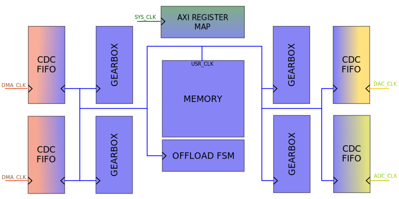
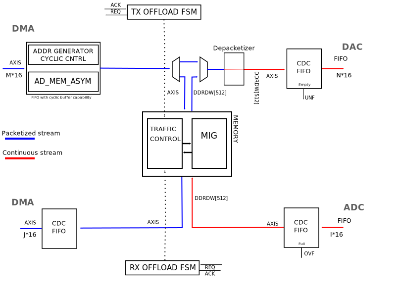

.. _data_offload:

Data Offload
================================================================================

.. hdl-component-diagram::

The :git-hdl:`Data Offload Engine <library/data_offload>` is, in essence, a
clock-domain crossing store-and-forward buffer (or FIFO) with some extra features
useful in bursty RF applications. More specifically, it was designed to sit
between the DMA and the DAC for the TX and between the ADC and the DMA for the
RX path of a digital RF chain. This is reflected in the synthesis settings of the
device, that also enable or disable certain other settings of features where
appropriate. For example, in the receive path cyclic operation isn't supported.

Features
--------------------------------------------------------------------------------

* Configurable storage unit with support for Block-RAM and External DRAM (Up to
  16 GiB) or external High Bandwidth Memory (HBM)
* Configurable interface width and rates
* External timing synchronization for precisely timed buffers (For example, in
  combination with the Timing-Division Duplexing Controller)
* Cyclic and oneshot store and forward operation
* Bypass mode to completely bypass all features and act as a pure CDC FIFO
* Many settings configurable at runtime via MM AXI4-Lite bus

.. note::

   The data offload does NOT support, in its current state, continuous streaming
   except when in bypass mode (thus disabling all other functionality).

Utilization
--------------------------------------------------------------------------------

.. list-table::
   :header-rows: 1

   * - Device Family
     - LUTs
     - FFs
   * - Xilinx Zynq UltraScale+
     - 750
     - 2000

Files
--------------------------------------------------------------------------------

.. list-table::
   :header-rows: 1

   * - Name
     - Description
   * - :git-hdl:`library/data_offload/data_offload.v`
     - Verilog source for the peripheral.
   * - :git-linux:`drivers/misc/adi-axi-data-offload.c`
     - Linux Driver.
   * - :git-linux:`arch/arm64/boot/dts/xilinx/zynqmp-zcu102-rev10-ad9081-m8-l4-do.dts`
     - Example device tree using the data offload.

Block Diagram
--------------------------------------------------------------------------------

Configuration Parameters
--------------------------------------------------------------------------------

.. hdl-parameters::

   * - ID
     - Instance identification number.
   * - MEM_TYPE
     - Define the used storage type: 0: BlockRAM; 1: external DDR.
   * - MEM_SIZE_LOG2
     - Define the log2 size of the storage element in bytes.
   * - TX_OR_RXN_PATH
     - If set TX path enabled, otherwise RX.
   * - SRC_DATA_WIDTH
     - The data width of the source interface.
   * - DST_DATA_WIDTH
     - The data width of the destination interface.
   * - DST_CYCLIC_EN
     - Enables CYCLIC mode for destinations like DAC.
   * - AUTO_BRINGUP
     - If enabled the IP runs automatically after bootup.
   * - SYNC_EXT_ADD_INTERNAL_CDC
     - If enabled the CDC circuitry for the external sync signal is added.
   * - HAS_BYPASS
     - If enabled the bypass circuitry is added.

Interface
--------------------------------------------------------------------------------

.. hdl-interfaces::

   * - s_axi_aclk
     - AXI4-Lite clock signal.
   * - s_axi_aresetn
     - Control-Domain Reset Input.
   * - s_axi
     - Memory mapped AXI4-Lite control interface.
   * - init_req
     - Indicator that the signal source (e.g. DMA) intends to provide new data soon.
   * - sync_ext
     - External synchronization signal, with or without internal clock-domain
       crossing logic. Can be used to couple certain state machine transitions to
       external processes.
   * - ddr_calib_done
     - Allows the user to read back status information about the DDR calibration
       status from software.
   * - s_axis_aclk
     - Source Domain Clock Signal Input.
   * - s_axis
     - AXI4-Stream subordinate data input.
   * - m_axis_aclk
     - Destination Domain Clock Signal Input.
   * - m_axis
     - AXI4-Stream manager output stream.

Register Map
--------------------------------------------------------------------------------

.. hdl-regmap::
   :name: DO

Detailed Description
--------------------------------------------------------------------------------

General Use Cases
~~~~~~~~~~~~~~~~~~~~~~~~~~~~~~~~~~~~~~~~~~~~~~~~~~~~~~~~~~~~~~~~~~~~~~~~~~~~~~~~

.. note::

   This IP will always have a storage unit (internal or external to the
   FPGA) and is designed to handle high data rates. If your data paths will run
   in a lower data rate, and your intention is just to transfer the data to another
   clock domain or to adjust the bus width of the data path, you may want to check
   out the util_axis_fifo or util_axis_fifo_asym IPs.

The initialization and data transfer looks as follows:

* in case of DAC, the DMA initializes the storage unit, after that the controller
  will push the data to the DAC interface in one-shot or cyclic way.
* in case of ADC, the DMA requests a transfer, the controller saves the data into
  the storage unit, after that it will push it to the DMA.
* BYPASS mode: simple streaming FIFO in case of clock rate or data width
  differences between source and sink interfaces (data rate MUST match in order
  to work); the BYPASS mode is used when an initially high rate path is downgraded
  to lower rates.

Generic Architecture
~~~~~~~~~~~~~~~~~~~~~~~~~~~~~~~~~~~~~~~~~~~~~~~~~~~~~~~~~~~~~~~~~~~~~~~~~~~~~~~~

The main role of our data paths is to stream data from point A to point B in a
particular system. There are always a SOURCE and a DESTINATION point, which can
be a device (ADC or DAC), a DMA (for system memory) or any other data processing IP.

In the context of Data Offload IP, we don't need to know who is the source and
who is the destination. Both interfaces are AXI4 Stream interfaces, which can be
supported in both Xilinx's an Intel's architecture, and can be connected to any
device core or DMA.

The storage unit is connected to the Data Offload controller via two AXIS interfaces.
This way the same controller can be used for various storage solutions. (BRAM,
URAM, external memory etc.)

Interfaces and Signals
~~~~~~~~~~~~~~~~~~~~~~~~~~~~~~~~~~~~~~~~~~~~~~~~~~~~~~~~~~~~~~~~~~~~~~~~~~~~~~~~

Register Map Configuration Interface
^^^^^^^^^^^^^^^^^^^^^^^^^^^^^^^^^^^^^^^^^^^^^^^^^^^^^^^^^^^^^^^^^^^^^^^^^^^^^^^^

AXI4 Lite Memory Mapped Subordinate (S_AXI4_LITE)
''''''''''''''''''''''''''''''''''''''''''''''''''''''''''''''''''''''''''''''''

This interface is used to access the register map.

.. code:: verilog

   // interface clock -- system clock -- 100 MHz
   input                   s_axi_aclk
   // interface resetn -- synchronous reset active low
   input                   s_axi_aresetn

   /* write address channel */

   // validates the address on the bus
   input                   s_axi_awvalid
   // write address
   input       [15:0]      s_axi_awaddr
   // protection type -- not used in the core
   input       [ 2:0]      s_axi_awprot
   // write ready, indicates that the subordinate can accept the address
   output                  s_axi_awready

   /* write data channel */

   // validate the data on the bus
   input                   s_axi_wvalid
   // write data
   input       [31:0]      s_axi_wdata
   // write strobe, indicates which byte lanes to update
   input       [ 3:0]      s_axi_wstrb
   // write ready, indicates that the subordinate can accept the data
   output                  s_axi_wready

   /* write response channel */

   // validates the write response of the subordinate
   output                  s_axi_bvalid
   // write response, indicates the status of the transfer
   output      [ 1:0]      s_axi_bresp
   // response ready, indicates that the manager can accept the data
   input                   s_axi_bready

   /* read address channel */

   // validates the address on the bus
   input                   s_axi_arvalid
   // read address
   input       [15:0]      s_axi_araddr
   // protection type -- not used in the core
   input       [ 2:0]      s_axi_arprot
   // read ready, indicates that the subordinate can accept the address
   output                  s_axi_arready

   /* read data channel */

   // validates the data on the bus
   output                  s_axi_rvalid
   // read response, indicates the status of the transfer
   output      [ 1:0]      s_axi_rresp
   // read data driven by the subordinate
   output      [31:0]      s_axi_rdata
   // read ready, indicates that the manager can accept the data
   input                   s_axi_rready

Supported Data Interfaces
^^^^^^^^^^^^^^^^^^^^^^^^^^^^^^^^^^^^^^^^^^^^^^^^^^^^^^^^^^^^^^^^^^^^^^^^^^^^^^^^

AXI4 Stream Interface (S_AXIS | M_AXIS)
''''''''''''''''''''''''''''''''''''''''''''''''''''''''''''''''''''''''''''''''

* The AXI Stream Subordinate (S_AXIS) interface is used to receive AXI stream
  from the transmit DMA or ADC device.
* The AXI Stream Manager (M_AXIS) interface is used to transmit AXI stream to
  receive DMA or DAC device.

.. code:: verilog

   // NOTE: this reference is a manager interface

   // interface clock -- can be device/core clock or DMA clock
   input                        m_axis_aclk
   // interface resetn -- synchronous reset with the system clock
   input                        m_axis_resetn
   // indicates that the subordinate can accept a transfer in the current cycle (in case of an ADC core, this will control the stream)
   input                        m_axis_ready
   // indicates that the manager is driving a valid transfer
   output                       m_axis_valid
   // primary payload
   output [DATA_WIDTH-1:0]      m_axis_data
   // indicates the boundary of a packet
   output                       m_axis_last
   // byte qualifier, we need this so we can have different DMA and device data widths
   output [(DATA_WIDTH/8)-1:0]  m_axis_tkeep

.. note::

   A packet will always be a full buffer. All the data beats are going to be
   full beats (all the bytes of the bus are valid), except for the last one.
   **axis_last** and **axis_tkeep** will be used to indicate a partial last beat.
   This information should be transferred from the source domain to the sink domain,
   so we can read back the data from memory correctly.

AXIS Source and Destination Interface to the Storage Unit
''''''''''''''''''''''''''''''''''''''''''''''''''''''''''''''''''''''''''''''''

This is a blocking (back-pressure) interface for the storage unit, with similar
behavior of main AXIS data interfaces.

Initialization Request Interface
^^^^^^^^^^^^^^^^^^^^^^^^^^^^^^^^^^^^^^^^^^^^^^^^^^^^^^^^^^^^^^^^^^^^^^^^^^^^^^^^

Defines a simple request interface to initialize the memory:

* The request will come from the system and will put the data offload FSM into
  a standby/ready state.

Synchronization Modes
''''''''''''''''''''''''''''''''''''''''''''''''''''''''''''''''''''''''''''''''

* **AUTOMATIC**

  * ADC: The IP will start to fill up the buffer with samples as soon as possible.
  * DAC: As the DMA will send a valid last, the FSM will start to send the stored
    data to the device.

* **HARDWARE**

  * ADC and DAC: An external signal will trigger the write or read into or from
    the memory.

* **SOFTWARE**

  * The software writes a RW1C register which will trigger the reads or writes
    into or from the memory.

.. note::

   In case of DAC, if the DMA does not send all the data into the buffer, before
   a hardware sync event, then the unsent data will be ignored. It's the
   user/software responsibility to sync up these events accordingly.

Clock Tree
~~~~~~~~~~~~~~~~~~~~~~~~~~~~~~~~~~~~~~~~~~~~~~~~~~~~~~~~~~~~~~~~~~~~~~~~~~~~~~~~

In general there are at least two different clocks in the data offload module:

  * DMA or system clock : on this clock will run all the front end interfaces
  * Memory Controller user clock : user interface clock of the DDRx controller
    (**optional**)
  * Device clock : the digital interface clock of the converter

A general frequency relationship of the above clocks are:

.. code::

  CLKdma <= CLKddr <= CLKconverter

The clock domain crossing should be handled by the
:git-hdl:`util_axis_fifo <library/util_axis_fifo>` module.

All the back end paths (device side) are time critical. The module must read or
write from or into the storage at the speed of the device.

.. code::

  DDR data rate >= Device data rate
  DDR data rate >= ADC data rate + DAC data rate

Data Path
~~~~~~~~~~~~~~~~~~~~~~~~~~~~~~~~~~~~~~~~~~~~~~~~~~~~~~~~~~~~~~~~~~~~~~~~~~~~~~~~

* The data path should be designed to support any difference between the source,
  memory and sink data width.

* The data width adjustments will be made by the CDC FIFO.

* In both paths (ADC and DAC) the data stream at the front-end side is packetized,
  meaning there is a valid TLAST/TKEEP in the stream. While in the back-end side
  the stream is continuous (no TLAST/TKEEP).

  * The DAC path has to have a depacketizer to get rid of the last partial beat
    of the stream.
  * Because the ADC path already arrives in a packed form, and we always will
    fill up the whole storage, we don't need to treat special use-cases.

Used Storage Elements
^^^^^^^^^^^^^^^^^^^^^^^^^^^^^^^^^^^^^^^^^^^^^^^^^^^^^^^^^^^^^^^^^^^^^^^^^^^^^^^^

+-----------------------+--------------------+-------------------+------------------+
|                       |        ZC706       |       ZCU102      |      A10SOC      |
+=======================+====================+===================+==================+
|         FPGA          | XC7Z045 FFG900 – 2 | XCZU9EG-2FFVB1156 | 10AS066N3F40E2SG |
+-----------------------+--------------------+-------------------+------------------+
| External Memory Type  |     DDR3 SODIMM    |        DDR4       |    DDR4 HILO     |
+-----------------------+--------------------+-------------------+------------------+
| External Memory Size  |        1 GB        |       512 MB      |       2 GB       |
+-----------------------+--------------------+-------------------+------------------+
| Embedded Memory Type  |        BRAM        |        BRAM       |       M20K       |
+-----------------------+--------------------+-------------------+------------------+
| Embedded Memory Size  |       19.1 Mb      |       32.1 Mb     |       41 Mb      |
+-----------------------+--------------------+-------------------+------------------+

Data Width Manipulation
^^^^^^^^^^^^^^^^^^^^^^^^^^^^^^^^^^^^^^^^^^^^^^^^^^^^^^^^^^^^^^^^^^^^^^^^^^^^^^^^

* Data width differences should be treated by the CDC FIFO.
* The smallest granularity should be 8 bits. This constraint will mainly generate
  additional logic just in the TX path, taking the fact that the data from the ADC
  will come packed.
* The main role of the gearbox is to improve the DDR's bandwidth, stripping the
  padding bits of each samples, so the raw data could be stored into the memory.

Xilinx's MIG vs. Intel's EMIF
^^^^^^^^^^^^^^^^^^^^^^^^^^^^^^^^^^^^^^^^^^^^^^^^^^^^^^^^^^^^^^^^^^^^^^^^^^^^^^^^

* Incrementing burst support for 1 to 256 beats, the length of the burst should
  be defined by the internal controller.
* Concurrent read/write access, the external memory to be shared between an ADC
  and DAC.
* Dynamic burst length tuning: an FSM reads and writes dummy data until both
  ADC's overflow and DAC's underflow lines are de-asserted. Pre-requisites: both
  devices' interfaces should be up and running.
* Optional gearbox to congest the samples in order to increase the maximum data rate.
* In general all samples are packed into 16 bits. This can add a significant
  overhead to the maximum real data rate on the memory interface. The gearbox's
  main role is to pack and unpack the device's samples into the required data width
  (in general 512 or 1024 bits).

Boards with FPGA side DDR3/4 SODIMMs/HILO: ZC706, ZCU102, A10SOC.

+------------------------------+-----------+------------+-------------------+
|                              |   ZC706   |   ZCU102   |      A10SOC       |
+==============================+===========+============+===================+
| Max data throughputs (MT/s)  |   1600    |    2400    |       2133        |
+------------------------------+-----------+------------+-------------------+
| DDRx reference clocks        |  200 MHz  |   300 MHz  |      133 MHz      |
+------------------------------+-----------+------------+-------------------+
| DDRx Data bus width          |    64     |     16     |        64         |
+------------------------------+-----------+------------+-------------------+
| Memory to FPGA clock ratio   |    4:1    |     4:1    |        4:1        |
+------------------------------+-----------+------------+-------------------+
| UI type & burst length       | AXI4-256  |  AXI4-256  | Avalon Memory Map |
+------------------------------+-----------+------------+-------------------+
| UI data width                |    512    |     128    |        512        |
+------------------------------+-----------+------------+-------------------+

Internal Cyclic Buffer Support for the TX Path
^^^^^^^^^^^^^^^^^^^^^^^^^^^^^^^^^^^^^^^^^^^^^^^^^^^^^^^^^^^^^^^^^^^^^^^^^^^^^^^^

* On the front end side of the TX path, a special buffer will handle the data
  width up/down conversions and run in cyclic mode if the length of the data set
  is smaller than 4/8 AXI/Avalon bursts. This way, we can avoid to overload the
  memory interface with small bursts.

* On the back end side, because the smallest granularity can be 8 bytes, we need
  a dynamic 'depacketizer' or re-aligner, which will filter out the invalid data
  bytes from the data stream (this module will use the tlast and tkeep signal of
  the AXI stream interface).

Control Path - Offload FSM
~~~~~~~~~~~~~~~~~~~~~~~~~~~~~~~~~~~~~~~~~~~~~~~~~~~~~~~~~~~~~~~~~~~~~~~~~~~~~~~~

.. list-table::

   * - .. figure:: tx_bram_fsm.svg

          TX Control FSM for Internal RAM Mode

     - .. figure:: rx_bram_fsm.svg

          RX Control FSM for Internal RAM Mode

Linux Driver
--------------------------------------------------------------------------------

The linux driver has two responsibilities:

* Initializes the data offload on startup.
* Integrates with cf_axi_dds to allow IIO to utilize the data offload for cyclic
  operation.

The former of those two is covered by the device tree, which implements five
options:

* ``adi,bringup`` will automatically enable the data offload on startup. Note
  that this option isn't always necessary, because the HDL itself may have been
  synthesized with auto-bringup.
* ``adi,oneshot`` configures the default mode of operation for TX data offloads.
  This will usually be overridden by the IIO buffer integration and thus doesn't
  have an effect in most situations.
* ``adi,bypass`` enables bypass mode, i.e. disables all functionality and makes
  the data offload act like a small asynchronous FIFO.
* ``adi,sync-config`` determines how the synchronization mechanism should operate.
  More information about this value can be found in the register map.
* ``adi,transfer-length`` is useful for RX instances, where the size of the receive
  buffer can be reduced from the default (All available storage).

The latter is addressed by the integration into
:git-linux:`cf_axi_dds.c <drivers/iio/frequency/cf_axi_dds.c>` and
:git-linux:`cf_axi_dds_buffer_stream.c <drivers/iio/frequency/cf_axi_dds_buffer_stream.c>`,
which allow the drivers to control the oneshot functionality of the data offload
based on what was requested with the current IIO buffer, assuming that bypass
was disabled.

References
--------------------------------------------------------------------------------

* HDL IP core at :git-hdl:`library/data_offload`
* :dokuwiki:`Data Offload Engine on wiki <resources/fpga/docs/data_offload>`
