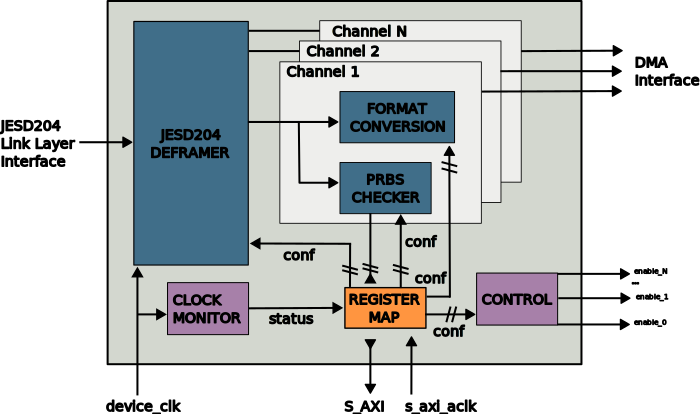

.. _ad_ip_jesd204_tpl_adc:

ADC JESD204B/C Transport Peripheral
================================================================================

.. hdl-component-diagram::

The ADC JESD204B/C Transport Peripheral implements the transport level handling
of a JESD204B/C transmitter device. It is compatible with a
:ref:`wide range of Analog Devices high-speed analog-to-digital converters <ad_ip_jesd204_tpl_adc_supported_devices>`.

The core handles the JESD204B/C deframing of the payload data.

The peripheral can be configured at runtime through a AXI4-Lite memory mapped
register map.

Features
--------------------------------------------------------------------------------

-  ADI high-speed ADC compatible JESD204B/C data deframing;
-  Test-pattern checker;
-  Per-channel data formatting (sign extension, two's complement to offset
   binary);
-  Runtime reconfigurability through memory-mapped register interface
   (AXI4-Lite).

Files
--------------------------------------------------------------------------------

.. important::

   To instantiate it, you need to use the procedure
   :git-hdl:`adi_tpl_jesd204_rx_create <library/jesd204/scripts/jesd204.tcl#L305>`

- :git-hdl:`ad_ip_jesd204_tpl_adc.v <library/jesd204/ad_ip_jesd204_tpl_adc/ad_ip_jesd204_tpl_adc.v>`

Block Diagram
--------------------------------------------------------------------------------

Synthesis Configuration Parameters
--------------------------------------------------------------------------------

.. hdl-parameters::

   * - ID
     - Instance identification number.
   * - NUM_LANES
     - Number of lanes supported by the peripheral.
       Equivalent to JESD204 ``L`` parameter.
   * - NUM_CHANNELS
     - Number of converters supported by the peripheral.
       Equivalent to JESD204 ``M`` parameter.
   * - SAMPLES_PER_FRAME
     - Number of samples per frame.
       Equivalent to JESD204 ``S`` parameter.
   * - CONVERTER_RESOLUTION
     - Resolution of the converter.
       Equivalent to JESD204 ``N`` parameter.
   * - BITS_PER_SAMPLE
     - Number of bits per sample.
       Equivalent to JESD204 ``NP`` parameter.
   * - OCTETS_PER_BEAT
     - Number of bytes per beat for each link.
   * - TWOS_COMPLEMENT
     - PRBS data format.
   * - PN7_ENABLE
     - Enable PN7 check.
   * - PN15_ENABLE
     - Enable PN15 check.

.. *- PN31_ENABLE
.. - Enable PN31 check.

Signal and Interface Pins
--------------------------------------------------------------------------------

.. hdl-interfaces::

   * - s_axi_aclk
     - All ``S_AXI`` signals are synchronous to this clock.
   * - s_axi_aresetn
     - Resets the internal state of the peripheral.
   * - s_axi
     - Memory mapped AXI-lite bus that provides access to modules register map.
   * - link
     - link_data: JESD204 link data interface (link layer interface).
   * - link_clk
     - :ref:`Device clock <jesd204 glossary>`
       for the JESD204B interface of the Link Layer Interface. Must
       be line clock/40 for correct 204B operation. Must be line
       clock/66 for correct 64b66b 204C operation.
   * - enable
     - Channel enable indicator of the Application layer Interface
   * - adc_valid
     - Qualifier signal for each channel of the Application layer
       interface. Always '1'.
   * - adc_data
     - Raw application layer data, every channel concatenated
       (Application layer interface).
   * - adc_dovf
     - Application layer overflow of the Application layer interface.

The S_AXI interface is synchronous to the s_axi_aclk clock. All other signals
and interfaces are synchronous to the device_clk clock.

Register Map
--------------------------------------------------------------------------------

.. hdl-regmap::
   :name: COMMON
   :no-type-info:

.. hdl-regmap::
   :name: ADC_COMMON
   :no-type-info:

.. hdl-regmap::
   :name: JESD_TPL
   :no-type-info:

.. hdl-regmap::
   :name: ADC_CHANNEL
   :no-type-info:

Theory of Operation
--------------------------------------------------------------------------------

Interfaces and Signals
~~~~~~~~~~~~~~~~~~~~~~~~~~~~~~~~~~~~~~~~~~~~~~~~~~~~~~~~~~~~~~~~~~~~~~~~~~~~~~~~

Configuration Interface
^^^^^^^^^^^^^^^^^^^^^^^^^^^^^^^^^^^^^^^^^^^^^^^^^^^^^^^^^^^^^^^^^^^^^^^^^^^^^^^^

The Peripheral features a register map configuration interface that can be
accessed through the AXI4-Lite ``S_AXI`` port. The register map can be used to
configure the Peripheral's operational parameters, query the current status of
the device and query the features supported by the device.

Link layer interface
^^^^^^^^^^^^^^^^^^^^^^^^^^^^^^^^^^^^^^^^^^^^^^^^^^^^^^^^^^^^^^^^^^^^^^^^^^^^^^^^

The link layer interface description can be found in the
:ref:`User Data Interface <axi_jesd204_rx_user_data>` section of the
:ref:`JESD204B/C Link Receive Peripheral <axi_jesd204_rx>` IP.

Application layer interface
^^^^^^^^^^^^^^^^^^^^^^^^^^^^^^^^^^^^^^^^^^^^^^^^^^^^^^^^^^^^^^^^^^^^^^^^^^^^^^^^

The application layer is connected to the deframer block output. The deframer
module creates sample data from the lane mapped and formatted JESD204 link data
based on the specified deframer configuration.

The data in the application layer interface ``adc_data`` has the following
layout:

::

       MSB                                                               LSB
     [ MmSn, ..., MmS1, MnS0, ..., M1Sn, ... M1S1, M1S0, M0Sn, ... M0S1, M0S0 ]

Where MjSi refers to the i-th sample of the j-th converter. With m being the
number of converters and n the number of samples per converter per beat.

The core asserts the ``enable`` signal for each channel that is enabled by the
software.

Clock Monitor
^^^^^^^^^^^^^^^^^^^^^^^^^^^^^^^^^^^^^^^^^^^^^^^^^^^^^^^^^^^^^^^^^^^^^^^^^^^^^^^^

The ``STATUS`` (``0x054``) register ``CLK_FREQ`` field allows to determine
the clock rate of the device clock (``link_clk``) relative to the AXI interface
clock (``s_axi_aclk``). This can be used to verify that the device clock is
running at the expected rate.

The number is represented as unsigned 16.16 format. Assuming a 100MHz processor
clock, this corresponds to a resolution of 1.523kHz per LSB. A raw value of 0
indicates that the link clock is currently not active.

Data Formatter
^^^^^^^^^^^^^^^^^^^^^^^^^^^^^^^^^^^^^^^^^^^^^^^^^^^^^^^^^^^^^^^^^^^^^^^^^^^^^^^^

The component is configured by the ``CHAN_CNTRL`` register
``FORMAT_SIGNEXT,FORMAT_TYPE,FORMAT_ENABLE`` fields. The block introduces one
clock cycle latency.

PRBS Check
^^^^^^^^^^^^^^^^^^^^^^^^^^^^^^^^^^^^^^^^^^^^^^^^^^^^^^^^^^^^^^^^^^^^^^^^^^^^^^^^

The block can monitor and compare the incoming deframed raw data against
PN9, PN23 and PN7, PN15 (if enabled) patterns selected by the ``ADC_PN_SEL``
field of ``CHAN_CNTRL_3`` register.

..
  it is missing PN31, because it does not exist on the source code

.. list-table::
   :header-rows: 1

   * - ADC_PN_SEL
     - PN
     - ENABLE
   * - 0
     - PN9
     - 1
   * - 1
     - PN23
     - 1
   * - 4
     - PN7
     - PN7_ENABLE
   * - 5
     - PN15
     - PN15_ENABLE

.. *-7
.. -PN31
.. -PN31_ENABLE

Before performing these tests you need to make sure that the ADC OUTPUT FORMAT
is set according to the ``TWOS_COMPLEMENT`` synthesis parameter.

For each channel, mismatches are reported in ``PN_ERR`` and ``PN_OOS`` fields of
the ``CHAN_STATUS`` register.

External synchronization
^^^^^^^^^^^^^^^^^^^^^^^^^^^^^^^^^^^^^^^^^^^^^^^^^^^^^^^^^^^^^^^^^^^^^^^^^^^^^^^^

An external synchronization signal ``adc_sync_in`` can be used to trigger data
movement from the link layer to user application layer.

The external synchronization signal should be synchronous with the ADC clock.
Synchronization will be done on the rising edge of the signal.

The self clearing ``SYNC`` control bit from the ``CNTRL (0x44)`` register,
will arm the trigger logic to wait for the external sync signal. The
``ADC_SYNC`` status bit from ``SYNC_STATUS (0x68)`` register, will show that
the synchronization is armed, but the synchronization signal has not yet been
received.

Once the sync signal is received, the data will start to flow and the
``ADC_SYNC`` status bit will reflect that with a deassertion.

While the synchronization mechanism is armed, the ``adc_rst`` output signal is
set such that downstream logic can be cleared, to have a fresh start once the
trigger is received.

Software Support
--------------------------------------------------------------------------------

.. warning::
   To ensure correct operation, it is highly recommended to use the
   Analog Devices provided JESD204B/C software packages for interfacing the
   peripheral. Analog Devices is not able to provide support in case issues arise
   from using custom low-level software for interfacing the peripheral.

Restrictions
--------------------------------------------------------------------------------

Reduced number of octets-per-frame (``F``) settings. The following values are
supported by the peripheral: 1, 2, 4

-  Starting from
   `this <https://github.com/analogdevicesinc/hdl/commit/454b900f90081fb95be857114e768f662178c8bd>`__
   commit this restriction no longer applies.

.. _ad_ip_jesd204_tpl_adc_supported_devices:

Supported Devices
--------------------------------------------------------------------------------

JESD204B Analog-to-Digital Converters
~~~~~~~~~~~~~~~~~~~~~~~~~~~~~~~~~~~~~~~~~~~~~~~~~~~~~~~~~~~~~~~~~~~~~~~~~~~~~~~~

-  :adi:`AD6673`: 80 MHz Bandwidth, Dual IF Receiver
-  :adi:`AD6674`: 385 MHz BW IF Diversity Receiver
-  :adi:`AD6676`: Wideband IF Receiver Subsystem
-  :adi:`AD6677`: 80 MHz Bandwidth, IF Receiver
-  :adi:`AD6684`: 135 MHz Quad IF Receiver
-  :adi:`AD6688`: RF Diversity and 1.2GHz BW Observation
   Receiver
-  :adi:`AD9207`: 12-Bit, 6 GSPS, JESD204B/JESD204C
   Dual Analog-to-Digital Converter
-  :adi:`AD9208`: 14-Bit, 3GSPS, JESD204B,
   Dual Analog-to-Digital Converter
-  :adi:`AD9209`: 12-Bit, 4GSPS, JESD204B/C, Quad
   Analog-to-Digital Converter
-  :adi:`AD9213`: 12-Bit, 10.25 GSPS, JESD204B, RF
   Analog-to-Digital Converter
-  :adi:`AD9234`: 12-Bit, 1 GSPS/500 MSPS JESD204B, Dual
   Analog-to-Digital Converter
-  :adi:`AD9250`: 14-Bit, 170 MSPS/250 MSPS, JESD204B, Dual
   Analog-to-Digital Converter
-  :adi:`AD9625`: 12-Bit, 2.6 GSPS/2.5 GSPS/2.0 GSPS,
   1.3 V/2.5 V Analog-to-Digital Converter
-  :adi:`AD9656`: Quad, 16-Bit, 125 MSPS JESD204B 1.8 V
   Analog-to-Digital Converter
-  :adi:`AD9680`: 14-Bit, 1.25 GSPS/1 GSPS/820 MSPS/500
   MSPS JESD204B, Dual Analog-to-Digital Converter
-  :adi:`AD9683`: 14-Bit, 170 MSPS/250 MSPS, JESD204B,
   Analog-to-Digital Converter
-  :adi:`AD9690`: 14-Bit, 500 MSPS / 1 GSPS JESD204B,
   Analog-to-Digital Converter
-  :adi:`AD9691`: 14-Bit, 1.25 GSPS JESD204B,
   Dual Analog-to-Digital Converter
-  :adi:`AD9694`: 14-Bit, 500 MSPS JESD204B, Quad
   Analog-to-Digital Converter
-  :adi:`AD9695`: 14-Bit, 1300 MSPS/625 MSPS,
   JESD204B, Dual Analog-to-Digital Converter Analog-to-Digital Converter
-  :adi:`AD9083`: 16-Channel, 125 MHz Bandwidth, JESD204B
   Analog-to-Digital Converter
-  :adi:`AD9094`: 8-Bit, 1 GSPS, JESD204B, Quad
   Analog-to-Digital Converter

JESD204B RF Transceivers
~~~~~~~~~~~~~~~~~~~~~~~~~~~~~~~~~~~~~~~~~~~~~~~~~~~~~~~~~~~~~~~~~~~~~~~~~~~~~~~~

-  :adi:`AD9371`: SDR Integrated, Dual RF Transceiver with
   Observation Path
-  :adi:`AD9375`: SDR Integrated, Dual RF Transceiver with
   Observation Path and DPD
-  :adi:`ADRV9009`: SDR Integrated, Dual RF Transceiver
   with Observation Path
-  :adi:`ADRV9008-1`: SDR Integrated, Dual RF Receiver
-  :adi:`ADRV9008-2`: SDR Integrated, Dual RF
   Transmitter with Observation Path

JESD204B/C Mixed-Signal Front Ends
~~~~~~~~~~~~~~~~~~~~~~~~~~~~~~~~~~~~~~~~~~~~~~~~~~~~~~~~~~~~~~~~~~~~~~~~~~~~~~~~

-  :adi:`AD9081`: MxFE™ Quad, 16-Bit, 12GSPS RFDAC and
   Quad, 12-Bit, 4GSPS RFADC
-  :adi:`AD9082`: MxFE™ QUAD, 16-Bit, 12GSPS RFDAC and
   DUAL, 12-Bit, 6GSPS RFADC
-  :adi:`AD9986`: 4T2R Direct RF Transmitter and
   Observation Receiver
-  :adi:`AD9988`: 4T4R Direct RF Receiver and Transmitter

More Information
--------------------------------------------------------------------------------

-  :ref:`JESD204 Interface Framework <jesd204>`
-  :ref:`Glossary of terms <jesd204 glossary>`
-  :ref:`HDL User Guide <user_guide>`

Technical Support
--------------------------------------------------------------------------------

Analog Devices will provide limited online support for anyone using the core
with Analog Devices components (ADC, DAC, Video, Audio, etc) via the
:ez:`EngineerZone <fpga>`.
