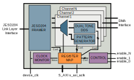

.. _ad_ip_jesd204_tpl_dac:

DAC JESD204B/C Transport Peripheral
================================================================================

.. hdl-component-diagram::

The DAC JESD204B/C Transport Peripheral (AD-IP-JESD204-TRANSPORT-DAC) implements
the transport level handling of a JESD204B/C transmitter device. It is
compatible with a
:ref:`wide range of Analog Devices high-speed digital-to-analog converters <ad_ip_jesd204_tpl_dac_supported_devices>`.

The core handles the JESD204B/C framing of the user-provided payload data. In
addition, it is capable of generating standard and user-defined test-pattern
data for interface verification. It also features a per-channel dual-tone DDS
that can be used to dynamically generate test-tones.

The peripheral can be configured at runtime through a AXI4-Lite memory mapped
register map.

Features
--------------------------------------------------------------------------------

- ADI high-speed DAC compatible JESD204B/C data framing;
- Test-pattern generator for interface verification;
- Per-channel dual-tone DDS (optional);
- Runtime reconfigurability through memory-mapped register interface
  (AXI4-Lite).

Files
--------------------------------------------------------------------------------

.. important::

   To instantiate it, you need to use the procedure
   :git-hdl:`adi_tpl_jesd204_tx_create <library/jesd204/scripts/jesd204.tcl#L176>`

- :git-hdl:`ad_ip_jesd204_tpl_dac.v <library/jesd204/ad_ip_jesd204_tpl_dac/ad_ip_jesd204_tpl_dac.v>`

Block Diagram
--------------------------------------------------------------------------------

Synthesis Configuration Parameters
--------------------------------------------------------------------------------

.. hdl-parameters::

   * - ID
     - Instance identification number.
   * - NUM_LANES
     - Number of lanes supported by the peripheral.
       Equivalent to JESD204 ``L`` parameter.
   * - NUM_CHANNELS
     - Number of converters supported by the peripheral.
     - Equivalent to JESD204 ``M`` parameter.
   * - SAMPLES_PER_FRAME
     - Number of samples per frame.
       Equivalent to JESD204 ``S`` parameter.
   * - CONVERTER_RESOLUTION
     - Resolution of the converter.
       Equivalent to JESD204 ``N`` parameter.
   * - BITS_PER_SAMPLE
     - Number of bits per sample.
       Equivalent to JESD204 ``NP`` parameter.
   * - OCTETS_PER_BEAT
     - Number of bytes per beat for each link.
   * - DDS_TYPE
     - DDS Type. Set 1 for CORDIC or 2 for Polynomial
   * - DDS_CORDIC_DW
     - CORDIC DDS Data Width.
   * - DDS_CORDIC_PHASE_DW
     - CORDIC DDS Phase Width.
   * - DATAPATH_DISABLE
     - Disable instantiation of DDS core.

Signal and Interface Pins
--------------------------------------------------------------------------------

.. hdl-interfaces::

    * - s_axi_aclk
      - All ``S_AXI`` signals and ``irq`` are synchronous to this clock.
    * - s_axi_aresetn
      - Resets the internal state of the peripheral.
    * - s_axi
      - Memory mapped AXI-lite bus that provides access to modules register map.
    * - link
      - link_data: Framed transmit data towards link layer.
    * - link_clk
      - :ref:`Device clock <jesd204 glossary>`
        for the JESD204B/C interface. Must be line clock/40 for 204B correct operation.
        Must be line clock/66 for correct 204C operation.
    * - enable
      - Request signal for each channel.
    * - dac_valid
      - Qualifier signal for each channel. Always '1'.
    * - dac_ddata
      - Raw application layer data, every channel concatenated.
    * - dac_dunf
      - Application layer underflow.

Register Map
--------------------------------------------------------------------------------

.. hdl-regmap::
   :name: COMMON
   :no-type-info:

.. hdl-regmap::
   :name: DAC_COMMON
   :no-type-info:

.. hdl-regmap::
   :name: JESD_TPL
   :no-type-info:

.. hdl-regmap::
   :name: DAC_CHANNEL
   :no-type-info:

Theory of Operation
--------------------------------------------------------------------------------

Data paths
~~~~~~~~~~~~~~~~~~~~~~~~~~~~~~~~~~~~~~~~~~~~~~~~~~~~~~~~~~~~~~~~~~~~~~~~~~~~~~~~

The data intended for the DAC can have multiple sources:

- **DMA source** Raw data can be accepted from a external block representing
  the Application layer;
- **DDS source** For each DAC channel, a dual-tone can be generated by a DDS core;
- **PRBS source** For each DAC channel, one of the following PN sequence can
  be selected: PN7, PN15, inverted PN7, inverted PN15.

Interfaces and Signals
~~~~~~~~~~~~~~~~~~~~~~~~~~~~~~~~~~~~~~~~~~~~~~~~~~~~~~~~~~~~~~~~~~~~~~~~~~~~~~~~

Application layer interface
^^^^^^^^^^^^^^^^^^^^^^^^^^^^^^^^^^^^^^^^^^^^^^^^^^^^^^^^^^^^^^^^^^^^^^^^^^^^^^^^

The application layer connects to the framer block when the DMA source is
selected. The framer module takes sample data and maps it onto the format that
the JESD204 link expects for the specified framer configuration.

The data in the application layer interface ``dac_ddata`` is expected to have
the following layout:

::

       MSB                                                               LSB
     [ MmSn, ..., MmS1, MnS0, ..., M1Sn, ... M1S1, M1S0, M0Sn, ... M0S1, M0S0 ]

Where MjSi refers to the i-th sample of the j-th converter. With m being the
number of converters and n the number of samples per converter per beat.

The core asserts the ``enable`` signal for each channel that is enabled by the
software. The ``dac_ddata`` data bus must contain data for each channel
regardless if the channels are enabled or not.

Link layer interface
^^^^^^^^^^^^^^^^^^^^^^^^^^^^^^^^^^^^^^^^^^^^^^^^^^^^^^^^^^^^^^^^^^^^^^^^^^^^^^^^

The link layer interface description can be found in the
:ref:`User Data Interface <axi_jesd204_tx_user_data>` section of the
:ref:`JESD204B/C Link Transmit Peripheral <axi_jesd204_tx>` IP.

Clock Monitor
^^^^^^^^^^^^^^^^^^^^^^^^^^^^^^^^^^^^^^^^^^^^^^^^^^^^^^^^^^^^^^^^^^^^^^^^^^^^^^^^

The ``STATUS`` (``0x054``) register ``CLK_FREQ`` field allows to determine
the clock rate of the device clock (``link_clk``) relative to the AXI interface
clock (``s_axi_aclk``). This can be used to verify that the device clock is
running at the expected rate.

The number is represented as unsigned 16.16 format. Assuming a 100MHz processor
clock, this corresponds to a resolution of 1.523kHz per LSB. A raw value of 0
indicates that the link clock is currently not active.

External synchronization
^^^^^^^^^^^^^^^^^^^^^^^^^^^^^^^^^^^^^^^^^^^^^^^^^^^^^^^^^^^^^^^^^^^^^^^^^^^^^^^^

By setting the ``EXT_SYNC`` parameter of the IP to 1, an external
synchronization signal ``dac_sync_in`` can be used to trigger data movement
from user application layer to the link layer, reset internal DDS cores or PRBS
generators. If the ``EXT_SYNC`` parameter is set to zero, the external signal
is ignored and only a software controlled reset happens inside the DDS,
PRBS logic.

The external synchronization signal should be synchronous with the DAC clock.
Synchronization will be done on the rising edge of the signal.

The self clearing ``SYNC`` control bit from the ``CNTRL_1`` (``0x44``)
register will arm the trigger logic to wait for the external sync signal. The
``DAC_SYNC_STATUS`` status bit from the ``SYNC_STATUS`` (``0x68``) register
will show that the synchronization is armed but the synchronization signal has
not yet been received.

Once the sync signal is received, the data will start to flow and the
``DAC_SYNC_STATUS`` status bit will reflect that with a deassertion.

While the synchronization mechanism is armed, the ``dac_valid`` output signal
is gated until the trigger signal is received. The gating happens only during
this period, meaning that ``dac_valid`` will stay high in all other
cases (normal operation).

Restrictions
--------------------------------------------------------------------------------

Reduced number of octets-per-frame (``F``) settings. The following values are
supported by the peripheral: 1, 2, 4

- Starting from
  `this <https://github.com/analogdevicesinc/hdl/commit/454b900f90081fb95be857114e768f662178c8bd>`__
  commit, this restriction no longer applies

Software Support
--------------------------------------------------------------------------------

.. warning::
  To ensure correct operation it is highly recommended to use the Analog
  Devices provided JESD204B/C software packages for interfacing the peripheral.
  Analog Devices is not able to provide support in case issues arise from using
  custom low-level software for interfacing the peripheral.

.. _ad_ip_jesd204_tpl_dac_supported_devices:

Supported Devices
--------------------------------------------------------------------------------

JESD204B Digital-to-Analog Converters
~~~~~~~~~~~~~~~~~~~~~~~~~~~~~~~~~~~~~~~~~~~~~~~~~~~~~~~~~~~~~~~~~~~~~~~~~~~~~~~~

- :adi:`AD9135`: Dual, 11-Bit, high dynamic, 2.8 GSPS,
  TxDAC+ Digital-to-Analog Converter
- :adi:`AD9136`: Dual, 16-Bit, 2.8 GSPS, TxDAC+
  Digital-to-Analog Converter
- :adi:`AD9144`: Quad, 16-Bit, 2.8 GSPS, TxDAC+
  Digital-to-Analog Converter
- :adi:`AD9152`: Dual, 16-Bit, 2.25 GSPS, TxDAC+
  Digital-to-Analog Converter
- :adi:`AD9154`: Quad, 16-Bit, 2.4 GSPS, TxDAC+
  Digital-to-Analog Converter
- :adi:`AD9161`: 11-Bit, 12 GSPS, RF Digital-to-Analog Converter
- :adi:`AD9162`: 16-Bit, 12 GSPS, RF Digital-to-Analog Converter
- :adi:`AD9163`: 16-Bit, 12 GSPS, RF DAC and Digital Upconverter
- :adi:`AD9164`: 16-Bit, 12 GSPS, RF DAC and Direct Digital Synthesizer
- :adi:`AD9172`: Dual, 16-Bit, 12.6 GSPS RF DAC with Channelizers
- :adi:`AD9173`: Dual, 16-Bit, 12.6 GSPS RF DAC with Channelizers
- :adi:`AD9174`: Dual, 16-Bit, 12.6 GSPS RF DAC and Direct Digital Synthesizer
- :adi:`AD9175`: Dual, 11-Bit/16-Bit, 12.6 GSPS RF DAC with Wideband Channelizers
- :adi:`AD9176`: Dual, 16-Bit, 12.6 GSPS RF DAC with Wideband Channelizers
- :adi:`AD9177`: Quad, 16-Bit, 12 GSPS RF DAC with Wideband Channelizers

JESD204B RF Transceivers
~~~~~~~~~~~~~~~~~~~~~~~~~~~~~~~~~~~~~~~~~~~~~~~~~~~~~~~~~~~~~~~~~~~~~~~~~~~~~~~~

- :adi:`AD9371`: SDR Integrated, Dual RF Transceiver with Observation Path
- :adi:`AD9375`: SDR Integrated, Dual RF Transceiver with Observation Path and DPD
- :adi:`ADRV9009`: SDR Integrated, Dual RF Transceiver with Observation Path
- :adi:`ADRV9008-1`: SDR Integrated, Dual RF Receiver
- :adi:`ADRV9008-2`: SDR Integrated, Dual RF Transmitter with Observation Path

JESD204B/C Mixed-Signal Front Ends
~~~~~~~~~~~~~~~~~~~~~~~~~~~~~~~~~~~~~~~~~~~~~~~~~~~~~~~~~~~~~~~~~~~~~~~~~~~~~~~~

- :adi:`AD9081`: MxFE Quad, 16-Bit, 12GSPS RFDAC and Quad, 12-Bit, 4GSPS RFADC
- :adi:`AD9082`: MxFE QUAD, 16-Bit, 12GSPS RFDAC and DUAL, 12-Bit, 6GSPS RFADC
- :adi:`AD9986`: 4T2R Direct RF Transmitter and Observation Receiver
- :adi:`AD9988`: 4T4R Direct RF Receiver and Transmitter

More Information
--------------------------------------------------------------------------------

- :ref:`JESD204 Interface Framework <jesd204>`
- :ref:`Glossary of terms <jesd204 glossary>`
- :ref:`HDL User Guide <user_guide>`

Technical Support
--------------------------------------------------------------------------------

Analog Devices will provide limited online support for anyone using the core
with Analog Devices components (ADC, DAC, Video, Audio, etc) via the
:ez:`EngineerZone <fpga>`.
