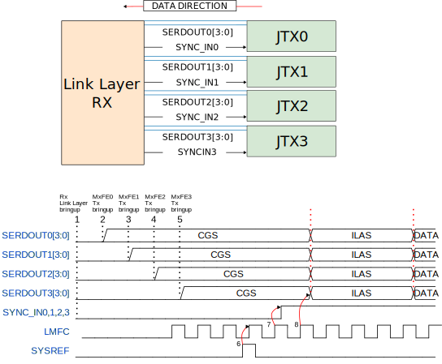

.. _axi_jesd204_rx:

JESD204B/C Link Receive Peripheral
================================================================================

.. hdl-component-diagram::

The :adi:`ADI <>` JESD204B/C Link Receive Peripheral implements the Link layer
handling of a JESD204 receive logic device. Implements the 8B/10B based link
layer defined in JESD204C standard that is similar to the Link layer defined in
JESD204B.

This includes handling of the SYSREF and SYNC~ and controlling the
:ref:`link state machine <axi_jesd204_rx_8b10b_link_state_machine>` accordingly,
as well as performing per lane descrambling and character replacement.

It implements the 64B/66B-based Link layer defined in the JESD204C standard. This
includes handling of the SYSREF, per lane decoding of sync header,
descrambling, CRC checking of data blocks and error monitoring.

The type of Link layer is selectable during implementation phase through the
``LINK_MODE`` synthesis parameter.

It has been designed for interoperability with
:ref:`Analog Devices JESD204 ADC converter products <axi_jesd204_rx_supported_devices>`.
To form a complete JESD204 receive logic device, it has to be combined with a
:ref:`PHY layer <jesd204_physical_layer>` and
:ref:`transport layer <jesd204_transport_layer>` peripheral.

Features
--------------------------------------------------------------------------------

- Backwards compatibility with JESD204B;
- 64B/66B Link layer defined in JESD204C;
- Subclass 0 and Subclass 1 support;
- Deterministic Latency (for Subclass 1 operation);
- Runtime reconfigurability through memory-mapped register interface
  (AXI4-Lite);
- Interrupts for event notification;
- Diagnostics;
- Max Lanerate with 8B/10B mode: 15 Gbps;
- Max Lanerate with 64B/66B mode: 32 Gbps;
- Low Latency;
- Independent per lane enable/disable.

..
   Utilization
   --------------------------------------------------------------------------------

   .. collapsible:: Detailed Utilization

    +---------------+---------+----+---+
    |Device Family  |NUM_LANES|LUTs|FFs|
    +===============+=========+====+===+
    |Intel Arria 10 |1        |TBD |TDB|
    +               +---------+----+---+
    |               |2        |TBD |TBD|
    +               +---------+----+---+
    |               |4        |TBD |TBD|
    +               +---------+----+---+
    |               |8        |TBD |TBD|
    +---------------+---------+----+---+
    |AMD Xilinx     |1        |TBD |TBD|
    |Artix 7        +---------+----+---+
    |               |2        |TBD |TBD|
    +               +---------+----+---+
    |               |4        |TBD |TBD|
    +               +---------+----+---+
    |               |8        |TBD |TBD|
    +---------------+---------+----+---+
    |AMD Xilinx     |1        |TBD |TBD|
    |Kintex 7       +---------+----+---+
    |               |2        |TBD |TBD|
    +               +---------+----+---+
    |               |4        |824 |897|
    +               +---------+----+---+
    |               |8        |TBD |TBD|
    +---------------+---------+----+---+
    |AMD Xilinx     |1        |TBD |TBD|
    |Virtex 7       +---------+----+---+
    |               |2        |TBD |TBD|
    +               +---------+----+---+
    |               |4        |TBD |TBD|
    +               +---------+----+---+
    |               |8        |TBD |TBD|
    +---------------+---------+----+---+

Files
--------------------------------------------------------------------------------

.. important::

   To use this wrapper in your project, you need to use the procedure
   :git-hdl:`adi_axi_jesd204_rx_create <library/jesd204/scripts/jesd204.tcl#L84>`
   to instantiate it.

.. list-table::
   :header-rows: 1

   * - Name
     - Description
   * - :git-hdl:`axi_jesd204_rx.v <library/jesd204/axi_jesd204_rx/axi_jesd204_rx.v>`
     - Verilog source for the peripheral.
   * - :git-hdl:`axi_jesd204_rx_ip.tcl <library/jesd204/axi_jesd204_rx/axi_jesd204_rx_ip.tcl>`
     - TCL script to generate the Vivado IP-integrator project for the
       peripheral.

Block Diagram
--------------------------------------------------------------------------------

.. image:: axi_jesd204_rx_204c.svg
   :width: 800
   :align: center
   :alt: JESD204B/C Rx Link Layer

AXI JESD204 RX Synthesis Configuration Parameters
--------------------------------------------------------------------------------

.. hdl-parameters::

   * - ID
     - Instance identification number.
   * - NUM_LANES
     - Maximum number of lanes supported by the peripheral.
   * - NUM_LINKS
     - Maximum number of links supported by the peripheral.
   * - LINK_MODE
     - |  Decoder selection of the link layer:
       |  1 - 8B/10B mode;
       |  2 - 64B/66B mode.
   * - DATA_PATH_WIDTH
     - Data path width in bytes. Set it to 4 in case of 8B/10B, 8 in case of
       64B/66B

JESD204 RX Synthesis Configuration Parameters
--------------------------------------------------------------------------------

.. hdl-parameters::
   :path: library/jesd204/jesd204_rx

   * - NUM_LANES
     - Maximum number of lanes supported by the peripheral.
   * - NUM_LINKS
     - Maximum number of links supported by the peripheral.
   * - LINK_MODE
     - |  Decoder selection of the link layer:
       |  1 - 8B/10B mode;
       |  2 - 64B/66B mode.
   * - DATA_PATH_WIDTH
     - Data path width in bytes. Set it to 4 in case of 8B/10B, 8 in case of
       64B/66B.
   * - TPL_DATA_PATH_WIDTH
     - Data path width in bytes towards transport layer. Must be greater or
       equal to ``DATA_PATH_WIDTH``. Must be a power of 2 integer multiple of
       the F parameter.
   * - ASYNC_CLK
     - Set this parameter to 1 if the link clock and the device clocks have
       different frequencies, or if they have the same frequency but a
       different source. If set, synchronizing logic and a gearbox of ratio
       ``DATA_PATH_WIDTH``:``TPL_DATA_PATH_WIDTH`` is inserted to do the rate
       conversion. If not set, ``TPL_DATA_PATH_WIDTH`` must match
       ``DATA_PATH_WIDTH``, the same clock must be connected to ``clk`` and
       ``device_clk`` inputs.

AXI JESD204 RX Signal and Interface Pins
--------------------------------------------------------------------------------

.. hdl-interfaces::

    * - s_axi_aclk
      - All ``S_AXI`` signals and ``irq`` are synchronous to this clock.
    * - s_axi_aresetn
      - Resets the internal state of the peripheral.
    * - s_axi
      - Memory mapped AXI-lite bus that provides access to modules register map.
    * - irq
      - Interrupt output of the module. Is asserted when at least one of the
        modules interrupt is pending and enabled.
    * - device_clk
      - :ref:`Device clock <jesd204 glossary>`
        for the JESD204 interface. Its frequency must be link clock
        \* ``DATA_PATH_WIDTH`` / ``TPL_DATA_PATH_WIDTH``
    * - device_reset
      - Reset active high synchronous with the
        :ref:`Device clock <jesd204 glossary>`.

JESD204 RX Signal and Interface Pins
--------------------------------------------------------------------------------

.. hdl-interfaces::
    :path: library/jesd204/jesd204_rx

    * - clk
      - :ref:`Link clock <jesd204 glossary>`
        for the JESD204 interface. Must be line clock/40 for correct operation
        in 8B/10B mode, line clock/66 in 64B/66B mode.
    * - reset
      - Reset active high synchronous with the
        :ref:`Link clock <jesd204 glossary>`
    * - rx_data
      - Received data.
    * - sync
      - sync[m-1:0] is JESD204 SYNC~ (or SYNC_N) signals, available in 8B/10B mode.
        (``0 <= m < NUM_LINKS``)
    * - sysref
      - JESD204 SYSREF signal.
    * - rx_phy*
      - n-th lane of the JESD204 interface (``0 <= n < NUM_LANES``).
    * - phy_en_char_align
      - Enable transceiver character alignment.

.. it was optimized out because it is always 1 in the source code
.. * - phy_ready
     - phy_ready Transceiver status.

Register Map
--------------------------------------------------------------------------------

.. hdl-regmap::
   :name: JESD_RX
   :no-type-info:

Theory of Operation
--------------------------------------------------------------------------------

The JESD204B/C receive peripheral consists of **two main components**:
the register map and the link processor.

Both components are fully asynchronous and are clocked by independent clocks.
The register map is in the ``s_axi_aclk`` clock domain, while the
link processor is in the ``clk`` and ``device_clk`` clock domain.

The **register map** is used to configure the operational parameters of the link
processor as well as to query the current state of the link processor.

The **link processor** itself is responsible for handling the JESD204 link layer
protocol.

Interfaces and Signals
~~~~~~~~~~~~~~~~~~~~~~~~~~~~~~~~~~~~~~~~~~~~~~~~~~~~~~~~~~~~~~~~~~~~~~~~~~~~~~~~

Register Map Configuration Interface
^^^^^^^^^^^^^^^^^^^^^^^^^^^^^^^^^^^^^^^^^^^^^^^^^^^^^^^^^^^^^^^^^^^^^^^^^^^^^^^^

The register map configuration interface can be accessed through the AXI4-Lite
``S_AXI`` interface. The interface is synchronous to the ``s_axi_aclk``. The
``s_axi_aresetn`` signal is used to reset the peripheral and should be asserted
during system startup until the ``s_axi_aclk`` is active and stable.
De-assertion of the reset signal should be synchronous to ``s_axi_aclk``.

JESD204 Control Signals
^^^^^^^^^^^^^^^^^^^^^^^^^^^^^^^^^^^^^^^^^^^^^^^^^^^^^^^^^^^^^^^^^^^^^^^^^^^^^^^^

The ``sync`` and ``sysref`` signals correspond to the SYNC~ and SYSREF signals
of the JESD204 specification.

The ``sync`` signal is asserted by the peripheral during link initialization and
must be connected to the corresponding JESD204 ADC converter devices on the same
link.

The ``sysref`` signal is generated externally and is optional. It is only
required to achieve deterministic latency in subclass 1 mode operation. If the
``sysref`` signal is not connected software needs to configure the peripheral
accordingly to indicate this.

When the ``sysref`` signal is used, in order to ensure correct operation, it is
important that setup and hold of the external signal relative to the
``device_clk`` signal are met. Otherwise, deterministic latency cannot be
guaranteed.

Transceiver Interface (RX_PHYn)
^^^^^^^^^^^^^^^^^^^^^^^^^^^^^^^^^^^^^^^^^^^^^^^^^^^^^^^^^^^^^^^^^^^^^^^^^^^^^^^^

For each lane, the peripheral has one corresponding RX_PHY interface. These
interfaces accept the physical layer data from the downstream physical layer
transceiver peripheral.

The physical layer is responsible for clock recovery, character alignment,
de-serialization as well an 8b10b decoding.

.. _axi_jesd204_rx_user_data:

User Data Interface (RX_DATA)
^^^^^^^^^^^^^^^^^^^^^^^^^^^^^^^^^^^^^^^^^^^^^^^^^^^^^^^^^^^^^^^^^^^^^^^^^^^^^^^^

User data is provided on the AXI4-Stream ``RX_DATA`` interface. The interface is
a reduced AXI4-Stream interface and only features the TVALID flow control
signal, but not the TREADY flow control signal. The behavior of the interface is
as if the TREADY signal was always asserted. This means as soon as ``rx_valid``
is asserted, a continuous stream of user data must be accepted from ``rx_data``.

.. wavedrom

   {
      signal: [
         ['RX_DATA',
            { name: "device_clk", wave: 'P.........' },
            { name: "rx_data",  wave: "x...======", data: ["D0", "D1", "D2",
            "D3", "D4", "..."] },
            { name: 'rx_valid', wave: '0...1.....' },
         ]
      ],
      foot: {
         text:
            ['tspan',{dx:'-45'}, 'Link Initialization', ['tspan', {dx:'60'},
            'User Data Phase'],],
         }
   }

After reset and during link initialization, the ``rx_valid`` signal is
deasserted. As soon as the User Data Phase is entered, the ``rx_valid`` will be
asserted to indicate that the peripheral is now providing the processed data
at the ``rx_data`` signal. The ``rx_valid`` signal stays asserted until the link
is either deactivated or reinitialized.

Typically, the ``RX_DATA`` interface is connected to a JESD204 transport layer
peripheral that deframes the data and passes it to the application layer. The
internal data path width of the peripheral is 4, this means that 4 octets
per lane are processed in parallel. When in the user data phase, the peripheral
provides 4 octets for each lane in each beat.

This means that ``RX_DATA`` interface is ``DATA_PATH_WIDTH`` \* 8 \*
``NUM_LANES`` bits wide. With each block of consecutive ``DATA_PATH_WIDTH`` \* 8
bits corresponding to one lane. The lowest ``DATA_PATH_WIDTH`` \* 8 bits
correspond to the first lane, while the highest ``DATA_PATH_WIDTH`` \* 8 bits
correspond to the last lane.

E.g. for 8B/10B mode where ``DATA_PATH_WIDTH``\ =4. Each lane specific 32-bit
block corresponds to 4 octets each 8 bits wide. The temporal ordering of the
octets is from LSB to MSB, this means the octet placed in the lowest 8 bits was
received first, the octet placed in the highest 8 bits was received last.

Data corresponding to lanes that have been disabled should be ignored and their
value is undefined.

Configuration Interface
~~~~~~~~~~~~~~~~~~~~~~~~~~~~~~~~~~~~~~~~~~~~~~~~~~~~~~~~~~~~~~~~~~~~~~~~~~~~~~~~

The peripheral features a register map configuration interface that can be
accessed through the AXI4-Lite ``S_AXI`` port. The register map can be used to
configure the peripherals operational parameters, query the current status of
the device and query the features supported by the device.

Peripheral Identification and HDL Synthesis Settings
^^^^^^^^^^^^^^^^^^^^^^^^^^^^^^^^^^^^^^^^^^^^^^^^^^^^^^^^^^^^^^^^^^^^^^^^^^^^^^^^

The peripheral contains multiple registers that allow the identification of the
peripheral as well as the discovery of features that were configured at HDL
synthesis time. Apart from the ``SCRATCH`` register, all registers in this
section are read-only and write access to them will be ignored.

The ``VERSION`` (``0x000``) register contains the version of the peripheral. The
version determines the register map layout and general features supported by the
peripheral. The version number follows `semantic versioning <http://semver.org/>`__.
Increments in the major number indicate backward incompatible changes,
increments in the minor number indicate backward compatible changes, patch
letter increments indicate bug fix.

The ``PERIPHERAL_ID`` (``0x004``) register contains the value of the ``ID`` HDL
configuration parameter that was set during synthesis. Its primary function is
to allow to distinguish between multiple instances of the peripheral in the same
design.

The ``SCRATCH`` (``0x008``) register is a general purpose 32-bit register that
can be set to an arbitrary values. Reading the register will yield the value
previously written (the value will be cleared when the peripheral is reset). Its
content does not affect the operation of the peripheral. It can be used by
software to test whether the register map is accessible or store custom
peripheral associated data.

The ``IDENTIFICATION`` (``0x00c``) register contains the value of ``"204R"``.
This value is unique to this type of peripheral and can be used to ensure that
the peripheral exists at the expected location in the memory mapped IO register
space.

The ``SYNTH_NUM_LANES`` (``0x010``) register contains the value of the
``NUM_LANES`` HDL configuration parameter that was set during synthesis. It
corresponds to the maximum of lanes supported by the peripheral. Possible values
are between ``1`` and ``32``.

The ``SYNTH_DATA_PATH_WIDTH`` (``0x014``) register contains the value of the
internal data path width per lane in octets. This is how many octets are
processed in parallel on each lane and affects the restrictions of possible
values for certain runtime configuration registers. The value is encoded as the
log2() of the data path width. Possible values are:

#. Internal data path width is 2;
#. Internal data path width is 4;
#. Internal data path width is 8.

The ``SYNTH_ELASTIC_BUFFER_SIZE`` (``0x040``) register describes the maximum
amount of octets that the elastic buffer can hold. This puts a limit on the
maximum local-multi-frame-clock (LMFC) / local-multiblock-clock (LEMC) period
(subclass 1) as well as the maximum skew between individual lanes (subclass 0).
Both must be less than the elastic buffer size.

Interrupt Handling
^^^^^^^^^^^^^^^^^^^^^^^^^^^^^^^^^^^^^^^^^^^^^^^^^^^^^^^^^^^^^^^^^^^^^^^^^^^^^^^^

Interrupt processing is handled by 3 closely related registers. All 3
registers follow the same layout, each bit in the register corresponds to one
particular interrupt.

When an interrupt event occurs it is recorded in the ``IRQ_SOURCE`` (``0x088``)
register. For a recorded interrupt event, the corresponding bit is set to 1. If
an interrupt event occurs while the bit is already set to 1, it will stay set
to 1.

The ``IRQ_ENABLE`` (``0x080``) register controls how recorded interrupt events
propagate. An interrupt is considered to be enabled if the corresponding bit in
the ``IRQ_ENABLE`` register is set to 1, it is considered to be disabled if the
bit is set to 0.

Disabling an interrupt will not prevent it from being recorded, but only its
propagation. This means if an interrupt event was previously recorded while the
interrupt was disabled and the interrupt is being enabled the interrupt event
will then propagate.

An interrupt event that has been recorded and is enabled propagates to the
``IRQ_PENDING`` (``0x084``) register. The corresponding bit for such an
interrupt will read as 1. Disabled or interrupts for which no events have been
recorded will read as 0. Also if at least one interrupt has been recorded and is
enabled the external ``irq`` signal will be asserted to signal the IRQ event to
the upstream IRQ controller.

A recorded interrupt event can be cleared (or acknowledged) by writing a 1 to
the corresponding bit to either the ``IRQ_SOURCE`` or ``IRQ_PENDING`` register.
It is possible to clear multiple interrupt events at the same time by setting
multiple bits in a single write operation.

For more details regarding interrupt operation see the
:ref:`interrupts section <axi_jesd204_rx_interrupts>` of this document.

Link Control
^^^^^^^^^^^^^^^^^^^^^^^^^^^^^^^^^^^^^^^^^^^^^^^^^^^^^^^^^^^^^^^^^^^^^^^^^^^^^^^^

The ``LINK_DISABLE`` (``0x0c0``) register is used to control the link state and
switch between enabled and disabled. While the link is disabled its state
machine will remain in reset and it will not react to any external event like
the ``SYSREF``\ signal.

Writing a 0 to the ``LINK_DISABLE`` register will enable the link. While the
link state is changing from disabled to enabled it will go through a short
initialization procedure, which will take a few clock cycles. To check whether
the initialization procedure has completed and the link is fully operational the
``LINK_STATE`` (``0x0c4``) register can be checked. The LINK_STATE (``[0]``) bit
will contain a 0 when the link is fully enabled and will contain a 1 while it is
disabled or going through the initialization procedure.

Writing a 1 to the ``LINK_DISABLE`` register will immediately disable the link.

The ``EXTERNAL_RESET`` (``[1]``) bit in the ``LINK_STATE`` register indicates
whether the external link reset signal is asserted (``1``) or de-asserted
(``0``). When the external link reset is asserted the link is disabled
regardless of the setting of ``LINK_DISABLE``. The external link reset is
controlled by the fabric and might be asserted if the link clock is not stable
yet.

Multi-link Control
^^^^^^^^^^^^^^^^^^^^^^^^^^^^^^^^^^^^^^^^^^^^^^^^^^^^^^^^^^^^^^^^^^^^^^^^^^^^^^^^

A multi-link is a link where multiple converter devices are connected to a
single logic device (FPGA). All links involved in a multi-link are synchronous
and established at the same time. For an 8B/10B RX link, this means that the
``SYNC~`` signal needs to be propagated from the FPGA to each converter.

For an 8B/10B link the ``MULTI_LINK_DISABLE`` register allows activating or
deactivating each ``SYNC~`` lines independently. This is useful when depending
on the use case profile some converter devices are supposed to be disabled.

Link Configuration
^^^^^^^^^^^^^^^^^^^^^^^^^^^^^^^^^^^^^^^^^^^^^^^^^^^^^^^^^^^^^^^^^^^^^^^^^^^^^^^^

The link configuration registers control certain aspects of the runtime behavior
of the peripheral. Since the JESD204 standard does now allow changes to link
configuration while the link is active the link configuration registers can only
be modified while the link is disabled. As soon as it is enabled the
configuration registers turn read-only and any writes to them will be ignored.

The ``LANES_DISABLE`` (``0x200``) register allows to disable individual lanes.
Each bit in the register corresponds to a particular lane and indicates whether
that lane is enabled or disabled. Bit 0 corresponds to the first lane, bit 1 to
the second lane and so on. A value of 0 for a specific bit means the
corresponding lane is enabled, a value of 1 means the lane is disabled. A
disabled lane will not receive any data when the link is otherwise active. By
default, all lanes are enabled.

The ``LINK_CONF0`` register configures the octets-per-frame and
frames-per-multi-frame settings of the link. The ``OCTETS_PER_FRAME``
(``[18:16]``) field should be set to the number of octets-per-frame minus 1 (F -
1). The ``OCTETS_PER_MULTIFRAME`` (``[7:0]``) field should be set to the number
of octets-per-frame multiplied by the number of frames-per-multi-frame minus 1
(FxK - 1). For correct operation FxK must be a multiple of 4. In 64B/66B mode
this field matches and also represents the number of octets per extended
multiblock (Ex32x8 - 1).

The ``LINK_CONF1`` register allows disabling optional link level processing
stages. The ``DESCRAMBLER_DISABLE`` (``[0]``) bit controls whether descrambling
of the received user data is enabled or disabled. A value of 0 enables
descrambling and a value of 1 disables it. In 64B/66B mode descrambling must be
always enabled. The ``CHAR_REPLACEMENT_DISABLE`` (``[1]``) bit controls whether
alignment character replacement is performed or not. A value of 0 enables
character replacement and a value of 1 disables it. If character replacement is
disabled and an alignment character is received
(:dokuwiki:`/F/ <resources/fpga/peripherals/jesd204/jesd204_glossary#control_characters>`
or
:dokuwiki:`/A/ <resources/fpga/peripherals/jesd204/jesd204_glossary#control_characters>`)
a unexpected K-character error is raised.

For correct operation, character replacement must be disabled when descrambling
is disabled otherwise undefined behavior might occur.

Both the transmitter as well as receiver device on the JESD204 link need to be
configured with the same settings for scrambling/descrambling and character
replacement for correct operation.

Character replacement is used only in 8B/10B links and completely disregarded in
64B/66B mode.

The ``LINK_CONF2`` register controls the behavior of elastic buffer. The
``BUFFER_EARLY_RELEASE`` (``[16]``) bit configures when the data is released
from the elastic buffer to the RX_DATA port. If the bit is set to 0 the data
will be released at the earliest configured release point after all lanes are
ready. When the bit is set to 1 the data will be released as soon as all lanes
are ready. The former gives deterministic latency and is required for subclass 1
operation, the later gives minimum latency.

The ``BUFFER_DELAY`` (``[11:0]``) field allows to configure the buffer release
opportunity point relative to the local-multi frame-clock (LMFC)/
local-multiblock-clock (LEMC). A setting of 0 indicates that the release
opportunity is aligned to the LMFC/LEMC edge. A setting of X indicates that it
trails the LMFC/LEMC edge by X octets.

.. wavedrom
   {
      signal: [
         { name: "device_clk", wave: 'P.........' },
         { name: "LMFC edge",  wave: "l..10.....", node:"...a"},
         { name: 'Release Opportunity', wave: '0.....10..', node:"......b"},
      ],
      edge: ['a~>b BUFFER DELAY/4']
   }

The ``BUFFER_DELAY`` field must be set to a multiple of 4. Writing a value that
is not a multiple of 4 will be rounded down to the next multiple of 4. For
correct operation, the ``BUFFER_DELAY`` field must also be set to a value
smaller than the number of octets per multi-frame (``F``\ x\ ``K``).

This mechanism can be used to reduce overall latency while still maintaining
deterministic latency if the maximum link latency (overall valid PVT settings)
is known.

SYSREF Handling
^^^^^^^^^^^^^^^^^^^^^^^^^^^^^^^^^^^^^^^^^^^^^^^^^^^^^^^^^^^^^^^^^^^^^^^^^^^^^^^^

The external SYSREF signal is used to align the internal local multiframe clocks
(LMFC)/ local-multiblock-clock (LEMC) between multiple devices on the same link.

The ``SYSREF_CONF`` (``0x100``) register allows to configure the behavior of the
SYSREF capture circuitry. Setting the ``SYSREF_DISABLE`` (``[0]``) bit to 1
disables the SYSREF handling. All external SYSREF events are ignored and the
LMFC/LEMC is generated internally. For Subclass 1 operation, SYSREF handling
should be enabled and for Subclass 0 operation it should be disabled.

The ``SYSREF_LMFC_OFFSET`` (``0x104``) register allows to modify the offset
between the SYSREF rising edge and the rising edge of the LMFC/LEMC.

For optimal operation it is recommended that all device on a JESD204 link should
be configured in a way so that the total offset between the value of the
``SYSREF_LMFC_OFFSET`` register must be set to a value smaller than the
configured number of octets-per-multiframe (``OCTETS_PER_MULTIFRAME``),
otherwise undefined behavior might occur.

The ``SYSREF_STATUS`` (``0x108``) register allows to monitor the status of the
SYSREF signals. ``SYSREF_DETECTED`` (``[0]``) bit indicates that the
peripheral as observed a SYSREF event. The ``SYSREF_ALIGNMENT_ERROR`` (``[1]``)
bit indicates that a SYSREF event has been observed which was unaligned, in
regards to the LMFC/LEMC period, to a previously recorded SYSREF event.

All bits in the ``SYSREF_STATUS`` register are write-to-clear. All bits will
also be cleared when the link is disabled.

Note that the ``SYSREF_STATUS`` register will not record any events if SYSREF
operation is disabled or the JESD204 link is disabled.

Link Status
^^^^^^^^^^^^^^^^^^^^^^^^^^^^^^^^^^^^^^^^^^^^^^^^^^^^^^^^^^^^^^^^^^^^^^^^^^^^^^^^

All link status registers are read-only. While the link is disabled, some of the
link status registers might contain bogus values. Their content should be
ignored until the link is fully enabled.

The ``STATUS_STATE`` (``[1:0]``) field of the ``LINK_STATUS`` (``0x280``)
register indicates the state of the
:ref:`8B/10B link state machine <axi_jesd204_rx_8b10b_link_state_machine>` or
:ref:`64B/66B link state machine <axi_jesd204_rx_64b66b_link_state_machine>`
depending on the selected decoder.

Possible values for a 8B/10B link are:

- RESET (**0x0**): The link is currently disabled;
- WAIT FOR PHY (**0x1**): The controller waits for the PHY level component to be
  ready;
- CGS (**0x2**): The controller is waiting for one or more lanes to complete the
  CGS phase;
- DATA (**0x3**): All lanes are in the data phase and the link is properly
  established.

Possible values for a 64B/66B link are:

- RESET (**0x0**): The link is currently disabled;
- WAIT BLOCK SYNC (**0x1**): The controller waits for all enabled lanes to reach
  sync header alignment;
- BLOCK SYNC (**0x2**): All enabled lanes from the PHY reached sync header
  alignment phase;
- DATA (**0x3**): All enabled lanes reached the multi-block synchronization phase,
  elastic buffer released the data and the link is properly established.

The state of each individual lane can be queried from the
:ref:`lane status <axi_jesd204_rx_lane_status>` registers.

.. _axi_jesd204_rx_lane_status:

Lane Status
^^^^^^^^^^^^^^^^^^^^^^^^^^^^^^^^^^^^^^^^^^^^^^^^^^^^^^^^^^^^^^^^^^^^^^^^^^^^^^^^

Each lane has a independent status register (``LANEn_STATUS`` (``0x300``)) that
indicates the current state of the lane.

8B/10B Link Lane Status Fields
''''''''''''''''''''''''''''''''''''''''''''''''''''''''''''''''''''''''''''''''

The ``CGS_STATE`` (``[1:0]``) indicates the current state of the lane code group
synchronization:

- INIT (**0x0**): Lane is not synchronized;
- CHECK (**0x1**): Lane is in the process of synchronizing, at least some /K/
  synchronization characters have been observed;
- DATA (**0x2**): Lane is synchronized and ready to receive data.

The ``IFS_READY`` (``[4]``) bit indicates that initial frame synchronization has
completed for the lane and the lane is receiving either ILAS data or user data.

The ``LANEn_LATENCY`` (``0x304``) register holds the duration in octets between
when the SYNC~ signal was de-asserted and when the frame synchronization for
this particular lane has completed. The ``LANEn_LATENCY`` register only holds
valid data if the ``IFS_READY`` bit of the ``LANEn_STATUS`` register is set.

64B/66B Link Lane Status Fields
''''''''''''''''''''''''''''''''''''''''''''''''''''''''''''''''''''''''''''''''

The ``EMB_STATE`` (``[10:8]``) indicates the current state of the Extended
Multi-Block alignment state machine:

- EMB_INIT (**3'b001**): Wait for sync header alignment and for an end of extended
  multiblock (EoEMB) indicator;
- EMB_HUNT (**3'b010**): Keep track and monitor consecutive EoEMBs until a
  threshold is reached;
- EMB_LOCK (**3'b100**): Asserted by receiver to indicate that extended multiblock
  alignment has been achieved.

8B/10B Link ILAS Configuration Data
^^^^^^^^^^^^^^^^^^^^^^^^^^^^^^^^^^^^^^^^^^^^^^^^^^^^^^^^^^^^^^^^^^^^^^^^^^^^^^^^

If the JESD204 transmitter emits an initial lane alignment sequence (ILAS) the
configuration data embedded in the second multi-frame of the ILA sequence is
captured by the peripheral and stored in a set of four per-lane registers
(``LANEn_ILAS0``, ``LANEn_ILAS1``, ``LANEn_ILAS2`` and ``LANEn_ILAS3``).
``ILAS_READY`` (``[5]``) bit in the corresponding ``LANEn_STATUS`` register
indicates whether the ILAS configuration data has been captured for a specific
lane. The data in the ``LANEn_ILASx`` registers is only valid when that bit is
asserted.

The received ILAS configuration data can be used to verify that the transmitter
device is using the expected configuration and that the lane and device mapping
is correct.

Clock Monitor
^^^^^^^^^^^^^^^^^^^^^^^^^^^^^^^^^^^^^^^^^^^^^^^^^^^^^^^^^^^^^^^^^^^^^^^^^^^^^^^^

The ``LINK_CLK_FREQ`` (``0x0c8``) register allows to determine the clock rate of
the link clock (``clk``) relative to the AXI interface clock (``s_axi_aclk``).
This can be used to verify that the link clock is running at the expected rate.

The ``DEVICE_CLK_FREQ`` (``0x0cc``) register allows to determine the clock rate
of the device clock (``device_clk``) relative to the AXI interface clock
(``s_axi_aclk``). This can be used to verify that the device clock is running at
the expected rate.

The number is represented as unsigned 16.16 format. Assuming a 100MHz processor
clock, this corresponds to a resolution of 1.523kHz per LSB. A raw value of 0
indicates that the link clock is currently not active.

.. _axi_jesd204_rx_interrupts:

Interrupts
~~~~~~~~~~~~~~~~~~~~~~~~~~~~~~~~~~~~~~~~~~~~~~~~~~~~~~~~~~~~~~~~~~~~~~~~~~~~~~~~

The core does not generate interrupts.

8B/10B Link
--------------------------------------------------------------------------------

.. image:: axi_jesd204_rx_204c_8b10b.svg
   :align: center

.. _axi_jesd204_rx_8b10b_link_state_machine:

8B/10B Link State Machine
~~~~~~~~~~~~~~~~~~~~~~~~~~~~~~~~~~~~~~~~~~~~~~~~~~~~~~~~~~~~~~~~~~~~~~~~~~~~~~~~

.. image:: jesd204_rx_state_machine.svg
   :align: right

The peripheral can be in one of four main operating phases: RESET, WAIT FOR PHY,
CGS, or DATA. Upon reset the peripheral starts in the RESET phase. The WAIT FOR
PHY and CGS phases are used during the initialization of the JESD204 link. The
DATA phase is used during normal operation when user data is received across the
JESD204 link.

RESET phase
^^^^^^^^^^^^^^^^^^^^^^^^^^^^^^^^^^^^^^^^^^^^^^^^^^^^^^^^^^^^^^^^^^^^^^^^^^^^^^^^

The RESET phase is the default state entered during reset. While disabled the
peripheral will stay in the RESET phase. When enabled, the peripheral will
transition from the RESET phase to the WAIT FOR PHY phase.

If at any point the peripheral is disabled, it will automatically transition
back to the RESET state.

Lanes that have been disabled in the register map configuration interface, will
behave as if the link was in the RESET state regardless of the actual state.

WAIT FOR PHY phase
^^^^^^^^^^^^^^^^^^^^^^^^^^^^^^^^^^^^^^^^^^^^^^^^^^^^^^^^^^^^^^^^^^^^^^^^^^^^^^^^

During the WAIT FOR PHY phase the peripheral will wait for all PHY controllers
for all enabled lanes to be ready for operation. Once this condition is
satisfied the controlled will transition to the CGS phase.

CGS phase
^^^^^^^^^^^^^^^^^^^^^^^^^^^^^^^^^^^^^^^^^^^^^^^^^^^^^^^^^^^^^^^^^^^^^^^^^^^^^^^^

During the CGS phase the peripheral will assert the external ~SYNC signal and
expects the connected JESD204 transmitter to send /K/ characters.

Each lane will independently the incoming data stream for /K/ characters and
adjust its state machine according to the received characters.

Once all enabled lanes have entered the DATA state the link state will
transition from the CGS phase to the DATA phase.

DATA phase
^^^^^^^^^^^^^^^^^^^^^^^^^^^^^^^^^^^^^^^^^^^^^^^^^^^^^^^^^^^^^^^^^^^^^^^^^^^^^^^^

The DATA phase is the main operating mode of the peripheral. In this phase it
will transmit transport layer data at the RX_DATA port. When the peripheral
enters the DATA phase the ``valid`` signal of the ``RX_DATA`` interface will be
asserted to indicate that transport layer data is now available.

By default the data received on each lane is descrambled. Descrambling can
optionally be disabled via the register map configuration interface.
Descrambling is enabled or disabled for all lanes equally.

Scrambling reduces data-dependent effects, which can affect both the analog
performance of the data converter as well as the bit-error rate of JESD204
serial link, therefore it is highly recommended to enable scrambling for the
link.

The peripheral also performs per-lane alignment character monitoring. When
alignment character replacement is enabled the JESD204 transmitter replaces
under certain predictable conditions (i.e. the receiver can recover the replaced
character) the last octet in a frame or multi-frame. Replaced characters at the
end of a frame, that is also the end of a multi-frame, are replaced by the /A/
character. Replaced characters at the end of a frame, that is not the end of a
multi-frame, are replaced by the /F/ character. If a alignment character is
received the peripheral checks that the it is in the expected position, either
the end of a frame or the end of a multi-frame, and reports an error if a lane
has become misaligned. This allows to detect alignment errors and allows the
application to re-initialize the link.

Alignment character monitoring can optionally be disabled via the register map
configuration interface. Alignment character monitoring is enabled or disabled
for all lanes equally. If alignment character monitoring is disabled, no errors
are reported when a misaligned alignment character is received.

Data on the ``RX_DATA`` port corresponding to a disabled lanes are undefined and
should be ignored.

8B/10B Multi-endpoint RX link establishment
~~~~~~~~~~~~~~~~~~~~~~~~~~~~~~~~~~~~~~~~~~~~~~~~~~~~~~~~~~~~~~~~~~~~~~~~~~~~~~~~

In a multi-endpoint configuration one link receive peripheral connects to
several endpoints/converter devices. In such cases the link is established
only when all enabled endpoints reach the DATA phase. For that all endpoints
must pass through CGS and ILAS stages.

Depending on the software implementation that controls the converter devices
the endpoints can be enabled at different moments. The link receive peripheral
will receive the CGS characters and do character alignment until for all enabled
endpoints lanes succeeds that and signalize that through the de-assertion
of ``SYNC~`` signal.

In the below example we have a multi-point link of four endpoints
(``NUM_LINKS`` = 4):

.. note::

    The physical layer is not depicted on purpose. JTXn represents the link
    layer counterpart in the converter device/endpoint *n*

The steps of the link bring-up are presented below:

*  **1** - Link receive peripheral is enabled, will assert its ``SYNC~`` signal
   to indicate to the endpoints it is ready to receive and align to the ``CGS``
   characters. All ``SYNC~`` signal to all enabled endpoints assert in the same
   time;
*  **2,3,4,5** - JESD transmit block of DAC enabled, will start sending ``CGS``
   characters until its ``SYNC~`` pin is not pulled low. The timing depends on
   the software implementation that controls the DAC;
*  **6** - In Subclass 1 (SC1) ``SYSREF`` is captured and ``LMFC`` in the
   FPGA and converter device is adjusted;
*  **7** - Once the ``CGS`` characters are received correctly on all enabled
   lanes, on the next Frame clock boundary in SC0 or ``LMFC`` boundary in SC1
   the ``SYNC~`` is de-asserted. All ``SYNC~`` signal to all enabled endpoints
   de-assert in the same time. **In SC1 if** ``SYSREF`` **is not captured the
   link receive peripheral will stay in CGS state and will keep** ``SYNC~``
   **asserted.**;
*  **8** - Once all enabled endpoints (not masked by ``MULTI_LINK_DISABLE``)
   observe the de-assert of the ``SYNC~`` signal, on the next Frame clock
   boundary for SC0 or the next ``LMFC`` boundary for SC1, will start sending
   the ``ILAS`` sequence, then after typically 4 ``LMFC`` periods later the
   actual ``DATA``.

64B/66B Link
--------------------------------------------------------------------------------

The 64-bit wide datapath of the link layer is fairly simple, the data received
from the PHY is sent through a mandatory descrambler block to an elastic buffer
that serves as an aligner cross lanes. Each beat of the datapath contains a
block of data of 8 octets.

For each lane the control path starts from the 2-bit sync header connected to
the header decoder that tracks and monitors multiblock and extended multiblock
markers from the stream, reconstructs the 32-bit sync word corresponding to
every multiblock and extracts the received CRC from it. The CRC is calculated
for every multiblock and is compared against the received CRC. The mismatches
are recorded by the error monitor block.

Beside the CRC errors the error monitor records invalid end of multiblock, end
of extended multiblock and invalid sync header errors. The source of every error
can be masked from the corresponding bit of the ``LINK_CONF3`` register.

.. image:: axi_jesd204_rx_204c_64b66b.svg
   :align: center

.. _axi_jesd204_rx_64b66b_link_state_machine:

64B/66B Link State Machine
~~~~~~~~~~~~~~~~~~~~~~~~~~~~~~~~~~~~~~~~~~~~~~~~~~~~~~~~~~~~~~~~~~~~~~~~~~~~~~~~

The peripheral can be in one of four main operating phases: RESET, WAIT BS,
BLOCK SYNC, or DATA. Upon reset the peripheral starts in the RESET phase. The
WAIT BS and BLOCK SYNC phases are used during the initialization of the JESD204
link. The DATA phase is used during normal operation when user data is received
across the JESD204 link.

.. image:: jesd204c_rx_state_machine.svg
   :align: right

.. _axi_jesd204_rx_reset-phase-1:

RESET phase
^^^^^^^^^^^^^^^^^^^^^^^^^^^^^^^^^^^^^^^^^^^^^^^^^^^^^^^^^^^^^^^^^^^^^^^^^^^^^^^^

The RESET phase is the default state entered during reset. While disabled the
peripheral will stay in the RESET phase. When enabled the peripheral will
transition from the RESET phase to the WAIT FOR PHY phase.

If at any point the peripheral is disabled it will automatically transition back
to the RESET state.

WAIT BS phase
^^^^^^^^^^^^^^^^^^^^^^^^^^^^^^^^^^^^^^^^^^^^^^^^^^^^^^^^^^^^^^^^^^^^^^^^^^^^^^^^

During the WAIT BS phase the peripheral will wait for all PHY controllers for
all enabled lanes to reach sync header alignment state ensuring the sync header
stream separation from the data blocks. Once this condition is satisfied the
controlled will transition to the BLOCK SYNC phase.

If one of the enabled lanes loses the the sync header alignment the link will
fall back to WAIT BS state.

BLOCK SYNC phase
^^^^^^^^^^^^^^^^^^^^^^^^^^^^^^^^^^^^^^^^^^^^^^^^^^^^^^^^^^^^^^^^^^^^^^^^^^^^^^^^

The BLOCK SYNC state ensures all enabled lanes achieved sync header alignment or
block synchronization phase in other terms. During this state the peripheral
will wait for all enabled lanes to reach extended multiblock alignment and the
elastic buffer get released. Once each enabled lane is extended multiblock
aligned for each lane the data blocks are stored in the elastic buffer then are
released at a well defined moment relative to the ``SYSREF`` signal.

.. _axi_jesd204_rx_data-phase-1:

DATA phase
^^^^^^^^^^^^^^^^^^^^^^^^^^^^^^^^^^^^^^^^^^^^^^^^^^^^^^^^^^^^^^^^^^^^^^^^^^^^^^^^

The DATA phase is the main operating mode of the peripheral. In this phase it
will transmit transport layer data at the ``RX_DATA`` port. When the peripheral
enters the DATA phase the ``valid`` signal of the ``RX_DATA`` interface will be
asserted to indicate that transport layer data is now available.

64B/66B Link Extended MultiBlock Alignment State Machine
~~~~~~~~~~~~~~~~~~~~~~~~~~~~~~~~~~~~~~~~~~~~~~~~~~~~~~~~~~~~~~~~~~~~~~~~~~~~~~~~

For each lane a state machine is used to detect the boundary of the extended
multiblocks by tracking well defined markers in the sync header stream. Once the
boundary is detected for each lane the corresponding data stream can be aligned
across all enabled lanes. This is done through the elastic buffer.

.. image:: jesd204c_rx_emb_state_machine.svg
   :align: right

EMB INIT State
^^^^^^^^^^^^^^^^^^^^^^^^^^^^^^^^^^^^^^^^^^^^^^^^^^^^^^^^^^^^^^^^^^^^^^^^^^^^^^^^

The EMB INIT is the default state of the state machine, all disabled lanes stay
in this state. The state is left only when the lane is enabled, the PHY
controller of the corresponding lane is sync header aligned and a valid end of
extended multiblock marker is detected in the sync header stream.

At any moment the PHY loses sync header alignment the state machine will fall
back to the EMB INIT state.

EMB HUNT State
^^^^^^^^^^^^^^^^^^^^^^^^^^^^^^^^^^^^^^^^^^^^^^^^^^^^^^^^^^^^^^^^^^^^^^^^^^^^^^^^

In the EMB HUNT state the state machine will look after four consecutive correct
extended multiblock indicators, once this is achieved the state machine enters
the EMB LOCK state. In case invalid end of multiblock or end of extended
multiblock markers are detected the state machine falls back to the EMB INIT
state.

EMB LOCK State
^^^^^^^^^^^^^^^^^^^^^^^^^^^^^^^^^^^^^^^^^^^^^^^^^^^^^^^^^^^^^^^^^^^^^^^^^^^^^^^^

In the EMB LOCK state the monitoring of multiblock and extended multiblock
indicators is continued. In case of eight consecutive indicators are incorrect
the state machine will return in the EMB INIT state. This state ensures the
validity of the 32-bit sync words constructed from the sync header stream. For
each multiblock the calculated CRC of the previous multiblock is extracted from
the current sync word.

Dual clock operation
--------------------------------------------------------------------------------

In case ``ASYNC_CLK`` parameter is set, a gearbox with 4:N (204B) or 8:N (204C)
ratio is enabled in the link layer peripherals, where N depends on the F
parameter of the link. The goal of the gearbox is to have at the transport layer
interface a data width that contains an integer number of frames per every
device clock cycle (each beat) so an integer number of samples can be
delivered/consumed to/from the application layer aligned to SYSREF ensuring
deterministic latency in modes where N'=12 or F!=1,2,4.

.. image:: dual_clock_operation.svg
   :align: center

The gearbox ratio corresponds with the ratio of the link layer interface data
width towards physical layer and transport layer in octets. The interface width
towards the physical layer in 8B/10B (204B) mode depends on the DATA_PATH_WIDTH
synthesis parameter, and can be either 4 octets (default) or 8 octets. In 204B
mode the util_adxcvr supports only data width of 4 octets. In 64b66b (aka 204C)
mode the data width towards the physical interface is always 8 octets.

The data path width towards the transport layer is defined by the
TPL_DATA_PATH_WIDTH synthesis parameter.

The following rules apply:

- TPL_DATA_PATH_WIDTH >= DATA_PATH_WIDTH;
- TPL_DATA_PATH_WIDTH = m x F; where m is a positive integer, power of 2.

The link clock and device clock ratio should be the inverse of the
DATA_PATH_WIDTH : TPL_DATA_PATH_WIDTH ratio.

In this context the link clock will be lane rate/40 or lane rate/80 for 204B
depending on DATA_PATH_WIDTH and lane rate/66 for 204C 64B/66B, however the
device clock could vary based in the F parameter.

64b/66b Link latency reduction
--------------------------------------------------------------------------------

Deterministic latency can be reduced by adjusting the release point of the
elastic buffer in RX link layer. By default the release point of the elastic
buffer is at the edge of LEMC. In case of 64b66b link the ``LATENCY`` register
will indicate how many octets will the elastic buffer store before the default
release point for that specific lane. The release point can be adjusted to bring
it closer to the last arrival lane (that will have the least octets in the
buffer) so minimizing the buffer usage and the latency in turn. The ``LATENCY``
must be measured over multiple power-ups and bring-up sequence. Identify the
slowest arrival lane (min value of the register). If multiple parallel links
must be synchronized all lanes from all links must be included in the process.

Once the slowest lane delay is identified, before enabling the links, SW needs
to set the register ``BUFFER_DELAY`` (0x240) from all parallel Rx links if
exists based on the following formula:

.. math::

   Buffer Delay = \frac{(F*K - min(LatencyRegs) + 32)}{TPLDW} + 4

Where:

- Buffer Delay - register 0x240 of the core;
- F*K - is the size of a multiframe in octets;
- LatencyRegs - is the measured latency of each lane observed during
  consecutive link bring-ups measured for all Rx links, see regs (0x304 +
  n*0x20) where n = 0..L-1 ; L is number of lanes;
- TPLDW - TPL datapath width in octets. Can be read from the
  ``SYNTH_DATA_PATH_WIDTH`` (0x14) reg ``TPL_DATA_PATH_WIDTH`` field.

**This value it the absolute minimum. It is recommended to increase it
slightly to have a better margin against power-up to power-up latency
variations.**

Software Support
--------------------------------------------------------------------------------

.. warning::

   To ensure correct operation it is highly recommended to use the
   Analog Devices provided JESD204 software packages for interfacing the
   peripheral. Analog Devices is not able to provide support in case issues arise
   from using custom low-level software for interfacing the peripheral.

- :dokuwiki:`JESD204 Receive Linux Driver Support <resources/tools-software/linux-drivers/jesd204/axi_jesd204_rx>`

.. _axi_jesd204_rx restrictions:

Restrictions
--------------------------------------------------------------------------------

During the design of the peripheral, the deliberate decision was made to support
only a subset of the features mandated by the JESD204 standard for receiver
logic devices.

The reasoning here is that the peripheral has been designed to interface to
:adi:`Analog Devices <>` JESD204 ADC converter devices and features that are
either not required or not supported by those converter devices would otherwise
lie dormant in peripheral and never be used.

Instead, the decision was made to not implement those unneeded features, even
when the JESD204 standard requires them for general purpose JESD204 receiver
logic devices. As :adi:`Analog Devices <>` ADC converter devices with new
requirements are released the peripheral will be adjusted accordingly.

This approach allows for a leaner design using less resources, allowing for
lower pipeline latency and a higher maximum device clock frequency.

The following lists where the peripheral deviates from the standard:

- No subclass 2 support. JESD204 subclass 2 has, due to its implementation
  details, restricted applicability and is seldom a viable option for a modern
  high-speed data converter system. To achieve deterministic latency, it is
  recommend to use subclass 1 mode;
- Reduced number of octets-per-frame settings. The JESD204 standard allows for
  any value between 1 and 256 to be used for the number of octets-per-frame;
- The following octets-per-frame are supported by the peripheral: 1, 2, 4 and
  1. (No longer applies starting from 1.07.a);
- Reduced number of frames-per-multi-frame settings. The following values are
  supported by the peripheral: 1-32, with the additional requirement that F*K
  is a multiple of 4. In addition F*K needs to be in the range of 4-256;
- No support for alignment character replacement when scrambling is disabled.
  (No longer applies starting from 1.07.a).

Additional Information
--------------------------------------------------------------------------------

- :ref:`JESD204 Glossary <jesd204 glossary>`

.. _axi_jesd204_rx_supported_devices:

Supported Devices
--------------------------------------------------------------------------------

JESD204B Analog-to-Digital Converters
~~~~~~~~~~~~~~~~~~~~~~~~~~~~~~~~~~~~~~~~~~~~~~~~~~~~~~~~~~~~~~~~~~~~~~~~~~~~~~~~

- :adi:`AD6673`: 80 MHz Bandwidth, Dual IF Receiver
- :adi:`AD6674`: 385 MHz BW IF Diversity Receiver
- :adi:`AD6676`: Wideband IF Receiver Subsystem
- :adi:`AD6677`: 80 MHz Bandwidth, IF Receiver
- :adi:`AD6684`: 135 MHz Quad IF Receiver
- :adi:`AD6688`: RF Diversity and 1.2GHz BW Observation Receiver
- :adi:`AD9207`: 12-Bit, 6 GSPS, JESD204B/JESD204C
  Dual Analog-to-Digital Converter
- :adi:`AD9208`: 14-Bit, 3GSPS, JESD204B, Dual Analog-to-Digital Converter
- :adi:`AD9209`: 12-Bit, 4GSPS, JESD204B/C, Quad Analog-to-Digital Converter
- :adi:`AD9213`: 12-Bit, 10.25 GSPS, JESD204B, RF Analog-to-Digital Converter
- :adi:`AD9234`: 12-Bit, 1 GSPS/500 MSPS JESD204B, Dual
  Analog-to-Digital Converter
- :adi:`AD9250`: 14-Bit, 170 MSPS/250 MSPS, JESD204B, Dual
  Analog-to-Digital Converter
- :adi:`AD9625`: 12-Bit, 2.6 GSPS/2.5 GSPS/2.0 GSPS,
  1.3 V/2.5 V Analog-to-Digital Converter
- :adi:`AD9656`: Quad, 16-Bit, 125 MSPS JESD204B 1.8 V
  Analog-to-Digital Converter
- :adi:`AD9680`: 14-Bit, 1.25 GSPS/1 GSPS/820 MSPS/500
  MSPS JESD204B, Dual Analog-to-Digital Converter
- :adi:`AD9683`: 14-Bit, 170 MSPS/250 MSPS, JESD204B, Analog-to-Digital Converter
- :adi:`AD9690`: 14-Bit, 500 MSPS / 1 GSPS JESD204B,
  Analog-to-Digital Converter
- :adi:`AD9691`: 14-Bit, 1.25 GSPS JESD204B, Dual Analog-to-Digital Converter
- :adi:`AD9694`: 14-Bit, 500 MSPS JESD204B, Quad Analog-to-Digital Converter
- :adi:`AD9695`: 14-Bit, 1300 MSPS/625 MSPS,
  JESD204B, Dual Analog-to-Digital Converter Analog-to-Digital Converter
- :adi:`AD9083`: 16-Channel, 125 MHz Bandwidth, JESD204B
  Analog-to-Digital Converter
- :adi:`AD9094`: 8-Bit, 1 GSPS, JESD204B, Quad Analog-to-Digital Converter

JESD204B RF Transceivers
~~~~~~~~~~~~~~~~~~~~~~~~~~~~~~~~~~~~~~~~~~~~~~~~~~~~~~~~~~~~~~~~~~~~~~~~~~~~~~~~

- :adi:`AD9371`: SDR Integrated, Dual RF Transceiver with Observation Path
- :adi:`AD9375`: SDR Integrated, Dual RF Transceiver with Observation Path and DPD
- :adi:`ADRV9009`: SDR Integrated, Dual RF Transceiver with Observation Path
- :adi:`ADRV9008-1`: SDR Integrated, Dual RF Receiver
- :adi:`ADRV9008-2`: SDR Integrated, Dual RF Transmitter with Observation Path

JESD204B/C Mixed-Signal Front Ends
~~~~~~~~~~~~~~~~~~~~~~~~~~~~~~~~~~~~~~~~~~~~~~~~~~~~~~~~~~~~~~~~~~~~~~~~~~~~~~~~

- :adi:`AD9081`: MxFE Quad, 16-Bit, 12GSPS RFDAC and Quad, 12-Bit, 4GSPS RFADC
- :adi:`AD9082`: MxFE QUAD, 16-Bit, 12GSPS RFDAC and DUAL, 12-Bit, 6GSPS RFADC
- :adi:`AD9986`: 4T2R Direct RF Transmitter and Observation Receiver
- :adi:`AD9988`: 4T4R Direct RF Receiver and Transmitter

Technical Support
--------------------------------------------------------------------------------

Analog Devices will provide limited online support for anyone using the core
with Analog Devices components (ADC, DAC, Clock, etc) via the
:ez:`EngineerZone <fpga>` under the GPL license. If you would like
deterministic support when using this core with an ADI component, please
investigate a commercial license. Using a non-ADI JESD204 device with this core
is possible under the GPL, but Analog Devices will not help with issues you may
encounter.

More Information
--------------------------------------------------------------------------------

- :ref:`JESD204 High-Speed Serial Interface Support <jesd204>`
- :ref:`HDL User Guide <user_guide>`
