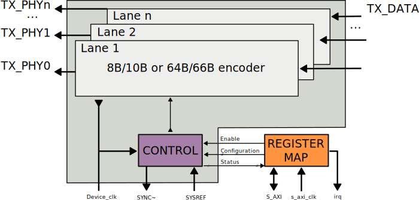
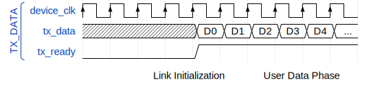
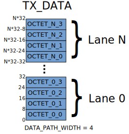
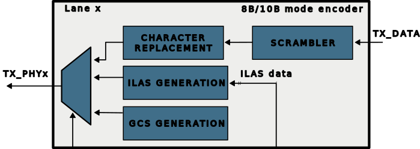
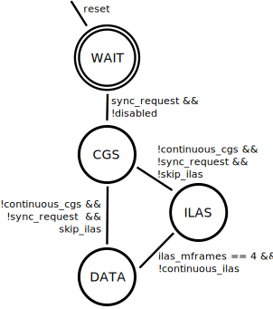
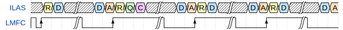
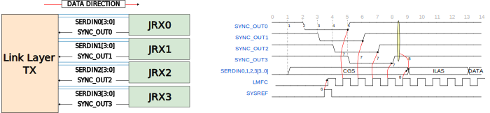
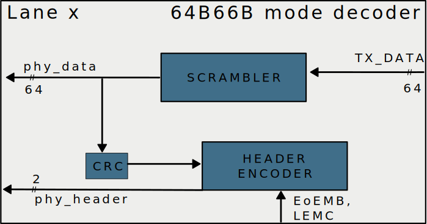

.. _axi_jesd204_tx:

JESD204B/C Link Transmit Peripheral
===============================================================================

.. hdl-component-diagram::

The :adi:`ADI <>` JESD204B/C Link Transmit Peripheral implements the Link layer
handling of a JESD204 transmit logic device. Implements the 8B/10B based Link
layer defined in JESD204C standard that is similar to the Link layer defined in
JESD204B.

This includes handling of the SYSREF and SYNC~ and controlling the
:ref:`link state machine <axi_jesd204_tx_8b_10b_link_state_machine>` accordingly,
as well as performing per lane scrambling and character replacement.

It has been designed for interoperability with
:ref:`ADI JESD204B DAC converter products <axi_jesd204_tx_supported_devices>`.
It implements the 64B/66B-based Link layer defined in the JESD204C standard.
This includes handling of the SYSREF, per lane encoding of sync header,
scrambling as per data multi-block CRC generation.

The type of Link layer is selectable during implementation phase through the
``LINK_MODE`` synthesis parameter.

To form a complete JESD204 transmit logic device, it has to be combined with a
:ref:`PHY layer <jesd204_physical_layer>` and
:ref:`transport layer <jesd204_transport_layer>` peripheral.

Features
-------------------------------------------------------------------------------

- Backwards compatibility with JESD204B;
- 64B/66B Link layer defined in JESD204C;
- Subclass 0 and Subclass 1 support;
- Deterministic Latency (for Subclass 1 operation);
- Runtime re-configurability through memory-mapped register interface (AXI4);
- Interrupts for event notification;
- Diagnostics;
- Max Lanerate with 8B/10B mode: 15 Gbps;
- Max Lanerate with 64B/66B mode: 32 Gbps;
- Low Latency;
- Independent per lane enable/disable.

..
   Utilization
   --------------------------------------------------------------------------------

   .. collapsible:: Detailed Utilization

    +---------------+---------+----+---+
    |Device Family  |NUM_LANES|LUTs|FFs|
    +===============+=========+====+===+
    |Intel Arria 10 |1        |TBD |TDB|
    +               +---------+----+---+
    |               |2        |TBD |TBD|
    +               +---------+----+---+
    |               |4        |TBD |TBD|
    +               +---------+----+---+
    |               |8        |TBD |TBD|
    +---------------+---------+----+---+
    |AMD Xilinx     |1        |TBD |TBD|
    |Artix 7        +---------+----+---+
    |               |2        |TBD |TBD|
    +               +---------+----+---+
    |               |4        |TBD |TBD|
    +               +---------+----+---+
    |               |8        |TBD |TBD|
    +---------------+---------+----+---+
    |AMD Xilinx     |1        |TBD |TBD|
    |Kintex 7       +---------+----+---+
    |               |2        |TBD |TBD|
    +               +---------+----+---+
    |               |4        |824 |897|
    +               +---------+----+---+
    |               |8        |TBD |TBD|
    +---------------+---------+----+---+
    |AMD Xilinx     |1        |TBD |TBD|
    |Virtex 7       +---------+----+---+
    |               |2        |TBD |TBD|
    +               +---------+----+---+
    |               |4        |TBD |TBD|
    +               +---------+----+---+
    |               |8        |TBD |TBD|
    +---------------+---------+----+---+

Files
-------------------------------------------------------------------------------

.. important::

   To use this wrapper in your project, you need to use the procedure
   :git-hdl:`adi_axi_jesd204_tx_create <library/jesd204/scripts/jesd204.tcl#L6>`
   to instantiate it.

.. list-table::
   :header-rows: 1

   * - Name
     - Description
   * - :git-hdl:`axi_jesd204_tx.v <library/jesd204/axi_jesd204_tx/axi_jesd204_tx.v>`
     - Verilog source for the peripheral.
   * - :git-hdl:`axi_jesd204_tx_ip.tcl <library/jesd204/axi_jesd204_tx/axi_jesd204_tx_ip.tcl>`
     - TCL script to generate the Vivado IP-integrator project for the
       peripheral.

Block Diagram
-------------------------------------------------------------------------------

AXI JESD204 TX Synthesis Configuration Parameters
-------------------------------------------------------------------------------

.. hdl-parameters::

   * - ID
     - Instance identification number.
   * - NUM_LANES
     - Maximum number of lanes supported by the peripheral.
   * - NUM_LINKS
     - Maximum number of links supported by the peripheral.
   * - LINK_MODE
     - |  Decoder selection of the link layer.
       |  1 - 8B/10B mode;
       |  2 - 64B/66B mode.
   * - DATA_PATH_WIDTH
     - Data path width in bytes. Set it 4 in case of 8B/10B, 8 in case of
       64B/66B.

JESD204 TX Synthesis Configuration Parameters
-------------------------------------------------------------------------------

.. hdl-parameters::
   :path: library/jesd204/jesd204_tx

   * - NUM_LANES
     - Maximum number of lanes supported by the peripheral.
   * - NUM_LINKS
     - Maximum number of links supported by the peripheral.
   * - LINK_MODE
     - |  Decoder selection of the link layer.
       |  1 - 8B/10B mode;
       |  2 - 64B/66B mode.
   * - DATA_PATH_WIDTH
     - Data path width in bytes. Set it to 4 in case of 8B/10B, 8 in case of
       64B/66B.
   * - TPL_DATA_PATH_WIDTH
     - Data path width in bytes towards transport layer. Must be greater or
       equal to ``DATA_PATH_WIDTH``. Must be a power of 2 integer multiple of
       the F parameter.
   * - ASYNC_CLK
     - Set this parameter to 1 if the link clock and the device clocks have
       different frequencies, or if they have the same frequency but a
       different source. If set, synchronizing logic and a gearbox of ratio
       ``DATA_PATH_WIDTH``:``TPL_DATA_PATH_WIDTH`` is inserted to do the rate
       conversion. If not set, ``TPL_DATA_PATH_WIDTH`` must match
       ``DATA_PATH_WIDTH``, the same clock must be connected to ``clk`` and
       ``device_clk`` inputs.

AXI JESD204 TX Signal and Interface Pins
-------------------------------------------------------------------------------

.. hdl-interfaces::

    * - s_axi_aclk
      - All ``S_AXI`` signals and ``irq`` are synchronous to this clock.
    * - s_axi_aresetn
      - Resets the internal state of the peripheral.
    * - s_axi
      - Memory mapped AXI-lite bus that provides access to modules register map.
    * - irq
      - Interrupt output of the module. Is asserted when at least one of the
        modules interrupt is pending and enabled.
    * - device_clk
      - :ref:`Device clock <jesd204 glossary>`
        for the JESD204 interface. Its frequency must be link clock \* ``DATA_PATH_WIDTH`` /
        ``TPL_DATA_PATH_WIDTH``
    * - device_reset
      - Reset active high synchronous with the
        :ref:`Device clock <jesd204 glossary>`.

JESD204 TX Signal and Interface Pins
-------------------------------------------------------------------------------

.. hdl-interfaces::
    :path: library/jesd204/jesd204_tx

    * - clk
      - :ref:`Link clock <jesd204 glossary>`
        for the JESD204 interface. Must be line clock/40 for correct
        operation in 8B/10B mode, line clock/66 in 64B/66B mode.
    * - reset
      - Reset active high synchronous with the
        :ref:`Link clock <jesd204 glossary>`.
    * - tx_data
      - Transmit data.
    * - sync
      - sync[m-1:0] is JESD204B SYNC~ (or SYNC_N) signal, available in 8B/10B mode.
        (``0 <= n < NUM_LINKS``)
    * - sysref
      - JESD204 SYSREF signal.
    * - tx_phy*
      - n-th lane of the JESD204 interface (``0 <= n < NUM_LANES``).

Register Map
-------------------------------------------------------------------------------

.. hdl-regmap::
   :name: JESD_TX
   :no-type-info:

Theory of Operation
-------------------------------------------------------------------------------

The JESD204B/C transmit peripheral consists of **two main components**:
the register map and the link processor.

Both components are fully asynchronous and are clocked by independent clocks.
The register map is in the ``s_axi_aclk`` clock domain, while the
link processor is in the ``clk`` and ``device_clk`` clock domain.

The **register map** is used to configure the operational parameters of the link
processor as well as to query the current state of the link processor.

The **link processor** itself is responsible for handling the JESD204 link layer
protocol.

Interfaces and Signals
~~~~~~~~~~~~~~~~~~~~~~~~~~~~~~~~~~~~~~~~~~~~~~~~~~~~~~~~~~~~~~~~~~~~~~~~~~~~~~~

Register Map Configuration Interface
^^^^^^^^^^^^^^^^^^^^^^^^^^^^^^^^^^^^^^^^^^^^^^^^^^^^^^^^^^^^^^^^^^^^^^^^^^^^^^^

The register map configuration interface can be accessed through the AXI4-Lite
``S_AXI`` interface. The interface is synchronous to the ``s_axi_aclk``. The
``s_axi_aresetn`` signal is used to reset the peripheral and should be asserted
during system startup until the ``s_axi_aclk`` is active and stable.
De-assertion of the reset signal should by synchronous to ``s_axi_aclk``.

JESD204B Control Signals
^^^^^^^^^^^^^^^^^^^^^^^^^^^^^^^^^^^^^^^^^^^^^^^^^^^^^^^^^^^^^^^^^^^^^^^^^^^^^^^

The ``sync`` and ``sysref`` signals corresponds to the SYNC~ and SYSREF signals
of the JESD204 specification. These are signals generated externally and need to
be connected to the peripheral for correct operation.

In 8B/10B link layer the ``sysref`` signal is optional and only required to
achieve deterministic latency in subclass 1 mode operation. If the ``sysref``
signal is not connected software needs to configure the peripheral accordingly
to indicate this. In 64B/66B link layer the ``sysref`` signal is mandatory.

When the ``sysref`` signal is used, in order to ensure correct operation, it is
important that setup and hold of the external signal relative to the
``device_clk`` signal are met. Otherwise deterministic latency can not be
guaranteed.

Transceiver Interface (TX_PHYn)
^^^^^^^^^^^^^^^^^^^^^^^^^^^^^^^^^^^^^^^^^^^^^^^^^^^^^^^^^^^^^^^^^^^^^^^^^^^^^^^

For each lane the peripheral has one corresponding ``TX_PHY`` interface. These
interfaces provide the pre-processed physical layer data. The TX_PHY interfaces
should be connected to the down-stream physical layer transceiver peripheral.

The physical layer peripheral receiving data from these interfaces are
responsible for performing the final 8b10b mapping as well as serializing the
data and transmitting it on the physical CML differential high-speed serial
lane.

.. _axi_jesd204_tx_user_data:

User Data Interface (TX_DATA)
^^^^^^^^^^^^^^^^^^^^^^^^^^^^^^^^^^^^^^^^^^^^^^^^^^^^^^^^^^^^^^^^^^^^^^^^^^^^^^^

User data is accepted on the the AXI4-Stream ``TX_DATA`` interface. The
interface is a reduced AXI4-Stream interface and only features the TREADY flow
control signal, but not the TVALID flow control signal. The behavior of the
interface is as if the TVALID signal was always asserted. This means as soon as
tx_ready is asserted a continuous stream of user data must be provided on
tx_data.

.. wavedrom

   {signal:
      [
         ['TX_DATA',
            { name: "device_clk", wave: 'P.........' },
            { name: "tx_data",  wave: "x...======",
            data: ["D0", "D1", "D2", "D3", "D4", "..."] },
            { name: 'tx_ready', wave: '0...1.....' },
         ]
      ],
      foot:
      {text:
         ['tspan',{dx:'-45'}, 'Link Initialization', ['tspan', {dx:'60'},
         'User Data Phase'],],
      }
   }

After reset and during link initialization the ``tx_ready`` signal is
de-asserted. As soon as the :ref:`User Data Phase <axi_jesd204_tx_user_data_phase>` is
entered the ``tx_ready`` will be asserted to indicate that the peripheral is now
accepting and processing the data from the ``tx_data`` signal. The ``tx_ready``
signal stays asserted until the link is either deactivated or re-initialized.

Typically the ``TX_DATA`` interface is connected to a JESD204B transport layer
peripheral that provides framed and lane mapped data. The internal data path
width of the peripheral is four, this means that four octets per lane are
processed in parallel. When in the user data phase the peripheral expects to
receive data for four octets for each lane in each beat.

This means that ``TX_DATA`` interface is ``DATA_PATH_WIDTH`` \* 8 \*
``NUM_LANES`` bits wide. With each block of consecutive ``DATA_PATH_WIDTH`` \*
8 bits corresponding to one lane. The lowest ``DATA_PATH_WIDTH`` \* 8 bits
correspond to the first lane, while the highest ``DATA_PATH_WIDTH`` \* 8 bits
correspond to the last lane.
E.g. for 8B/10B mode where DATA_PATH_WIDTH=4. Each lane specific 32-bit block
corresponds to four octets each 8 bits wide. The temporal ordering of the
octets is from LSB to MSB, this means the octet placed in the lowest 8 bits is
transmitted first, the octet placed in the highest 8 bits is transmitted last.

Data corresponding to lanes that have been disabled are ignored and their value
is don't care.

Configuration Interface
~~~~~~~~~~~~~~~~~~~~~~~~~~~~~~~~~~~~~~~~~~~~~~~~~~~~~~~~~~~~~~~~~~~~~~~~~~~~~~~

The peripheral features a register map configuration interface that can be
accessed through the AXI4-Lite ``S_AXI`` port. The register map can be used to
configure the peripherals operational parameters, query the current status of
the device and query the features supported by the device.

Peripheral Identification and HDL Synthesis Settings
^^^^^^^^^^^^^^^^^^^^^^^^^^^^^^^^^^^^^^^^^^^^^^^^^^^^^^^^^^^^^^^^^^^^^^^^^^^^^^^

The peripheral contains multiple registers that allow the identification of the
peripheral as well as the discovery of features that were configured at HDL
synthesis time. Apart from the ``SCRATCH`` register all registers in this
section are read-only and write to them will be ignored.

The ``VERSION`` (``0x000``) register contains the version of the peripheral. The
version determines the register map layout and general features supported by the
peripheral. The version number follows `semantic versioning <http://semver.org/>`__.
Increments in the major number indicate backward incompatible changes,
increments in the minor number indicate backward compatible changes, patch
letter increments indicate a bug fix.

The ``PERIPHERAL_ID`` (``0x004``) register contains the value of the ``ID`` HDL
configuration parameter that was set during synthesis. Its primary function is
to allow to distinguish between multiple instances of the peripheral in the same
design.

The ``SCRATCH`` (``0x008``) register is a general purpose 32-bit register that
can be set to an arbitrary values. Reading the register will yield the value
previously written (The value will be cleared when the peripheral is reset). Its
content does not affect the operation of the peripheral. It can be used by
software to test whether the register map is accessible or store custom
peripheral associated data.

The ``IDENTIFICATION`` (``0x00c``) register contains the value of ``"204T"``.
This value is unique to this type of peripheral and can be used to ensure that
the peripheral exists at the expected location in the memory mapped IO register
space.

The ``SYNTH_NUM_LANES`` (``0x010``) register contains the value of the
``NUM_LANES`` HDL configuration parameter that was set during synthesis. It
corresponds to the maximum of lanes supported by the peripheral. Possible values
are between ``1`` and ``32``.

The ``SYNTH_DATA_PATH_WIDTH`` (``0x014``) register contains the value of the
internal data path width per lane in octets. This is how many octets are
processed in parallel on each lane and affects the restrictions of possible
values for certain runtime configuration registers. The value is encoded as the
log2() of the data path width. Possible values are:

#. Internal data path width is 2;
#. Internal data path width is 4;
#. Internal data path width is 8.

Interrupt Handling
^^^^^^^^^^^^^^^^^^^^^^^^^^^^^^^^^^^^^^^^^^^^^^^^^^^^^^^^^^^^^^^^^^^^^^^^^^^^^^^

Interrupt processing is handled by three closely related registers. All three
registers follow the same layout, each bit in the register corresponds to one
particular interrupt.

When an interrupt event occurs it is recorded in the ``IRQ_SOURCE`` (``0x088``)
register. For a recorded interrupt event the corresponding bit is set to 1. If
an interrupt event occurs while the bit is already set to 1 it will stay set to
1.

The ``IRQ_ENABLE`` (``0x080``) register controls how recorded interrupt events
propagate. An interrupt is considered to be enabled if the corresponding bit in
the ``IRQ_ENABLE`` register is set to 1, it is considered to be disabled if the
bit is set to 0.

Disabling an interrupt will not prevent it from being recorded, but only its
propagation. This means if an interrupt event was previously recorded while the
interrupt was disabled and the interrupt is being enabled the interrupt event
will then propagate.

An interrupt event that has been recorded and is enabled propagates to the
``IRQ_PENDING`` (``0x084``) register. The corresponding bit for such an
interrupt will read as 1. Disabled or interrupts for which no events have been
recorded will read as 0. Also if at least one interrupt has been recorded and is
enabled the external ``irq`` signal will be asserted to signal the IRQ event to
the upstream IRQ controller.

A recorded interrupt event can be cleared (or acknowledged) by writing a 1 to
the corresponding bit to either the ``IRQ_SOURCE`` or ``IRQ_PENDING`` register.
It is possible to clear multiple interrupt events at the same time by setting
multiple bits in a single write operation.

For more details regarding interrupt operation see the
:ref:`interrupts section <axi_jesd204_tx_interrupts>` of this document.

Link Control
^^^^^^^^^^^^^^^^^^^^^^^^^^^^^^^^^^^^^^^^^^^^^^^^^^^^^^^^^^^^^^^^^^^^^^^^^^^^^^^

The ``LINK_DISABLE`` (``0x0c0``) register is used to control the link state and
switch between enabled and disabled. While the link is disabled its state
machine will remain in reset and it will not react to any external event like
the ``SYSREF`` or ``SYNC~`` signals.

Writing a 0 to the ``LINK_DISABLE`` register will enable the link. While the
link state is changing from disabled to enabled it will go through a short
initialization procedure, which will take a few clock cycles. To check whether
the initialization procedure has completed and the link is fully operational the
``LINK_STATE`` (``0x0c4``) register can be checked. This register will contain a
0 when the link is fully enabled and will contain a 1 while it is disabled or
going through the initialization procedure.

Writing a 1 to the ``LINK_DISABLE`` register will immediately disable the link.

The ``EXTERNAL_RESET`` (``[1]``) bit in the ``LINK_STATE`` register indicates
whether the external link reset signal is asserted (``1``) or de-asserted
(``0``). When the external link reset is asserted the link is disabled
regardless of the setting of ``LINK_DISABLE``. The external link reset is
controlled by the fabric and might be asserted if the link clock is not stable
yet.

Multi-link Control
^^^^^^^^^^^^^^^^^^^^^^^^^^^^^^^^^^^^^^^^^^^^^^^^^^^^^^^^^^^^^^^^^^^^^^^^^^^^^^^

A multi-link is a link where multiple converter devices are connected to a
single logic device (FPGA). All links involved in a multi-link are synchronous
and established at the same time. For an 8B/10B TX link, this means that the
FPGA receives multiple SYNC signals, one for each link.

For a 8B/10B link the ``MULTI_LINK_DISABLE`` register allows activating or
deactivating each ``SYNC~`` lines independently. This is useful when depending
on the use case profile some converter devices are supposed to be disabled.

Link Configuration
^^^^^^^^^^^^^^^^^^^^^^^^^^^^^^^^^^^^^^^^^^^^^^^^^^^^^^^^^^^^^^^^^^^^^^^^^^^^^^^

The link configuration registers control certain aspects of the runtime behavior
of the peripheral. Since the JESD204 standard does now allow changes to link
configuration while the link is active the link configuration registers can only
be modified while the link is disabled. As soon as it is enabled the
configuration registers turn read-only and any writes to them will be ignored.

The ``LANES_DISABLE`` (``0x200``) register allows to disable individual lanes.
Each bit in the register corresponds to a particular lane and indicates whether
that lane is enabled or disabled. Bit 0 corresponds to the first lane, bit 1 to
the second lane and so on. A value of 0 for a specific bit means the
corresponding lane is enabled, a value of 1 means the lane is disabled. A
disabled lane will not transmit any data when the link is otherwise active. By
default, all lanes are enabled.

The ``LINK_CONF0`` register configures the octets-per-frame and
frames-per-multi-frame settings of the link. The ``OCTETS_PER_FRAME``
(``[18:16]``) field should be set to the number of octets-per-frame minus 1 (F -
1). The ``OCTETS_PER_MULTIFRAME`` (``[9:0]``) field should be set to the number
of octets-per-frame multiplied by the number of frames-per-multi-frame minus 1
(FxK - 1). For correct operation FxK must be a multiple of ``DATA_PATH_WIDTH``.
In 64B/66B mode this field matches and also represents the number of octets per
extended multiblock (Ex32x8 - 1).

The ``LINK_CONF1`` register controls the optional link level processing stages.
The ``SCRAMBLER_DISABLE`` (``[0]``) bit controls whether scrambling of the
transmitted user data is enabled or disabled. A value of 0 enables scrambling
and a value of 1 disables it. In 64B/66B mode scrambling must be always enabled.
The ``CHAR_REPLACEMENT_DISABLE`` (``[1]``) bit controls whether alignment
character replacement is performed or not. A value of 0 enables character
replacement and a value of 1 disables it. For correct operation, character
replacement must be disabled when scrambling is disabled otherwise undefined
behavior might occur.

Both the transmitter as well as receiver device on the JESD204 link need to be
configured with the same settings for scrambling/descrambling and character
replacement for correct operation.

It is recommended to leave both scrambling as well as alignment character
replacement enabled during normal operation and only disable it for debugging or
testing purposes.

Character replacement is used only in 8B/10B links and completely disregarded in
64B/66B mode.

The ``LINK_CONF2`` (``0x240``) register contains configuration data that affects
the transitions of the :ref:`link state machine <axi_jesd204_tx_8b_10b_link_state_machine>`. If the
``CONTINUOUS_CGS`` (``[0]``) bit is set the state machine will remain in the CGS
phase indefinitely and send repeated
:ref:`/K/ control character <jesd204 glossary>`.
If the ``CONTINUOUS_ILAS`` (``[1]``) bit is set the state machine will remain
in the ILAS phase indefinitely and send repeated ILAS sequences. If the
``SKIP_ILAS`` (``[2]``) bit is set the state machine will directly transition
to the DATA phase from the CGS phase without going through the ILAS phase.
The ``LINK_CONFIG2`` register is used only in 8B/10B links and completely
disregarded in 64B/66B mode.

The ``LINK_CONF3`` (``0x244``) register configures the duration of the ILAS
sequence in number of multi-frames. Its value is equal to the number of
multi-frames minus one. In the current iteration of the peripheral, this
register is read-only and the ILAS will always last for four multi-frames. The
``LINK_CONFIG3`` register is used only in 8B/10B links and completely
disregarded in 64B/66B mode.

ILAS Configuration Data
^^^^^^^^^^^^^^^^^^^^^^^^^^^^^^^^^^^^^^^^^^^^^^^^^^^^^^^^^^^^^^^^^^^^^^^^^^^^^^^

For 8B/10B link layer the ILAS configuration data registers contain the
configuration data that is sent during the ILAS phase. Similar to the link
configuration registers, the ILAS configuration data registers can only be
modified while the link is disabled and turn read-only as soon as it is enabled.

For each lane there is a set of four registers (``LANEn_ILAS0``,
``LANEn_ILAS1``, ``LANEn_ILAS2``, ``LANEn_ILAS3``) that allow access to the 14
configuration data octets. Aside from the ``LID`` and ``FCHK`` fields all fields
for each of the lanes map to the same internal storage. This means only the
``LID`` and ``FCHK`` fields can be configured with per-lane configuration data,
all other fields must be set to the same value for all lanes.

SYSREF Handling
^^^^^^^^^^^^^^^^^^^^^^^^^^^^^^^^^^^^^^^^^^^^^^^^^^^^^^^^^^^^^^^^^^^^^^^^^^^^^^^

The external SYSREF signal is used to align the internal local multiframe clocks
(LMFC)/ local-multiblock-clock (LEMC) between multiple devices on the same link.

The ``SYSREF_CONF`` (``0x100``) register controls the behavior of the SYSREF
capture circuitry. Setting the ``SYSREF_DISABLE`` (``[0]``) bit to 1 disables
the SYSREF handling. All external SYSREF events are ignored and the LMFC/LEMC is
generated internally. For Subclass 1 operation SYSREF handling should be enabled
and for Subclass 0 operation it should be disabled.

The ``SYSREF_LMFC_OFFSET`` (``0x104``) register allows modifying the offset
between the SYSREF rising edge and the rising edge of the LMFC/LEMC. Must be a
multiple of ``DATA_PATH_WIDTH``.

For optimal operation, it is recommended that all device on a JESD204 link
should be configured in a way so that the total offset between

The value of the ``SYSREF_LMFC_OFFSET`` register must be set to a value smaller
than the configured number of octets-per-multiframe (``OCTETS_PER_MULTIFRAME``),
otherwise undefined behavior might occur.

The ``SYSREF_STATUS`` (``0x108``) register allows monitoring the status of the
SYSREF signals. ``SYSREF_DETECTED`` (``[0]``) bit indicates that the peripheral
as observed a SYSREF event. The ``SYSREF_ALIGNMENT_ERROR`` (``[1]``) bit
indicates that a SYSREF event has been observed which was unaligned, in regards
to the LMFC period, to a previously recorded SYSREF event.

All bits in the ``SYSREF_STATUS`` register are write-to-clear. All bits will
also be cleared when the link is disabled.

Note that the ``SYSREF_STATUS`` register will not record any events if SYSREF
operation is disabled or the JESD204 link is disabled.

Link Status
^^^^^^^^^^^^^^^^^^^^^^^^^^^^^^^^^^^^^^^^^^^^^^^^^^^^^^^^^^^^^^^^^^^^^^^^^^^^^^^

All link status registers are read-only. While the link is disabled some of the
link status registers might contain bogus values. Their content should be
ignored until the link is fully enabled.

The ``STATUS_STATE`` (``[1:0]``) field of the ``LINK_STATUS`` (``0x280``)
register indicates the state of the
:ref:`8B/10B link state machine <axi_jesd204_tx_8b_10b_link_state_machine>`
or 64B/66B link state machine depending on the selected encoder. Possible
values are:

Possible values for a 8B/10B link are:

- **0**: WAIT phase;
- **1**: CGS phase;
- **2**: ILAS phase;
- **3**: DATA phase.

Possible values for a 64B/66B link are:

- **0**: WAIT phase;
- **3**: DATA phase.

The ``STATUS_SYNC`` (``[4]``) field represents the raw state of the external
SYNC~ and can be used to monitor whether the JESD204B converter device has
requested link synchronization. This is available only for 8B/10B links.

Manual Synchronization Request
^^^^^^^^^^^^^^^^^^^^^^^^^^^^^^^^^^^^^^^^^^^^^^^^^^^^^^^^^^^^^^^^^^^^^^^^^^^^^^^

For 8B/10B links the ``MANUAL_SYNC_REQUEST`` (``0x248``) register can be used to
transition the link state from the WAIT phase to the CGS phase in the absence of
an external synchronization request. This is useful for test cases where the
peripheral is connected to signal analyzer instead of a JESD204B receiver
device.

Writing a 1 to this register will trigger a manual synchronization request.
Writing the register while the link is disabled or writing a 0 to the register
has no effect. The register is self-clearing and reading it will always return
0.

This feature is useful if the ``SYNC~`` is stuck high from some reason. Setting
the ``MANUAL_SYNC_REQUEST`` bit will bring out the Tx link peripheral from
``CGS`` and will continue with sending ``ILAS`` and ``DATA`` information. After
this, the ``SYNC_STATUS`` bit would read high, and ``LINK_STATE`` would be
``DATA``.

If the ``SYNC~`` is stuck low, writing the ``MANUAL_SYNC_REQUEST`` would not do
too much, the link would stay in ``CGS`` and wait the de-assertion of ``SYNC~``
which won't happen. In this case the ``SYNC_STATUS`` would stay low and
``LINK_STATE``\ would be ``CGS``.

Clock Monitor
^^^^^^^^^^^^^^^^^^^^^^^^^^^^^^^^^^^^^^^^^^^^^^^^^^^^^^^^^^^^^^^^^^^^^^^^^^^^^^^

The ``LINK_CLK_FREQ`` (``0x0c8``) register allows to determine the clock rate of
the link clock (``clk``) relative to the AXI interface clock (``s_axi_aclk``).
This can be used to verify that the link clock is running at the expected rate.

The ``DEVICE_CLK_FREQ`` (``0x0cc``) register allows to determine the clock rate
of the device clock (``device_clk``) relative to the AXI interface clock
(``s_axi_aclk``). This can be used to verify that the device clock is running at
the expected rate.

The number is represented as unsigned 16.16 format. Assuming a 100MHz processor
clock this corresponds to a resolution of 1.523kHz per LSB. A raw value of 0
indicates that the link clock is currently not active.

.. _axi_jesd204_tx_interrupts:

Interrupts
~~~~~~~~~~~~~~~~~~~~~~~~~~~~~~~~~~~~~~~~~~~~~~~~~~~~~~~~~~~~~~~~~~~~~~~~~~~~~~~

The core does not generate interrupts.

8B/10B Link
-------------------------------------------------------------------------------

.. _axi_jesd204_tx_8b_10b_link_state_machine:

8B/10B Link State Machine
~~~~~~~~~~~~~~~~~~~~~~~~~~~~~~~~~~~~~~~~~~~~~~~~~~~~~~~~~~~~~~~~~~~~~~~~~~~~~~~

The peripheral can be in one of four main operating phases: WAIT, CGS, ILAS or
DATA. Upon reset the peripheral starts in the WAIT phase. The CGS and ILAS
phases are used during the initialization of the JESD204B link. The DATA phase
is used during normal operation when user data is transmitted across the
JESD204B link.

Wait Phase (WAIT)
^^^^^^^^^^^^^^^^^^^^^^^^^^^^^^^^^^^^^^^^^^^^^^^^^^^^^^^^^^^^^^^^^^^^^^^^^^^^^^^

The WAIT phase is the default state entered during reset. While disabled the
peripheral will stay in the WAIT phase. When enabled, the peripheral will stay
in the WAIT phase until a synchronization request is received.

A synchronization request can either be generated manually through the register
map configuration interface or by one of the JESD204B receivers by asserting the
``SYNC~`` signal. Once a synchronization request is received the peripheral
transitions to the CGS phase.

During the WAIT phase the peripheral will continuously transmit
:ref:`/K/ control character <jesd204 glossary>`
on each of the ``TX_PHYn`` interfaces.

If at any point the peripheral is disabled, it will automatically transition
back to the WAIT state.

Lanes that have been disabled in the register map configuration interface, will
behave as if the link was in the WAIT state regardless of the actual state.

Code Group Synchronization Phase (CGS)
^^^^^^^^^^^^^^^^^^^^^^^^^^^^^^^^^^^^^^^^^^^^^^^^^^^^^^^^^^^^^^^^^^^^^^^^^^^^^^^

During the CGS phase the peripheral will continuously transmit
:ref:`/K/ control character <jesd204 glossary>`
on each of the ``TX_PHYn`` interfaces.

The peripheral will stay in the CGS phase until all of following conditions are
satisfied:

- The synchronization request is de-asserted;
- The CGS phase has lasted for at least the configured minimum CGS duration (1
  frame + 9 octets by default);
- The end of a multi-frame is reached (This means the next phase will start at
  the beginning of a multi-frame);
- The SYSREF signal has been captured and the LMFC is properly aligned.

If the peripheral is configured for continuous CGS operation it will stay in the
CGS phase indefinitely regardless of whether the above conditions are met or
not.

By default the peripheral will transition to the ILAS phase at the end of the
CGS phase. If the core is configured to skip the ILAS phase it will instead
directly transition to the DATA phase.

Initial Lane Alignment Sequence Phase (ILAS)
^^^^^^^^^^^^^^^^^^^^^^^^^^^^^^^^^^^^^^^^^^^^^^^^^^^^^^^^^^^^^^^^^^^^^^^^^^^^^^^

During the ILAS phase the peripheral transmits the initial lane alignment
sequence. The transmitted ILAS consists of four multi-frames. The first octet of
each multi-frame is the
:ref:`/R/ control character <jesd204 glossary>`
and the last octet of each multi-frame is the
:ref:`/A/ control character <jesd204 glossary>`.

During the second multi-frame the link configuration data is transmitted from
the 3rd to 16th octet. The second octet of the second multi-frame is the
:ref:`/Q/ control character <jesd204 glossary>`
to indicate that this multi-frame carries configuration data. The ILAS
configuration data sequence can be programmed through the register map
configuration interface.

All other octets of the ILAS sequence will contain the numerical value
corresponding to the position of the octet in the ILAS sequence (E.g. the fifth
octet of the first multi-frame contains the value 4).

.. wavedrom

   {
      signal:
      [
         { name: "ILAS",  wave: "x35x|.54378x|x5435x|.5435x|x54", data: ["/R/",
         "D", "D", "/A/", "/R/", "/Q/", "C", "D", "/A/", "/R/", "D", "D",
         "/A/", "/R/", "D", "D", "A"] },
         { name: "LMFC", wave: 'pH..|l..H...|l..H..|l..H..|l..' },
      ],
      config: { skin: 'narrow' }
   }

By default the ILAS is transmitted for a duration of 4 multi-frames. After the
last ILAS multi-frame the peripheral switches to the DATA phase.

If the peripheral is configured for continuous ILAS operation it will instead
remain in the ILAS phase indefinitely. In continuous ILAS mode the peripheral
will transition back to the first multi-frame of the ILAS sequence after the
last multi-frame has been transmitted.

In accordance with the JESD204B standard the data transmitted during the ILAS
phase is not scrambled regardless of whether scrambling is enabled or not.

.. _axi_jesd204_tx_user_data_phase:

User Data Phase (DATA)
^^^^^^^^^^^^^^^^^^^^^^^^^^^^^^^^^^^^^^^^^^^^^^^^^^^^^^^^^^^^^^^^^^^^^^^^^^^^^^^

The DATA phase is the main operating mode of the peripheral. In this phase it
will receive transport layer data at the ``TX_DATA`` port, split it onto the
corresponding lanes and perform per-lane processing of the data according to the
peripherals configuration. When the peripheral enters the DATA phase the
``ready`` signal of the ``TX_DATA`` will be asserted to indicate that transport
layer data is now accepted.

By default the data transmitted on each lane will be scrambled. Scrambling can
optionally be disabled via the register map configuration interface. Scrambling
is enabled or disabled for all lanes equally.

Scrambling reduces data-dependent effects, which can affect both the analog
performance of the data converter as well as the bit-error rate of JESD204B
serial link, therefore it is highly recommended to enable scrambling.

The peripheral also performs per-lane alignment character replacement. Alignment
character replacement will replace under certain predictable conditions (i.e.
the receiver can recover the replaced character) the last octet in a frame or
multi-frame. Replaced characters at the end of a frame, that is also the end of
a multi-frame, are replaced by the
:ref:`/A/ character <jesd204 glossary>`.
Replaced characters at the end of a frame, that is not the end of a
multi-frame, are replaced by the
:ref:`/F/ character <jesd204 glossary>`.
Alignment characters can be used by the receiver to ensure proper frame
and lane alignment.

Alignment character replacement can optionally be disabled via the register map
configuration interface. Alignment character replacement is enabled or disabled
for all lanes equally. Alignment character replacement is only available when
scrambling is enabled and must be disabled when scrambling is disabled,
otherwise undefined behavior might occur.

Data on the ``TX_DATA`` port corresponding to a disabled lane is ignored.

8B/10B Multi-endpoint TX link establishment
~~~~~~~~~~~~~~~~~~~~~~~~~~~~~~~~~~~~~~~~~~~~~~~~~~~~~~~~~~~~~~~~~~~~~~~~~~~~~~~

In a multi-endpoint configuration one link transmit peripheral connects to
several endpoints/converter devices. In such cases the link is established
only when all enabled endpoints reach the DATA phase. For that all endpoints
must pass through CGS and ILAS stages.

Depending on the software implementation that controls the converter devices
the endpoints can be enabled at different moments. The link transmit peripheral
will send CGS characters until all enabled endpoints succeeded character
alignment and signalize that through the de-assertion of ``SYNC~`` signal.

In the below example we have a multi-point link of four endpoints
(``NUM_LINKS`` = 4):

.. note::

   The physical layer is not depicted on purpose. JRXn represents the link
   layer counterpart in the converter device/endpoint *n*.

The steps of the link bring-up are presented below:

- **1** - Link transmit peripheral is enabled, will start to send ``CGS``
  characters on all lanes regardless of the state of the ``SYNC~`` signal;
- **2,3,4,5** - JESD Receive block of ADC enabled, its corresponding ``SYNC~``
  pin is pulled low. The timing depends on the software implementation that
  controls the ADC;
- **6** - In Subclass 1 (SC1) ``SYSREF`` is captured and ``LMFC`` in the
  FPGA and converter device is adjusted;
- **7** - Once the ``CGS`` characters are received correctly, on the next
  Frame clock boundary in SC0 or ``LMFC`` boundary in SC1 the ``SYNC~`` is
  de-asserted;
- **8** - Once all enabled endpoints (not masked by ``MULTI_LINK_DISABLE``)
  de-assert the ``SYNC~`` signal, on the next Frame clock boundary for SC0 or
  the next ``LMFC`` boundary for SC1, the transmit peripheral will start
  sending the ``ILAS`` sequence, then ``MFRAMES_PER_ILAS`` (typically 4)
  ``LMFC`` periods later the actual ``DATA``. **In SC1 if** ``SYSREF`` **is not
  captured the link transmit peripheral will stay in CGS state.**

Diagnostics
~~~~~~~~~~~~~~~~~~~~~~~~~~~~~~~~~~~~~~~~~~~~~~~~~~~~~~~~~~~~~~~~~~~~~~~~~~~~~~~

:ref:`Troubleshooting JESD204B Tx links <troubleshoot_jesd204_tx>`

64B/66B Link
-------------------------------------------------------------------------------

The 64-bit wide datapath of the link layer is fairly simple, the only mandatory
part of the 64B66B link layer datapath is the scrambler. This must be active
during the operation of the link, however for debug purposes can be bypasses
with a control register ``SCRAMBLER_DISABLE``.

The data is accepted from the upstream transport layer core once the local
extended multiblock clock (LEMC) is adjusted to the captured SYSREF signal. Once
this happened the data will be accepted without interruption until the link is
disabled since there is no back-pressure from the physical layer.

If the core does not receives at least one SYSREF pulse it will not pass any
data from transport layer to physical layer.

For each multiblock sent on the data interface a CRC is calculated which is sent
on the 2-bit sync header stream during the next multiblock period. Beside the
CRC the sync header stream contains synchronization information to mark the
boundary of the multiblock and extended multiblocks.

Dual clock operation
-------------------------------------------------------------------------------

In case ``ASYNC_CLK`` parameter is set, a gearbox with 4:N (204B) or 8:N (204C)
ratio is enabled in the link layer peripherals, where N depends on the F
parameter of the link. The goal of the gearbox is to have at the transport
layer interface a data width that contains an integer number of frames per
every device clock cycle (each beat) so an integer number of samples can be
delivered/consumed to/from the application layer aligned to SYSREF ensuring
deterministic latency in modes where N'=12 or F!=1,2,4.

The gearbox ratio corresponds with the ratio of the link layer interface data
width towards physical layer and transport layer in octets. The interface width
towards the physical layer in 8B/10B (204B) mode depends on the DATA_PATH_WIDTH
synthesis parameter, and can be either 4 octets (default) or 8 octets. In 204B
mode the util_adxcvr supports only data width of 4 octets. In 64b66b (aka 204C)
mode the data width towards the physical interface is always 8 octets.

The data path width towards the transport layer is defined by the
TPL_DATA_PATH_WIDTH synthesis parameter.

The following rules apply:

- TPL_DATA_PATH_WIDTH >= DATA_PATH_WIDTH;
- TPL_DATA_PATH_WIDTH = m x F; where m is a positive integer, power of 2.

The link clock and device clock ratio should be the inverse of the
DATA_PATH_WIDTH : TPL_DATA_PATH_WIDTH ratio.

In this context the link clock will be lane rate/40 or lane rate/80 for 204B
depending on DATA_PATH_WIDTH and lane rate / 66 for 204C 64B/66B, however the
device clock could vary based in the F parameter.

Software Support
-------------------------------------------------------------------------------

.. warning::

   To ensure correct operation it is highly recommended to use the
   Analog Devices provided JESD204B software packages for interfacing the
   peripheral. Analog Devices is not able to provide support in case issues arise
   from using custom low-level software for interfacing the peripheral.

- :dokuwiki:`JESD204B Transmit Linux Driver Support <resources/tools-software/linux-drivers/jesd204/axi_jesd204_tx>`

.. _axi_jesd204_tx restrictions:

Restrictions
-------------------------------------------------------------------------------

During the design of the peripheral the deliberate decision was made to support
only a subset of the features mandated by the JESD204B standard for transmitter
logic devices.

The reasoning here is that the peripheral has been designed to interface to
:adi:`Analog Devices <>` JESD204B DAC converter devices and features that are
either not required or not supported by those converter devices would otherwise
lie dormant in peripheral and never be used.

Instead, the decision was made to not implement those unneeded features, even
when the JESD204B standard requires them for general purpose JESD204B
transmitter logic devices. As :adi:`Analog Devices <>` DAC converter devices
with new requirements are released the peripheral will be adjusted accordingly.

This approach allows for a leaner design using less resources, allowing for
lower pipeline latency and a higher maximum device clock frequency.

The following lists where the peripheral deviates from the standard:

- No subclass 2 support. JESD204B subclass 2 has, due to its implementation
  details, restricted applicability and is seldom a viable option for a modern
  high-speed data converter system. To achieve deterministic latency it is
  recommend to use subclass 1 mode;
- Reduced number of octets-per-frame settings. The JESD204B standard allows for
  any value between 1 and 256 to be used for the number of octets-per-frame;
- The following octets-per-frame values are supported by the peripheral: 1, 2,
  4 and 8 (no longer applies starting from 1.06.a);
- Reduced number of frames-per-multi-frame settings. The following values are
  supported by the peripheral: 1-32, with the additional requirement that F*K
  is a multiple of 4. In addition F*K needs to be in the range of 4-256;
- No support for alignment character replacement when scrambling is
  disabled (no longer applies starting from 1.06.a).

.. _axi_jesd204_tx_supported_devices:

Supported Devices
-------------------------------------------------------------------------------

JESD204B Digital-to-Analog Converters
~~~~~~~~~~~~~~~~~~~~~~~~~~~~~~~~~~~~~~~~~~~~~~~~~~~~~~~~~~~~~~~~~~~~~~~~~~~~~~~

- :adi:`AD9135`: Dual, 11-Bit, high dynamic, 2.8 GSPS, TxDAC+ Digital-to-Analog Converter
- :adi:`AD9136`: Dual, 16-Bit, 2.8 GSPS, TxDAC+ Digital-to-Analog Converter
- :adi:`AD9144`: Quad, 16-Bit, 2.8 GSPS, TxDAC+ Digital-to-Analog Converter
- :adi:`AD9152`: Dual, 16-Bit, 2.25 GSPS, TxDAC+ Digital-to-Analog Converter
- :adi:`AD9154`: Quad, 16-Bit, 2.4 GSPS, TxDAC+ Digital-to-Analog Converter
- :adi:`AD9161`: 11-Bit, 12 GSPS, RF Digital-to-Analog Converter
- :adi:`AD9162`: 16-Bit, 12 GSPS, RF Digital-to-Analog Converter
- :adi:`AD9163`: 16-Bit, 12 GSPS, RF DAC and Digital Upconverter
- :adi:`AD9164`: 16-Bit, 12 GSPS, RF DAC and Direct Digital Synthesizer
- :adi:`AD9172`: Dual, 16-Bit, 12.6 GSPS RF DAC with Channelizers
- :adi:`AD9173`: Dual, 16-Bit, 12.6 GSPS RF DAC with Channelizers
- :adi:`AD9174`: Dual, 16-Bit, 12.6 GSPS RF DAC and Direct Digital Synthesizer
- :adi:`AD9175`: Dual, 11-Bit/16-Bit, 12.6 GSPS RF DAC with Wideband Channelizers
- :adi:`AD9176`: Dual, 16-Bit, 12.6 GSPS RF DAC with Wideband Channelizers
- :adi:`AD9177`: Quad, 16-Bit, 12 GSPS RF DAC with Wideband Channelizers

JESD204B RF Transceivers
~~~~~~~~~~~~~~~~~~~~~~~~~~~~~~~~~~~~~~~~~~~~~~~~~~~~~~~~~~~~~~~~~~~~~~~~~~~~~~~

- :adi:`AD9371`: SDR Integrated, Dual RF Transceiver with Observation Path
- :adi:`AD9375`: SDR Integrated, Dual RF Transceiver with Observation Path and DPD
- :adi:`ADRV9009`: SDR Integrated, Dual RF Transceiver with Observation Path
- :adi:`ADRV9008-1`: SDR Integrated, Dual RF Receiver
- :adi:`ADRV9008-2`: SDR Integrated, Dual RF Transmitter with Observation Path

JESD204B/C Mixed-Signal Front Ends
~~~~~~~~~~~~~~~~~~~~~~~~~~~~~~~~~~~~~~~~~~~~~~~~~~~~~~~~~~~~~~~~~~~~~~~~~~~~~~~

- :adi:`AD9081`: MxFE Quad, 16-Bit, 12GSPS RFDAC and Quad, 12-Bit, 4GSPS RFADC
- :adi:`AD9082`: MxFE QUAD, 16-Bit, 12GSPS RFDAC and DUAL, 12-Bit, 6GSPS RFADC
- :adi:`AD9986`: 4T2R Direct RF Transmitter and Observation Receiver
- :adi:`AD9988`: 4T4R Direct RF Receiver and Transmitter

Technical Support
-------------------------------------------------------------------------------

Analog Devices will provide limited online support for anyone using the core
with Analog Devices components (ADC, DAC, Clock, etc) via the
:ez:`EngineerZone <fpga>` under the GPL license. If you would like
deterministic support when using this core with an ADI component, please
investigate a commercial license. Using a non-ADI JESD204 device with this core
is possible under the GPL, but Analog Devices will not help with issues you may
encounter.

More Information
-------------------------------------------------------------------------------

- :ref:`JESD204B High-Speed Serial Interface Support <jesd204>`
- :ref:`Troubleshooting JESD204B TX links <troubleshoot_jesd204_tx>`
- :ref:`HDL User Guide <user_guide>`
