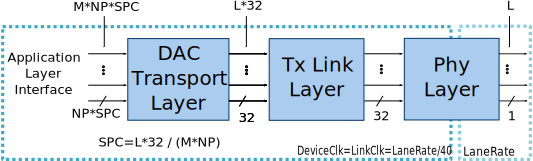

.. _generic_jesd_bds:

Generic JESD204 block designs
===============================================================================

Using the generic building blocks from the
:ref:`ADI IP library <library>`, together with the
:ref:`JESD framework <jesd204>`, parametrizable block designs can be built to
interface ADI ADCs and DACs in various JESD modes.

Link parameters
-------------------------------------------------------------------------------

========= ===============================================
Parameter Description
========= ===============================================
L         Number of lanes
M         Number of converters
F         Octets per Frame per Lane
S         Samples per Converter per Frame
NP/N'     Total number of Bits per Sample
N         Converter Resolution
K         Frames per Multiframe
HD        High Density User Data Format
E         Number of multiblocks in an extended multiblock
========= ===============================================

.. important::

   In JESD links, the following equations must hold:
   
   .. math::
   
      M * S * NP = L * F * 8
      
   or

   .. math::

      \frac{M}{L} = \frac{F}{s} * \frac{8}{NP}

Changing the link parameters
~~~~~~~~~~~~~~~~~~~~~~~~~~~~~~~~~~~~~~~~~~~~~~~~~~~~~~~~~~~~~~~~~~~~~~~~~~~~~~~

Usually, projects are built and configured to exercise the ADC/DAC devices at
maximum capability using all available lanes --- this corresponds to a single
JESD operation mode.

To switch to other modes, the generic block designs can be reconfigured by
changing its parameters. These parameters map to the JESD link parameters.
See the example below taken from
:git-hdl:`this block design <projects/adrv9009/common/adrv9009_bd.tcl>`:

.. code-block:: tcl

   # TX parameters
   set TX_NUM_OF_LANES 4      ; # L
   set TX_NUM_OF_CONVERTERS 4 ; # M
   set TX_SAMPLES_PER_FRAME 1 ; # S
   set TX_SAMPLE_WIDTH 16     ; # N/NP
    
   set TX_SAMPLES_PER_CHANNEL 2 ; # L * 32 / (M * N)

.. caution::

   Changing the parameters "number of lanes" requires updating the top-level
   file and the constraints file as well! If the number of lanes is reduced,
   both files must be updated to remove references to the unused lanes.

Generic TX path
-------------------------------------------------------------------------------

The following diagram presents a generic JESD TX path from Application layer
to the FPGA boundary. The application layer is connected to the TX path through 
the DAC Transport Layer, which for each converter it accepts a data beat on
every cycle. The width of data beat is defined by the SPC and NP parameter.

SPC represents the number of samples per converter per data clock cycle.
SPC must be a natural number (greater than one and a whole number).

On each clock cycle, the Link Layer accepts 32 bits per every lane as a
constraint from the physical layer that is configured to 32-bit mode.
This means that for each clock cycle, the application layer must provide
enough samples for each converter such that the Transport Layer can fill
32 bits of data for each lane.

Due to this constraint, the following equation must hold:

.. math::
   
   L * 32 = M* NP * SPC

In such designs, the following constraints apply to the Transport Layer:

- F = {1, 2, 4}
- NP = {8, 16}

More information on the DAC Transport layer can be found in
:ref:`ad_ip_jesd204_tpl_dac` page.

The Link layer consists of L number of lanes which form the link.
More information on the Tx Link layer can be found in
:ref:`axi_jesd204_tx` page.

Example1: TX link with L=4, M=1, S=1, F=2, NP=16
~~~~~~~~~~~~~~~~~~~~~~~~~~~~~~~~~~~~~~~~~~~~~~~~~~~~~~~~~~~~~~~~~~~~~~~~~~~~~~~

Software related
-------------------------------------------------------------------------------

- :dokuwiki:`ADC Linux driver documentation <resources/tools-software/linux-drivers/iio-adc/axi-adc-hdl>`
- :dokuwiki:`DAC Linux driver documentation <resources/tools-software/linux-drivers/iio-dds/axi-dac-dds-hdl>`
- :dokuwiki:`ADI JESD204B/C Transmit Peripheral Linux driver documentation <resources/tools-software/linux-drivers/jesd204/axi_jesd204_tx>`
- :dokuwiki:`ADI JESD204B/C Receive Peripheral Linux driver documentation <resources/tools-software/linux-drivers/jesd204/axi_jesd204_rx>`
- :dokuwiki:`ADI JESD204B/C AXI_ADXCVR Highspeed Transceivers Linux driver documentation <resources/tools-software/linux-drivers/jesd204/axi_adxcvr>`
