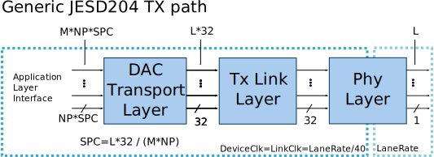

.. _generic_jesd_bds:

Generic JESD204 block designs
===============================================================================

Using the generic building blocks from the
:ref:`ADI IP library <library>`, together with the
:ref:`JESD framework <jesd204>`, parametrizable block designs can be built to
interface ADI ADCs and DACs in various JESD modes.

Link parameters
-------------------------------------------------------------------------------

========= ===============================================
Parameter Description
========= ===============================================
L         Number of lanes
M         Number of converters
F         Octets per Frame per Lane
S         Samples per Converter per Frame
NP/N'     Total number of Bits per Sample
N         Converter Resolution
K         Frames per Multiframe
HD        High Density User Data Format
E         Number of multiblocks in an extended multiblock
========= ===============================================

.. important::

   In JESD links, the following equations must hold:

      **M * S * NP = L * F * 8**

   or

      **M / L = (F / S) * (8 / NP)**

Changing the link parameters
~~~~~~~~~~~~~~~~~~~~~~~~~~~~~~~~~~~~~~~~~~~~~~~~~~~~~~~~~~~~~~~~~~~~~~~~~~~~~~~

Usually, projects are built and configured to exercise the ADC/DAC devices at
maximum capability using all available lanes --- this corresponds to a single
JESD operation mode.

To switch to other modes, the generic block designs can be reconfigured by
changing its parameters. These parameters map to the JESD link parameters.
See the example below taken from
:git-hdl:`this block design <projects/adrv9009/common/adrv9009_bd.tcl>`:

.. code-block:: tcl

   # TX parameters
   set TX_NUM_OF_LANES 4      ; # L
   set TX_NUM_OF_CONVERTERS 4 ; # M
   set TX_SAMPLES_PER_FRAME 1 ; # S
   set TX_SAMPLE_WIDTH 16     ; # N/NP

   set TX_SAMPLES_PER_CHANNEL 2 ; # L * 32 / (M * N)

.. caution::

   Changing the parameters "number of lanes" requires updating the top-level
   file and the constraints file as well! If the number of lanes is reduced,
   both files must be updated to remove references to the unused lanes.

Generic TX path
-------------------------------------------------------------------------------

The following diagram presents a generic JESD TX path from the Application Layer
to the FPGA boundary. The application layer is connected to the TX path through
the DAC Transport Layer, which for each converter it accepts a data beat on
every cycle. The width of data beat is defined by the SPC and NP parameter.

SPC represents the number of samples per converter per data clock cycle.
SPC must be a natural number (greater than one and a whole number).

On each clock cycle, the Link layer accepts 32 bits per every lane as a
constraint from the physical layer that is configured to 32-bit mode.
This means that for each clock cycle, the application layer must provide
enough samples for each converter such that the Transport Layer can fill
32 bits of data for each lane.

Due to this constraint, the following equation must hold:

**L * 32 = M * NP * SPC**

In such designs, the following constraints apply to the Transport Layer:

- F = {1, 2, 4}
- NP = {8, 16}

.. _generic_jesd_bds tx-general-rules:

.. important::

   Some general rules that **always should hold**:

   - **LaneRate = SampleRate * (10/8) * (M/L) * NP**
   - **SampleRate = DAC_rate/Total_interpolation**
   - **Link Clock = Lane Rate / 40**
   - If OUTDIV_CLK is used: **Link Clock = (RefClock)/((OutClkSel == 4)? 2 : (OutClkSel == 3)? 1 : 1)**

Where:

- ``M`` - "adi,converters-per-device", device tree property from "axi-jesd204-tx" node
- ``L`` - number of lanes per link, parameter of JESD IP
- ``NP`` - "adi,bits-per-sample" device tree property from "axi-jesd204-tx" node
- ``RefClock`` - reference clock for the transceivers
- ``SampleRate`` - rate of the samples that feeds the JESD link
- ``DAC_rate`` - DAC raw sample rate after interpolation
- ``Total_interpolation`` - product of selected interpolations on the datapath,
  e.g: ``DAC_interpolation * Channel_interpolation``
- ``OutClkSel`` - "adi,out-clk-select" device tree property from XCVR node

More information on the DAC Transport Layer can be found in
:ref:`ad_ip_jesd204_tpl_dac` page.

The Link layer consists of L number of lanes which form the link.
More information on the TX Link layer can be found in
:ref:`axi_jesd204_tx` page.

Example 1: TX link with L=4, M=1, S=1, F=2, NP=16
~~~~~~~~~~~~~~~~~~~~~~~~~~~~~~~~~~~~~~~~~~~~~~~~~~~~~~~~~~~~~~~~~~~~~~~~~~~~~~~

In this mode, the Transport Layer will output 2 frames in every clock cycle
(32 bits / (F*8) = 2).
The Application Layer must provide 8 samples each cycle to be able to fill
the 2 frames.

**SPC = (L*32) / (M*NP) = (4*32) / (1*16) = 128/16 = 8**

Example 2: TX link with L=4, M=4, S=1, F=2, NP=16
~~~~~~~~~~~~~~~~~~~~~~~~~~~~~~~~~~~~~~~~~~~~~~~~~~~~~~~~~~~~~~~~~~~~~~~~~~~~~~~

In this mode the Transport Layer will output two frames in every clock cycle.
32 bits / (F*8) = 2.
The Application Layer must provide 8 samples each cycle to be able to fill the
2 frames.

**SPC = (L*32) / (M*NP) = (4*32) / (4*16) = 128/64 = 2**

Generic RX path
-------------------------------------------------------------------------------

The following diagram presents a generic JESD RX path from the Application Layer
to the FPGA boundary. The Application Layer is connected to the RX path through
the ADC Transport Layer, which for each converter generates a data beat on
every cycle. The width of data beat is defined by the SPC and NP parameter.
SPC represents the number of samples per converter per data clock cycle.
SPC must be a natural number (greater than one and a whole number).

.. image:: jesd204_generic_rx_path.svg
   :width: 700
   :align: center
   :alt: Generic JESD204 RX path

On each clock cycle, the Link layer generates 32 bits per every lane as it is
constrained from the Physical Layer that is configured to 32-bit mode. This
means that for each clock cycle, the Application Layer must accept enough
samples for each converter so the Transport Layer use 32 bits of data from
each lane.

In such designs, the following constraints apply to the Transport Layer:

- F = {1, 2, 4}
- NP = {8, 16}

More information on the ADC Transport layer can be found in
:ref:`ad_ip_jesd204_tpl_adc` page.

The Link layer consists from L number of lanes which form the link.
More information on the RX Link layer can be found in
:ref:`axi_jesd204_rx` page.

Example: RX link with L=4, M=1, S=1, F=2, NP=16
~~~~~~~~~~~~~~~~~~~~~~~~~~~~~~~~~~~~~~~~~~~~~~~~~~~~~~~~~~~~~~~~~~~~~~~~~~~~~~~

In this mode the Transport Layer will accept two frames in every clock cycle.
32 bits / (F*8) = 2;
The Application Layer must accept 8 samples each cycle so the transport layer
can deframe the 2 frames.

**SPC = (L*32) / (M*NP) = (4*32) / (1*16) = 128/16 = 8**

.. note::

   Such a parametrizable block design was built for the ADRV9009 prototyping
   platform and can be found :git-hdl:`here <projects/adrv9009/common/adrv9009_bd.tcl>`.

JESD204 modes with F=8
-------------------------------------------------------------------------------

In a period of LinkClk, the Link layer always handles 32 bits per lane.
The Transport Layer running at a same clock rate can fill the 32 bits with
frames of 1,2 or 4 bytes.

However, for a link with L=1, M=4, NP=16 the minimum number of bytes per
frame that must be supported is 8 (F=8).

Example: TX link with L=1, M=4, S=1, F=8, NP=16
~~~~~~~~~~~~~~~~~~~~~~~~~~~~~~~~~~~~~~~~~~~~~~~~~~~~~~~~~~~~~~~~~~~~~~~~~~~~~~~

To fulfill the requirement that in every DataClk period for each converter
from the Application Layer a sample must be accepted (64 bits in this case),
DataClk must be run with half the speed of the LinkClk.

The rate adaptation and synchronization is done with a gearbox which receives
its clocks from a PLL that ensures its output clocks are in phase.

Example: RX link with L=1, M=4, S=1, F=8, NP=16
~~~~~~~~~~~~~~~~~~~~~~~~~~~~~~~~~~~~~~~~~~~~~~~~~~~~~~~~~~~~~~~~~~~~~~~~~~~~~~~

The RX path is similar to the TX. In order the transport layer to produce a
sample per converter in every clock cycle the Data clock must be ran at half
of the LinkClock speed.

Such a parametrizable block design that supports also F=8 was built for the
ADRV9009 prototyping platform, and can be found
:git-hdl:`here <dev_adrv9009_less_lanes:projects/adrv9009/common/adrv9009_bd.tcl>`.

Software related
-------------------------------------------------------------------------------

- :dokuwiki:`ADC Linux driver documentation <resources/tools-software/linux-drivers/iio-adc/axi-adc-hdl>`
- :dokuwiki:`DAC Linux driver documentation <resources/tools-software/linux-drivers/iio-dds/axi-dac-dds-hdl>`
- :dokuwiki:`ADI JESD204B/C Transmit Peripheral Linux driver documentation <resources/tools-software/linux-drivers/jesd204/axi_jesd204_tx>`
- :dokuwiki:`ADI JESD204B/C Receive Peripheral Linux driver documentation <resources/tools-software/linux-drivers/jesd204/axi_jesd204_rx>`
- :dokuwiki:`ADI JESD204B/C AXI_ADXCVR Highspeed Transceivers Linux driver documentation <resources/tools-software/linux-drivers/jesd204/axi_adxcvr>`
