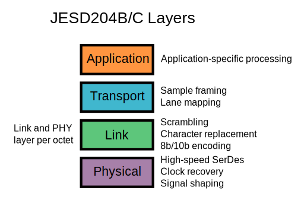
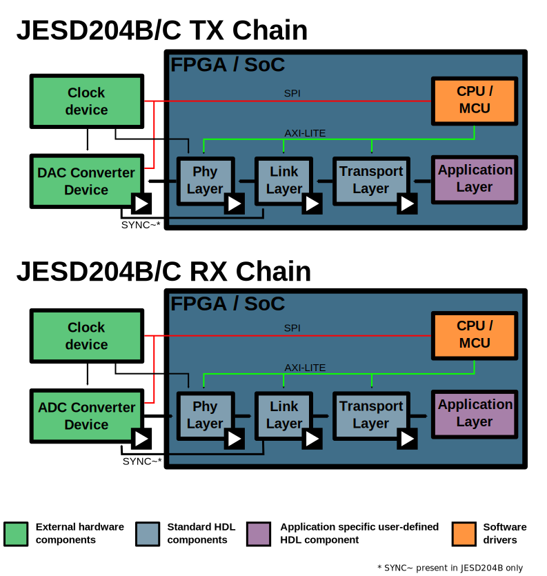

.. _jesd204:

JESD204 Interface Framework
================================================================================

.. toctree::
   :maxdepth: 1

   Generic JESD204 block designs <generic_jesd_bds/index>
   JESD204B/C Link Transmit Peripheral <axi_jesd204_tx/index>
   JESD204B/C Link Receive Peripheral <axi_jesd204_rx/index>
   ADC JESD204B/C Transport Peripheral <ad_ip_jesd204_tpl_adc/index>
   DAC JESD204B/C Transport Peripheral <ad_ip_jesd204_tpl_dac/index>
   Xilinx FPGAs Transceivers Wizard <xgt_wizard/index>
   AMD Versal Adaptive SoC Transceiver Subsystem <versal_transceiver_subsystem/index>
   Troubleshooting JESD204 TX links <troubleshoot/troubleshoot_jesd204_tx>

The JESD204, JESD204A, JESD204B and the JESD204C data converter serial interface
standard was created through the JEDEC committee to standardize and reduce the
number of data inputs/outputs between high-speed data converters and other
devices, such as FPGAs (field-programmable gate arrays).

Fewer interconnects simplifies layout and allows smaller form factor realization
without impacting overall system performance. These attributes are important to
address the system size and cost constraints of a range of high-speed ADC
applications, including wireless infrastructure (GSM, EDGE, W-CDMA, LTE,
CDMA2000, WiMAX, TD-SCDMA) transceiver architectures, software-defined radios,
portable instrumentation, medical ultrasound equipment, and Mil/Aero applications
such as radar and secure communications.

:adi:`Analog Devices, Inc. (ADI) <>` is an original participating member of the JEDEC
JESD204 standards committee and we have concurrently developed compliant data
converter technology and tools, and a comprehensive product roadmap to fully
enable our customers to take advantage of this significant interfacing
breakthrough.

:adi:`ADI <>` supplies a full-stack supporting JESD204B/C which provides a
fully integrated system level experience. This solution includes:

.. hint::

   - :ref:`Reference hardware platforms <rapid_prototyping_label>` for
     rapid-prototyping
   - :ref:`FPGA HDL support <fpga_hdl_support_label>` for interfacing JESD204B/C ADCs,
     DACs, and RF Transceivers
   - :ref:`Software support <software_support_label>` to configure the converter
     devices and FPGA HDL peripherals

How to Obtain a License
--------------------------------------------------------------------------------

When customers and partners download/use software from GitHub, e-mail or
similar ways, they are obligated to comply to the terms and conditions of
the :git-hdl:`Software License Agreement <LICENSE_ADIJESD204>`.
This core is released under two different licenses. You may choose either:

- Commercial licenses may be purchased from :adi:`ADI <>` by ordering
  :adi:`IP-JESD204 <en/design-center/evaluation-hardware-and-software/jesd204-interface-framework.html>`.
  This will allow you to use the core in a closed system.
- GPL 2, this allows you to use the core for any purpose, but you must release
  anything else that links to the JESD204 core (this would normally be your
  algorithmic IP). **You do not need to sign or purchase** anything to use
  the JESD204 core under the GPL license.

There is only one core -- the only difference is the license and support.
If you have a question about the license, you can email
`jesd204-licensing@analog.com <jesd204-licensing@analog.com>`__.

Details on the JESD204 standard
--------------------------------------------------------------------------------

.. _jesd204 glossary:

Glossary
~~~~~~~~~~~~~~~~~~~~~~~~~~~~~~~~~~~~~~~~~~~~~~~~~~~~~~~~~~~~~~~~~~~~~~~~~~~~~~~~

**Control characters**

============== ========= ====================================================
Representation Character  Description
============== ========= ====================================================
 **/R/**       K28.0     Initial lane alignment sequence multi-frame start
 **/A/**       K28.3     Lane alignment
 **/Q/**       K28.4     Initial lane alignment sequence configuration marker
 **/K/**       K28.5     Code group synchronization
 **/F/**       K28.7     Frame synchronization
============== ========= ====================================================

**Abbreviations**

- **CGS** - Code Group Synchronization
- **ILAS** - Initial Lane Alignment Sequence
- **LMFC** - Local Multi Frame Clock
- **LEMC** - Local Extended Multiblock Clock
- **MCDA** - Multiple Converter Device Alignment
- **NMCDA** - No Multiple Converter Device Alignment
- **RBD** - RX Buffer Delay
- **EMB** - Extended Multiblock
- **EoMB** - End-of-multiblock sequence (00001)
- **EoEMB** - End of extended multiblock identifier bit

**Link parameters**

- **L** - Lane Count
- **M** - Converter Count
- **F** - Octets per Frame per Lane
- **S** - Samples per Converter per Frame
- **NP** - Total Number of Bits per Sample
- **N** - Converter Resolution
- **K** - Frames per Multiframe
- **HD** - High Density User Data Format
- **E** - Number of multiblocks in an extended multiblock

**Clocks**

- **character clock** - Clock with which 8b10b characters and octets are
  generated.
- **conversion clock** - Clock used by a converter device to perform the A2D
  or D2A conversion.
- **link clock** - Link parallel clock feeding the link layer, lane rate / 40
  or lane rate / 80 for 204B links, lane rate / 66 for 204C 64b66b links
- **device clock** - Master clock supplied to the JESD204B device from which
  all other clock signals must be derived. In context of FPGA is an integer
  multiple of frame clock, used directly in link, transport and application
  layers.
- **frame clock** - Clock rate at which samples are generated/processed. Has
  the same rate as the conversion clock, except for interpolating DACs or
  decimating DACs, where it is slower by the interpolation/decimation factor.
- **line clock** - Clock for the high-speed serial interface.
- **local clock** - A clock generated inside a JESD204B device.
- **SYSREF clock** - Slow clock used for cross-device synchronization purposes.

.. important::

   All clocks inside a JESD204B system must have an integer relationship.

Overview
~~~~~~~~~~~~~~~~~~~~~~~~~~~~~~~~~~~~~~~~~~~~~~~~~~~~~~~~~~~~~~~~~~~~~~~~~~~~~~~~

JESD204B/C is a high-speed serial link for data converters between converter and
logic device (FPGA/ASIC):

- (JESD204B) up to 12.5 Gbps (raw data) per lane, with 8B10B encoding
- (JESD204C) up to 32.5 Gbps per lane, with 64B66B encoding
- Up to 32 lanes per link
- Handles data mapping and framing
- Multi-chip synchronization
- Deterministic latency

Key Aspects of JESD204 Standards
~~~~~~~~~~~~~~~~~~~~~~~~~~~~~~~~~~~~~~~~~~~~~~~~~~~~~~~~~~~~~~~~~~~~~~~~~~~~~~~~

- 8b/10b Embedded Clock

  - DC balanced encoding which guarantees significant transition frequency for
    use with clock and data recovery (CDR) designs
  - Encoding allows both data and control characters - control characters can
    be used to specify link alignment, maintenance, monitoring, etc
  - Detection of single bit error events on the link

- Serial Lane Alignment

  - Using special training patterns with control characters, lanes can be
    aligned across a "link"
  - Trace-to-trace tolerance may be relaxed, relative to synchronous sampling
    parallel LVDS designs

- Serial Lane Maintenance/Monitoring

  - Alignment maintained through the super-frame structure and use of specific
    "characters" to guarantee alignment
  - Link quality monitored at receiver on a lane by lane basis
  - Link established and dropped by the receiver based on error thresholds

- Device Clock: A clock signal in the system which is a harmonic of the frame
  rate of the data on the link. In JESD204B systems, the frame clock is no
  longer the master system reference.
- SYNC~

  - A system synchronous, active low signal from the receiver to the transmitter
    which denotes the state of synchronization
  - Synchronous to the local multiframe clock (LMFC)
  - When SYNC~ is low, the receiver and transmitter are synchronizing
  - SYNC~ and frame clock should have similar compliance in order to ensure
    proper capture/transmission timing (i.e., LVDS, CMOS, CML)
  - SYNC~ signals may be combined if multiple DACs/ADCs are involved.

- Lane 0, … , L-1

  - Differential lanes on the link (typically high speed CML)
  - 8B/10B code groups are transmitted MSB first/LSB last

- SYSREF (Optional)

  - An optional source-synchronous, high slew rate timing resolution signal
    responsible for resetting device clock dividers (including LMFC) to ensure
    deterministic latency
  - One shot, "gapped periodic" or periodic
  - Distributed to both ADCs/DACs and ASIC/FPGA logic devices in the system
  - When available, SYSREF is the master timing reference in JESD204B systems
    since it is responsible for resetting the LMFC references

Deterministic Latency in JESD204B
~~~~~~~~~~~~~~~~~~~~~~~~~~~~~~~~~~~~~~~~~~~~~~~~~~~~~~~~~~~~~~~~~~~~~~~~~~~~~~~~

Latency can be defined as deterministic when the time from the input of the
JESD204x transmitter to the output of the JESD204x receiver is consistently the
same number of clock cycles. In parallel implementations, deterministic latency
is rather simple - clocks are carried with the data. In serial implementations,
multiple clock domains exist, which can cause nondeterminism. JESD204 and
JESD204A do not contain provisions for guaranteeing deterministic latency.

JESD204B looks to address the deterministic latency issue by specifying 3
device subclasses:

- Device Subclass 0 - no support for deterministic latency
- Device Subclass 1 - deterministic latency using SYSREF (above 500 MSPS)
- Device Subclass 2 - deterministic latency using SYNC~ (up to 500 MSPS)

JESD204 Interface Framework Overview
~~~~~~~~~~~~~~~~~~~~~~~~~~~~~~~~~~~~~~~~~~~~~~~~~~~~~~~~~~~~~~~~~~~~~~~~~~~~~~~~

The JESD204 Interface Framework is a system-level integrated HDL and software
framework that handles system-level as well as component-level constraints and
dependencies:

- Valid operating values of a configuration settings
- Relationship between different configuration settings
- Constraints are propagated between connected components
- PLL out frequency constraints will affect converter sample rate constraints
  and vice versa
- Diagnostics to detect failure source.

It is an integrated framework covering the whole stack on different facets of
system design:

- Hardware: Reference and rapid prototyping systems
- HDL: IPs for JESD204 protocol handling
- Software: Drivers to manage clock-chips, converters and HDL
- Components have been co-designed for improved interoperability

Key features:

- Automatic interface configuration based on application settings
- High-level API
- Dynamic re-configuration
- Integration with Matlab/Simulink, Python and GNU radio

The JESD204B standard defines multiple layers, each layer being responsible
for a particular function.

The :adi:`Analog Devices <>` JESD204B HDL solution follows the standard here
and defines 4 layers: physical layer, link layer, transport layer and
application layer. For the first three layers Analog Devices provides
tandard components that can be linked up to provide a full JESD204B protocol
processing chain.

Depending on the FPGA and converter combinations that are being interfaced,
different components can be chosen for the physical and transport layer.
The FPGA defines which physical layer component should be used and the
interfaced converter defines which transport layer component should be used.

The link layer component is selected based on the direction of the JESD204B
link.

The application layer is user defined and can be used to implement application
specific signal processing.

.. _fpga_hdl_support_label:

FPGA HDL Support
--------------------------------------------------------------------------------

The JESD204B/C standard defines multiple layers, each layer being responsible
for a particular function. The Analog Devices JESD204B/C HDL solution follows
the current standard and defines 4 layers. Physical layer, link layer, transport
layer and application layer. For the first three layers, :adi:`ADI <>` provides
standard components that can be linked to provide a full JESD204B/C protocol
processing chain.

Depending on the FPGA and converter combinations that are being interfaced,
different components can be chosen for the physical and transport layer. The
FPGA defines which **physical** layer component should be used, meanwhile the
interfaced converter defines which **transport** layer component should be used.

The **link** layer component is selected based on the direction of the
JESD204B/C link.

The **application** layer is user-defined and can be used to implement
application-specific signal processing.

.. _jesd204_physical_layer:

Physical Layer
~~~~~~~~~~~~~~~~~~~~~~~~~~~~~~~~~~~~~~~~~~~~~~~~~~~~~~~~~~~~~~~~~~~~~~~~~~~~~~~~

Physical layer peripherals are responsible for interfacing and configuring the
high-speed serial transceivers. Currently, we have support for GTXE2, GTHE3,
GTHE4, GTYE4 for AMD Xilinx, GTY and GTYP transceivers for AMD Versal
and Arria 10, Stratix 10 H-Tile, Agilex 7 F-Tile transceivers for Intel.

- :ref:`axi_adxcvr`: JESD204B/C Gigabit
  Transceiver Register Configuration Peripheral
- :ref:`UTIL_ADXCVR <util_adxcvr>`: JESD204B/C Gigabit
  Transceiver Interface Peripheral for AMD Xilinx FPGAs
- :ref:`AMD Versal Adaptive SoC Transceiver Subsystem <versal_transceiver_subsystem>`: JESD204B/C
  Gigabit Transceiver Interface Peripheral for AMD Xilinx Versal FPGAs

Link Layer
~~~~~~~~~~~~~~~~~~~~~~~~~~~~~~~~~~~~~~~~~~~~~~~~~~~~~~~~~~~~~~~~~~~~~~~~~~~~~~~~

Link layer peripherals are responsible for JESD204B/C protocol handling,
including scrambling/descrambling, lane alignment, character replacement and
alignment monitoring.

- :ref:`JESD204B/C Transmit Peripheral <axi_jesd204_tx>`:
  JESD204B/C Link Layer Transmit Peripheral
- :ref:`JESD204B/C Receive Peripheral <axi_jesd204_rx>`:
  JESD204B/C Link Layer Receive Peripheral

.. _jesd204_transport_layer:

Transport Layer
~~~~~~~~~~~~~~~~~~~~~~~~~~~~~~~~~~~~~~~~~~~~~~~~~~~~~~~~~~~~~~~~~~~~~~~~~~~~~~~~

Transport layer peripherals are responsible for converter specific data framing
and de-framing.

- :ref:`ADC JESD204B/C Transport Peripheral <ad_ip_jesd204_tpl_adc>`:
  JESD204B/C Transport Layer Receive Peripheral
- :ref:`DAC JESD204B/C Transport Peripheral <ad_ip_jesd204_tpl_dac>`:
  JESD204B/C Transport Layer Transmit Peripheral

Interfaces
~~~~~~~~~~~~~~~~~~~~~~~~~~~~~~~~~~~~~~~~~~~~~~~~~~~~~~~~~~~~~~~~~~~~~~~~~~~~~~~~

Interfaces are a well-defined collection of wires that are used to communicate
between components. The following interfaces are used to connect components of
the HDL JESD204B/C processing stack.

.. _software_support_label:

Software Support
--------------------------------------------------------------------------------

Linux
~~~~~~~~~~~~~~~~~~~~~~~~~~~~~~~~~~~~~~~~~~~~~~~~~~~~~~~~~~~~~~~~~~~~~~~~~~~~~~~~

- :dokuwiki:`JESD204 (FSM) Interface Linux Kernel Framework <resources/tools-software/linux-drivers/jesd204/jesd204-fsm-framework>`
- :dokuwiki:`JESD204B/C Transmit Linux Driver <resources/tools-software/linux-drivers/jesd204/axi_jesd204_tx>`:
  Linux driver for the JESD204B transmit core.
- :dokuwiki:`JESD204B/C Receive Linux Driver <resources/tools-software/linux-drivers/jesd204/axi_jesd204_rx>`:
  Linux driver for the JESD204B receive core.
- :dokuwiki:`JESD204B/C AXI_ADXCVR Highspeed Transceivers Linux Driver <resources/tools-software/linux-drivers/jesd204/axi_adxcvr>`
- :dokuwiki:`JESD204B Statistical Eyescan Application <resources/tools-software/linux-software/jesd_eye_scan>`
- :dokuwiki:`JESD204B Status Utility <resources/tools-software/linux-software/jesd_status>`
- :dokuwiki:`AXI DAC HDL Linux Driver <resources/tools-software/linux-drivers/iio-dds/axi-dac-dds-hdl>`

  - :dokuwiki:`AD9172 DAC Linux Driver <resources/tools-software/linux-drivers/iio-dds/ad9172>`
  - :dokuwiki:`AD9081 MxFE Linux Driver <resources/tools-software/linux-drivers/iio-mxfe/ad9081>`
  - :dokuwiki:`ADRV9009, ADRV9008 highly integrated, wideband RF transceiver Linux device driver <resources/tools-software/linux-drivers/iio-transceiver/adrv9009>`
  - :dokuwiki:`AD9371, AD9375 highly integrated, wideband RF transceiver Linux device driver <resources/tools-software/linux-drivers/iio-transceiver/ad9371>`

- :dokuwiki:`AXI ADC HDL Linux Driver <resources/tools-software/linux-drivers/iio-adc/axi-adc-hdl>`

  - :dokuwiki:`AD9208 ADC Linux Driver <resources/tools-software/linux-drivers/iio-adc/ad9208>`
  - :dokuwiki:`AD9081 MxFE Linux Driver <resources/tools-software/linux-drivers/iio-mxfe/ad9081>`
  - :dokuwiki:`ADRV9009, ADRV9008 highly integrated, wideband RF transceiver Linux device driver <resources/tools-software/linux-drivers/iio-transceiver/adrv9009>`
  - :dokuwiki:`AD9371, AD9375 highly integrated, wideband RF transceiver Linux device driver <resources/tools-software/linux-drivers/iio-transceiver/ad9371>`

No-OS
~~~~~~~~~~~~~~~~~~~~~~~~~~~~~~~~~~~~~~~~~~~~~~~~~~~~~~~~~~~~~~~~~~~~~~~~~~~~~~~~

- :dokuwiki:`ADI JESD204B/C AXI_ADXCVR Highspeed Transceivers No-OS Driver <resources/tools-software/uc-drivers/jesd204/axi_adxcvr>`
- :dokuwiki:`ADI JESD204B/C Receive Peripheral No-OS Driver <resources/tools-software/uc-drivers/jesd204/axi_jesd204_rx>`
- :dokuwiki:`ADI JESD204B/C Transmit Peripheral No-OS Driver <resources/tools-software/uc-drivers/jesd204/axi_jesd204_tx>`
- :dokuwiki:`AXI ADC No-OS Driver <resources/tools-software/uc-drivers/jesd204/axi_adc_core>`
- :dokuwiki:`AXI DAC No-OS Driver <resources/tools-software/uc-drivers/jesd204/axi_dac_core>`

Tutorial
--------------------------------------------------------------------------------

#. :dokuwiki:`System Architecture <resources/fpga/peripherals/jesd204/tutorial/system_architecture>`
#. :ref:`generic_jesd_bds`.
   This will help you understand the generic blocks for the next steps.
#. Checkout the :ref:`HDL Source <build_hdl>`, and then build either one of:

   #. :dokuwiki:`HDL AMD Xilinx <resources/fpga/peripherals/jesd204/tutorial/hdl_xilinx>`
   #. :dokuwiki:`HDL Altera <resources/fpga/peripherals/jesd204/tutorial/hdl_altera>`

#. :dokuwiki:`Linux <resources/fpga/peripherals/jesd204/tutorial/linux>`

HDL Example Projects
--------------------------------------------------------------------------------

- :ref:`AD-FMCADC2-EBZ Reference Design (RETIRED) <fmcadc2>`
- :dokuwiki:`AD-FMCADC3-EBZ Reference Design (RETIRED) <resources/fpga/xilinx/fmc/ad-fmcadc3-ebz>`
- :dokuwiki:`AD-FMCADC4-EBZ Reference Design (RETIRED) <resources/fpga/xilinx/fmc/ad-fmcadc4-ebz>` on:

  - :git-hdl:`AMD Xilinx ZC706 <hdl_2018_r2:projects/fmcadc4/zc706>`

- :ref:`AD-FMCADC5-EBZ Reference Design (RETIRED) <fmcadc5>`
- :ref:`AD-FMCJESDADC1-EBZ Reference Design (RETIRED) <fmcjesdadc1>`
- :ref:`AD-FMCOMMS8-EBZ Reference Design <fmcomms8>` on:

  - :git-hdl:`Intel Arria 10 SoC <projects/fmcomms8/a10soc>`
  - :git-hdl:`AMD Xilinx ZCU102 <projects/fmcomms8/zcu102>`

- :ref:`AD-FMCOMMS11-EBZ Reference Design <fmcomms11>` on:

  - :git-hdl:`AMD Xilinx ZC706 <projects/fmcomms11/zc706>`

- :ref:`AD-FMCDAQ2-EBZ Reference Design <daq2>` on:

  - :git-hdl:`Intel Arria 10 SoC <projects/daq2/a10soc>`
  - :git-hdl:`Intel A10Gx (RETIRED) <hdl_2021_r1:projects/daq2/a10gx>`
  - :git-hdl:`AMD Xilinx KC705 (RETIRED) <hdl_2023_r2:projects/daq2/kc705>`
  - :git-hdl:`AMD Xilinx KCU105 <projects/daq2/kcu105>`
  - :git-hdl:`AMD Xilinx VC707 (RETIRED) <hdl_2018_r2:projects/daq2/vc707>`
  - :git-hdl:`AMD Xilinx ZC706 <projects/daq2/zc706>`
  - :git-hdl:`AMD Xilinx ZCU102 <projects/daq2/zcu102>`

- :ref:`AD-FMCDAQ3-EBZ Reference Design <daq3>` on:

  - :git-hdl:`Intel A10Gx (RETIRED) <hdl_2021_r1:projects/daq3/a10gx>`
  - :git-hdl:`AMD Xilinx KCU105 <projects/daq3/kcu105>`
  - :git-hdl:`AMD Xilinx VCU118 <projects/daq3/vcu118>`
  - :git-hdl:`AMD Xilinx ZC706 <projects/daq3/zc706>`
  - :git-hdl:`AMD Xilinx ZCU102 <projects/daq3/zcu102>`

- :ref:`ADRV9371X Reference Design <adrv9371x>` on:

  - :git-hdl:`Intel Arria 10 SoC <projects/adrv9371x/a10soc>`
  - :git-hdl:`Intel A10Gx (RETIRED) <hdl_2021_r1:projects/adrv9371x/a10gx>`
  - :git-hdl:`AMD Xilinx KCU105 <projects/adrv9371x/kcu105>`
  - :git-hdl:`AMD Xilinx ZC706 <projects/adrv9371x/zc706>`
  - :git-hdl:`AMD Xilinx ZCU102 <projects/adrv9371x/zcu102>`

- :ref:`ADRV9009 Reference Design <adrv9009>` on:

  - :git-hdl:`AMD Xilinx ZCU102 <projects/adrv9009/zcu102>`

- :ref:`ADRV9009-ZU11EG-SOM Reference Design <adrv9009zu11eg>` on:

  - :git-hdl:`Intel Arria 10 SoC <projects/adrv9009zu11eg/a10soc>`
  - :git-hdl:`Intel A10Gx (RETIRED) <hdl_2021_r1:projects/adrv9009zu11eg/a10gx>`
  - :git-hdl:`AMD Xilinx ZC706 <projects/adrv9009zu11eg/zc706>`
  - :git-hdl:`ADRV9009-ZU11EG-SOM <projects/adrv9009zu11eg>`

- :ref:`AD913x/AD917x/AD9144/AD915x Reference Design (dac_fmc_ebz) <dac_fmc_ebz>` on:

  - See the :git-hdl:`list of supported parts <projects/dac_fmc_ebz#readme>`
  - :git-hdl:`Intel Arria 10 SoC <projects/dac_fmc_ebz/a10soc>`
  - :git-hdl:`AMD Xilinx VCU118 <projects/dac_fmc_ebz/vcu118>`
  - :git-hdl:`AMD Xilinx ZC706 <projects/dac_fmc_ebz/zc706>`
  - :git-hdl:`AMD Xilinx ZCU102 <projects/dac_fmc_ebz/zcu102>`

- :ref:`AD916x Reference Design <ad916x_fmc>` on:

  - See the :git-hdl:`list of supported parts <projects/ad916x_fmc#readme>`
  - :git-hdl:`AMD Xilinx ZCU102 <projects/ad916x_fmc/zcu102>`

- :ref:`AD9081-FMCA-EBZ/AD9082-FMCA-EBZ <ad9081_fmca_ebz>` on:

  - (AD9081) :git-hdl:`Intel Arria 10 SoC <projects/ad9081_fmca_ebz/a10soc>`
  - (AD9081) :git-hdl:`Intel FM87 <projects/ad9081_fmca_ebz/fm87>`
  - (AD9081) :git-hdl:`AMD Xilinx ZC706 <projects/ad9081_fmca_ebz/zc706>`
  - (AD9081) :git-hdl:`AMD Xilinx ZCU102 <projects/ad9081_fmca_ebz/zcu102>`
  - (AD9081) :git-hdl:`AMD Xilinx VCU118 <projects/ad9081_fmca_ebz/vcu118>`
  - (AD9081) :git-hdl:`AMD Xilinx VCU128 (RETIRED) <hdl_2023_r2:projects/ad9081_fmca_ebz/vcu128>`
  - (AD9081) :git-hdl:`AMD Xilinx VCK190 <projects/ad9081_fmca_ebz/vck190>`
  - (AD9082) :git-hdl:`AMD Xilinx VCK190 <projects/ad9082_fmca_ebz/vck190>`
  - (AD9082) :git-hdl:`AMD Xilinx VCU118 <projects/ad9082_fmca_ebz/vcu118>`
  - (AD9082) :git-hdl:`AMD Xilinx ZC706 <projects/ad9082_fmca_ebz/zc706>`
  - (AD9082) :git-hdl:`AMD Xilinx ZCU102 <projects/ad9082_fmca_ebz/zcu102>`

- :ref:`AD9081-FMCA-EBZ X-Band Phased Array Reference Design <ad9081_fmca_ebz_x_band>`

  - :git-hdl:`AMD Xilinx ZCU102 <projects/ad9081_fmca_ebz_x_band/zcu102>`

- :ref:`AD9213-DUAL-EBZ Reference Design <ad9213_dual_ebz>`

  - :git-hdl:`Intel Stratix 10 SoC <projects/ad9213_dual_ebz/s10soc>`

- :ref:`AD9213-EVB Reference Design <ad9213_evb>` on:

  - :git-hdl:`AMD Xilinx VCU118 <projects/ad9213_evb/vcu118>`

- :ref:`AD6676EVB Reference Design <ad6676evb>` on:

  - :git-hdl:`AMD Xilinx VC707 (RETIRED) <hdl_2023_r2:projects/ad6676evb/vc707>`
  - :git-hdl:`AMD Xilinx ZC706 <projects/ad6676evb/zc706>`

- :ref:`AD9083-EVB Reference Design <ad9083_evb>` on:

  - :git-hdl:`Intel Arria 10 SoC <projects/ad9083_evb/a10soc>`
  - :git-hdl:`AMD Xilinx ZCU102 <projects/ad9083_evb/zcu102>`

- :ref:`AD9208-DUAL-EBZ Reference Design <ad9208_dual_ebz>` on:

  - :git-hdl:`AMD Xilinx VCU118 <projects/ad9208_dual_ebz/vcu118>`

- :ref:`AD9209-FMCA-EBZ reference design <ad9209_fmca_ebz>` on:

  - :git-hdl:`AMD Xilinx VCK190 <projects/ad9209_fmca_ebz/vck190>`

- :ref:`AD9656-FMC HDL Reference Design <ad9656_fmc>` on:

  - :git-hdl:`AMD Xilinx ZCU102 <projects/ad9656_fmc/zcu102>`

- :ref:`AD9695-FMC Reference Design <ad9695_fmc>` on:

  - :git-hdl:`AMD Xilinx ZCU102 <projects/ad9695_fmc/zcu102>`

- :ref:`AD-QUADMXFE1-EBZ Reference Design <ad_quadmxfe1_ebz>` on:

  - :git-hdl:`AMD Xilinx VCU118 <projects/ad_quadmxfe1_ebz/vcu118>`

- :ref:`AD-FMCLIDAR1-EBZ Reference Design (RETIRED) <ad_fmclidar1_ebz>`
- :ref:`ADRV9026 Reference Design <adrv9026>` on:

  - :git-hdl:`Intel Arria 10 SoC <projects/adrv9026/a10soc>`
  - :git-hdl:`AMD Xilinx VCK190 <projects/adrv9026/vck190>`
  - :git-hdl:`AMD Xilinx VCU118 <projects/adrv9026/vcu118>`
  - :git-hdl:`AMD Xilinx ZCU102 <projects/adrv9026/zcu102>`

- :ref:`ADRV904x Reference Design <adrv904x>` on:

  - :git-hdl:`AMD Xilinx VCK190 <projects/adrv904x/vck190>`
  - :git-hdl:`AMD Xilinx ZCU102 <projects/adrv904x/zcu102>`

Technical Articles
~~~~~~~~~~~~~~~~~~~~~~~~~~~~~~~~~~~~~~~~~~~~~~~~~~~~~~~~~~~~~~~~~~~~~~~~~~~~~~~~

- :adi:`JESD204B Survival Guide <media/en/technical-documentation/technical-articles/JESD204B-Survival-Guide.pdf>`
- :adi:`Synchronizing Sample Clocks of a Data Converter Array <en/resources/technical-articles/synchronizing-sample-clocks-of-a-data-converter-array>`

.. _rapid_prototyping_label:

JESD204B Rapid Prototyping Platforms
~~~~~~~~~~~~~~~~~~~~~~~~~~~~~~~~~~~~~~~~~~~~~~~~~~~~~~~~~~~~~~~~~~~~~~~~~~~~~~~~

- :adi:`AD-FMCOMMS11-EBZ` :dokuwiki:`(User Guide) <resources/eval/user-guides/ad-fmcomms11-ebz>`
- :adi:`ADRV9009-ZU11EG` :dokuwiki:`ADRV9009-ZU11EG (User Guide) <resources/eval/user-guides/adrv9009-zu11eg>`
- :adi:`EVAL-AD-FMCADC2-EBZ`
- :adi:`EVAL-AD-FMCADC3-EBZ` (RETIRED)
- :adi:`EVAL-AD-FMCADC4-EBZ` (RETIRED)
- :adi:`EVAL-AD-FMCDAQ2-EBZ` :dokuwiki:`(User Guide) <resources/eval/user-guides/ad-fmcdaq2-ebz>`
- :adi:`EVAL-AD-FMCJESDADC1-EBZ`
- :adi:`EVAL-AD917x <EVAL-AD9172>`
- :adi:`EVAL-ADRV9008-9009` :dokuwiki:`(User Guide) <resources/eval/user-guides/adrv9009>`
- :adi:`EVAL-ADRV9371` :dokuwiki:`(User Guide) <resources/eval/user-guides/mykonos>`
- :adi:`EVAL-FMCDAQ3-EBZ`

JESD204B ADCs
~~~~~~~~~~~~~~~~~~~~~~~~~~~~~~~~~~~~~~~~~~~~~~~~~~~~~~~~~~~~~~~~~~~~~~~~~~~~~~~~

- :adi:`AD6673`: 80 MHz Bandwidth, Dual IF Receiver
- :adi:`AD6674`: 385 MHz BW IF Diversity Receiver
- :adi:`AD6676`: Wideband IF Receiver Subsystem
- :adi:`AD6677`: 80 MHz Bandwidth, IF Receiver
- :adi:`AD6684`: 135 MHz Quad IF Receiver
- :adi:`AD6688`: RF Diversity and 1.2GHz BW Observation Receiver
- :adi:`AD9207`: 12-bit, 6 GSPS, JESD204B/C Dual ADC
- :adi:`AD9208`: 14-bit, 3 GSPS, JESD204B, Dual ADC
- :adi:`AD9209`: 12-bit, 4 GSPS, JESD204B/C, Quad ADC
- :adi:`AD9213`: 12-bit, 10.25 GSPS, JESD204B, RF ADC
- :adi:`AD9234`: 12-bit, 1 GSPS/500 MSPS JESD204B, Dual ADC
- :adi:`AD9250`: 14-bit, 170 MSPS/250 MSPS, JESD204B, Dual ADC
- :adi:`AD9625`: 12-bit, 2.6 GSPS/2.5 GSPS/2.0 GSPS, 1.3V/2.5V ADC
- :adi:`AD9656`: Quad, 16-bit, 125 MSPS JESD204B 1.8V ADC
- :adi:`AD9680`: 14-bit, 1.25 GSPS/1 GSPS/820 MSPS/500MSPS JESD204B, Dual ADC
- :adi:`AD9683`: 14-bit, 170 MSPS/250 MSPS, JESD204B, ADC
- :adi:`AD9690`: 14-bit, 500 MSPS / 1 GSPS JESD204B, ADC
- :adi:`AD9691`: 14-bit, 1.25 GSPS JESD204B, Dual ADC
- :adi:`AD9694`: 14-bit, 500 MSPS JESD204B, Quad ADC
- :adi:`AD9695`: 14-bit, 1300 MSPS/625 MSPS,JESD204B, Dual ADC
- :adi:`AD9083`: 16-Channel, 125 MHz Bandwidth, JESD204B ADC
- :adi:`AD9094`: 8-bit, 1 GSPS, JESD204B, Quad ADC

JESD204B DACs
~~~~~~~~~~~~~~~~~~~~~~~~~~~~~~~~~~~~~~~~~~~~~~~~~~~~~~~~~~~~~~~~~~~~~~~~~~~~~~~~

- :adi:`AD9135`: Dual, 11-bit, high dynamic, 2.8 GSPS, TxDAC+ DAC
- :adi:`AD9136`: Dual, 16-bit, 2.8 GSPS, TxDAC+ DAC
- :adi:`AD9144`: Quad, 16-bit, 2.8 GSPS, TxDAC+ DAC
- :adi:`AD9152`: Dual, 16-bit, 2.25 GSPS, TxDAC+ DAC
- :adi:`AD9154`: Quad, 16-bit, 2.4 GSPS, TxDAC+ DAC
- :adi:`AD9161`: 11-bit, 12 GSPS, RF DAC
- :adi:`AD9162`: 16-bit, 12 GSPS, RF DAC
- :adi:`AD9163`: 16-bit, 12 GSPS, RF DAC and Digital Upconverter
- :adi:`AD9164`: 16-bit, 12 GSPS, RF DAC and Direct Digital Synthesizer
- :adi:`AD9172`: Dual, 16-bit, 12.6 GSPS RF DAC with Channelizers
- :adi:`AD9173`: Dual, 16-bit, 12.6 GSPS RF DAC with Channelizers
- :adi:`AD9174`: Dual, 16-bit, 12.6 GSPS RF DAC and Direct Digital Synthesizer
- :adi:`AD9175`: Dual, 11-bit/16-bit, 12.6 GSPS RF DAC with Wideband Channelizers
- :adi:`AD9176`: Dual, 16-bit, 12.6 GSPS RF DAC with Wideband Channelizers
- :adi:`AD9177`: Quad, 16-bit, 12 GSPS RF DAC with Wideband Channelizers

JESD204B RF Transceivers
~~~~~~~~~~~~~~~~~~~~~~~~~~~~~~~~~~~~~~~~~~~~~~~~~~~~~~~~~~~~~~~~~~~~~~~~~~~~~~~~

- :adi:`AD9371`: SDR Integrated, Dual RF Transceiver with Observation Path
- :adi:`AD9375`: SDR Integrated, Dual RF Transceiver with Observation Path and DPD
- :adi:`ADRV9008-1`: SDR Integrated, Dual RF Receiver
- :adi:`ADRV9008-2`: SDR Integrated, Dual RF Transmitter with Observation Path
- :adi:`ADRV9009`: SDR Integrated, Dual RF Transceiver with Observation Path

JESD204B/C Mixed-Signal Front Ends
~~~~~~~~~~~~~~~~~~~~~~~~~~~~~~~~~~~~~~~~~~~~~~~~~~~~~~~~~~~~~~~~~~~~~~~~~~~~~~~~

- :adi:`AD9081`: MxFE Quad, 16-bit, 12 GSPS RF DAC and Quad, 12-bit, 4 GSPS RF ADC
- :adi:`AD9082`: MxFE QUAD, 16-bit, 12 GSPS RF DAC and DUAL, 12-bit, 6 GSPS RF ADC
- :adi:`AD9986`: 4T2R Direct RF Transmitter and Observation Receiver
- :adi:`AD9988`: 4T4R Direct RF Receiver and Transmitter

JESD204B Clocking Solutions
~~~~~~~~~~~~~~~~~~~~~~~~~~~~~~~~~~~~~~~~~~~~~~~~~~~~~~~~~~~~~~~~~~~~~~~~~~~~~~~~

- :adi:`AD9528`: JESD204B Clock Generator with 14 LVDS/HSTL Outputs
- :adi:`ADF4371`: Microwave Wideband Synthesizer with Integrated VCO
- :adi:`HMC7043`: High Performance, 3.2 GHz, 14-Output Fanout Buffer
- :adi:`HMC7044`: High Performance, 3.2 GHz, 14-Output Jitter Attenuator with JESD204B
- :adi:`LTC6952`: Ultralow Jitter, 4.5GHz PLL, JESD204B/C

Software Support
--------------------------------------------------------------------------------

- No-OS JESD204 project at :git-no-OS:`jesd204`
- Linux JESD204 project at :git-linux:`drivers/jesd204`
- Linux JESD204 IIO project at :git-linux:`drivers/iio/jesd204`

References
--------------------------------------------------------------------------------

- HDL IP core at :git-hdl:`library/jesd204`
- :adi:`Understanding Layers in the JESD204B Specification—A High Speed ADC Perspective <en/resources/technical-articles/understanding-layers-in-jesd204b-specification>`
- :ref:`generic_jesd_bds`
- :ref:`troubleshoot_jesd204_tx`
