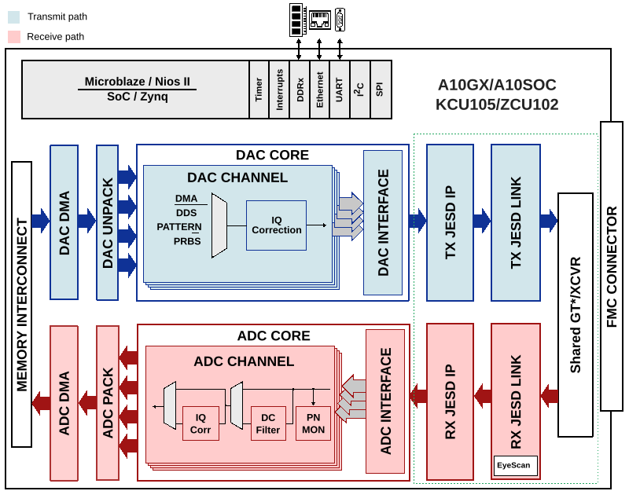

.. _jesd204-system-architecture:

System Architecture
===============================================================================

Every HDL design of a reference project can be divided into two subsystems:

#. **Base design** - contains an embedded processor (soft or hard) and all
   the peripheral IPs that the carrier board supports.

#. **Board design** - direct integration of all the necessary IPs used to
   support an FMC I/O board.

DAQ2 Hardware Architecture
-------------------------------------------------------------------------------

.. figure:: daq2_top.jpg
   :width: 400
   :align: right
   :alt: AD-FMCDAQ2-EBZ board

   AD-FMCDAQ2-EBZ evaluation board

The :adi:`AD-FMCDAQ2-EBZ <EVAL-AD-FMCDAQ2-EBZ>` module is used here as an
example to illustrate how a JESD204B-based system is structured. The module
comprises:

-  :adi:`AD9680` dual, 14-bit, 1.0 GSPS, JESD204B ADC
-  :adi:`AD9144` quad, 16-bit, 2.8 GSPS, JESD204B DAC
-  :adi:`AD9523-1` low jitter clock generator

The hardware can be divided into four functional partitions: transmit path,
receive path, clocking, and control/power management.

.. image:: daq2_block_diagram.png
   :width: 600
   :align: center
   :alt: DAQ2 block diagram

Transmit Path
~~~~~~~~~~~~~~~~~~~~~~~~~~~~~~~~~~~~~~~~~~~~~~~~~~~~~~~~~~~~~~~~~~~~~~~~~~~~~~~

The reference design generates digital signals for the :adi:`AD9144` using the
JESD204B interface. The physical layer consists of 4 lanes running at 10 Gbps.
The device is configured and controlled via SPI and directly active GPIO
signals.

Receive Path
~~~~~~~~~~~~~~~~~~~~~~~~~~~~~~~~~~~~~~~~~~~~~~~~~~~~~~~~~~~~~~~~~~~~~~~~~~~~~~~

The reference design captures data from the :adi:`AD9680` using the JESD204B
interface. The physical layer consists of 4 lanes running at 10 Gbps. The
device is configured and controlled via SPI and directly active GPIO signals.

Clocking
~~~~~~~~~~~~~~~~~~~~~~~~~~~~~~~~~~~~~~~~~~~~~~~~~~~~~~~~~~~~~~~~~~~~~~~~~~~~~~~

The clocking architecture uses a 125 MHz onboard crystal as input to the
:adi:`AD9523-1`. The clock generator upconverts this to approximately 3 GHz
using an internal VCO, with an integer multiplier of 24x producing 3000 MHz.

The VCO output is then divided to provide:

-  1000 MHz sample clocks for both the DAC and ADC
-  500 MHz reference clocks for the FPGA transceivers
-  SYSREF signal for deterministic latency (Subclass 1)

The :adi:`AD9523-1` provides a clean, low-jitter clock distribution network
that is essential for achieving optimal JESD204B link performance.

References
-------------------------------------------------------------------------------

-  :ref:`daq2` - AD-FMCDAQ2-EBZ HDL reference design
-  :ref:`generic_jesd_bds` - Generic JESD204 block designs
-  :ref:`jesd204` - JESD204 Interface Framework
