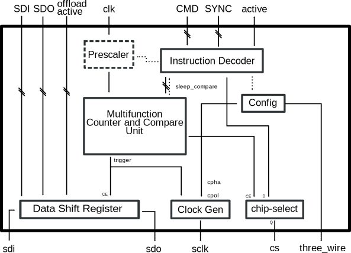

.. _spi_engine execution:

SPI Engine Execution Module
================================================================================

.. hdl-component-diagram::

The :git-hdl:`SPI Engine Execution <library/spi_engine/spi_engine_execution>`
IP core is the heart of the SPI Engine framework.
It is responsible for handling a SPI Engine control stream and translates it
into low-level SPI bus transactions.

Files
-------------------------------------------------------------------------------

.. list-table::
   :widths: 25 75
   :header-rows: 1

   * - Name
     - Description
   * - :git-hdl:`library/spi_engine/spi_engine_execution/spi_engine_execution.v`
     - Verilog source for the peripheral.
   * - :git-hdl:`library/spi_engine/spi_engine_execution/spi_engine_execution_ip.tcl`
     - TCL script to generate the Vivado IP-integrator project for the peripheral.

Configuration Parameters
--------------------------------------------------------------------------------

.. hdl-parameters::

   * - NUM_OF_CS
     - Number of chip-select signals for the SPI bus (min: 1, max: 8).
   * - DEFAULT_SPI_CFG
     - Reset configuration value for the
       :ref:`spi_engine spi-configuration-register`
   * - DEFAULT_CLK_DIV
     - Reset configuration value for the
       :ref:`spi_engine prescaler-configuration-register`
   * - DATA_WIDTH
     - Data width of the parallel data stream. Will define the transaction's
       granularity. Supported values: 8/16/24/32
   * - NUM_OF_SDI
     - Number of multiple SDI lines, (min: 1, max: 8)

Signal and Interface Pins
--------------------------------------------------------------------------------

.. hdl-interfaces::

   * - clk
     - All other signals are synchronous to this clock.
   * - resetn
     - Resets the internal state machine of the core.
   * - ctrl
     - :ref:`spi_engine control-interface` subordinate.
       SPI Engine Control stream that contains commands and data for the
       execution module.
   * - spi
     - :ref:`spi_engine spi-bus-interface` controller.
       Low-level SPI bus interface that is controlled by peripheral.

Theory of Operation
--------------------------------------------------------------------------------

The SPI Engine Execution module implements the physical access to the SPI bus.
It implements a small but powerful programmable state machine that translates a
SPI Engine command stream into low-level SPI bus access.

Communication with a command stream generator happens via the ``ctrl``
interface and the low-level SPI access is handled on the ``spi`` interface.

Internally the SPI Engine execution module consists of an instruction encoder
that translates the incoming commands into an internal control signal, a
multi-function counter and compares unit that is responsible for handling the
timing and a shift register which holds the received and transmitted SPI data.

The module has an optional programmable pre-scaler register that can be used to
divide the external clock to the counter and compare unit.

