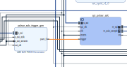

.. _spi_engine tutorial:

SPI Engine Tutorial - PulSAR-ADC
================================================================================

The goal of this tutorial is to present the process of adding
:ref:`spi_engine` support for an ADI precision converter or family of converters
using a few simple steps.
The target carrier is the Digilent Cora-z7s board using a PMOD connector.

Evaluating the target device
--------------------------------------------------------------------------------

The aim of this project is to provide support for a family of ADCs which come in
the form of
:dokuwiki:`pulsar-adc-pmods <resources/eval/user-guides/circuits-from-the-lab/pulsar-adc-pmods>`.
They all share the same interface and the same PCB, the differences being found
in their performance. The table below offers a comparison between the timing
parameters of the SPI interface for these devices. Using this table we can see
how much they have in common and where the key differences are. All the values
are for 3.3V VIO since the Cora-z7s is only 3.3V capable.

+----------+----------+------+----------+----------+----------+----------+
| Device   | Re       | KSPS | T\_      | T_CONV   | T_CYC    | T_ACQ    |
|          | solution |      | SPI_SCLK | max [ns] | min [ns] | min [ns] |
|          |          |      | min [ns] |          |          |          |
+==========+==========+======+==========+==========+==========+==========+
| AD7942   | 14       | 250  | 18       | 2200     | 4000     | 1800     |
+----------+----------+------+----------+----------+----------+----------+
| AD7946   | 14       | 500  | 15       | 1600     | 2000     | 400      |
+----------+----------+------+----------+----------+----------+----------+
| AD7988-1 | 16       | 100  | 12       | 9500     | 1000     | 500      |
+----------+----------+------+----------+----------+----------+----------+
| AD7685   | 16       | 250  | 15       | 2200     | 4000     | 1800     |
+----------+----------+------+----------+----------+----------+----------+
| AD7687   | 16       | 250  | 10       | 2200     | 4000     | 1800     |
+----------+----------+------+----------+----------+----------+----------+
| AD7691   | 16       | 250  | 15       | 2200     | 4000     | 1800     |
+----------+----------+------+----------+----------+----------+----------+
| AD7686   | 16       | 500  | 15       | 1600     | 2000     | 400      |
+----------+----------+------+----------+----------+----------+----------+
| AD7693   | 16       | 500  | 15       | 1600     | 2000     | 400      |
+----------+----------+------+----------+----------+----------+----------+
| AD7      | 16       | 500  | 12       | 1600     | 2000     | 400      |
| 988-5(B) |          |      |          |          |          |          |
+----------+----------+------+----------+----------+----------+----------+
| AD7      | 16       | 500  | 12       | 1200     | 2000     | 800      |
| 988-5(C) |          |      |          |          |          |          |
+----------+----------+------+----------+----------+----------+----------+
| AD7980   | 16       | 1000 | 10       | 710      | 1000     | 290      |
+----------+----------+------+----------+----------+----------+----------+
| AD7983   | 16       | 1333 | 12       | 500      | 750      | 250      |
+----------+----------+------+----------+----------+----------+----------+
| AD7690   | 18       | 400  | 15       | 2100     | 2500     | 400      |
+----------+----------+------+----------+----------+----------+----------+
| AD7982   | 18       | 1000 | 12       | 710      | 1000     | 290      |
+----------+----------+------+----------+----------+----------+----------+
| AD7984   | 18       | 1333 | 12       | 500      | 750      | 250      |
+----------+----------+------+----------+----------+----------+----------+

The device with the most demanding timing specifications is the AD7984. It
requires the highest amount of data (18 bit) to be read in the least amount of
time (T_ACQ 250ns). The other devices will work with the same HDL by just using
different “downgraded” configurations.

SPI Engine hierarchy instantiation
--------------------------------------------------------------------------------

The SPI Engine can be implemented in two ways, either by placing and connecting
each IP individually or by using the function provided by the
:git-hdl:`library/spi_engine/scripts/spi_engine.tcl` script.

Using the script ensures that the correct connections are being made and that
the IP cores will receive the correct parameter configuration since certain
parameters need to be set to the same value. The function takes the following
arguments:

.. code:: tcl

   proc spi_engine_create {{name "spi_engine"} {data_width 32} {async_spi_clk 1} {num_cs 1} {num_sdi 1} {sdi_delay 0} {echo_sclk 0}}

**data_width** will set the width of the data bus / data line used by the SPI
engine to connect to the DMA and which serves the purpose of sending ADC sample
data to the DDR memory. The data_width value will also set the maximum word
length for the SPI transfer. Valid values are are 8/16/24/32. The DMA valid
values are 16/32/64/128[…]. Since the Pulsar_ADC devices are all single SDI/SDO
and some of them require 18bit transfers, this value will be rounded to 32bit.

**async_spi_clk** will chose the reference clock for the SPI Engine. Setting
this parameter to 0 will configure the hierarchy to use the axi clock (100MHz)
as the reference clock. Setting it to 1 will allow for an external reference
clock (spi_clk). Because some devices need 80MHz SCLK, a 160MHz reference clock
is required which implies an external reference.

**num_cs** selects the number of CS lines.

**num_sdi** selects the number of SDI lines.

**sdi_delay** The latch of the SDI line can be delayed with 1, 2 or 3 SPI core
clock cycle. Needed for designs with high SCLK rate (>50MHz).

Configuration tcl code and result below:

.. code:: tcl

   source $ad_hdl_dir/library/spi_engine/scripts/spi_engine.tcl

   set data_width    32
   set async_spi_clk 1
   set num_cs        1
   set num_sdi       1
   set sdi_delay     1
   set hier_spi_engine spi_pulsar_adc

   spi_engine_create $hier_spi_engine $data_width $async_spi_clk $num_cs $num_sdi $sdi_delay

.. image:: tutorial/pulsar_hdl_1.svg
   :align: center

SPI Engine reference clock
--------------------------------------------------------------------------------

There are 3 categories of devices depending on the SPI interface clock (SCLK):
80 MHz, 50MHz (one device) and 40MHz. SCLK will be derived from the spi_clk
reference signal using an internal prescaler with this formula:

.. math::

   f_{sclk} = \frac{f_{clk}}{((div + 1) * 2)}

Therefore a 160MHz reference clock will be needed for the 40 and 80MHz variants
and 100MHz for the 50MHz SCLK. The axi_clkgen IP core will be used to obtain the
160MHz which will be the default value to ensure that the design bitstream meets
timing. This IP can also be configured from software to output 100MHz.

.. code:: tcl

   ad_ip_instance axi_clkgen spi_clkgen
   ad_ip_parameter spi_clkgen CONFIG.CLK0_DIV 5
   ad_ip_parameter spi_clkgen CONFIG.VCO_DIV 1
   ad_ip_parameter spi_clkgen CONFIG.VCO_MUL 8

Clock source for IP and spi_clk connection

.. code:: tcl

   ad_connect $sys_cpu_clk spi_clkgen/clk
   ad_connect spi_clk spi_clkgen/clk_0
   ad_connect spi_clk spi_pulsar_adc/spi_clk
   ad_connect spi_clk axi_pulsar_adc_dma/s_axis_aclk

AD7984 Timing diagram
--------------------------------------------------------------------------------

The operation mode that will be implemented using the SPI Engine in offload mode
is the :math:`\overline{CS}` Mode, 3-Wire with Busy Indicator Serial Interface Timing (SDI High),
as shown in :datasheet:`AD7984:[{"num"%3A51%2C"gen"%3A0}%2C{"name"%3A"XYZ"}%2C52%2C713%2C0]`,
page 18, figure 30.

Key timing characteristics:

.. code:: tcl

   18 bit transfers
   750 ns T_CYC
   500 ns T_CONV
   250 ns T_ACQ
   12 ns T_SCLK @ >3V VIO (cora pmod is 3V3)

Sample rate control
~~~~~~~~~~~~~~~~~~~~~~~~~~~~~~~~~~~~~~~~~~~~~~~~~~~~~~~~~~~~~~~~~~~~~~~~~~~~~~~~

The T_CYC parameter is the what sets the maximum sample rate (1/750 => 1333
KSPS). To achieve precise control over the sample rate we will use a PWM
generator (AXI PWM GEN) using the spi_clk as reference. The spi_clock is used to
avoid clock domain crossing mechanisms which will introduce latency, decreasing
the overall performance of the system.

.. code:: tcl

   ad_ip_instance axi_pwm_gen pulsar_adc_trigger_gen
   ad_ip_parameter pulsar_adc_trigger_gen CONFIG.PULSE_0_PERIOD 120
   ad_ip_parameter pulsar_adc_trigger_gen CONFIG.PULSE_0_WIDTH 1

   ad_connect spi_clk pulsar_adc_trigger_gen/ext_clk
   ad_connect $sys_cpu_clk pulsar_adc_trigger_gen/s_axi_aclk
   ad_connect sys_cpu_resetn pulsar_adc_trigger_gen/s_axi_aresetn
   ad_connect pulsar_adc_trigger_gen/pwm_0  $hier_spi_engine/offload/trigger

Since the AXI PWM IP core is connected to the system with AXI4 Lite, the
software will be able to change the frequency of its output at any time. The
resolution of the PWM period is the reference clock period (spi_clk) providing a
wide range of options.

The PWM output will be used as a trigger signal for the offload IP core.

The CS signal will be used to drive CNV and will have the same frequency as the
PWM-trigger signal.

DMA setup
--------------------------------------------------------------------------------

DMA destination bus (connection to Zynq – DDR memory) shall always be 64 bit
wide AXI4 MM and source bus shall be data_width \* num_sdi = 32 bit, AXI4 Stream.

.. code:: tcl

   ad_ip_instance axi_dmac axi_pulsar_adc_dma
   ad_ip_parameter axi_pulsar_adc_dma CONFIG.DMA_TYPE_SRC 1
   ad_ip_parameter axi_pulsar_adc_dma CONFIG.DMA_TYPE_DEST 0
   ad_ip_parameter axi_pulsar_adc_dma CONFIG.CYCLIC 0
   ad_ip_parameter axi_pulsar_adc_dma CONFIG.SYNC_TRANSFER_START 0
   ad_ip_parameter axi_pulsar_adc_dma CONFIG.AXI_SLICE_SRC 0
   ad_ip_parameter axi_pulsar_adc_dma CONFIG.AXI_SLICE_DEST 1
   ad_ip_parameter axi_pulsar_adc_dma CONFIG.DMA_2D_TRANSFER 0
   ad_ip_parameter axi_pulsar_adc_dma CONFIG.DMA_DATA_WIDTH_SRC $data_width //32
   ad_ip_parameter axi_pulsar_adc_dma CONFIG.DMA_DATA_WIDTH_DEST 64

The system clock is used as destination clock and the spi_clk is used as source
clock

.. code:: tcl

   ad_connect spi_clk axi_pulsar_adc_dma/s_axis_aclk
   ad_mem_hp1_interconnect $sys_cpu_clk axi_pulsar_adc_dma/m_dest_axi

System Top
--------------------------------------------------------------------------------

This is a layer on top of the system_wrapper generated by Vivado used to
instantiate IO buffers, I/ODDRs or to create some custom connections which would
be harder to do in the block design. It also allows for more consistency across
projects. In this particular case we use it to place an IO buffer for the ADC
power down signal (pulsar_adc_spi_pd).

System Constraints
--------------------------------------------------------------------------------

The system_constr.xdc file inside the carrier folder
(/coraz7s/system_constr.xdc) is used for defining the physical FPGA pins used by
this particular project (in this case the AD7984 ADC), excluding the "common"
design for the carrier board which has a separate constraints file (i.e. DDR
pins, Ethernet, UART etc). It also contains some timing constraints specific to
the SPI Engine.

.. code::

   create_generated_clock -name spi_clk -source [get_pins -filter name=~*CLKIN1 -of [get_cells -hier -filter name=~*spi_clkgen*i_mmcm]] -master_clock clk_fpga_0 [get_pins -filter name=~*CLKOUT0 -of [get_cells -hier -filter name=~*spi_clkgen*i_mmcm]]

.. code::

   # relax the SDO path to help closing timing at high frequencies
   set_multicycle_path -setup 8 -to [get_cells -hierarchical -filter {NAME=~*/data_sdo_shift_reg[*]}] -from [get_clocks spi_clk]
   set_multicycle_path -hold  7 -to [get_cells -hierarchical -filter {NAME=~*/data_sdo_shift_reg[*]}] -from [get_clocks spi_clk]
   set_multicycle_path -setup 8 -to [get_cells -hierarchical -filter {NAME=~*/execution/inst/left_aligned_reg*}] -from [get_clocks spi_clk]
   set_multicycle_path -hold  7 -to [get_cells -hierarchical -filter {NAME=~*/execution/inst/left_aligned_reg*}] -from [get_clocks spi_clk]

Testbench
--------------------------------------------------------------------------------

To check the overall performance of the design and also to expose any major
bugs, the system can be tested using a testbench from :git-testbenches:`/`.

The testbench framework is designed to use the same bd.tcl as the actual project
:git-testbenches:`main:pulsar_adc_pmdz/system_bd.tcl#L50`

The setup assumes the testbenches repo is cloned inside the hdl repo. To build
the testbench project simply run :code:`make cfg1` from the
*hdl/testbenches/pulsar_adc_pmdz/* folder. Besides exposing possible bugs,
using the testbench will provide the user with an early way of evaluating the
timing of the design. The testbench can also be a very useful tool for IP
development.

Evaluating the result
~~~~~~~~~~~~~~~~~~~~~~~~~~~~~~~~~~~~~~~~~~~~~~~~~~~~~~~~~~~~~~~~~~~~~~~~~~~~~~~~

Due to the limits of the SPI Engine cores, T_CYC needs to be increased slightly
over the minimum value, to ensure that the design meets the T_CONV minimum. This
will slightly lower the maximum sample rate of the design from 1.333 MSPS to
1.322 MSPS.

.. image:: tutorial/pulsar_hdl_timing_2.png
   :width: 100%

Holding CS high for 500ns ensures that we always meet T_CONV minimum.

.. image:: tutorial/pulsar_hdl_timing_3.png
   :width: 100%

The 250ns minimum T_ACQ is also met with a slightly higher value of 256.25ns.

.. image:: tutorial/pulsar_hdl_timing_4.png
   :width: 100%

Overall the project appears to be functional and ready for the next step in
development, using software.

Software section
--------------------------------------------------------------------------------

.. important::

   This section is still under development.
